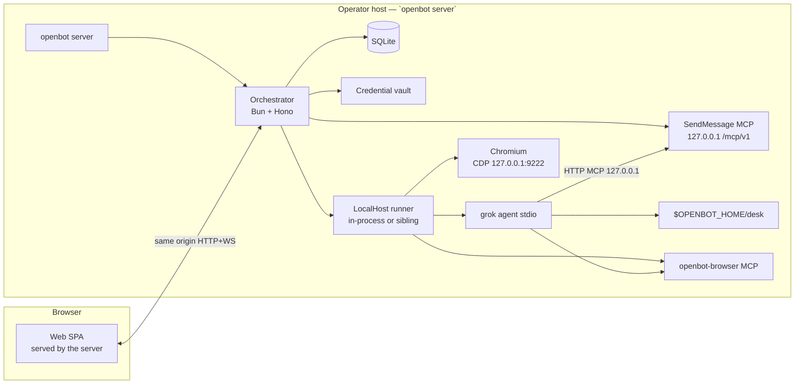

# OpenBot Phase 1 — Always-On Teammate Loop

| Field | Value |
| --- | --- |
| **Title** | OpenBot Phase 1 Design: Always-On Teammate Loop |
| **Author** | OpenBot maintainers (draft) |
| **Date** | 2026-08-25 |
| **Status** | Draft |
| **Scope** | Phase 1 only. Repo is greenfield (`/Users/jasonwilson/git/openbot`). This document proposes code that does not yet exist. |
| **Audience** | Senior engineers implementing or reviewing the first PRs |

**Resolved operator decisions (final):** GitHub sign-up is **allowlist-only**. Phase 1 does **not** provision cloud VMs. Runtime is **Bun**.

---

## Overview

Phase 1 ships a single named teammate you text from the web: it works on a durable **host** (the machine running `openbot server`), replies only via `SendMessage`, and keeps working after you close the browser tab. If a turn ends with no `SendMessage`, the orchestrator fallback-promotes swallowed assistant text into the thread and marks it as fallback. That is the whole Phase 1 product.

You start OpenBot in **server mode** on some machine you already have — a VPS, a home server, a laptop, a Fly app you deploy yourself. **Whatever machine is running the server becomes the desk.** Grok Build and Chromium are spawned **on that same machine**. OpenBot does not call Fly Machines or any cloud API to create tenant VMs. Laptop-closed works **only if** the server process is running on a host that stays up; if you ran server mode on the laptop you closed, the teammate stops. Product copy says that honestly.

Users already pay for coding harnesses. Phase 1 does not replace them and does not ship multi-agent coordination. It is the **agent-management surface**: name one bot, colocate Grok Build with the desk directory, write to the human thread only when the teammate means to.

---

## Key Decisions

Defaults below are binding for Phase 1.

| # | Decision | Choice | Rationale |
| --- | --- | --- | --- |
| D1 | Phase | Phase 1 only: one client, one host desk, one harness, one bot in the UX | Scope freeze. Later phases are listed at the end. |
| D2 | Client | **Web**, served by the same server package. Desktop/mobile are out. | Fastest iterate loop. One URL. No Tauri/Electron. |
| D3 | Harness | **Grok Build via ACP only.** No Codex/OpenCode adapters. | ACP-native, headless, MCP-capable. |
| D4 | Harness placement | **Colocated on the server host.** Orchestrator never remotes a coding harness onto a different disk. | Native bash/edit/grep must see the desk directory. |
| D5 | Compute contract | **Five methods**, not “the same computer”: `workspaceRoot`, `exec`, `display` (CDP), `lifecycle` (harness+browser), `takeoverUrl`. | A later remote runner or hosted Fly desk can implement the same interface. Phase 1 implementer is `LocalHostDriver`. |
| D6 | Tool ownership | Orchestrator: `SendMessage` (only). Compute: FS, terminal, CDP browser, takeover. Harness: native coding tools. | Do not mount a giant computer-use MCP onto Grok. Extra project MCP discovery is suppressed. |
| D7 | Human-visible writes | **`SendMessage` is the only write to the thread.** Assistant text is live-work, not chat. | Teammate UX. Fallback-promote is the safety net. |
| D8 | Fallback | If an ACP turn ends with **no orchestrator-DB evidence of SendMessage**, promote swallowed assistant text with `origin=fallback`. | Serializable / exclusive lock on the turn row. Never the runner’s counter. |
| D9 | Bots in UX | **One bot per account** in UI and run-loop. Schema allows many rows behind `bots_one_active`. | Avoids a storage rewrite later. Copy must not imply multi-bot works. |
| D10 | Browser | **Chromium via Playwright, CDP bound to `127.0.0.1:9222`.** No OS computer-use. | 2FA/CAPTCHA happen in a browser. |
| D11 | Takeover | **CDP screencast + input forwarding** on a **dedicated media WebSocket**. Not noVNC, not WebRTC, not multiplexed on RPC. | Overlay page URL. Pause browser MCP while the human drives. |
| D12 | Credentials | **Vault injects `XAI_API_KEY` at grok spawn and on every runner ensure/hello.** Never disk, never logs. | Cloud/`grok login` cookies are not the story. Process restart would otherwise lose the key. |
| D13 | Out of Phase 1 | `cptr` / Open WebUI Computer, group chats, `SendToAgent`, learned routines, mobile/desktop, Codex/OpenCode, **hosted multi-tenant VM provisioning** | See [Later Phases](#later-phases-out-of-scope). A future remote runner is a thin process **we own**, not cptr. |
| D14 | Language / runtime | **TypeScript on Bun.** `bun` workspaces, `bun test`, Bun as the process for CLI, orchestrator, and runner. | One runtime, native TypeScript, fast install (`bun install`), ships as `bunx openbot` / a bun binary. Node 22 + pnpm would be a second toolchain for no Phase 1 gain. Playwright and the ACP/MCP TS SDKs run on Bun. |
| D15 | Compute backend | **`LocalHostDriver` / in-process (or localhost sibling) runner.** The server host **is** the desk. No `FlyMachineDriver` in Phase 1. | Operator decision: OpenBot does not provision tenant VMs. Docker Compose is optional packaging of the same server, not a provisioner. |
| D16 | Always-on | **Keep the `openbot server` process running** on a durable host (systemd, tmux, a VPS, a Fly app **the operator deploys**). OpenBot does not autostart Machines. | Laptop-closed works iff that host stays up. Copy must not claim otherwise. `lifecycle({op:"stop"})` stops grok+chrome only, not the server. |
| D17 | Host size | **Whatever the host is.** Recommend ≥4 GB RAM if you want Chromium + Grok together; ≥10 GB disk for the desk. | We do not pick a Fly SKU. 2 GB will OOM Chromium+Grok. |
| D18 | ACP transport | **`grok agent stdio` spawned by the runner on the server host.** Not `grok agent serve` as the default. | Runner is the process parent (`waitpid`). Resume is best-effort within one process lifetime. |
| D19 | `SendMessage` attachment | Orchestrator hosts **Streamable HTTP MCP** on **`http://127.0.0.1:<port>/mcp/v1`**. Stdio bridge if Grok lacks `mcpCapabilities.http`. | Same-host Phase 1. HTTP kept so a later remote runner still works. Token is harness-session scoped, not 2h/turn-bound. |
| D20 | Browser tools | Thin runner-local stdio MCP (`openbot-browser`). Same Chromium as takeover. | Compute-owned. Paused during takeover. |
| D21 | Product auth | **GitHub OAuth** via Better Auth **and an allowlist**. Only listed GitHub logins may sign in. `accounts.auth_user_id` → Better Auth `user.id`. | Operator decision. No open sign-up. |
| D22 | Harness auth | User-supplied **`XAI_API_KEY`** in the vault. Select ACP `authMethods` from the pin; **do not hard-code `xai.api_key`.** | Headless path documented by Grok Build. |
| D23 | Prompt overlay | Append via `session/new` `_meta.rules`. Do **not** use `systemPromptOverride`. | Override would wipe Grok’s coding identity. |
| D24 | Permission mode | Default `_meta.autoMode: true`. Surface `session/request_permission` in the client. Settings: Ask / Auto / Always-approve. | Permissions are a modal, not a thread `Message`. |
| D25 | Control plane | **In-process runner by default** (ComputeContract is a local object). Optional sibling process on 127.0.0.1 using runner-initiated JSON-RPC `/runner/v1`. Takeover media is a dedicated WS either way. | Same-host; no inbound to tenant VMs. Protocol exists so a later remote runner does not rewrite the orch. |
| D26 | Database | **SQLite** (Drizzle + `bun:sqlite`) in `$OPENBOT_HOME/openbot.sqlite`. WAL. No Redis. | Single-host package must not require Postgres. Postgres is a later hosted option. |
| D27 | Isolation | **Single-host, allowlisted users, one desk directory.** Not per-account 6PN. The bot has the same FS as the server (minus vault files). | Operator decision. Shared-desk warning still ships. |
| D28 | Promote truth | `promote()` in one exclusive transaction. Skip if `sent_message_count > 0` **or** any `messages.origin='send_message'` for that `turn_id`. Runner counter is telemetry only. | SendMessage is HTTP to the orchestrator; the runner cannot see it. |
| D29 | MCP token lifetime | Bound to `{accountId, botId, threadId, harnessSessionId}`. **No 2h exp.** Hashed at rest. Authorize **only** `turns.status='running'` (never `queued`). Drain in-flight MCP HTTP after `promote()` before the next `session/prompt`. | Warm grok + 24h permission waits. Queued-turn attach would stamp the reply on the next user message. |
| D30 | Process identity | Server/runner may run as the operator’s uid. Chromium is a child, CDP on loopback. **Never run Chromium as root.** Optional Docker: gosu to a non-root user. | Phase 1 is not a multi-tenant VM image. nftables/6PN are later. |
| D31 | Cookies / origins | **Same-origin:** Hono serves the SPA and `/v1` `/auth` `/mcp`. `SameSite=Lax`. MCP has **no browser CORS**. | One process. Split `app.`+`api.` is later. |
| D32 | Packaging | **Client/server package.** `openbot server` (or `bunx openbot server`) binds API + web, uses `$OPENBOT_HOME/desk` as the workspace, spawns Grok and Chromium on that machine. | Operator decision: BYO host. The server owns the desk. |

---

## Background & Motivation

### Why this exists

Coding harnesses already work on a laptop. The missing product is the **teammate loop**: a named agent with a durable computer that continues after the human disconnects the *client*, and a thread that only receives intentional messages. Grok Bot shipped that loop (2026-08-11) as a locked-brain, $200–$300/mo bundle. OpenBot’s wedge is the same UX with an **unlocked brain** (BYO Grok Build) on a host the operator already runs.

Phase 1 is **not** a fleet of provisioned cloud desktops. It is a package you start in server mode.

### Competitive context (not dependencies)

| Product | Shape | Why we are not it |
| --- | --- | --- |
| **Grok Bot** (SpaceXAI / Cursor, 2026-08-11) | Named teammates, always-on shared cloud Linux, reply-when-you-mean-it. Locked brain. | We copy the *loop*, not the lock-in, not their provisioned VM control plane. |
| **Open WebUI Computer (`cptr`)** | Computer-first, local, BYO harness. | Not our product surface. **Do not depend on it.** |
| **OpenClaw** | Chat-gateway + ACP adapters + isolated workspaces. | Isolated workspaces are the opposite of a shared-desk teammate. |

North star (context, not Phase 1): agent management + pluggable compute (this host now; remote/hosted desks later) + harness adapters + communication-as-tools.

---

## Goals & Non-Goals

### Goals (Phase 1)

1. An allowlisted GitHub user can sign in, create **one** named bot, paste an `XAI_API_KEY`.
2. `openbot server` serves the web UI and API from one process; the desk is a directory on that machine.
3. The user can text the bot; the turn runs even if the **browser tab** closes (the **server process** must stay up).
4. Grok Build runs **on that host** via ACP stdio, cwd = desk directory.
5. Native grep/edit/bash work because of colocation.
6. Browser automation is CDP/Playwright on that host; takeover finishes auth/2FA/CAPTCHA.
7. The human thread only gains assistant rows via `SendMessage` or fallback-promote. Promote is DB-authoritative; only `running` turns; drain before the next prompt.
8. Live-work is visible and recoverable after refresh.

### Non-Goals (Phase 1)

- Calling Fly Machines / any cloud to **provision** tenant VMs (no `FlyMachineDriver`).
- `cptr`, Open WebUI Computer, group chats, `SendToAgent`, learned routines, cron, “watch me do it.”
- Desktop, mobile, Codex / OpenCode adapters.
- Per-bot filesystem isolation, gVisor, per-account 6PN, multi-tenant VM isolation.
- Production billing.
- ACP `session/load` as the product thread.
- Mounting filesystem or terminal MCPs.
- Multiple threads per bot (`threads_one_per_bot`).
- A product API to stop the **host**.

---

## Proposed Design

### System context



The orchestrator is the product brain. The runner is the compute adapter (`LocalHostDriver`). Grok Build is the coding brain, spawned on the **same host**.

### Packaging and server mode

Install / run (proposed):

```bash
bunx openbot server --port 8787 --home ~/.openbot
# or, after install:
openbot server
openbot allowlist add <github-login>
```

| Path | Role |
| --- | --- |
| `$OPENBOT_HOME/` | Default `~/.openbot` (override `--home` / `OPENBOT_HOME`) |
| `openbot.sqlite` | Drizzle SQLite (WAL) |
| `master.key` | Vault master key, mode `0600` (or `OPENBOT_MASTER_KEY`) |
| `allowlist` | GitHub logins, one per line (or `OPENBOT_GITHUB_ALLOWLIST`) |
| `desk/` | Workspace root for Grok (`cwd`). Chromium profile under `desk/.openbot/chromium` |
| `logs/` | JSON logs |

First start generates `master.key` if missing. GitHub OAuth app callback is `http://<host>:<port>/auth/callback/github` (Better Auth). `OPENBOT_GITHUB_CLIENT_ID` / `SECRET` required.

**Honest always-on copy** (README + onboarding):

> Closing this browser tab does not stop your teammate. Stopping `openbot server` does. If you want work to continue while your laptop is closed, run the server on a machine that stays up (VPS, home server, systemd), not on the laptop you are about to shut.

Optional Docker: same binary, volume-mount `$OPENBOT_HOME`, Chromium as non-root. Not required for the demo.

### Suggested stack

| Layer | Pick | Why |
| --- | --- | --- |
| Runtime | **Bun** (workspaces, `bun test`, `bun build`) | One runtime, native TS, fast install, `bunx` distribution. |
| Web | React SPA (Vite) bundled into the server | Same process as the API. No Vercel/Next split. |
| Orchestrator | Hono on Bun (`Bun.serve`) | WS-capable, typed, serves static SPA + `/v1` + `/mcp/v1`. |
| Runner | Same Bun process (`InProcessRunner`) by default | Simplest colocation. Optional sibling `openbot-runner` on 127.0.0.1. |
| ACP | `@agentclientprotocol/sdk` | Official TS client, protocol v1. |
| MCP | `@modelcontextprotocol/sdk` Streamable HTTP | `SendMessage` on GET+POST localhost. |
| Browser | `playwright-core` + Chromium (Playwright install or system Chrome) | CDP loopback. |
| DB | SQLite via `bun:sqlite` + Drizzle | Single file, no daemon. Writer transactions use `BEGIN IMMEDIATE` (SQLite equivalent of exclusive row lock). |
| Auth | Better Auth, GitHub, allowlist hook | Reject non-listed logins in the OAuth callback. |
| Crypto | libsodium for vault DEKs | Envelope encryption. |

**Explicitly rejected for Phase 1:** Node 22 + pnpm as the required toolchain, Next.js as the control plane, Fly Machines provisioner, Postgres as a required daemon, Python/Go split, Redis, cptr.

### Repo layout (proposed)

```
openbot/
  package.json                  # bun workspaces, name: openbot
  bun.lock
  tsconfig.base.json
  .github/workflows/ci.yml      # bun install --frozen-lockfile && bun test
  apps/
    server/                     # CLI `openbot` + Hono + static SPA mount
    web/                        # Vite React SPA
  packages/
    db/
    api-types/
    auth/
    compute-protocol/
    acp-grok/
    mcp-send-message/
    live-work/
    vault/
    runner/                     # InProcessRunner + optional sibling process
    mcp-bridge/
  compute/
    image/                      # OPTIONAL Dockerfile for containerized host
      Dockerfile
      GROK_VERSION
  infra/
    compose/                    # OPTIONAL: run the same server in a container
      docker-compose.yml
    systemd/
      openbot.service           # unit example: keep the process up
  tests/
    fixtures/acp/
    contract/
    e2e/
  README.md
```

Packages: `@openbot/server` (bin: `openbot`), `@openbot/web`, `@openbot/db`, `@openbot/api-types`, `@openbot/auth`, `@openbot/compute-protocol`, `@openbot/acp-grok`, `@openbot/mcp-send-message`, `@openbot/live-work`, `@openbot/vault`, `@openbot/runner`, `@openbot/mcp-bridge`.

### Compute contract (five methods)

The Phase 1 default is **in-process**: the orchestrator calls these as TypeScript methods. The same types are spoken over `/runner/v1` JSON-RPC if `OPENBOT_RUNNER=sibling` (and later, a remote runner). This is **not** a cloud Machines API.

```ts
// packages/compute-protocol/src/contract.ts  (proposed)
export type ComputeId = string;

export interface ComputeContract {
  workspaceRoot(): Promise<{ path: string }>; // $OPENBOT_HOME/desk

  exec(req: {
    cmd: string[];
    cwd?: string;          // must be under workspaceRoot
    env?: Record<string, string>;
    timeoutMs?: number;    // default 30_000; hard cap 120_000
  }): Promise<{ exitCode: number; stdout: string; stderr: string }>;

  display(): Promise<{
    cdpUrl: string;        // http://127.0.0.1:9222
    browserAlive: boolean;
    pageUrl?: string;
    pageOrigin?: string;
  }>;

  lifecycle(req:
    | { op: "start" }      // start/ensure grok+chrome; does NOT exit the server
    | { op: "stop" }       // stop harness + browser; server stays up
    | { op: "health" }
  ): Promise<{
    runner: "ok" | "degraded";
    harness: "down" | "starting" | "idle" | "in_turn" | "crashed";
    browser: "down" | "up";
    diskFreeBytes: number;
    harnessSessionId?: string;
    acpSessionId?: string;
  }>;

  takeoverUrl(): Promise<{
    ready: true;
    screencastNonce: string;
  }>;
}
```

**Invariants**

- `cdpUrl` is never sent to the browser client. Takeover is orchestrator-proxied.
- `exec` is for the orchestrator (debug). Default timeout 30s. Grok’s bash does **not** go through `exec`.
- `workspaceRoot` is `$OPENBOT_HOME/desk` in Phase 1. The method exists so a later remote runner can return another path.
- `lifecycle({op:"stop"})` does **not** stop `openbot server`.

### LocalHostDriver

```ts
interface ComputeDriver {
  /** Phase 1: ensure desk dir + chromium profile exist. No cloud API. */
  ensure(accountId: string): Promise<ComputeInstance>;
  describe(id: string): Promise<{
    driver: "localhost";
    workspacePath: string;
    state: "running" | "unhealthy";
  }>;
  /** Wipe desk/ (type-to-confirm). Does not uninstall the server. */
  wipeDesk(id: string): Promise<void>;
}
```

Phase 1 HTTP does **not** expose host start/stop. Settings “Destroy computer” maps to `wipeDesk`. There is no `machineStart` / `machineStop` / `restoreFromSnapshot` in Phase 1.

`OPENBOT_COMPUTE_DRIVER=localhost` (only Phase 1 driver).

Desk layout (created on first `ensure`):

```
$OPENBOT_HOME/desk/          # Grok cwd
  projects/
  .openbot/
    chromium/                # persistent browser profile
    runner-state.json        # no secrets
```

Vault files live in `$OPENBOT_HOME/`, **not** under `desk/`.

### Control plane: in-process vs sibling

**Default (`OPENBOT_RUNNER=inprocess`):** `InProcessRunner` implements `ComputeContract` in the server process. `ensureHarness({ env })` is a function call (the in-process analogue of `hello_ack`). Credential re-inject runs on every server start and every harness respawn.

**Sibling (`OPENBOT_RUNNER=sibling`):** spawn `openbot-runner`; it connects to `ws://127.0.0.1:<port>/runner/v1`. Framing is newline JSON-RPC only (no JPEG on this socket). Hello/hello_ack as previously specified: `needsCredentials: true` every process start; orch returns vault env; runner drops `XAI_API_KEY` after spawn. Machine token lives in runner **heap** (not `process.env`) for reconnect. Screencast uses `/runner/v1/screencast` with a nonce from `startScreencast`, never from hello.

Takeover media (both modes): dedicated WS, binary JPEG + JSON input. Orchestrator bridges `/v1/takeover` ↔ screencast. RPC cannot HOL-block behind 10 fps.

### MCP attachment (Phase 1)

| Driver | `OPENBOT_MCP_URL` | TLS |
| --- | --- | --- |
| localhost (default) | `http://127.0.0.1:<port>/mcp/v1` | none (loopback) |
| optional Docker | `http://127.0.0.1:<port>/mcp/v1` inside the container | none |

Hono: `GET`+`POST /mcp/v1`. **No browser CORS** on MCP. Auth: `Authorization: Bearer <mcp token>` only.

A future remote runner will use public HTTPS; that is **not** the Phase 1 path. Keep Streamable HTTP so that move does not change the tool host.

Stdio `openbot-mcp-bridge` remains the fallback if Grok lacks `mcpCapabilities.http` (still targets the same localhost URL).

### ACP integration (Grok Build on the host)

The runner is the ACP client.

**Launch argv** (pin after PR-09 spike; global flags before `agent`):

```
grok --no-auto-update agent --no-leader --model grok-build stdio
```

Do not pass `--always-approve` unless settings = Always-approve. Default Auto: `_meta.autoMode: true`.

Env at spawn (from vault ensure, in-memory only):

```
XAI_API_KEY=<injected>
HOME=<operator home or $OPENBOT_HOME/home>
GROK_DISABLE_AUTOUPDATER=1
GROK_CURSOR_MCPS_ENABLED=0
GROK_CLAUDE_MCPS_ENABLED=0
```

Write `$HOME/.grok/config.toml` (not under `desk/`) with empty `[mcp_servers]`. Do not persist the API key there.

**Handshake**

1. `initialize` — protocol v1; record `mcpCapabilities.http`, resume, `authMethods`.
2. `authenticate` if required. Do **not** hard-code `xai.api_key`. Pick from advertised methods with `_meta: { headless: true }` when using only `XAI_API_KEY`. Interactive TTY login → fail the turn with a system notice.
3. `_x.ai/mcp/list` (or inspect): fail-closed if any server other than `openbot` / `openbot-browser`. Preflight: refuse start if `desk/.mcp.json` (etc.) declares servers. Residual if Grok hides discovery.
4. `session/new` or `session/resume`.

**`session/new`** (`OPENBOT_MCP_URL` = loopback):

```json
{
  "cwd": "<desk path>",
  "mcpServers": [
    {
      "type": "http",
      "name": "openbot",
      "url": "http://127.0.0.1:8787/mcp/v1",
      "headers": [{ "name": "Authorization", "value": "Bearer <mcp_token>" }]
    },
    {
      "name": "openbot-browser",
      "command": "openbot-browser",
      "args": ["stdio"],
      "env": [{ "name": "OPENBOT_CDP_URL", "value": "http://127.0.0.1:9222" }]
    }
  ],
  "_meta": {
    "autoMode": true,
    "rules": "You are Ada.\n…\nThe only way to talk to the user is the SendMessage tool. You MUST call SendMessage to ask, report a result, report a blocker, or send status. Assistant text is a private work log."
  }
}
```

If `mcpCapabilities.http !== true`, attach stdio `openbot-mcp-bridge` instead of the HTTP entry (same URL/token).

**Resume:** persist `acpSessionId`. In-process crash of grok (not the server): `session/resume` if supported. **Server process restart** wipes in-memory ACP state → `session/new` + thread digest + `harness_session_reset`. Desk files and Chromium profile persist on disk.

**Permission prompts:** forwarded as `permission_request`; modal in the web client; 24h timeout; not a `Message`. `deadline_at` extends to `now+24h`. `session/cancel` answers ACP `{ outcome: "cancelled" }`.

### MCP tokens and SendMessage authorization

Minted at harness session start (and on sibling `hello_ack`). Not per user message.

| Field | Value |
| --- | --- |
| Bound claims | `{ accountId, botId, threadId, harnessSessionId }` |
| **Not** bound | `turnId`, 2h `exp` |
| Storage | `mcp_tokens.token_hash` |
| Lifetime | Until harness session ends. Optional 30d backstop → `session/new` with a fresh token. |
| HTTP | `Authorization: Bearer ob_sess_…` |

**Authorize `SendMessage`:**

1. Verify token; reject if revoked.
2. Increment `mcpInflight[harnessSessionId]` for this HTTP request (`finally` decrements).
3. `SELECT … FROM turns WHERE harness_session_id = ? AND thread_id = ? AND status = 'running'` inside `BEGIN IMMEDIATE`. **Never** match `queued`.
4. If none: **409 `no_active_turn`**. Required when the handler loses the race with `promote()`.
5. Insert message + increment `sent_message_count` in **that same transaction**.

**Drain:** after `promote()` commits, do not `session/prompt` the next turn until `mcpInflight === 0` or 2s elapses. Late SendMessage 409s; it must not attach to queued B.

Rate limits: 20/turn, 100/account/hour.

### Sequence: user message → SendMessage

```mermaid
sequenceDiagram
  autonumber
  actor User
  participant Web
  participant Orch as Orchestrator
  participant DB as SQLite
  participant Runner as Runner on host
  participant Grok as grok agent stdio
  participant Chrome as Chromium CDP

  User->>Web: POST /v1/threads/:id/messages
  Web->>Orch: cookie + body
  Orch->>DB: insert Message role=user
  Orch->>DB: insert Turn queued/running, deadline_at=now+2h
  Orch-->>Web: 202 { turnId } + WS message.created
  Note over Orch,Runner: Browser tab may close. Server process must stay up.

  Orch->>Runner: lifecycle health; ensure harness
  Runner->>Chrome: CDP up (profile desk/.openbot/chromium)
  Runner->>Grok: spawn if needed with vault env; session/new or resume
  Grok->>Orch: MCP GET+POST http://127.0.0.1/mcp/v1
  Orch-->>Grok: tools = [SendMessage]
  Runner->>Grok: session/prompt(user text)

  loop Work
    Grok-->>Runner: session/update
    Runner-->>Orch: live_work
    Orch-->>Web: WS live_work
    opt Native coding
      Grok->>Grok: bash / edit / grep on desk/
    end
    opt Browser MCP and not takeover
      Grok->>Runner: openbot-browser.*
      Runner->>Chrome: Playwright/CDP
    end
    opt Permission
      Grok->>Runner: session/request_permission
      Runner->>Orch: permission_request
      Web->>Orch: POST /v1/turns/:id/permissions/:reqId
      Orch->>Runner: permission_response
    end
  end

  Grok->>Orch: tools/call SendMessage
  Orch->>DB: BEGIN IMMEDIATE; lock running turn
  Orch->>DB: insert send_message AND sent_message_count += 1; COMMIT
  Orch-->>Web: WS message.created
  Orch-->>Grok: { ok, messageId }

  Grok-->>Runner: session/prompt result
  Runner-->>Orch: turn.acp_done { stopReason, telemetrySentMessageCount? }
  Orch->>DB: promote()
  Orch->>Orch: drain mcpInflight (0 or 2s)
  Note over Orch,Grok: Only then queued B becomes running
```

### Sequence: fallback-promote

```mermaid
sequenceDiagram
  autonumber
  participant Grok
  participant Runner
  participant Orch
  participant DB as SQLite
  participant Web

  loop Turn
    Grok-->>Runner: agent_message_chunk
    Runner-->>Orch: live_work + assistant_text
  end
  Grok-->>Runner: stopReason end_turn
  Runner-->>Orch: acp_done telemetrySentMessageCount=0
  Orch->>DB: BEGIN IMMEDIATE; lock turn
  alt DB has send_message
    Orch->>DB: complete; no fallback
  else no SendMessage and text
    Orch->>DB: insert origin=fallback
    Orch-->>Web: message.created fallback
  else empty
    Orch->>DB: insert origin=system
  end
```

### promote() — orchestrator DB truth

Called on `acp_done`, harness crash, cancel, deadline. **Never** reads `telemetrySentMessageCount`.

SQLite: use `BEGIN IMMEDIATE` so SendMessage and promote cannot interleave writers. That is the SQLite stand-in for `SELECT … FOR UPDATE`.

```ts
async function promote(turnId: string, cause: AcpDone | Crash | Cancel | Deadline) {
  await db.transaction(async (tx) => {
    const turn = await lockTurnImmediate(tx, turnId);
    if (!turn || turn.status !== "running") return;

    if (cause.assistantText) {
      turn.assistant_text = cap(turn.assistant_text + cause.assistantText, 256 * 1024);
    }

    const sendRows = await countSendMessage(tx, turnId);
    const hasSend = turn.sent_message_count > 0 || sendRows > 0;

    if (!hasSend) {
      const body = turn.assistant_text.trim();
      if (body.length > 0) {
        await insertMessage(tx, { origin: "fallback", role: "assistant", body });
        turn.promote_reason =
          cause.kind === "crash" ? "crash"
          : cause.kind === "cancel" ? "cancel"
          : cause.kind === "deadline" ? "deadline"
          : "no_send_message";
      } else {
        await insertMessage(tx, {
          origin: "system",
          role: "system",
          body: "The teammate finished this turn without a message.",
        });
        turn.promote_reason = "empty_turn";
      }
    }

    turn.status = cause.kind === "cancel" ? "cancelled"
      : cause.kind === "deadline" ? "failed"
      : "completed";
    turn.stop_reason = cause.stopReason ?? null;
    turn.finished_at = new Date();
    await updateTurn(tx, turn);
  });
}

async function sendMessage(ctx: McpCtx, input: { body: string; urgency?: "normal" | "needs_user" }) {
  const claims = await verifyMcpToken(ctx.bearer);
  mcpInflight.add(claims.harnessSessionId);
  try {
    const msg = await db.transaction(async (tx) => {
      const turn = await lockRunningTurn(tx, claims); // status='running' only
      if (!turn) throw mcpError("no_active_turn");
      if (turn.sent_message_count >= 20) throw mcpError("rate_limited");
      const row = await insertMessage(tx, {
        threadId: claims.threadId,
        turnId: turn.id,
        role: "assistant",
        origin: "send_message",
        body: input.body,
        urgency: input.urgency ?? "normal",
      });
      await incrementSent(tx, turn.id);
      await audit(tx, { type: "send_message", messageId: row.id });
      return row;
    });
    pushToUser(claims.accountId, { type: "message.created", message: publicMessage(msg) });
    return { content: [{ type: "text", text: JSON.stringify({ ok: true, messageId: msg.id }) }] };
  } finally {
    mcpInflight.remove(claims.harnessSessionId);
  }
}
```

**Required tests (PR-03, reused in glue):**

| Case | Expect |
| --- | --- |
| SendMessage then `acp_done` telemetry 0 | one `send_message`, no fallback |
| `acp_done` before HTTP commit, then handler commits | never both fallback and send_message |
| insert then crash before increment | `hasSend` via origin count |
| SendMessage + leftover working text | no second bubble |
| double `acp_done` | second no-op |
| empty, no SendMessage | `origin=system` |
| cancel + partial text, no SendMessage | fallback; `turns.status=cancelled`; `promote_reason=cancel` |
| telemetry 99, DB 0 | still promote |
| A running, B queued; promote(A); late SendMessage | **409**; **zero** send_message on B |
| A still running | SendMessage attaches to **A** only |

### Sequence: takeover

```mermaid
sequenceDiagram
  autonumber
  actor User
  participant Web
  participant Orch
  participant Runner
  participant Chrome

  User->>Web: Takeover
  Web->>Orch: POST /v1/compute/takeover
  Orch->>Orch: hash-store ticket; invalidate previous
  Orch->>Runner: startScreencast; pause browser MCP
  Runner-->>Orch: { screencastNonce }
  Runner->>Chrome: Page.startScreencast
  Orch-->>Web: 200 { ticket }
  Web->>Orch: WS /v1/takeover first message { type: "auth", ticket }
  loop Frames
    Chrome-->>Runner: screencastFrame
    Runner-->>Orch: binary jpeg
    Orch-->>Web: jpeg + overlay pageUrl
  end
  loop Input
    Web->>Orch: mouse/key
    Orch->>Runner: input
    Runner->>Chrome: dispatchMouseEvent / dispatchKeyEvent
  end
  User->>Web: Done
  Orch->>Runner: stopScreencast; unpause MCP
```

Tickets: 128-bit, hashed, bound `{accountId, computeId, userSessionId}`, 10 min, one per account. Ticket **not** in the URL. Origin check. Overlay **page URL + origin**. Pause `openbot-browser` (`takeover_active`). No frame logs. ~10 fps, JPEG q60, max width 1280. Cookies persist in `desk/.openbot/chromium`.

### Live-work vs thread

| Stream | Store | UI |
| --- | --- | --- |
| Thread | `messages` | user, `send_message`, `fallback`, system |
| Live-work | `live_work_events` + WS | thoughts, working text, tool calls, permissions, notices |

Working text is not a chat bubble unless promote fires. Fallback badge: **“Fallback — teammate did not call SendMessage”**. Caps: 7 days / 50k events; 64 KiB/event; `assistant_text` 256 KiB.

### Thin browser MCP

`navigate`, `tabs`, `snapshot` (a11y preferred), `click`, `type`, `wait`. Paused during takeover. No OS computer-use loop.

---

## API / Interface Changes

Same-origin, cookie session. Allowlisted GitHub only.

### HTTP

| Method | Path | Purpose |
| --- | --- | --- |
| `GET/POST` | `/auth/*` | Better Auth. Callback rejects non-allowlisted `user.login`. |
| `GET` | `/v1/me` | Account |
| `POST` | `/v1/bots` | `{ name, description }` — 409 if an active bot exists. Ensures desk dir. |
| `PATCH` | `/v1/bots/:id` | Name/description |
| `PATCH` | `/v1/bots/:id/settings` | `{ permissionMode }` |
| `GET` | `/v1/bots/:id` | Bot + host health + permissionMode |
| `GET` | `/v1/threads` | The one default thread |
| `GET` | `/v1/threads/:id` | Messages |
| `POST` | `/v1/threads/:id/messages` | 202; 429 if ≥5 queued |
| `POST` | `/v1/turns/:id/cancel` | cancel + promote |
| `POST` | `/v1/turns/:id/permissions/:reqId` | Allow/deny |
| `GET` | `/v1/turns/:id/live-work` | Catch-up |
| `PUT` | `/v1/credentials/xai` | Set/rotate key |
| `DELETE` | `/v1/credentials/xai` | Forget |
| `GET` | `/v1/compute` | Host health: harness/browser/disk (`starting`\|`running`\|`unhealthy`) — **not** a cloud provision spinner |
| `POST` | `/v1/compute/takeover` | `{ ticket }` |
| `DELETE` | `/v1/compute` | Wipe `desk/`. Body `{ confirm: "DELETE" }` |
| `GET` | `/v1/healthz` | Process up |
| `GET` | `/v1/readyz` | SQLite open + desk writable |
| `GET`/`POST` | `/mcp/v1` | Streamable HTTP MCP |

No `POST /v1/compute/stop`. No provision/Fly routes.

### WebSocket

| Path | Auth | Traffic |
| --- | --- | --- |
| `/v1/push` | Cookie | messages, turns, live_work, permissions, compute.health |
| `/runner/v1` | sibling mode only; heap machine token | JSON-RPC. **No frames.** |
| `/runner/v1/screencast` | `screencastNonce` | Binary JPEG + input |
| `/v1/takeover` | first-message `{ ticket }` | User frames + input |

In-process mode does not need `/runner/v1` for RPCs; screencast WS still exists for the browser client.

### `SendMessage` schema

No `replyTo`.

```json
{
  "name": "SendMessage",
  "description": "Send a message to the user on the OpenBot thread. This is the ONLY way the user will see your words.",
  "inputSchema": {
    "type": "object",
    "additionalProperties": false,
    "required": ["body"],
    "properties": {
      "body": { "type": "string", "minLength": 1, "maxLength": 32000 },
      "urgency": { "type": "string", "enum": ["normal", "needs_user"], "default": "normal" }
    }
  }
}
```

### Client UX

1. **Sign in** — GitHub. Non-allowlisted users see a denied page (not a provisioned desk).
2. **Onboarding** — name, description, paste `XAI_API_KEY`. Banner: *“This bot uses the same filesystem as the OpenBot server. Files, cookies, and logins on the desk are not isolated. Phase 1 runs one bot.”* Always-on honesty sentence (tab vs process).
3. **Thread** — SendMessage bubbles, fallback badge, system notices (server down, missing key).
4. **Composer** — not disabled while in_turn; queue depth 5. Closing the **tab** does not cancel.
5. **Live-work drawer** — “Working notes (not sent)”.
6. **Takeover** — canvas + URL overlay.
7. **Permissions modal**.
8. **Settings** — rotate key, permission mode, wipe desk. No “stop host”.

### Turn bounds

| Bound | Value |
| --- | --- |
| `deadline_at` | now+2h when `running` |
| Permission wait | extend to now+24h |
| Queue | max 5 |
| `assistant_text` | 256 KiB |
| live-work event | 64 KiB |
| SendMessage | 20/turn, 100/hour |

---

## Data Model Changes

Drizzle + SQLite. Illustrative SQL; `drizzle-kit` is the source of truth. Better Auth CLI tables: `user`, `session`, `account`, `verification`. Product `accounts.auth_user_id` → `user.id`. Do not store `github_id` on product `accounts`.

SQLite types: `text` UUIDs, `integer` epoch ms or ISO text timestamps (Drizzle `mode: 'timestamp'`). Writers: `BEGIN IMMEDIATE`.

```sql
CREATE TABLE accounts (
  id           text PRIMARY KEY,
  auth_user_id text NOT NULL UNIQUE,
  created_at   integer NOT NULL
);

CREATE TABLE bots (
  id              text PRIMARY KEY,
  account_id      text NOT NULL REFERENCES accounts(id),
  name            text NOT NULL,
  description     text NOT NULL DEFAULT '',
  status          text NOT NULL DEFAULT 'active',
  permission_mode text NOT NULL DEFAULT 'auto',
  created_at      integer NOT NULL
);
CREATE UNIQUE INDEX bots_one_active ON bots(account_id) WHERE status = 'active';

CREATE TABLE compute_instances (
  id              text PRIMARY KEY,
  account_id      text NOT NULL UNIQUE REFERENCES accounts(id),
  driver          text NOT NULL DEFAULT 'localhost',
  workspace_path  text NOT NULL,
  state           text NOT NULL, -- starting | running | unhealthy
  last_health_at  integer,
  created_at      integer NOT NULL
);

CREATE TABLE threads (
  id         text PRIMARY KEY,
  account_id text NOT NULL REFERENCES accounts(id),
  bot_id     text NOT NULL REFERENCES bots(id),
  title      text NOT NULL DEFAULT 'New thread',
  created_at integer NOT NULL
);
CREATE UNIQUE INDEX threads_one_per_bot ON threads(bot_id);

CREATE TABLE harness_sessions (
  id             text PRIMARY KEY,
  compute_id     text NOT NULL REFERENCES compute_instances(id),
  bot_id         text NOT NULL REFERENCES bots(id),
  acp_session_id text,
  state          text NOT NULL,
  grok_version   text,
  created_at     integer NOT NULL,
  ended_at       integer
);

CREATE TABLE mcp_tokens (
  id                 text PRIMARY KEY,
  harness_session_id text NOT NULL REFERENCES harness_sessions(id),
  account_id         text NOT NULL REFERENCES accounts(id),
  bot_id             text NOT NULL REFERENCES bots(id),
  thread_id          text NOT NULL REFERENCES threads(id),
  token_hash         text NOT NULL UNIQUE,
  revoked_at         integer,
  created_at         integer NOT NULL
);

CREATE TABLE takeover_tickets (
  id              text PRIMARY KEY,
  account_id      text NOT NULL REFERENCES accounts(id),
  compute_id      text NOT NULL REFERENCES compute_instances(id),
  user_session_id text NOT NULL,
  ticket_hash     text NOT NULL UNIQUE,
  expires_at      integer NOT NULL,
  consumed_ws     integer NOT NULL DEFAULT 0,
  created_at      integer NOT NULL
);

CREATE TABLE turns (
  id                 text PRIMARY KEY,
  thread_id          text NOT NULL REFERENCES threads(id),
  bot_id             text NOT NULL REFERENCES bots(id),
  harness_session_id text REFERENCES harness_sessions(id),
  status             text NOT NULL,
  stop_reason        text,
  sent_message_count integer NOT NULL DEFAULT 0,
  assistant_text     text NOT NULL DEFAULT '',
  promote_reason     text, -- no_send_message | crash | empty_turn | cancel | deadline | null
  error              text,
  deadline_at        integer,
  started_at         integer,
  finished_at        integer,
  created_at         integer NOT NULL
);

CREATE TABLE messages (
  id         text PRIMARY KEY,
  thread_id  text NOT NULL REFERENCES threads(id),
  turn_id    text REFERENCES turns(id),
  role       text NOT NULL,
  origin     text NOT NULL,
  body       text NOT NULL,
  urgency    text NOT NULL DEFAULT 'normal',
  created_at integer NOT NULL
);
CREATE INDEX messages_thread_created ON messages(thread_id, created_at);
CREATE INDEX messages_turn_origin ON messages(turn_id, origin);

CREATE TABLE credentials (
  id          text PRIMARY KEY,
  account_id  text NOT NULL REFERENCES accounts(id),
  kind        text NOT NULL,
  ciphertext  blob NOT NULL,
  dek_wrapped blob NOT NULL,
  key_id      text NOT NULL,
  last_four   text NOT NULL,
  created_at  integer NOT NULL,
  rotated_at  integer
);
CREATE UNIQUE INDEX credentials_account_kind ON credentials(account_id, kind);

CREATE TABLE live_work_events (
  id         text PRIMARY KEY,
  turn_id    text NOT NULL REFERENCES turns(id),
  seq        integer NOT NULL,
  kind       text NOT NULL,
  payload    text NOT NULL,
  created_at integer NOT NULL
);

CREATE TABLE audit_events (
  id         text PRIMARY KEY,
  account_id text REFERENCES accounts(id),
  actor      text NOT NULL,
  type       text NOT NULL,
  payload    text NOT NULL,
  created_at integer NOT NULL
);
```

Phase 2: relax `bots_one_active`; still one desk directory unless an isolation project says otherwise.

---

## Credential vault

| Kind | Source | Injected as |
| --- | --- | --- |
| `xai_api_key` | Settings | `XAI_API_KEY` on the grok child only, via `ensureHarness` / `hello_ack` |

GitHub tokens stay in Better Auth `account`. Envelope: per-secret DEK, wrapped with `OPENBOT_MASTER_KEY` / `master.key`. Decrypt only in the orchestrator for last-four display and harness ensure.

On **every** server start and every harness respawn: if no vault row, do not spawn grok (system notice). Else inject env, spawn, drop the cleartext from runner memory. Never write the key under `desk/`. Rotation: in-flight grok finishes; next spawn gets the new key.

`pino` redacts `*.XAI_API_KEY`, `*.Authorization`, `*.ciphertext`, `*.token`, `*.env`. CI interceptor fails on `xai-` + 8 alphanumerics in logs.

---

## Auth: product vs harness

| Concern | Mechanism |
| --- | --- |
| Who is the human | GitHub OAuth → allowlist (`OPENBOT_GITHUB_ALLOWLIST` or `$OPENBOT_HOME/allowlist`) → Better Auth `user` → `accounts`. Cookie `HttpOnly`, `SameSite=Lax`. |
| Who may text this bot | Cookie → `accounts.id === bot.account_id`. |
| Who is the runner | In-process: same process. Sibling: heap machine token on localhost WS. |
| Who may call SendMessage | Session-scoped MCP token; **running** turn only. |
| Model API | User `XAI_API_KEY`. |
| Takeover | Hashed ticket, first-message auth, Origin = the server origin. |

---

## Failure modes

| Failure | User-visible | Recovery |
| --- | --- | --- |
| **Server process stopped** (laptop closed, systemd down) | Client disconnect; teammate **not** running | Start `openbot server` on a durable host. Copy already warned. |
| **Harness crash** | Live-work notice; promote from DB | Respawn grok with vault env; resume or new session. Cap 5/10 min. |
| **ACP EOF** | Same as crash | Same |
| **SendMessage never called** | Fallback or empty-turn system | `promote()` |
| **Late SendMessage after promote** | None (409 to grok) | Drain then next turn |
| **Chromium crash** | `browser_restarted` | Relaunch same userDataDir |
| **Credential missing** | System message | Paste key |
| **Browser tab closed** | None | Success path **if server is up** |
| **Permission while away** | Modal on return | 24h |
| **MCP 401 / unreachable** | May fallback | Loopback URL/token; bridge |
| **Server restart mid-turn** | Brief disconnect | Re-inject key; if unsure, cancel+promote |
| **Disk full** | System message | Warn |
| **Grok auth rejected** | “xAI rejected the API key” | Rotate |
| **Unexpected MCP** | Session fails to start | Remove `.mcp.json` |
| **Turn deadline** | System notice | cancel+promote |
| **Non-allowlisted GitHub user** | Denied at login | Operator adds login |

---

## Isolation

- Single host, allowlisted users, one desk directory.
- Vault/master.key live **outside** `desk/` (Grok cwd).
- The bot can read/write everything in `desk/` and, like any process under the same uid, much of the host — **laptop-equivalent**. Copy says so.
- CDP `127.0.0.1` only.
- MCP tokens cannot write to another account’s thread (allowlisted multi-user on one host still row-lock by `account_id`).
- **Not Phase 1:** per-account VMs, 6PN, nftables, `FLY_API_TOKEN` SSH.

---

## Alternatives Considered

### 1. Desktop client first

Rejected: slow OSS dogfood. Web in the server package is enough.

### 2. `grok agent serve` as default

Rejected: hides process parent. Stdio + runner `waitpid`.

### 3. Fly Machines provisioner as Phase 1 compute

**Rejected by operator.** Phase 1 is BYO host. Hosted multi-tenant desks (one app per account, custom 6PN, provision API) are a later phase. The five-method contract is what that phase will implement.

### 4. noVNC / WebRTC takeover

Rejected: we already have headless Chromium. CDP screencast.

### 5. Assistant text is the thread

Rejected: destroys teammate UX.

### 6. Giant computer-use MCP

Rejected: native tools stay native; only SendMessage + thin browser MCP.

### 7. Node 22 + pnpm

Rejected by operator. Bun is the one runtime.

### 8. Always-stdio MCP bridge, never HTTP

Reachability on localhost is trivial either way. Keep HTTP so a later remote runner does not change the tool host; keep the bridge if the pin lacks `mcpCapabilities.http`.

### 9. Postgres required

Rejected for a single-host package. SQLite in `$OPENBOT_HOME`. Postgres later if we host multi-tenant control planes.

---

## Security & Privacy

| Threat | Mitigation |
| --- | --- |
| Non-allowlisted GitHub user | Callback deny; no account row |
| Stolen session cookie | `HttpOnly` + `SameSite=Lax`; short session |
| Cross-account SendMessage | Token bind + running-turn lock |
| CDP on LAN | Bind `127.0.0.1` |
| Prompt injection exfiltrates `XAI_API_KEY` | Laptop-equivalent: key is in grok env. Do not put master.key on the desk. |
| Project `.mcp.json` attacker MCP | Fail-closed list/preflight |
| SendMessage spam | 20/turn, 100/hour |
| Logs leak keys | Redaction + test |
| XSS in Markdown | sanitize |
| Takeover ticket in logs | First-message auth, hashed |
| Screencast HOL-blocks RPC | Dedicated WS |
| Chromium as root | Forbidden |

We do not train on user data. README states it.

---

## Observability

JSON logs (`pino`): `service`, `accountId?`, `turnId?`, `reqId`. Never secrets, MCP bodies, frames.

Metrics (optional `/metrics` on 127.0.0.1): turns running, duration, send_message, fallback_promote (warn if ratio >50%/1h), harness restarts, mcp errors, vault decrypt fail, unexpected_mcp.

Audit: login, allowlist deny, credential rotate, wipe desk, takeover, SendMessage ids, permissions.

---

## Cost / ops

Phase 1 product cost is **not** a per-seat Fly VM.

| Item | Who pays |
| --- | --- |
| Host running `openbot server` | Operator (existing VPS / home server / laptop / a Fly app **they** `fly deploy`) |
| Disk for `$OPENBOT_HOME/desk` | Operator |
| xAI tokens | User’s `XAI_API_KEY` |
| GitHub OAuth app | Free |

Recommend ≥4 GB RAM for Chromium+Grok. systemd unit in `infra/systemd/openbot.service`.

Hosted Fly **provisioning** of per-account Machines (~$23/mo shared-cpu-4x, volumes, 6PN) is **Later Phases**, not a Phase 1 line item.

---

## Testing strategy

1. **Unit** (`bun test`): `promote()` matrix (including queued-B / late SendMessage 409), vault round-trip + log redaction, MCP token running-only, drain before next prompt, `_meta.rules`, allowlist reject.
2. **Fake ACP** (`tests/fixtures/acp`): scripted grok.
3. **Contract**: in-process runner + fake grok + stub CDP. Five methods. `exec` 30s default. Kill/restart server, next turn still auths without Settings PUT. `:9222` on 127.0.0.1 only.
4. **Integration**: server + temp `$OPENBOT_HOME` SQLite. Serial turns; 6th queued 429; tab WS drop; SendMessage-then-acp_done; drain.
5. **E2E** (`tests/e2e`): Playwright against `openbot server` on localhost (mocked GitHub). Onboarding → SendMessage bubble without fallback; `no_message` → fallback badge; takeover one frame + overlay. **No Fly, no required Docker.**
6. **SendMessage eval** (dogfood, not CI): real grok pin; fallback-rate alert.

CI: `bun test` + in-process contract. Do not call real xAI in CI.

---

## Rollout Plan

1. Local dogfood: `openbot server`, allowlisted maintainers, fake or real grok.
2. Optional Docker packaging of the same binary.
3. Operators who want laptop-closed run systemd/VPS themselves.
4. Public OSS: still allowlist until fallback-rate and crash loops look sane.
5. Feature flags: `OPENBOT_TAKEOVER`, `OPENBOT_BROWSER_MCP`.

**Hosted multi-tenant Fly provisioning is not a Phase 1 rollout step.**

---

## Latency targets (warm harness on a live host)

| Path | Target |
| --- | --- |
| POST message → 202 | p95 < 200 ms |
| POST → first live_work | p95 < 2 s (keep grok warm) |
| SendMessage → bubble | p95 < 300 ms |
| Takeover first frame | p95 < 1.5 s |
| Server process start → ready | p95 < 5 s (excluding first Playwright Chromium download) |

Keep grok **warm** while the server is up.

---

## Later Phases (out of scope)

Phase 2 (roster, `SendToAgent`, parallel per-bot turns) is specified in [phase-2-team-on-one-desk.md](./phase-2-team-on-one-desk.md).

Still later than Phase 2:

- **Hosted multi-tenant desks** — Fly Machines (or similar) **provision** API: one app per account, custom 6PN, encrypted volumes, `FlyMachineDriver`, `FLY_API_TOKEN` SSH residual, nftables, ~$23/mo SKU math. Implements the same five-method contract.
- **Remote runner** — orchestrator on host A, runner+grok on host B (operator’s other machine). Sibling `/runner/v1` over TLS. Not cptr.
- Group chats, desktop/mobile, idle suspend, KMS vault, team SSO, Postgres-backed multi-tenant control plane, cron, watch-me-do-it, per-bot isolation, OpenCode adapters.

---

## Open Questions

### Resolved (operator, final)

1. **GitHub sign-up** — **Allowlist only.**
2. **Cloud VM provisioning** — **None in Phase 1.** Server mode; the host is the desk.
3. **Runtime** — **Bun.**
4. **Fly org / region** — not a Phase 1 question (no provisioner).

### Engineering spikes (mandatory in named PRs; stop and patch this doc if the pin disagrees)

1. **Grok CLI version pin** — latest stable at implementation time → `compute/image/GROK_VERSION` / README.
2. **PR-07 Streamable HTTP vs this pin** — `mcpCapabilities.http`, GET+POST, no Origin. Keep the stdio bridge path.
3. **PR-09 ACP argv and `authMethods`** — confirm `grok --no-auto-update agent --no-leader --model grok-build stdio`; methods with only `XAI_API_KEY`; whether `_meta.rules` actually drives SendMessage (fallback-rate eval).
4. **PR-10 Chromium on the operator host** — Playwright-installed vs system Chrome; `--no-sandbox` need when not root; uid ≠ 0; `:9222` loopback only.

---

## References

- Grok Bot launch (2026-08-11): [Cursor forum](https://forum.cursor.com/t/introducing-grok-bot/168053)
- Grok Build: [overview](https://docs.x.ai/build/overview), [agent mode](https://github.com/xai-org/grok-build/blob/main/crates/codegen/xai-grok-pager/docs/user-guide/15-agent-mode.md), [auth](https://github.com/xai-org/grok-build/blob/main/crates/codegen/xai-grok-pager/docs/user-guide/02-authentication.md)
- ACP: [session setup](https://agentclientprotocol.com/protocol/session-setup), [tool calls](https://agentclientprotocol.com/protocol/v1/tool-calls)
- MCP Streamable HTTP: [tools](https://modelcontextprotocol.io/specification/2025-03-26/server/tools)
- Bun: workspaces, `bun:sqlite`, `Bun.serve`
- Better Auth Drizzle + GitHub provider

---

## PR Plan

Each PR is independently reviewable. Demo is **install → `openbot server` → allowlist sign-in → SendMessage on this machine**. In-process/local e2e before any optional Docker. **No Fly Machines driver PR in Phase 1.**

### PR-01 — Bun workspace skeleton

- **Title:** `chore: bun workspaces, CI, openbot CLI stub`
- **Files:** `package.json` workspaces, `bun.lock`, `tsconfig.base.json`, `.github/workflows/ci.yml`, `apps/server` bin stub, `README.md` (allowlist, BYO host, tab-vs-process honesty, shared-desk warning)
- **Depends on:** none
- **Description:** `bun test` / typecheck green on empty packages. No Node/pnpm.

### PR-02 — SQLite schema + Better Auth tables

- **Title:** `feat(db): sqlite drizzle, accounts mapping, bots, turns, vault columns`
- **Files:** `packages/db/**`, Better Auth generate, `accounts.auth_user_id`, `bots_one_active`, `threads_one_per_bot`, `harness_sessions` before `turns`, `mcp_tokens`, `takeover_tickets`, `promote_reason` including cancel/deadline, `compute_instances.driver='localhost'`. Apply-migrations test on a temp file.
- **Depends on:** PR-01

### PR-03 — promote() and API types

- **Title:** `feat: Zod types and DB-authoritative fallback-promote`
- **Files:** `packages/api-types/**`, `packages/live-work/**`
- **Depends on:** PR-01
- **Description:** Vitest matrix including queued-B / late SendMessage 409. `BEGIN IMMEDIATE` semantics in the fake DB.

### PR-04 — Vault

- **Title:** `feat(vault): envelope encryption, rotation, log redaction`
- **Files:** `packages/vault/**`
- **Depends on:** PR-01

### PR-05 — Compute protocol + in-process fake

- **Title:** `feat(compute-protocol): five-method contract and InProcess fake`
- **Files:** `packages/compute-protocol/**`
- **Depends on:** PR-01
- **Description:** No Fly types. Fake implements health/exec/display/ensureHarness.

### PR-06 — Server: Hono, GitHub allowlist, healthz, static mount

- **Title:** `feat(server): openbot server, Better Auth allowlist, same-origin`
- **Files:** `apps/server/**`, `packages/auth/**`, allowlist file/env, `/v1/me`, `/v1/healthz`, `/v1/readyz`
- **Depends on:** PR-02
- **Description:** Non-allowlisted GitHub users denied. Serves a placeholder SPA.

### PR-07 — SendMessage MCP on 127.0.0.1

- **Title:** `feat(mcp): Streamable HTTP SendMessage, session-scoped tokens`
- **Files:** `packages/mcp-send-message/**`, GET+POST `/mcp/v1`, inflight counter, running-only lock
- **Depends on:** PR-02, PR-03, PR-06
- **Description:** **Spike:** Grok pin vs HTTP MCP. Cookies must not authorize. Queued-only → 409.

### PR-08 — Bots, threads, turns, settings

- **Title:** `feat(server): bot create, one thread, serial turns, permissionMode`
- **Files:** bot/thread/message routes, `GET /v1/compute` host health (not provision), `PATCH` settings, `/v1/push`
- **Depends on:** PR-06, PR-03
- **Description:** Turns stay `queued` until runner glue. `ensure()` desk dir on bot create.

### PR-09 — ACP client + fake grok

- **Title:** `feat(acp-grok): stdio ACP client and scripted fake agent`
- **Files:** `packages/acp-grok/**`, `tests/fixtures/acp/**`
- **Depends on:** PR-01, PR-03
- **Description:** **Spike:** argv, `authMethods`, `_meta.rules`. `OPENBOT_ACP_COMMAND` for fake.

### PR-10 — LocalHost runner: grok, Chromium, browser MCP

- **Title:** `feat(runner): in-process runner, CDP loopback, thin browser MCP`
- **Files:** `packages/runner/**`, `mcp-bridge`, Chromium launch as non-root, extra-MCP preflight, heap token for sibling mode, `startScreencast` nonce
- **Depends on:** PR-05, PR-09
- **Description:** **Spike:** Playwright vs system Chrome; no root chrome; `:9222` loopback.

### PR-11 — Turn glue: ensure harness, promote, drain

- **Title:** `feat(server): localhost runner glue, vault re-inject, promote on acp_done`
- **Files:** wire PR-04/07/08/10; drain; sibling `/runner/v1` optional
- **Depends on:** PR-04, PR-05, PR-07, PR-08, PR-09, PR-10
- **Description:** Tests: restart process, next turn still auths; queued B + late SendMessage 409.

### PR-12 — Thin web (Phase 1 demo)

- **Title:** `feat(web): onboarding, thread, live-work, fallback badge, permission modal`
- **Files:** `apps/web/**` bundled into server
- **Depends on:** PR-08, PR-11
- **Description:** **This is the Phase 1 demo:** allowlist sign-in, create bot, paste key, SendMessage on **this machine**. Honesty copy. Takeover canvas may land in PR-13 if split, but fallback badge must work.

### PR-13 — Local e2e

- **Title:** `test: localhost e2e SendMessage + fallback + takeover overlay`
- **Files:** `tests/e2e/**`, `tests/contract/**`
- **Depends on:** PR-12
- **Description:** Playwright vs `openbot server`. No Docker required. No Fly.

### PR-14 — Optional Docker + systemd unit

- **Title:** `chore: optional container host and systemd unit`
- **Files:** `compute/image/Dockerfile` (non-root chrome), `infra/compose/*`, `infra/systemd/openbot.service`
- **Depends on:** PR-13
- **Description:** Convenience. Demo must already pass without this PR.

### PR-15 — Observability and failure banners

- **Title:** `feat(ops): metrics, prune, user-visible failure modes`
- **Files:** `/metrics`, prune job, banners for missing key / crash / unexpected MCP / deadline / server-not-durable copy
- **Depends on:** PR-11

### PR-16 — Hardening

- **Title:** `fix: rate limits, wipe-desk confirm, MCP authz negatives`
- **Files:** remaining rate limits, `DELETE /v1/compute`, takeover Origin tests
- **Depends on:** PR-13, PR-15

PRs 14–16 may overlap after 13. **Do not add a Fly Machines provisioner to this ladder.**
