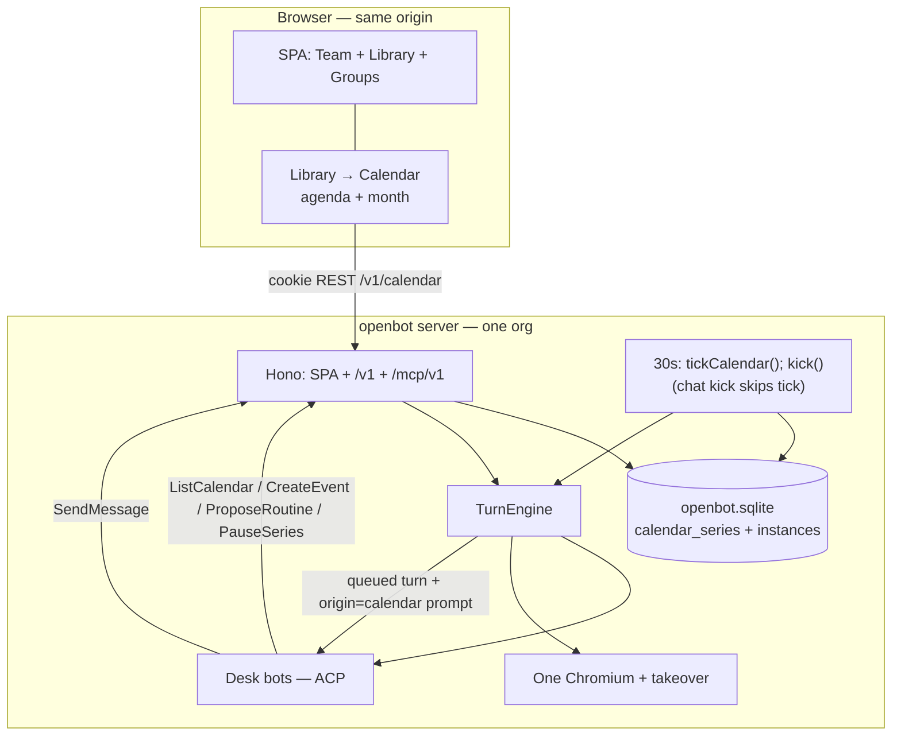
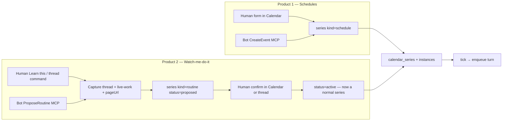

# OpenBot Phase 4 — Durable Calendar, Schedules, and Learned Routines

| Field | Value |
| --- | --- |
| **Title** | OpenBot Phase 4 Design: Durable calendar with a UI; schedules/automations; watch-me-do-it |
| **Author** | OpenBot maintainers (draft) |
| **Date** | 2026-08-26 |
| **Status** | Draft |
| **Depends on** | Phase 1–3 **as implemented in this tree** (`0.3.0` / PR #1 on `release/0.3.0`), not the pre-code freeze |
| **Audience** | Engineers extending `apps/server` + `packages/*` |

Phase 3 shipped org identity, Gateway federation, and group threads. Phase 4 is how **time** enters the teammate loop: a calendar the human can see, two products sitting on it (schedules, and learned-from-watching), and firing that is a real `TurnEngine` turn — not a sidecar cron table.

---

## Overview

OpenBot today only works when a human (or another bot, or OpenAI, or inbound federation) enqueues a turn. There is no clock. “Ada, every weekday at 9, summarize overnight mail” and “learn the workflow I just did in takeover” were deferred as **cron** and **watch-me-do-it** in Phase 1–3, and they were already specified as **two products**. They still are.

Phase 4 adds one substrate both products share: a **durable org-local calendar** in sqlite, with a first-class SPA view. A series is the Google Calendar / iCalendar object (dtstart, timezone, optional RRULE, exceptions). Instances are the occurrences. Automations and learned routines are **kinds of calendar events**, not a hidden job table and not a second “skills” app. When an instance is due, OpenBot enqueues a turn on the assignee desk bot via the existing `TurnEngine`. Occupancy is wait-behind-queue with **one in-flight per series** and a single `due` follow-up (not skip-if-busy). The bot talks to the human only with `SendMessage` (or fallback-promote), same as a human-queued turn. Calendar tick is a **sibling** of `maintenance()`, not inside it — chat `kick()` does not rematerialize the horizon.

The calendar does not run if `openbot server` is down. Catch-up is bounded and honest: a closed laptop means the 9am summary did not happen. Watch-me-do-it v1 drafts a prompt + cadence + assignee from the current thread (and optional takeover/live-work summary). It does **not** record CDP traces or replay clicks.

---

## Where we actually are

Cite this tree (`package.json` version **0.3.0**, Grok CLI pin **1.0.5**), not Phase 1/2/3 sketches where they disagree.

### Runtime (0.3.0, Phase 3 as shipped)

| Fact | Where |
| --- | --- |
| One Bun process = one org = one sqlite | `apps/server/src/cli.ts`, `OpenbotDb.open(join(home, "openbot.sqlite"))` in `apps/server/src/app.ts` |
| `$OPENBOT_HOME`: sqlite, `master.key`, `org.ed25519`, `allowlist`, `desk/`, `grok-home/` | README “Data on disk”; `docs/host-service.md` |
| SQLite WAL, `BEGIN IMMEDIATE`, additive `ensureColumn` then indexes | `packages/db/src/index.ts` `SCHEMA` + `migrate()` |
| `openbot server` / `demo` / `install` / `org` / `gateway` / `peers` / `version` | `apps/server/src/cli.ts` |
| Boot kick: `reapOrphans()` then `kick()` | `cli.ts` demo (~509) and server (~548) |
| Maintenance every **30s**, `unref()`’d; **does not** start turns today | `createApp`: `setInterval(() => ctx.engine.maintenance(), 30_000)` in `app.ts`; `stopApp` clears it |
| Idle ACP TTL **10 min** desk / **30 min** Gateway | `packages/runner/src/index.ts` `DEFAULT_ACP_IDLE_MS`, `DEFAULT_GATEWAY_ACP_IDLE_MS`; `TurnEngine.maintenance()` → `reapIdleHarnesses()` |
| Always-on honesty | README: closing the tab does not stop teammates; stopping the process / unit / VM does |

There is **no** calendar table, **no** cron, **no** RRULE, **no** timezone on `org_meta`, **no** SPA Calendar folder. Time does not exist in the product except as `created_at` / `deadline_at` on turns (human POST sets `deadline_at = now + 2h` in `POST /v1/threads/:id/messages`).

### Turns and the engine

| Fact | Where |
| --- | --- |
| `kick()` → `maintenance()` + `loop()` | `TurnEngine.kick()` in `apps/server/src/engine.ts` |
| At most one `running` turn per `bot_id`; `startIdleBots()` dequeues oldest `queued` | same; `runningBots` in-process set |
| Queue depth **5** per bot | `POST /v1/threads/:id/messages` (`queue_full` 429); `sendToAgent` (`target_busy` 429); `enqueueUserTurn` in `openai.ts`; group mentions skip if full |
| `runTurn` prompt is `SELECT body FROM messages WHERE turn_id = ? AND role = 'user'` | `engine.ts` — empty user row ⇒ empty `session/prompt` |
| Overlay `_meta.rules` on **`session/new` only** | `packages/acp-grok` `deskIdentityRules` / `gatewayIdentityRules`. Per-kind instructions **cannot** live in overlay without respawn |
| Group/fed context is a **`runTurn` prefix**, not overlay | `engine.ts` `if (thread.kind === "group")` |
| Cold start injects digest (40 msgs / 12k chars) | `buildThreadDigest()` — origins `user`, `send_message`, `fallback`, `agent`, `system`, `thread`, `federation`. **Not** `prompt` |
| `promote()` is DB-authoritative; `pending_approval` does not count as a send | `packages/live-work/src/index.ts` |
| `promote()` maps `crash` → turn `status='completed'` (`promote_reason='crash'`); `reapOrphans` websocket says `failed` | same 58–59; `engine.ts` reapOrphans |
| Activity `lastMessage` has **no origin filter** | `activityForAccount` `app.ts` ~1574 |
| SPA `upsertMessage` skips `prompt` only | `spa.ts` ~1509 |
| `LocalHostRunner.display()` returns CDP `pageUrl` without a takeover WS | `packages/runner/src/index.ts` 185–212 |
| Human-visible writes: `SendMessage` or fallback-promote | same; SPA composer is not the bot’s mouth |
| MCP token minted **only on cold start**; `claims.threadId` is that first thread | `engine.ts` `if (!warm) persistMcpToken(..., threadId: turn.thread_id)` |
| Orphan `running` turns after crash are promoted with a system note | `TurnEngine.reapOrphans()` |

### MCP (role-aware)

`packages/mcp-send-message/src/index.ts` `mcpToolsForRole()` / `handleMcpJsonRpc`; `serverInfo.version` is **`"0.3.0"`**.

| Caller | Tools |
| --- | --- |
| Desk | `SendMessage`, `SendToAgent`, `SendToThread`, `ListBots`, `CreateBot` |
| Gateway | those except `CreateBot`, plus `SendToOrg`, `Inbox` |

`CreateBot` is the pattern Phase 4 copies: `requireDesk`, `lockRunningTurn()`, cap, audit, `onCreateBot` hook. Rate: 20 SendMessage/turn, 100/account/hour; 20 A2A/turn, 200/account/hour. Cookie rejected on `/mcp/v1`.

### SPA

`apps/server/src/spa.ts` — one HTML string, dark, 44px targets, same-origin. Left rail: **Team** (desk bots + New bot) + **Library** (Activity, Archive, Gateway pin) + **Groups**. `state.view` is `human` \| `a2a` \| `group` \| `activity` \| `archive`. **No calendar view.** Settings: federation toggle, peers, permission mode, `requireHumanApproval`, API keys. Takeover: `POST /v1/compute/takeover` then `WS /v1/takeover` (JPEG + input) — one Chromium for the org (`packages/runner` `startScreencast` / `dispatchInput`).

### Approvals, audit, org

- `urgency=needs_user` or `bots.require_human_approval` parks `origin='pending_approval'` (`sendMessage()`, `tests/approvals.test.ts`). ACP `session/request_permission` is a **modal**, not a thread message.
- `audit_events` (`account_id`, `actor`, `type`, `payload`, `created_at`): `send_message`, `create_bot`, `fed.*`.
- `org_meta` singleton `id='current'`: `org_id`, `slug`, `name`, `public_origin`, `pubkey`, `federation_enabled`, `account_id`. **No timezone column.** `OrgMetaRow` in `apps/server/src/org.ts`. `PATCH /v1/org` today accepts only `federationEnabled`.
- Phase 3 specified `GET /v1/metrics`; **it did not land** in this tree. Do not pretend it exists.

### Honesty that remains true

From README / `docs/host-service.md`, unchanged in Phase 4:

- Closing the browser tab does not stop teammates. Stopping `openbot server` / the unit / the VM does.
- `$OPENBOT_HOME/desk` is a **shared computer**, not a security boundary inside an org. One Chromium.
- Restart = new ACP process + digest; not amnesia, not a new soul.
- Federation is off until the operator turns it on. Calendar is **not** a reason to turn it on.

### What does not exist

No `calendar_series`, `calendar_instances`, org timezone, RRULE expander, calendar REST, Calendar rail folder, `ListCalendar` / `CreateEvent` / `ProposeRoutine` / `PauseSeries`, `origin='calendar'`, watch-me-do-it capture, or fake-agent calendar directives. Phase 1–3 non-goals listed cron and watch-me-do-it **separately**. Fly provisioning, npm packaging, and binary/Homebrew are **not** this phase.

---

## Background & Motivation

The teammate loop is “Ada keeps working after you close the tab.” That is only true for work **already queued**. Recurring work (“every weekday at 9”) and reusable work (“the thing I just did — save that”) have nowhere to live. Operators have been running the server as a host service (`docs/host-service.md`); the missing piece is a clock they can **see and edit**, not a crontab in `$OPENBOT_HOME`.

Pain if we skip the calendar and bolt on a `jobs` table:

- The human cannot answer “what fires next?” without an API dump.
- A bot that can `CreateBot` would also be able to install silent every-minute jobs.
- Watch-me-do-it becomes a second app (“skills”) that does not occupy time, so Ada double-books 9am.
- Catch-up after a closed laptop is undefined, so we either stampede Grok on boot or silently drop work.

Two product requests, one substrate:

1. **Schedules / automations** — explicit timed work. Human or bot (MCP) creates a series with a prompt, assignee, optional thread. This is the Phase 1–3 “cron” line.
2. **Watch-me-do-it / learned-from-watching** — the human does a task (thread and/or takeover). OpenBot proposes a routine. The human confirms. **Different create path, different trust, different default approval.** Same calendar row afterward.

---

## Goals & Non-Goals

### Goals

1. Persist an org-local **calendar** (series + instances) in sqlite. Survive process restart. UI is the source of truth the human looks at.
2. **Schedules:** create one-shot or recurring events with a prompt, desk-bot assignee, optional thread. Fire = enqueue a real turn on that bot.
3. **Watch-me-do-it v1:** human marks “learn this”; OpenBot drafts a **prompt + cadence + assignee** from the current thread + live-work summaries + best-effort Chromium `pageUrl` via `LocalHostRunner.display()` (no takeover WS required); series starts `status='proposed'` until the human confirms.
4. SPA Library rail gains **Calendar** (agenda + month; week may slip). Create, edit, pause, inspect last run + next fire, link through to the turn/thread. Same `spa.ts` patterns; no new frontend framework. New Event is always a **schedule**.
5. Org default timezone on `org_meta`, set only from **Settings IANA select** (default `UTC` until the operator picks a zone). Events store **UTC instants + the IANA name** used when the human typed “9am”. No browser auto-detect.
6. Calendar tick is a **sibling** of `TurnEngine.maintenance()`, driven by the existing 30s timer plus calendar REST/MCP writes. Chat `kick()` does **not** rematerialize. **No second process.** Catch-up is explicit and capped.
7. Desk MCP tools, role-aware like `CreateBot`: `ListCalendar`, `CreateEvent`, `ProposeRoutine`, `PauseSeries`. Rate limits + min interval. Human can always edit/delete in the UI. `CreateEvent` may assign **another** desk bot.
8. Approvals: learned routines always `proposed`. **`CreateEvent` always inserts `status=proposed`** — the human confirms in Calendar, even when they asked in the same turn. Series flag default: **on** when firing thread is a group **or** assignee `bots.require_human_approval` **or** the creator set the checkbox; otherwise off.
9. Fake ACP tests cover fire → turn → `SendMessage` with `tests/fixtures/acp/fake-agent.ts`. No live xAI.
10. Additive sqlite migrations. One sqlite per instance.

### Non-Goals (Phase 4)

- **Fly / cloud VM provisioning**, npm packaging, binary/Homebrew (one-line: out).
- **Google / Apple Calendar sync**, OAuth, two sources of truth. Optional later: **ICS export**. Inbound sync is out.
- **CDP trace recording and replay.** Watch-me-do-it v1 is a drafted prompt, not a macro player. A second computer-use stack is out; the existing Chromium/takeover is the only browser.
- **Sub-minute cron.** Min interval **5 minutes** between fires of one series.
- **Scheduled `SendToOrg`.** Calendar is org-local. Do not federate calendar rows. Gateway is not a valid v1 assignee.
- Occupancy as a product (“Ada is in a meeting, don’t interrupt”) beyond wait-behind-queue + one-in-flight-per-series + one `due` follow-up. Multi-bot calendar “busy” is later.
- **`OPENBOT_TIMEZONE` as source of truth** / browser auto-detect of org timezone. Settings IANA select only.
- Postgres, Redis, a second agent runtime, changing `promote()` truth, raising the desk cap above 6, putting Gateway in `bots[]`.
- Desktop/mobile clients, OpenCode/Claude adapters.
- Bot-created **confirmed** (`active`) series. `CreateEvent` never auto-activates.

---

## Key Decisions

| # | Decision | Choice | Rationale |
| --- | --- | --- | --- |
| P4-D1 | Source of truth | **Calendar series + instances in sqlite**, Google Calendar / iCalendar mental model. Automations and learned routines are `kind` on a series, not parallel tables the UI hides. | Operator: “built on top of a durable calendar with a UI.” Cron-as-sidecar is how the human never sees the next fire. |
| P4-D2 | Two products | **Do not lump cron and watch-me-do-it.** Same storage and UI; different create paths, trust, default approval. New Event is always `kind=schedule`. Routines exist only via Learn this / `ProposeRoutine`. | Listed separately in Phase 1–3 non-goals (`phase-1` Later Phases; `phase-2` “Cron, routines, watch-me-do-it”; `phase-3` same). A weekday mail summary is not “we watched you.” |
| P4-D3 | Firing | **Enqueue a desk-bot turn** via `TurnEngine`. Assignee default `role='desk'`. Gateway assignee **rejected in v1**. One running turn per `bot_id` still holds. `CreateEvent` may target **another** desk bot (human can pause). Default `thread_id` = source / running-turn thread, not always the DM. | Do not spawn a second agent runtime. `runTurn` already knows how to prompt, digest, promote. MCP `claims.threadId` is the cold-start thread — tools default to `lockRunningTurn().thread_id`. |
| P4-D4 | Occupancy (frozen v1) | **Wait behind the bot’s queue** (depth 5 queued, not queued+running). **One in-flight (`queued`/`running`) per series.** Keep **the latest extra** as `due`; coalesce only older extras — **do not skip-latest.** `min_interval_ms` is an enqueue **floor** (step 5: if `now - last_fired_at < min_interval_ms`, leave `due`), not a window that qualifies follow-ups. Queue full → stay `due`. **Do not skip-because-busy. Do not overlap.** Host-down coalesce of older misses is separate (P4-D5). | Composes queue, in-flight, and catch-up. Hourly overrun keeps 10:00 `due` (not coalesced). A 5-minute series whose turn lasts 6 minutes waits, then fires only after the 5-minute floor. Meeting-busy is later. |
| P4-D5 | Catch-up | Materialize **(a)** the single latest occurrence with `scheduled_at <= now` in `[now - CAL_CATCHUP_MS, now]` (and `dtstart` if that is the one-shot), **plus (b)** up to 64 **future** rows / 14d — do **not** spend the 64 budget on old misses. Any materialized `scheduled` with `scheduled_at <= now` is a **miss**. Newest miss **&lt; 24h** → fire **at most one** (the latest); older materialized misses `skipped_coalesce` (agenda muted “coalesced”). Newest miss **≥ 24h** → `skipped_offline`, system notice on assignee human DM, audit. Enqueue failure leaves the candidate `due`. Laptop-closed = work did not happen. | Honest always-on. 5-minute series down 20h must catch up the **most recent** beat, not `now-24h` plus 64 soonest. |
| P4-D6 | UI | **First-class SPA Calendar** in Library next to Activity/Archive. Agenda default + readable month. Week view may slip if PR-44 blows up `spa.ts`. No new framework. `renderApp` treats `calendar` like `activity` (composer hidden). | A calendar the human cannot see is a cron table. Match `spa.ts` (44px, dark, `state.view`). |
| P4-D7 | Timezone | `org_meta.timezone` IANA string, default **`UTC` until the operator picks a zone in Settings**. Source of truth is **Settings IANA `<select>`** (`PATCH /v1/org { timezone }`). **Do not** auto-detect from the browser. **Do not** use `OPENBOT_TIMEZONE` as source of truth (env is undocumented / non-goal). Series stores `dtstart_utc` (ms) + `timezone` (the zone used when the human typed “9am”). Recurrence expanded in **civil time** in that zone, then stored as UTC instants. **No naive local timestamps.** Validate with `new Intl.DateTimeFormat(undefined, { timeZone })` (400 on throw). Settings `<select>` from `Intl.supportedValuesOf?.('timeZone')` when present. | Operator 2026-08-26: explicit, no traveler surprise. DST: “weekdays at 9” stays 09:00 Eastern, not a frozen UTC offset. |
| P4-D8 | Tick placement | **`tickCalendar()` is not inside `maintenance()`.** `TurnEngine.loop()` stays **private**. Public drain is **`kick()`** (`maintenance() + loop()`). 30s timer and calendar REST/MCP writes that can make a row due: **`tickCalendar(); kick();`**. Chat `kick()` **does not** rematerialize (a “hi” at 09:00:01 must not expand 14 days of RRULE on the HTTP thread). Nested `kick` from `tickCalendar` is forbidden (`maybeKickGatewayDrain` already calls `kick` from a turn — calendar must not). **No second process.** | `app.ts` cannot call private `loop()`. Extra `maintenance()` on the calendar path is cheap. `tests/idle-acp.test.ts` keeps calling `maintenance()` only. Boot: `reapOrphans(); tickCalendar(); kick();`. |
| P4-D9 | Instance ↔ turn | Instance row **points at** `turn_id` after enqueue. Do **not** duplicate `turns`. Prompt is a `role='user'` `origin='calendar'` row bound to that turn (same pattern as federation’s bound user row). | `runTurn` reads `WHERE turn_id = ? AND role = 'user'`. Prefix-only is not a prompt. |
| P4-D10 | Transcript | `origin='calendar'` is **engine input**, omitted from GET `/v1/threads`, `onPush`, Activity, digest — same as `origin='prompt'`. The bot **must** `SendMessage` if the human should see a result. Do not dump assistant text as “the 9am ran.” Fallback-promote still applies if they never send (existing safety net). | Phase 1 D7. A weekday bubble of swallowed live-work would wreck the DM. |
| P4-D11 | MCP | Desk-only: `ListCalendar`, `CreateEvent`, `ProposeRoutine`, `PauseSeries`. Gateway **does not** get calendar tools. `requireDesk` + `lockRunningTurn()` like `CreateBot`. **`CreateEvent` always inserts `status=proposed`.** Never `active`, even if the human asked in the same turn. Human confirms in Calendar. Matches `ProposeRoutine`. | Operator 2026-08-26: no silent cron from a bot. Human UI always wins. |
| P4-D12 | Caps | **Min 5 minutes** between fires of one series (`now - last_fired_at < min_interval_ms` → leave `due`). **Max 32 non-cancelled** series per org (`active` + `paused` + `proposed`). Create, confirm, and **unpause** all 409 at the cap. Horizon: **one latest catch-up miss** (not counted against the 64) **plus** at most **64 future** instances or 14 days, whichever first; rematerialize on tick. **Max 8** calendar enqueues per tick org-wide (further bounded per bot by queue depth 5). CreateEvent/ProposeRoutine: **3/turn**, **20/account/hour**, counted via `audit_events.type='calendar.create'`. | Pause-32-then-create-32 must not yield 64 firing series. Hourly and 5-minute are legal; the 64 is a **future** window, not a bag of old misses. |
| P4-D13 | RRULE subset | Implement in **`packages/calendar`** (no `rrule` / `ical.js` dependency). `FREQ=HOURLY\|DAILY\|WEEKLY\|MONTHLY`, `INTERVAL`, `BYDAY`, `BYHOUR`/`BYMINUTE`, `COUNT`/`UNTIL` **in the rrule string only**. Create/parse rejects `SECONDLY`, `MINUTELY` unless `INTERVAL` yields ≥ 5 min, and `BYSETPOS`. **Do not** reject HOURLY or 5-minute series for expanding to &gt; 64 in 14 days — that cap is materialize-only. One-shot = `rrule` NULL. Jan 31 + `FREQ=MONTHLY`: skip months with no 31st (RFC; do not clamp to 28). | Tests without a server: `FREQ=HOURLY;INTERVAL=1` and `FREQ=MINUTELY;INTERVAL=5` parse and expand. Unbounded expand is a DoS on tick, bounded by the window. |
| P4-D14 | Watch-me-do-it v1 | **Draft only.** Capture = current thread transcript (last 20 visible msgs) + last turn `summarizeLiveEvent` text (not raw payloads) + `LocalHostRunner.display().pageUrl` when Chrome is up (empty if never started; **do not** require an active takeover WS). Insert `kind='routine'` `status='proposed'`. Firing `thread_id` defaults to the **source thread**. Human edits in Calendar UI or confirms. **No CDP journal, no replay.** | Listed separately from cron in Phase 1–3 non-goals. Replay is later and would still use this Chromium. |
| P4-D15 | Approvals | Learned **always** `status='proposed'` (the confirm). **`CreateEvent` always `proposed`** — no in-thread auto-activate. **Do not** default `require_human_approval=1` on all routines. Human UI New Event schedules are `active` immediately (the form is the confirm). Series flag default **on** iff firing `thread_id` is a group **or** assignee `bots.require_human_approval` **or** the creator set the checkbox. `sendMessage()` joins `calendar_instances` on `turn_id` (PR-43). Calendar-turn-only: if any `pending_approval` exists for that turn, treat as `hasSend` before `promote()` so we do not empty_turn **and** park a card. Global `promote()` truth for human turns is unchanged (`tests/approvals.test.ts`). | Operator 2026-08-26: even “Ada, every weekday at 9…” is a proposed row until Calendar confirm. Daily 09:00 with the flag on must not spam “finished without a message.” |
| P4-D16 | No Google sync | OpenBot calendar **is** the product. ICS export later. Inbound Google/Apple is out (OAuth + two clocks). | Operator: durable calendar with a UI, not a replica of the personal calendar. |
| P4-D17 | Org-local | Do not federate calendar rows. No scheduled `SendToOrg` in v1. | Phase 3 hop=1 mail is a diplomat job, not a clock. Two orgs with two calendars is two processes. |
| P4-D18 | Assignee archive / purge | Archive (`POST /v1/bots/:id/archive`): **pause** series with `assignee_bot_id=?` and `status IN ('active','proposed')`; assignee stays. Restore does **not** auto-unpause (human resumes in Calendar; avoids cap surprises). Purge: cancel only series where `assignee_bot_id=? OR created_by_bot_id=?`; **do not** match `thread_id IN (threads WHERE bot_id=?)` (that would cancel Ada’s group standup when convenor Bob is purged). Thread/turn FKs `ON DELETE SET NULL`. Tick skips null-assignee series. | Groups are rehomed, not deleted, when a member remains (`deleteBotPermanently` ~570–582). Learn-this on groups is v1. |
| P4-D19 | Exceptions | This-occurrence cancel = instance `status='cancelled'` (EXDATE analogue). If the instance is **`queued`**, cancel the **turn** in the same `immediate()` (`UPDATE turns SET status='cancelled'` — same as `POST /v1/turns/:id/cancel` for queued). If **`running`**, leave it: **in-flight finishes**; the UI says so. Series pause / edit-from-now-on apply the same to future `scheduled`/`due`/`queued` of the old rrule (`running` still finishes). | Otherwise the UI “cancels” while `startIdleBots` still dequeues the prompt. |
| P4-D20 | Prefix not overlay | Calendar instructions are a **`runTurn` prefix** when the user-row origin is `calendar`. Load `SELECT origin, body` (today `SELECT body` only). **Final concatenation** (every turn, warm or cold): `digest? + calendarBlock? + groupBlock? + body`. If implementing as prepends: apply **group first, calendar second** (last prepend wins the front). Do not put cadence in `_meta.rules`. | Warm ACP is `Map<botId, AcpClient>`. Overlay cannot change per turn. Same as P3-D23. `[[echo-cal-prefix]]` must see the calendar block **before** `Group thread "…"`. |

---

## Proposed Design

### System context



The calendar is not a scheduler daemon. It is rows + a tick that inserts the same `turns` a human POST would.

### Two create paths (do not merge in the UI)



Calendar UI lists both; badges `Schedule` vs `Routine` vs `Proposed`. Confirming a routine does not convert it into a “skill” object. **New Event is always a schedule** — there is no product toggle on the form.

### Series and instances

A **series** is what the human edits. An **instance** is one firing.

| Series field | Role |
| --- | --- |
| `kind` | `schedule` (cron product) \| `routine` (learned product) |
| `status` | `proposed` \| `active` \| `paused` \| `cancelled` |
| `prompt` | User-row body for the firing turn (the work) |
| `assignee_bot_id` | Desk bot. v1: `IFNULL(role,'desk')='desk'` and `status='active'`. **Nullable** after purge. Tick skips NULL. |
| `thread_id` | Turn’s thread. **Learn this / ProposeRoutine / CreateEvent:** default `lockRunningTurn().thread_id` or the Learn-this source thread (a group stays a group). **New Event form:** default assignee human DM unless the human picks a group. Nullable after purge (`ON DELETE SET NULL`). |
| `dtstart_utc` + `timezone` | First occurrence + zone for civil expansion |
| `rrule` | NULL = one-shot; else canonical subset string. **Source of truth for COUNT/UNTIL** — no parallel `until_utc`/`count` columns. |
| `require_human_approval` | If 1, firing turn’s `SendMessage` parks `pending_approval` even if the bot flag is off |
| `created_by` | `human` \| `bot` \| `learn` |
| `capture_summary` | Watch-me-do-it notes (nullable). Inspectable in UI. Not executed. |

**Instance status machine:**

```
scheduled  →  (scheduled_at <= now) miss
           →  catch-up keeps latest (<24h) as enqueue candidate; older skipped_coalesce
           →  ≥24h: skipped_offline
enqueue ok     → queued → running → completed | failed | cancelled
enqueue fail   → due (retry next tick)
pause          → scheduled|due → skipped_paused; queued → cancel turn + cancelled
this-occurrence cancel: queued → cancel turn; running → leave (in-flight finishes)
proposed series: no instances until confirm
```

**Miss definition:** any `scheduled` row with `scheduled_at <= now` is a miss. Catch-up/coalesce then run. Enqueue failure is the only path that assigns `due`.

Reconcile from `(turns.status, promote_reason, error)` — **not** from `turns.status` alone. In this tree `promote()` maps `cancel` → `cancelled`, `deadline` → `failed`, and **crash → `completed`** (`packages/live-work/src/index.ts` 58–59). `reapOrphans` pushes websocket `failed` while the row is `completed`. Instance mapping:

| Turn after promote | Instance |
| --- | --- |
| `status='cancelled'` | `cancelled` |
| `promote_reason IN ('crash','deadline')` or `error IS NOT NULL` | `failed` |
| else `status='completed'` | `completed` |

There is **no deadline reaper** in this phase (`deadline_at = now+2h` is copied from human POST for consistency; nothing reads it). After `reapOrphans` promotes an orphaned calendar turn, the next tick must **not** re-enqueue that instance.

Unique `(series_id, scheduled_at)` so rematerialize is idempotent.

### Recurrence (`packages/calendar`)

New workspace package, analogue of `packages/federation`: **pure functions, no sqlite, no Hono.** `CAL_*` constants live here (not in `packages/db`) so tick code imports `@openbot/calendar` without a cycle. Wire `packages/calendar/package.json` and `apps/server` dependency in **PR-41**.

Canonical RRULE text examples the UI/MCP accept (all legal at create time):

```
FREQ=DAILY;INTERVAL=1;BYHOUR=9;BYMINUTE=0
FREQ=WEEKLY;BYDAY=MO,TU,WE,TH,FR;BYHOUR=9;BYMINUTE=0
FREQ=WEEKLY;BYDAY=FR;BYHOUR=17;BYMINUTE=0
FREQ=HOURLY;INTERVAL=1
FREQ=MINUTELY;INTERVAL=5
```

Create/parse rejects: `FREQ=SECONDLY`; `FREQ=MINUTELY` with interval &lt; 5 minutes; `BYSETPOS`; unknown keys that would change meaning. **Do not** reject a rule because it would expand to more than 64 instances in 14 days.

Expansion:

1. Interpret `dtstart_utc` in `series.timezone` as civil `YYYY-MM-DDTHH:MM`.
2. Iterate occurrences in that zone (`BYHOUR`/`BYMINUTE` are **local**). `COUNT` / `UNTIL` come from the **rrule string**, not extra columns.
3. Convert each civil time to UTC via `Intl` (or `Temporal.ZonedDateTime` if the pin’s Bun exposes it — spike in PR-41; **do not store the civil string as the fire time**).
4. DST spring-forward: if 09:00 does not exist, skip that instance (do not fire at 10:00 silently). Fall-back: fire at the **first** 09:00.
5. Monthly / 31st: if `dtstart` is Jan 31 and `FREQ=MONTHLY` (or `BYMONTHDAY=31`), **skip** months with no 31st (RFC 5545). Do not clamp to Feb 28.
6. Materialize **one latest catch-up miss** (if any) plus at most 64 **future** rows or 14 days, whichever first; rematerialize on later ticks as the window slides. Do not fill the 64 with old misses.

Tests (no server): `America/New_York` 2026-03-08 and 2026-11-01; `UTC`; invalid RRULE; `MINUTELY;INTERVAL=1` rejected; `HOURLY;INTERVAL=1` and `MINUTELY;INTERVAL=5` parse and expand; Jan 31 monthly skip.

`org_meta.timezone` is the **default** for new events and for the SPA calendar grid. It does not rewrite existing series (they keep their own `timezone`).

### Tick, fire, catch-up

`tickCalendar` lives in `apps/server/src/calendar-tick.ts` (imports `@openbot/calendar` + `@openbot/db`). It is **not** a method of `maintenance()`.

```mermaid
sequenceDiagram
  participant T as 30s timer / boot / calendar REST
  participant M as TurnEngine.maintenance
  participant C as tickCalendar
  participant DB as sqlite
  participant L as startIdleBots
  participant B as Ada ACP
  participant H as Human DM

  Note over T,M: chat kick() = maintenance + loop only (no tickCalendar)
  T->>C: tickCalendar(now)
  C->>DB: latest miss in 24h + up to 64 future
  C->>DB: catch-up / coalesce / skip_offline
  C->>DB: candidate → INSERT turns queued + origin=calendar user row
  C->>DB: COMMIT immediate (before kick/loop)
  T->>M: kick() = maintenance + loop
  T->>L: startIdleBots
  L->>B: runTurn (digest? + calendar + group + body)
  B->>H: SendMessage (or fallback-promote)
  L->>DB: promote(); reconcile instance
```

**Who calls `tickCalendar`:**

| Caller | Calls |
| --- | --- |
| 30s timer | `tickCalendar(); kick();` (`loop()` is private; `kick` = maintenance + loop) |
| Boot (`cli.ts`) | `reapOrphans(); tickCalendar(); kick();` |
| REST create / confirm / unpause, MCP that can make a row due | `tickCalendar(); kick();` once (still gated by 8/tick + queue 5; extra reap is cheap) |
| Chat `kick()` (human POST, SendToAgent, SendToThread, CreateBot) | `maintenance(); loop();` — **no** `tickCalendar` |

`BEGIN IMMEDIATE` covers the enqueue slice and **must commit before** `kick()` / `runTurn` / `promote()` (those also `immediate()`; nested begin fails). Bound work: only series with `next_due_at <= now + CAL_HORIZON_MS` (or NULL). Tick &lt; 50 ms is a target, not a hope — skip full-horizon expand of series whose next fire is next week. Do not call private `loop()` from `app.ts`.

**`tickCalendar(db, nowMs)`:**

1. **Materialize.** For each `calendar_series` `status='active'` with a live desk assignee, insert missing `scheduled` rows (idempotent on `(series_id, scheduled_at)`). Split the window — **do not** spend the 64 budget on old misses:
   - **(a) Latest miss:** the **single** latest occurrence with `scheduled_at <= now` (from `dtstart` forward). One row, even if it is 20h or 3d stale. Do **not** insert the other 287 five-minute beats in a 24h outage.
   - **(b) Future window:** up to `CAL_MAX_INSTANCES_HORIZON` (64) occurrences with `scheduled_at > now` and `scheduled_at <= now + CAL_HORIZON_MS`. Future-only.
   - One-shot 10 minutes ago: **(a)** that row; catch-up fires it (&lt; 24h).
   - Daily created after 09:00 with dtstart this morning: **(a)** this morning; catch-up fires it if &lt; 24h.
   - One-shot 3 days ago: **(a)** that row; catch-up marks `skipped_offline` (step 3).
   - 5-minute series, freeze `now` 20h after last tick: **(a)** is the most recent beat, **not** `now-24h` plus 64 soonest. Catch-up fires that latest beat.
2. **Pause/cancel series.** `paused`/`cancelled`: `scheduled`/`due` → `skipped_paused` / `cancelled`. **`queued`:** cancel the turn in the same transaction (P4-D19). **`running`:** leave the instance; it finishes.
3. **Catch-up per series** (`scheduled` with `scheduled_at <= now`, plus leftover `due`):
   - Let `misses` be those rows oldest-first. Let `latest = misses.at(-1)`.
   - If `now - latest.scheduled_at >= 24h`: set all `skipped_offline`; insert **one** `origin='system'` notice on the assignee human DM (“Calendar missed N runs for {title} while OpenBot was down. They were not replayed.”); audit `calendar.skipped_offline`; **do not** enqueue.
   - Else: keep `latest` as the catch-up candidate; older misses `skipped_coalesce` (agenda: muted “coalesced”). No extra DM for coalesce — the grid shows it.
4. **In-flight (same series).** If the series already has `queued` or `running`:
   - Do **not** enqueue another.
   - Keep **the latest extra** as `due`. Older extras `skipped_coalesce`. **Do not** filter follow-ups by `min_interval_ms` (that field is a floor at enqueue, not a ceiling that drop-coalesces hourly overruns).
   - Hourly series still `running` at 10:01: 10:00 stays `due`, not `skipped_coalesce`.
   - 5-minute series whose turn lasts 6 minutes: next beat stays `due`; step 5’s floor delays enqueue until 5 minutes after `last_fired_at`.
5. **Enqueue** up to **8** candidates **org-wide** this tick, oldest `scheduled_at` first:
   - Assignee must be active desk bot (`assignee_bot_id` NOT NULL).
   - `COUNT queued WHERE bot_id=?` must be **&lt; 5**; else leave `due`. (Queued-only, matching `app.ts` 1068–1072. A bot with 1 running + 4 queued still has one slot.)
   - **Floor:** if `series.last_fired_at` is set and `now - last_fired_at < series.min_interval_ms`, leave `due` (do not enqueue). Restores the 5-minute minimum after a follow-up is kept.
   - Per-bot the 8/tick cap is therefore `min(8, 5 - queued)` for that bot. **One assignee owning 32 series at 09:00 does not drain in two minutes** — Ada serializes ~32 Grok turns; tick 1 enqueues at most 5 if she is idle, not 8.
   - Insert `turns` `{ bot_id: assignee, thread_id: series.thread_id, status:'queued', deadline_at: now+2h }` — `thread_id` is required at fire time; if NULL (purged), skip and audit. Same shape as `POST /v1/threads/:id/messages`.
   - Insert `messages` `{ role:'user', origin:'calendar', turn_id, thread_id, body: series.prompt }`.
   - `instance.status='queued'`, `instance.turn_id=...`, `series.last_fired_at=now`, `series.next_due_at=...`.
   - Audit `calendar.fire` `{ seriesId, instanceId, turnId }` actor `engine`.
6. Return `{ enqueued, dueLeft, skippedOffline, skippedCoalesce }`. Never call `kick()` from here.

**Timer change** (`app.ts`). `loop()` is `private` (`engine.ts` ~174). Do not call it from `app.ts`. Public drain is `kick()`:

```ts
// today
ctx.maintenanceTimer = setInterval(() => ctx.engine.maintenance(), 30_000);

// Phase 4 — tick then kick. kick() does not rematerialize. Chat kick() is unchanged
// (no tickCalendar). Extra maintenance() inside kick() is cheap.
ctx.maintenanceTimer = setInterval(() => {
  ctx.engine.tickCalendar();
  ctx.engine.kick();
}, 30_000);
ctx.maintenanceTimer.unref();
```

`TurnEngine.tickCalendar()` is a public wrapper around `apps/server/src/calendar-tick.ts` so the timer/REST do not import the tick module twice. Tests: do **not** sleep 35s; call `tickCalendar(); kick();` (or fake timers). `tests/idle-acp.test.ts` keeps calling `maintenance()` only and must still start **zero** turns.

**`runTurn` additions:**

- Load `SELECT origin, body FROM messages WHERE turn_id = ? AND role = 'user' ORDER BY created_at DESC LIMIT 1` (today `SELECT body` only, `engine.ts` 393–395).
- Prefix composition, **every** turn (warm or cold). Specify the **final string**, not a sequence of prepends:

```
prompt = (cold ? digest + "\n---\nCurrent message:\n" : "")
       + (origin === "calendar" ? calendarBlock + "\n\n" : "")
       + (thread.kind === "group" ? groupBlock + "\n\n" : "")  // existing engine.ts 398–400 text
       + body
```

  If implementing as prepends: apply **group first, calendar second** so calendar wins the front. Cold digest wrapping stays `wrapPromptWithDigest(digest, rest)` around that result.

```
This turn was started by calendar event "{title}" ({kind}{, recurring}).
Do the work in the prompt. If the human should see a result, call SendMessage.
If this turn is on a group thread, speak there with SendToThread; SendMessage still DMs the human privately.
If you parked a SendMessage as pending_approval, you are done — do not ramble.
Do not announce that you are a cron job. Do not CreateEvent from this turn unless the prompt asks to schedule follow-up.
```

- `VISIBLE_MESSAGES_SQL`, `onPush`, Activity SQL, SPA `upsertMessage` skip `origin='calendar'` like `prompt`.
- `buildThreadDigest` does **not** add `calendar`.
- After `promote()`, reconcile the instance from `(status, promote_reason, error)` (P4-D9 table). Also on the next tick. Orphaned calendar turn after restart: `reapOrphans` promotes; tick must not insert a second turn.

**Promote / empty_turn:** Do **not** increment `sent_message_count` just because the calendar fired. Silent “only ping if urgent” may still empty_turn — form help says that is OK. **Calendar-turn-only exception:** if the turn has any `origin='pending_approval'` row, set `hasSend` (e.g. bump `sent_message_count` if it is still 0) **before** `promote()`, so a parked send is not followed by “finished without a message.” Do not change global `promote()` for human turns.

Fake-agent: add `[[echo-cal-prefix]]` (SendMessage `got-calendar-prefix` if the calendar block is present) and keep `[[echo-prefix]]` for the group line. A group-fired calendar turn must see **both**, and the calendar block must appear **before** `Group thread "…"`.

### Occupancy decision table (P4-D4, frozen)

Columns are the live conditions at enqueue time.

| Same series in-flight (`queued`/`running`) | Other work on assignee | Queue queued=5 | Host-down miss | Action |
| --- | --- | --- | --- | --- |
| no | no | no | n/a (on time) | Enqueue |
| no | yes (Ada mid-DM) | no | n/a | Enqueue; waits behind the queue |
| no | any | yes | n/a | Stay `due`; retry next tick |
| yes | any | any | n/a | Do not enqueue. Keep **the latest extra** as `due`; older extras `skipped_coalesce`. Enqueue later only if the floor `now - last_fired_at >= min_interval_ms` |
| no | any | any | newest &lt; 24h | Fire **latest** only; older `skipped_coalesce` (agenda “coalesced”) |
| no | any | any | newest ≥ 24h | All `skipped_offline` + one DM notice |

Worked examples:

| Situation | Behavior |
| --- | --- |
| Ada `running` a human hello, queue 0–4, weekday 9am series | Enqueue; waits |
| Ada queue **5** | Stay `due` |
| 5-minute series, turn lasts 6 minutes | One in-flight; next beat stays `due`; enqueue only after `last_fired_at + 5min` |
| Hourly series still `running` at 10:01 | 10:00 stays `due`, **not** `skipped_coalesce` (`min_interval_ms` is not a follow-up ceiling) |
| 32 series at 09:00, **one** assignee | Tick enqueues `min(8, 5 − queued)` for Ada. Drain ≈ 32 serial Grok turns, **not** ~2 minutes |
| 32 series at 09:00, 6 idle desk bots | Up to 8 enqueues this tick org-wide, spread by oldest `scheduled_at` |
| Host down 3 hours, weekday 9am | One catch-up |
| Host down 3 hours, hourly series (23 misses) | One fire (latest); 22 coalesced, visible in agenda |
| Host down 3 days | `skipped_offline` + DM notice |

### Watch-me-do-it v1 (bounded)

**Not built:** event log of CDP `Input.dispatch*` / screenshots / “replay this Tuesday.”

**Built:**

1. UI: on a human DM or group thread, button **Learn this**. `POST /v1/calendar/learn { threadId, botId? }`.
2. Thread command: human message that the SPA treats as a learn action is **not** a magic regex in the engine. Optional later: if the human texts “learn this”, Ada’s *next* turn may `ProposeRoutine`. v1 is the button + MCP so we do not parse chat.
3. Server capture (no Grok required):
   - Last 20 visible messages of `threadId` (`origin NOT IN ('prompt','calendar')`).
   - Last turn on that thread: `summarizeLiveEvent` text over recent `live_work_events` (same helper as Activity). **Do not** copy raw payloads into `prompt`.
   - Page URL: `LocalHostRunner.display().pageUrl` when Chrome is up (`packages/runner` 185–212). Empty if Chromium never started. **Do not** require an active takeover WebSocket.
   - Assignee = `botId` or the source thread’s desk bot (human DM bot, or convening bot on a group). Desk only.
4. Insert series `kind='routine' status='proposed'` with a **draft** `title` (thread title or “Routine from {bot}”), `prompt` = stitched capture (“Repeat this workflow: … Transcript: … Live work: … Page: …”), `capture_summary` JSON, `created_by='learn'`, **`thread_id` = source thread** (group stays group), `source_thread_id`, `source_turn_id` if any. **No `rrule` until the human sets one** — proposed one-shot at `dtstart_utc = now + 1 day` local 09:00 in org timezone is a starting guess the form shows (still in the catch-up window if they confirm late the same day).
5. Push `{ type: 'calendar.proposed', seriesId }` so the SPA can open the editor. Human must set cadence and confirm (`POST /v1/calendar/series/:id/confirm` → `active`, then `tickCalendar(); kick();`).

`ProposeRoutine` MCP is the bot-shaped path: Ada, in a running turn, submits `{ title, prompt, rrule?, dtstart?, timezone?, threadId? }`. Default `threadId` = `lockRunningTurn().thread_id` (not `claims.threadId`). Always `proposed`. She should `SendMessage` “I drafted a routine — confirm it in Calendar.”

Honesty copy in the Learn-this modal:

> This saves a prompt you can edit, not a recording of clicks. OpenBot will not replay the browser session.

### MCP tools (desk)

Role-aware list in `mcpToolsForRole`: desk gains four tools; Gateway list **unchanged**.

```ts
export const LIST_CALENDAR_TOOL = {
  name: "ListCalendar",
  description:
    "List this org's calendar series (title, kind, status, next fire, assignee). Use before CreateEvent. The human edits the same calendar in the UI.",
  inputSchema: {
    type: "object",
    properties: {
      status: { type: "string", enum: ["proposed", "active", "paused", "cancelled"] },
      kind: { type: "string", enum: ["schedule", "routine"] },
    },
  },
};

export const CREATE_EVENT_TOOL = {
  name: "CreateEvent",
  description:
    "Create a calendar schedule (one-shot or recurring) for a desk bot (you or another). Always status=proposed — the human must confirm in Calendar. Never auto-activates. Min interval 5 minutes. Cap 32 non-cancelled series. Do not install every-minute jobs. Do not curl OpenBot HTTP.",
  inputSchema: {
    type: "object",
    properties: {
      title: { type: "string" },
      prompt: { type: "string", description: "Work the assignee does when it fires" },
      botId: { type: "string" },
      name: { type: "string", description: "Assignee desk bot name" },
      dtstart: { type: "string", description: "ISO-8601 instant or local civil time" },
      timezone: { type: "string", description: "IANA tz; default org timezone" },
      rrule: { type: "string", description: "RFC 5545 subset; omit for one-shot" },
      threadId: { type: "string" },
      requireHumanApproval: { type: "boolean" },
    },
    required: ["title", "prompt"],
  },
};

export const PROPOSE_ROUTINE_TOOL = {
  name: "ProposeRoutine",
  description:
    "Draft a learned routine on the calendar as status=proposed. The human must confirm in Calendar. Not a CDP replay. Not CreateEvent.",
  inputSchema: {
    type: "object",
    properties: {
      title: { type: "string" },
      prompt: { type: "string" },
      botId: { type: "string" },
      name: { type: "string" },
      rrule: { type: "string" },
      dtstart: { type: "string" },
      timezone: { type: "string" },
      threadId: { type: "string" },
    },
    required: ["title", "prompt"],
  },
};

export const PAUSE_SERIES_TOOL = {
  name: "PauseSeries",
  description:
    "Pause or resume a calendar series by id. Pausing skips future fires. The human can also pause in the UI.",
  inputSchema: {
    type: "object",
    properties: {
      seriesId: { type: "string" },
      paused: { type: "boolean" },
    },
    required: ["seriesId", "paused"],
  },
};
```

Authorization: `verifyMcpToken` + `lockRunningTurn` + `requireDesk`. Assignee defaults to **caller** if `botId`/`name` omitted; **may be another desk bot** (human can pause). Cannot target Gateway (`forbidden`). Cannot target another org. Default `threadId` = `lockRunningTurn().thread_id` if omitted.

Rate: 3/turn and 20/account/hour counted as `SELECT COUNT(*) FROM audit_events WHERE type='calendar.create' AND account_id=? AND created_at>?` (and per `payload` turnId for the per-turn cap). Pause/unpause does not count as create; unpause still hits the 32 non-cancelled cap.

`CreateEvent` / `ProposeRoutine` parse dtstart: if the string has `Z` or an offset, that is the UTC instant and `timezone` is still stored for display/RRULE; if naive, interpret in `timezone` or org default. Never write a naive column. **`CreateEvent` always inserts `status=proposed`.** It does not call `tickCalendar` (nothing is due until the human confirms). After REST **confirm / unpause / human New Event**, call `tickCalendar(); kick();` once. Do not fire from the MCP handler itself. `loop()` stays private.

Overlay (`deskIdentityRules`) add, stable for the ACP child:

```
Time: ListCalendar / CreateEvent / ProposeRoutine / PauseSeries. CreateEvent and ProposeRoutine always insert a proposed calendar row the human must confirm in Calendar. They never silently start firing. Min 5 minutes between fires. Do not schedule SendToOrg. Do not curl OpenBot HTTP.
```

Per-turn calendar prefix stays in `runTurn` (P4-D20).

### SPA Calendar

`apps/server/src/spa.ts` only (no Vite app). Patterns to copy: `openActivity` / `paintActivity`, folder buttons in Library, `state.view`, `tests/spa-markup.test.ts` string asserts.

- Library, after Archive (before Gateway pin): folder **Calendar** (`#open-calendar`).
- `state.view === 'calendar'`. `renderApp`: `inCalendar` next to `inActivity` / `inArchive` — heading `Calendar`, composer **hidden**, `mainInner` is the calendar board (not `#msgs`).
- Segmented control: **Agenda** (default) + **Month**. **Week may slip** to a fast-follow if PR-44 blows up the ~2300-line `spa.ts` string.
- Month grid in org timezone (`state.org.timezone` from `GET /v1/org`). Events are instance `scheduled_at` converted for display.
- Agenda: upcoming 14 days + a **Proposed** section at top. `skipped_offline` muted honesty; `skipped_coalesce` muted “coalesced.”
- Click instance → side panel or modal: title, kind, rrule prose, assignee, last run (`selectBot` + thread of `series.thread_id`), next fire, Pause, Edit, Delete this occurrence / this series. If `running`: “In-flight — this run will finish.”
- **New event** primary button → form: **always** `kind='schedule'`, `created_by='human'`, `status=active`. Fields: title, assignee `<select>` desk bots, datetime-local, timezone (default org), repeat (none / weekdays 09:00 / daily / weekly / custom RRULE advanced), prompt textarea, require-approval checkbox (prechecked per P4-D15). **No Schedule vs Routine toggle.** Submit `POST /v1/calendar/series`.
- Thread header **Learn this** (`#learn-this`) when `state.view` is `human` or `group`. Not on A2A. That is the only UI create path for `kind='routine'`.
- Settings: IANA timezone `<select>` from `Intl.supportedValuesOf?.('timeZone')` (fallback: validated text input of an IANA name — still the human picking a zone). `PATCH /v1/org { timezone }`. Default `UTC` until set. **Do not** read `Intl.DateTimeFormat().resolvedOptions().timeZone` and PATCH on boot. Copy: “Used when you type 9am. Existing events keep their own zone. Defaults to UTC until you pick one.”
- While `state.view==='calendar'`, reuse the existing host poll (`setInterval` 2500ms at `spa.ts` ~933 that already repaints Activity when `state.view==='activity'` at ~1326): if calendar, `GET /v1/calendar`. Prefer `onPush` `calendar.updated` / `calendar.proposed` / `calendar.fire` when present. **Do not** invent a separate 15s timer “like Activity.”
- Markup tests: `open-calendar`, `Learn this`, `timezone`, `calendar.proposed`, `origin === 'calendar'`, `inCalendar`, no “Schedule vs Routine” toggle.

Do not build a drag-and-drop Google Calendar clone. Agenda + a readable month grid is v1.

### Overlay, digest, Activity

| Surface | Calendar origin rows |
| --- | --- |
| `GET /v1/threads` / `:id` | Omit (`VISIBLE_MESSAGES_SQL` → `origin NOT IN ('prompt','calendar')`) |
| `onPush` `message.created` | Omit (`app.ts` `onPush` already skips `prompt`; add `calendar`) |
| Activity `lastMessage` | **Change the query** (`activityForAccount` `app.ts` ~1574): `WHERE thread_id=? AND origin NOT IN ('prompt','calendar') ORDER BY created_at DESC LIMIT 1`. A `skipped_offline` system notice **should** show. |
| SPA `upsertMessage` | `if (m.origin === 'prompt' \|\| m.origin === 'calendar') return;` (`spa.ts` ~1509 today only skips `prompt`) |
| Digest | Omit calendar; include send_message/fallback/system |
| Fallback-promote | Unchanged for human turns; lands on `turn.thread_id`. Calendar-turn pending_approval counts as hasSend (P4-D15). |

---

## API / Interface Changes

Session cookie (or bearer **session** token), same `requireSession` as `/v1/org`. **Not** `sk-ob_…`.

| Method | Path | Body / query | Result |
| --- | --- | --- | --- |
| `GET` | `/v1/calendar` | `from`, `to` (UTC ms), optional `status`, `kind` | `{ timezone, series, instances }` for the window + proposed series |
| `GET` | `/v1/calendar/series/:id` | | Series + last 20 instances + next fire |
| `POST` | `/v1/calendar/series` | `{ title, prompt, botId, dtstart, timezone?, rrule?, threadId?, requireHumanApproval? }` | `{ series }` 201. **Always** `kind='schedule'`, `created_by='human'`, `status='active'`. Reject `kind` if present. Then `tickCalendar(); kick();`. MCP uses the tool, not this. |
| `PATCH` | `/v1/calendar/series/:id` | subset of fields; `status`: `active` \| `paused` \| `cancelled`. **Not** independent `until`/`count`. | Rematerialize if rrule/dtstart/tz change. Unpause 409 if non-cancelled cap. Then `tickCalendar(); kick();` if the change can make a row due. |
| `POST` | `/v1/calendar/series/:id/confirm` | | proposed → active (routines and bot drafts). Then `tickCalendar(); kick();`. |
| `POST` | `/v1/calendar/series/:id/pause` | `{ paused: boolean }` | Unpause counts toward cap 32. Queued instances: cancel turns. Running: finish. |
| `DELETE` | `/v1/calendar/series/:id` | | `cancelled` (do not DELETE rows; keep history). Same queued/running rules as pause. |
| `POST` | `/v1/calendar/instances/:id/cancel` | | this occurrence only. **`queued` → cancel the turn in the same `immediate()`.** `running` → 409 `in_flight` (or 200 with `{ finished: false }` and copy “this run will finish”). |
| `POST` | `/v1/calendar/learn` | `{ threadId, botId? }` | `{ series }` proposed routine; `thread_id` = source thread |
| `PATCH` | `/v1/org` | **+ `timezone`** IANA string | Same handler as `federationEnabled`. Ignore unknown keys. 400 invalid IANA **without** breaking federation tests. `orgMemberSnapshot` includes `timezone`. |
| `GET` | `/v1/org` | | + `timezone` |

Zod in `packages/api-types` (`createCalendarSeriesInput`, `patchCalendarSeriesInput`, `learnRoutineInput`). Title max 200; prompt max 32_000 (same as message body); rrule max 512.

`GET /v1/me` does not need timezone (Settings reads `state.org` from `GET /v1/org`). `deadline_at = now+2h` on calendar turns matches human POST; nothing in the engine consumes it — consistent, not a calendar feature.

**MCP:** `tools/list` desk includes the four tools; `handleMcpJsonRpc` switch; bump `serverInfo.version` to `"0.4.0"` when touching that file.

**Fake agent** (`tests/fixtures/acp/fake-agent.ts`) — add to the **header comment** next to `[[send:]]` / `[[echo-prefix]]`:

```
[[listcal]]
[[createevent:Title:Prompt:RRULE]]
[[propose:Title:Prompt]]
[[pause:seriesId]]
[[echo-cal-prefix]]   SendMessage got-calendar-prefix if the calendar runTurn block is present
[[send:…]]            existing — used by fire tests
```

`[[createevent]]` calls `CreateEvent`; fire tests insert rows directly and use `[[send:]]` so we do not depend on Grok interpreting a calendar prefix. Group+calendar: `[[echo-cal-prefix]]` and `[[echo-prefix]]` both fire.

**CLI:** optional `openbot calendar` list (later PR, not blocking). Timezone may be set via `PATCH` / Settings; `openbot org` JSON grows `timezone`.

---

## Data Model Changes

Additive `OpenbotDb.migrate()` matching this tree: `exec(SCHEMA)` (full `CREATE TABLE IF NOT EXISTS` + indexes) → `ensureColumn` for additive columns → extra unique indexes. New tables in this repo live **in `SCHEMA`** (`org_inbox`, `thread_bridges`). `org_meta.federation_enabled` is **both** in `CREATE TABLE` and `ensureColumn`. Do the same for timezone.

1. Add `timezone text NOT NULL DEFAULT 'UTC'` to `SCHEMA`’s `org_meta` **and** `ensureColumn('org_meta', 'timezone', "text NOT NULL DEFAULT 'UTC'")`.
2. Put `calendar_series` / `calendar_instances` DDL **in `SCHEMA`**.
3. PR-41: `tests/schema.test.ts` asserts `timezone` on `org_meta`, both calendar tables, and the indexes below. Extend `OrgMetaRow`, `orgMemberSnapshot`, `orgCliSnapshot` (`org.ts` 27–37, 265–298). `ensureOrgMeta` INSERT lists columns explicitly — include `timezone` or rely on DEFAULT (prefer listing it).

```sql
-- inside SCHEMA, org_meta also has:
--   timezone text NOT NULL DEFAULT 'UTC'

CREATE TABLE IF NOT EXISTS calendar_series (
  id text PRIMARY KEY,
  account_id text NOT NULL REFERENCES accounts(id),
  title text NOT NULL,
  prompt text NOT NULL,
  assignee_bot_id text REFERENCES bots(id),          -- nullable: purge
  thread_id text REFERENCES threads(id) ON DELETE SET NULL,
  kind text NOT NULL,                 -- schedule | routine
  status text NOT NULL,               -- proposed | active | paused | cancelled
  rrule text,                         -- NULL = one-shot; COUNT/UNTIL live here
  dtstart_utc integer NOT NULL,
  timezone text NOT NULL,
  require_human_approval integer NOT NULL DEFAULT 0,
  created_by text NOT NULL,           -- human | bot | learn
  created_by_bot_id text REFERENCES bots(id),  -- nullable; SET NULL on purge
  source_turn_id text REFERENCES turns(id) ON DELETE SET NULL,
  source_thread_id text REFERENCES threads(id) ON DELETE SET NULL,
  capture_summary text,
  min_interval_ms integer NOT NULL DEFAULT 300000,
  last_fired_at integer,
  next_due_at integer,
  created_at integer NOT NULL,
  updated_at integer NOT NULL
);
CREATE INDEX IF NOT EXISTS calendar_series_account_status
  ON calendar_series(account_id, status);
CREATE INDEX IF NOT EXISTS calendar_series_next
  ON calendar_series(status, next_due_at);

CREATE TABLE IF NOT EXISTS calendar_instances (
  id text PRIMARY KEY,
  series_id text NOT NULL REFERENCES calendar_series(id),
  scheduled_at integer NOT NULL,      -- UTC ms
  status text NOT NULL,
  turn_id text REFERENCES turns(id) ON DELETE SET NULL,
  skipped_reason text,
  created_at integer NOT NULL,
  started_at integer,
  finished_at integer
);
CREATE UNIQUE INDEX IF NOT EXISTS calendar_instances_series_when
  ON calendar_instances(series_id, scheduled_at);
CREATE INDEX IF NOT EXISTS calendar_instances_status_when
  ON calendar_instances(status, scheduled_at);
CREATE INDEX IF NOT EXISTS calendar_instances_turn
  ON calendar_instances(turn_id) WHERE turn_id IS NOT NULL;
```

No `until_utc` / `count` columns. RRULE `COUNT`/`UNTIL` are parsed from `rrule` only. PATCH cannot set them independently.

Constants in **`packages/calendar`** (not `packages/db` — tick imports calendar; calendar does not import db):

```ts
export const CAL_MIN_INTERVAL_MS = 5 * 60 * 1000;
export const CAL_MAX_SERIES = 32; // non-cancelled (active+paused+proposed)
export const CAL_HORIZON_MS = 14 * 24 * 60 * 60 * 1000;
export const CAL_MAX_INSTANCES_HORIZON = 64; // future rows only; latest miss is extra
export const CAL_CATCHUP_MS = 24 * 60 * 60 * 1000;
export const CAL_MAX_FIRES_PER_TICK = 8;
export const CAL_CREATE_PER_TURN = 3;
export const CAL_CREATE_PER_HOUR = 20;
```

**`deleteBotPermanently`** (`packages/db/src/index.ts` ~539) — **PR-41**, inside the existing `immediate()`, **before** turn/thread/bot deletes (same “detach FKs first” discipline as messages / `org_inbox.acked_turn_id` / `thread_bridges`):

```sql
UPDATE calendar_instances SET turn_id = NULL
 WHERE turn_id IN (SELECT id FROM turns WHERE bot_id = ?);

-- Cancel only series this bot owns or created. Do NOT match thread_id /
-- source_thread_id: groups are rehomed (`deleteBotPermanently` ~570–582) and
-- Ada's group standup must survive Bob-the-convenor being purged.
UPDATE calendar_series SET
  created_by_bot_id = NULL,
  assignee_bot_id = NULL,
  status = 'cancelled',
  updated_at = ?
 WHERE assignee_bot_id = ?
    OR created_by_bot_id = ?;
```

Thread/turn refs (`thread_id`, `source_thread_id`, `source_turn_id`, instance `turn_id`) rely on **`ON DELETE SET NULL`**. `assignee_bot_id` / `created_by_bot_id` have no ON DELETE (the UPDATE is the product: we want `status='cancelled'`).

**Archive** (`POST /v1/bots/:id/archive` in `app.ts` ~615) — helper `pauseCalendarSeriesForAssignee(db, botId)` in `packages/db` (PR-41), called from the archive route (PR-42):

```sql
UPDATE calendar_series SET status = 'paused', updated_at = ?
 WHERE assignee_bot_id = ? AND status IN ('active', 'proposed');
```

Restore (`POST` unarchive ~655) does **not** auto-unpause. Human resumes in Calendar (avoids cap-32 surprises).

PR-41 tests:
- `tests/purge.test.ts` — active series + instance pointing at the bot’s human DM and a turn; purge; no `SQLITE_CONSTRAINT`; series cancelled with null assignee; instance `turn_id` null.
- Same file: group thread convened by Bob, series assigned to Ada (`thread_id` = that group); purge Bob; group rehomed; **Ada’s series still `active` with the same `thread_id`**.

PR-42 test next to existing archive tests: archive Ada → her series `paused`; restore Ada → series still `paused`.

`messages.origin`: app-enforced add `calendar`. No CHECK constraint (same as `federation` / `prompt`).

---

## Alternatives Considered

### A. Hidden `jobs` / crontab table + optional UI later

A `cron_jobs` row with `expr` and `last_run`, SPA leftover. **Reject.** Operator asked for a durable calendar with a UI as the substrate. Jobs the human cannot see are how Ada grows a zoo of 5-minute loops.

### B. One product: “automations” that include learned routines

Single “skill” object with an optional schedule. **Reject.** Listed separately in Phase 1–3 non-goals. Same **rows**, different **kind** and confirm path. Lumping them in the UI (one “New automation” wizard, or a Schedule vs Routine toggle on New Event) is how trust gets confused. New Event is always a schedule.

### C. Second worker process / `node-cron` / OS launchd per series

**Reject.** One process is the org. The existing 30s timer already runs; calendar tick is a sibling of `maintenance()`, not a daemon. A second process would need locking on sqlite writers and would still die when the host dies.

### D. Fire overlapping turns (break one-running-per-bot)

**Reject.** `startIdleBots` and ACP session identity assume one `session/prompt` per bot. Overlap is a different engine.

### E. Skip-if-busy (drop the due instance when Ada is `running`)

**Reject for v1.** Loses the 9:05 summary because Ada was answering a DM, and skip-latest on a 5-minute series whose turn lasts 6 minutes is skip-if-busy in disguise. Frozen as wait + one-in-flight + one `due` follow-up (P4-D4). Meeting-busy remains later.

### F. Full Google Calendar replica + OAuth sync

**Reject** for v1 (P4-D16). Two clocks. ICS export can wait until someone asks to print the week.

### G. CDP session record/replay as watch-me-do-it v1

**Reject.** Huge, brittle, not the Chromium we have (takeover is JPEG frames, not a journal). v1 is a prompt the human edits.

### H. Put cadence in `_meta.rules` / overlay

**Reject.** Overlay is session-lifetime (P3-D23). Calendar turns share a warm ACP with DMs.

---

## Security & Privacy Considerations

### Trust boundaries

Calendar is **inside** the org. Desk is still not a security boundary. A series prompt is attacker-controlled text that becomes a `session/prompt` on a desk bot — same class as a human DM. Learned capture may include thread secrets; it lives in sqlite next to messages.

| Threat | Severity | Mitigation |
| --- | --- | --- |
| Bot installs every-minute Grok jobs | High | Min 5 min; cap 32 non-cancelled; 3/turn 20/hour via `audit_events`; default `proposed`; UI always wins; Gateway has no tools |
| Stampede at 09:00 / after laptop opens | High | 8 fires/tick org-wide; queue depth 5; one in-flight/series; 24h skip_offline; chat kick does not rematerialize |
| Calendar fire writes ramble into the DM | Medium | `origin='calendar'` omitted from GET/onPush/Activity/SPA; SendMessage/fallback unchanged except calendar pending_approval = hasSend |
| Prompt injection via learned transcript | Medium | Proposed-only; human edits prompt; same overlay as DMs |
| Scheduled `SendToOrg` / federation abuse | High | No Gateway assignee; no calendar tools on Gateway; no federated rows |
| Cross-org calendar leak | High | Org-local sqlite; no `/fed` calendar routes |
| Naive local timestamps / TZ injection | Low | `new Intl.DateTimeFormat(undefined, { timeZone })` 400 on throw; store UTC ms |
| `sk-ob_` creates series | Medium | Cookie/session only, like peers (P3-D26) |
| Assignee = archived bot still firing | Medium | Archive pauses (`pauseCalendarSeriesForAssignee`); restore does not auto-unpause; purge nulls assignee + cancels owned/created series only |
| Capture includes vault paths from live-work | Medium | Stitch `summarizeLiveEvent` text only; `display().pageUrl` not raw CDP |
| Human confirms a routine that emails externally | Medium | `proposed` is the confirm. Flag on iff group thread / bot flag / checkbox — **not** default-on for all routines |

Audit types: `calendar.create`, `calendar.confirm`, `calendar.pause`, `calendar.cancel`, `calendar.fire`, `calendar.skipped_offline`, `calendar.learn`. Actor `human` \| `harness` \| `engine`. Payload ids + title; **do not** log full prompts.

`RedactingLogger`: unchanged; calendar prompts can contain mail — they go to sqlite and ACP, not stdout.

---

## Observability

- **Logs:** `calendar.tick` `{enqueued, dueLeft, skippedOffline, skippedCoalesce, ms}`; `calendar.fire` `{seriesId, instanceId, turnId, botId}`; `calendar.catchup` `{seriesId, n, policy}`.
- **Audit:** as above; 2k preview of title only.
- **Metrics:** Phase 3’s `GET /v1/metrics` never shipped. Do **not** block on it. Expose counters on `GET /v1/calendar` (`activeSeries`, `proposedSeries`, `dueInstances`, `skippedOffline24h`) and/or add a small `calendar` object to `GET /v1/org` later. If someone lands `/v1/metrics` in this phase, include `calendar_fire_total`, `calendar_skip_offline_total`, `calendar_due`.
- **Health:** `/v1/readyz` stays `{ ok, home, desk }`. A stuck due queue is not a liveness failure.
- **UI:** Calendar agenda shows `skipped_offline` in muted honesty and `skipped_coalesce` as muted “coalesced.”

Latency: tick **&lt; 50 ms** on a 32-series org (no Grok on the timer path). Bound work by `next_due_at`. Enqueue commits, then `kick()`. Turn latency unchanged (warm harness p95 targets from Phase 1 still apply).

Load: 32 series × weekday 9am = 32 turns. Per-tick 8 org-wide, further capped per bot by queue depth 5. **If Ada owns all 32, drain is ~32 serial Grok turns, not two minutes.** Document: do not assign the whole morning mailroom to one bot on a 4 GB laptop (same RAM story as six Groks).

---

## Rollout Plan

1. **Dev:** `startTestServer` + fake ACP. Insert a due instance, `tickCalendar(); kick();`, `[[send:ok]]`, assert DM + `instance.turn_id`. DST unit tests in `packages/calendar`. Catch-up: past one-shot 10 min ago; daily created after 09:00; 5-minute series frozen 20h later fires the **latest** beat.
2. **Flags:** none required. Calendar is local and off until a series exists. Optional later: `OPENBOT_CALENDAR=0` panic skip of `tickCalendar` (do not add unless a PR needs it).
3. **Staging:** host-service box left running overnight; weekday 9am series; kill the process for 2 hours and confirm one catch-up; kill for 48 hours and confirm `skipped_offline` + notice.
4. **Docs:** README capability row; honesty line; this file. Settings timezone.
5. **Rollback:** pause all series in UI or `UPDATE calendar_series SET status='paused'`. Schema stays. Stopping `openbot server` still stops fires.

Existing 0.3.0 DBs: migrate adds `timezone='UTC'` and empty calendar tables. First Settings save sets the org zone.

---

## Risks

| Risk | Severity | Mitigation |
| --- | --- | --- |
| 32 series × Grok at 09:00 OOM | High | Cap 32 non-cancelled; 8/tick org-wide; queue 5; honest drain copy; prefer spreading assignees |
| Host down, user expects catch-up of every miss | High | Copy + `skipped_offline` notice; 24h one-shot catch-up; coalesced visible in agenda |
| Implementer puts `tickCalendar` in `maintenance()` or calls private `loop()` from `app.ts` | **Critical** if missed | P4-D8: timer/REST are `tickCalendar(); kick();`; chat `kick()` has no tick; `idle-acp` still `maintenance()`-only |
| Past one-shot never materialized | High | Expand from `min(dtstart, now-24h)`; tests in `calendar-catchup.test.ts` |
| Empty `origin='calendar'` prompt (forgot user row) | High | Same class as empty group prompts; test asserts `session/prompt` body |
| `promote()` empty_turn + pending card daily | Medium | Calendar-turn pending_approval = hasSend; prefix; form help for true silent finishes |
| DST / 31st monthly wrong | Medium | Civil expansion tests; skip non-existent civil times and missing month-days |
| Bot `CreateEvent` loops (event creates event) | Medium | 3/turn via audit; prefix; cap 32 |
| Learn-this overclaims replay | Medium | Modal copy; `kind=routine` badge “prompt, not recording” |
| Nested `BEGIN IMMEDIATE` tick vs `promote` | Medium | Commit enqueue before `kick()`; `busy_timeout` 5s |
| Archived bot FK / purge | High if missed | P4-D18 SQL in PR-41; purge must not cancel via `thread_id IN (threads.bot_id)`; `tests/purge.test.ts` Ada-on-Bob’s-group |
| Queue stuck `due` forever (Ada always depth 5) | Medium | Agenda shows overdue; human pauses or cancels; no silent drop |
| Cancelling UI while turn still runs | Medium | Queued cancel = cancel turn; running finishes; test in `calendar-fire.test.ts` |
| Watch-me-do-it prompt too large | Low | 32k cap; stitch last 20 msgs clipped |

---

## v1 vs later

| v1 (this phase) | Later |
| --- | --- |
| Series + instances, SPA Calendar, MCP, catch-up, learn-as-draft | CDP journal + replay through the **existing** Chromium |
| Min 5 minutes | Sub-minute / exact-second cron |
| Wait behind queue + one in-flight/series + latest extra `due` + enqueue floor | “Ada is in a meeting” occupancy; duration blocks; don’t interrupt |
| Org-local; desk assignees | Scheduled SendToOrg; Gateway diplomat cadences; federated calendars |
| No Google/Apple | ICS export; then maybe inbound sync (separate RFC — two clocks) |
| RRULE subset | EXDATE table, BYSETPOS, per-instance overrides of prompt |
| One catch-up / 24h | Operator-tunable catch-up window |
| Agenda + month (week may slip) | Week view, drag-drop, invites, multi-human attendees |

---

## Resolved Open Questions

Operator answers, **final**, 2026-08-26. No remaining product forks in this list.

1. **Default org timezone source** — **Settings IANA select. Default `UTC` until the operator picks a zone in Settings.** Explicit, no traveler surprise. Do **not** auto-detect from the browser. Do **not** add `OPENBOT_TIMEZONE` as the source of truth (env is undocumented / non-goal). Confirmed P4-D7.

2. **Bot `CreateEvent` confirmed in the same turn?** — **No. Always `proposed`.** `CreateEvent` always inserts `status=proposed`. Human confirms in Calendar. Matches `ProposeRoutine`. No silent cron from a bot, even when the human asked in the same turn (“Ada, every weekday at 9…”). Learned/`ProposeRoutine` stays `proposed` either way. Confirmed P4-D11 / P4-D15.

3. **Occupancy when the assignee is mid-turn** — **Wait behind the queue + one in-flight per series + keep the latest extra `due`.** `min_interval_ms` is an enqueue floor, not a follow-up ceiling. Do not skip-because-busy. Do not skip-latest. Host-down still coalesces older misses (&lt; 24h fire latest; ≥ 24h `skipped_offline`). Meeting-busy / notify-human is later. Confirmed P4-D4.

Not in this list (frozen): calendar as SoT, two products, firing = turn, no Google sync, no CDP replay, no scheduled SendToOrg, min 5 min, cap 32 non-cancelled, 24h catch-up, SPA in `spa.ts`, tick sibling of maintenance, New Event = schedule only.

---

## Honesty (Phase 4)

- **The calendar runs only while `openbot server` runs.** A closed laptop, a stopped unit, a stopped VM: the 9am did not happen. We may fire **one** catch-up if you were down less than a day. We will not replay a weekend of missed mail summaries.
- **Closing the tab still does not stop teammates** — including a turn the calendar already queued. Stopping the process stops the clock **and** the turn.
- **Watch-me-do-it v1 is not a recording.** It is a proposed calendar event whose prompt was drafted from a thread. You edit it. We do not replay clicks.
- **This is not Google Calendar.** No sync. No invites. It is how time enters the teammate loop on this org’s sqlite.
- **Schedules and learned routines are two products** that happen to occupy the same grid. Confirming a routine does not hide it from Calendar.
- One desk, one Chromium, cap 6 desk bots, Gateway is not a calendar worker.

---

## References

- This repo: `README.md`, `docs/host-service.md`, `docs/design/phase-1-always-on-teammate-loop.md` (D7 human-visible writes; Later Phases lists cron and watch-me-do-it **separately**), `docs/design/phase-2-team-on-one-desk.md` (non-goals: “Cron, routines, watch-me-do-it”), `docs/design/phase-3-orgs-vms-gateway.md` (P3-D23 prefix not overlay; maintenance 30s; Gateway not a seventh coder)
- Code: `packages/db/src/index.ts` (`SCHEMA`, `ensureColumn`, `deleteBotPermanently`), `apps/server/src/engine.ts` (`kick`, `maintenance`, `startIdleBots`, `runTurn` `SELECT body`), `apps/server/src/app.ts` (`maintenanceTimer`, `VISIBLE_MESSAGES_SQL`, `activityForAccount`, `POST /v1/threads/:id/messages`, `PATCH /v1/org` federationEnabled-only), `apps/server/src/spa.ts` (Library rail, Activity poll 2500ms, `upsertMessage` prompt-only omit), `apps/server/src/cli.ts` (boot `kick`), `apps/server/src/org.ts` (`OrgMetaRow`, `orgMemberSnapshot`), `packages/mcp-send-message/src/index.ts` (`mcpToolsForRole`, `CreateBot`, `lockRunningTurn`, `serverInfo` `"0.3.0"`), `packages/acp-grok/src/index.ts` (`deskIdentityRules`), `packages/live-work/src/index.ts` (`promote` crash→completed, `buildThreadDigest`), `packages/runner/src/index.ts` (`display().pageUrl`, idle TTL, takeover JPEG)
- Tests that lock current contracts: `tests/schema.test.ts`, `tests/engine-parallel.test.ts`, `tests/loop.test.ts`, `tests/approvals.test.ts`, `tests/spa-markup.test.ts`, `tests/create-bot.test.ts`, `tests/reap-orphans.test.ts`, `tests/purge.test.ts`, `tests/idle-acp.test.ts`, `tests/fixtures/acp/fake-agent.ts`
- RFC 5545 RRULE (subset only). IANA time zones. Google Calendar series/exception mental model (not their API).

---

## PR Plan

Each PR independently reviewable and mergeable. Tests: fake ACP (`OPENBOT_ACP_COMMAND`, `tests/fixtures/acp/fake-agent.ts`). No live xAI. **Do not** start Fly, packaging, Google sync, or CDP-replay PRs on this ladder. Numbering continues after Phase 3’s PR-40.

### PR-41 — Schema + org timezone + `packages/calendar` math (no fire)

- **Title:** `feat(db): calendar_series/instances, org timezone, RRULE subset`
- **Files:** `packages/db/src/index.ts` (`SCHEMA` + `ensureColumn` timezone, calendar tables/indexes, **`deleteBotPermanently` detach SQL** limited to `assignee_bot_id OR created_by_bot_id`, `pauseCalendarSeriesForAssignee` helper); new `packages/calendar` (`package.json`, parse/expand/DST, `CAL_*` constants — **no `tickCalendar`**); `apps/server/package.json` `@openbot/calendar`; `apps/server/src/org.ts` `OrgMetaRow.timezone`, snapshots, `PATCH /v1/org` `timezone` (ignore unknown keys; 400 invalid IANA); `tests/schema.test.ts`; `tests/calendar-rrule.test.ts` (NY DST, reject minutely INTERVAL=1, **accept HOURLY and MINUTELY;INTERVAL=5**, Jan 31 monthly skip); `tests/purge.test.ts` series+instance+turn **and** group convened by Bob / series assigned to Ada survives Bob purge
- **Depends on:** this tree (0.3.0)
- **Description:** Empty calendar. No engine change. Invalid IANA → 400. Default `UTC`. Purge must not `SQLITE_CONSTRAINT` and must not cancel another bot’s group series.

### PR-42 — REST for series/instances

- **Title:** `feat(api): /v1/calendar CRUD, confirm, pause, learn capture (no tick)`
- **Files:** `packages/api-types`, `apps/server/src/app.ts` (calendar routes **and** `POST /v1/bots/:id/archive` → `pauseCalendarSeriesForAssignee`; restore does not unpause), `tests/calendar-api.test.ts`, archive assertion next to existing roster/archive tests
- **Depends on:** PR-41
- **Description:** Human session only. `POST /v1/calendar/series` is always `kind=schedule` `created_by=human` `status=active`. `POST /learn` writes `proposed` routine with `thread_id` = source thread; capture = last 20 + `summarizeLiveEvent` + `display().pageUrl`. Cap 32 **non-cancelled** (create/confirm/unpause). Prompt 32k. No enqueue yet. Learn without a thread 404s. Pause of `queued` cancels the turn if a `turn_id` exists (none yet in this PR). Archive Ada → her series `paused`; restore Ada → still `paused`.

### PR-43 — Engine: due instances → turns + catch-up

- **Title:** `feat(engine): tickCalendar enqueues turns; origin=calendar; series-flag park`
- **Files:** `apps/server/src/calendar-tick.ts`; `apps/server/src/engine.ts` (public `tickCalendar()` wrapper **not** in `maintenance`, **not** exposing `loop()`, prefix = `digest? + calendarBlock? + groupBlock? + body`, `SELECT origin, body`, instance reconcile from `promote_reason`/`error`, calendar pending_approval → hasSend); `apps/server/src/app.ts` timer = `tickCalendar(); kick();`, `VISIBLE_MESSAGES_SQL`, `onPush`, **`activityForAccount` origin filter**, REST create/confirm/unpause call `tickCalendar(); kick();`; `packages/live-work` digest omit; `packages/mcp-send-message` `sendMessage()` join `calendar_instances` for series flag; `spa.ts` `upsertMessage` skip calendar (**touch it here**, one-line); `tests/calendar-fire.test.ts` (fake ACP `[[send:]]`, queued cancel, orphan restart, hourly overrun keeps 10:00 `due`, 5-minute follow-up waits for floor); `tests/calendar-catchup.test.ts` (past one-shot 10 min, daily created after 09:00, host-down ≥24h, 5-minute series frozen 20h later catch-up is **latest** beat not `now-24h+5.3h`, queue_full stays `due`); `tests/calendar-approvals.test.ts` series flag parks SendMessage; `tests/idle-acp.test.ts` still starts zero turns from `maintenance()` alone
- **Depends on:** PR-42
- **Description:** Boot `reapOrphans(); tickCalendar(); kick();`. Max 8/tick org-wide. One in-flight per series + latest extra `due` + enqueue floor. Desk assignee only. Assert GET thread does **not** contain the calendar prompt row; does contain SendMessage. Assert `instance.turn_id` set. Do **not** sleep 35s. Group+calendar fake-agent: calendar block appears **before** `Group thread "…"`.

### PR-44 — SPA Calendar view

- **Title:** `feat(web): Library Calendar, agenda+month, timezone settings`
- **Files:** `apps/server/src/spa.ts`, `tests/spa-markup.test.ts`
- **Depends on:** PR-42. Fire badges work once PR-43 is in; hide “last run” if no `turn_id` yet
- **Description:** Folder next to Activity/Archive. `state.view='calendar'` treated like `activity` in `renderApp` (composer hidden). New event form is **schedule only** (no product toggle). Pause/edit/delete occurrence. Settings timezone. Reuse the 2500ms host poll while the view is open. Copy: laptop-closed honesty; coalesced muted. **Week view may slip** if the PR blows up the HTML string. No new framework.

### PR-45 — MCP tools

- **Title:** `feat(mcp): ListCalendar, CreateEvent, ProposeRoutine, PauseSeries`
- **Files:** `packages/mcp-send-message`, `packages/api-types`, `packages/acp-grok` desk overlay line, `handleMcpJsonRpc` `0.4.0`, fake-agent header comment + directives, `tests/calendar-mcp.test.ts` (Gateway `forbidden`; min interval; cap; proposed default; other-desk assignee allowed; `lockRunningTurn().thread_id` default), `tests/send-to-org.test.ts` serverInfo 0.4.0
- **Depends on:** PR-42, PR-43 (confirm/create path may `tickCalendar`)
- **Description:** `requireDesk` + `lockRunningTurn`. 3/turn 20/hour via `audit_events`. Assignee default caller, **may be another desk bot**. **`CreateEvent` always `proposed`** (never auto-activates; human confirms in Calendar). Unpause 409 at cap 32.

### PR-46 — Watch-me-do-it propose flow in UI + thread

- **Title:** `feat(web): Learn this button, proposed editor, confirm`
- **Files:** `spa.ts` (`#learn-this`, proposed badge, modal copy “not a recording”), confirm → `tickCalendar(); kick();`; `tests/calendar-learn.test.ts`; markup asserts; fake `[[echo-cal-prefix]]` on a group thread (calendar block before `Group thread`)
- **Depends on:** PR-44, PR-43
- **Description:** Human DM + group only. Capture uses `display().pageUrl` — **no** new CDP recorder. Firing thread is the source thread. Confirm rematerializes via tick.

### PR-47 — Audit, README, remaining polish

- **Title:** `docs(calendar): audit types, honesty copy, leftover tests`
- **Files:** audit types already written in earlier PRs — this PR fills gaps, README + `docs/host-service.md` one honesty paragraph, any remaining markup. **Not** purge FKs (PR-41) and **not** the `sendMessage` join (PR-43).
- **Depends on:** PR-43, PR-45, PR-46
- **Description:** Pause skips due; running finishes. Do not add ICS/Google.

**Do not** schedule a provisioner PR, an ICS/Google PR, a CDP-replay PR, or scheduled-SendToOrg on this ladder.
