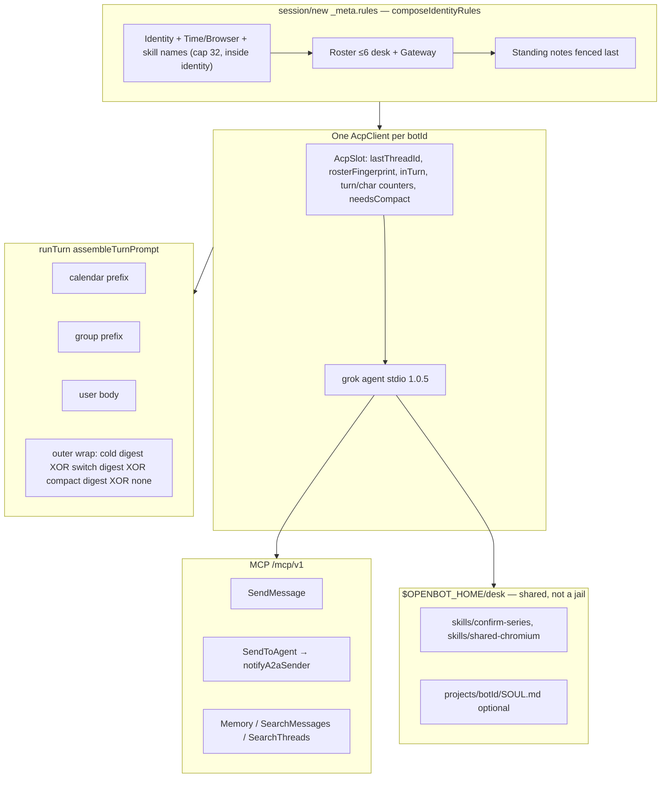

# OpenBot Phase 5 — Hermes-inspired teammate behavior

| Field | Value |
| --- | --- |
| **Title** | OpenBot Phase 5 Design: Hermes-inspired teammate behavior (roster, thread-switch, standing memory, A2A loop, desk skills, warm compact) |
| **Author** | OpenBot maintainers (draft) |
| **Date** | 2026-08-31 |
| **Status** | Draft |
| **Depends on** | Phase 1–4 **as implemented in this tree** (`0.4.1`), not the pre-code freeze |
| **Audience** | Engineers extending `apps/server` + `packages/*` |
| **Grok pin** | `PINNED_GROK_CLI = "1.0.5"` (`packages/acp-grok/src/pin.ts`) |

Steal Hermes **behavior**, not its surface. No Telegram, no any-model adapter, no Weaviate/Honcho/Mem0, no autonomous skill factory, no seven terminal backends. Overlay stays `_meta.rules` on `session/new` only. Never `systemPromptOverride`. One warm `AcpClient` per bot for all threads. `SendMessage` remains the only human-visible write. Shared `$OPENBOT_HOME/desk` is not a jail. Tests are `bun test` + `tests/fixtures/acp/fake-agent.ts`.

---

## Overview

OpenBot 0.4.1 already has a team on one desk: up to six named Grok ACP children, 1:1 `SendToAgent`, group `@mention`, Gateway federation, a calendar, and a cold-start digest. The teammate still **forgets the org** between threads and after a long warm day. Ada must call `ListBots` to learn Bob is the writer. A warm DM leaking into a group `@mention` is unaddressed. `SendToAgent` returns `{ ok, threadId, turnId }` and then goes silent. ConfirmSeries / Chromium dances live as fat overlay paragraphs. Standing facts have nowhere to live except the current thread’s last 20 lines.

Phase 5 closes that gap in six independently reviewable PRs that share one `AcpSlot`, one overlay composer, and one prompt-assembly matrix:

1. Bake the roster (≤6 desk bots + Gateway, names + clipped descriptions) into `_meta.rules`. Fingerprint mismatch respawns **that** bot on the next `ensureHarness`. Persist `harness_sessions.roster_fingerprint` and skip resume on mismatch. Do not globally kill ACP children on `CreateBot`.
2. Keep one Grok child per bot. On a **warm, non-compact** `thread_id` change, prefix a **switch banner + that thread’s digest**. Do not spawn N processes.
3. Persist per-bot MEMORY + org USER notes in sqlite; inject at `session/new`; search the log with FTS5. No Weaviate. Writes persist immediately; `require_memory_approval` default off. Skip `session/resume` when `overlay_hash` mismatches.
4. Close the A2A loop without blocking Ada: typed `target_archived` vs `not_found`, and one `origin=system` “A2A complete” line after Bob’s turn. Do **not** queue Ada. Do **not** write the human DM.
5. Seed `desk/skills/<name>/SKILL.md` (confirm-series, shared-chromium). Overlay lists **names only**. Optional `desk/projects/<botId>/SOUL.md`. No `ListSkills` MCP. No auto-write skills.
6. Warm compact = `session/new` on the **same pid** + sqlite digest + rebuilt `_meta.rules`. Triggers: every 20 successful turns, 48k accumulated prompt chars, overflow, explicit test API. **Not** mid-`prompt()`. Idle TTL stays. Compact-on-thread-switch is **opt-in** (`OPENBOT_ACP_COMPACT_ON_SWITCH`, default off).

---

## Where we actually are (cite this tree)

| Fact | Where |
| --- | --- |
| Version `0.4.1`, Grok CLI pin **1.0.5** | `package.json`, `packages/acp-grok/src/pin.ts` |
| Overlay is identity-only on `session/new` | `packages/acp-grok/src/index.ts` `deskIdentityRules` / `gatewayIdentityRules` / `AcpClient.sessionParams`. Instructs “See who is here: ListBots.” **No roster.** |
| No `systemPromptOverride` anywhere | Phase 1 D23. Keep it that way. |
| One warm child per bot, all threads | `packages/runner/src/index.ts` `acps: Map<botId, AcpSlot>`. `AcpSlot = { client, botId, idleTtlMs, role, resumed? }`. **No** `lastThreadId`, roster fingerprint, overlay hash, or compact counters. |
| `matchesHarness` | `LocalHostRunner.matchesHarness` — model / reasoningEffort / permissionMode only. Also returns false if **process-global** `this.harness === "crashed"` (PR6 must make crash per-slot; see P5-D22). Engine and runner **must stay in sync** or the next child gets `mcpToken: ""`. |
| Idle TTL | Desk **2h** (`DEFAULT_ACP_IDLE_MS`), Gateway **30m**. `reapIdle` skips the current **process-global** `in_turn` client (`this.acp === client && this.harness === "in_turn"`). Phase 5 uses `slot.inTurn` (P5-D22). |
| Cold start vs warm | `TurnEngine.runTurn`: `!warm` ends harness row, inserts a new one, mints MCP token bound to **this** `turn.thread_id`, may `resumeSessionId`. Digest **only** if `!warm && !harness.resumed`. Warm path: `session/prompt` only. |
| `prevAcpId` today | `SELECT acp_session_id FROM harness_sessions WHERE bot_id = ? AND acp_session_id IS NOT NULL ORDER BY created_at DESC LIMIT 1` — **walks history**. Phase 5 uses the latest row **including NULL** (P5-D22). |
| Prompt prefixes | Group if `threads.kind === 'group'`, then calendar if `origin === 'calendar'` (P4-D20: last prepend wins the front). Digest wraps the rest. |
| Digest | `buildThreadDigest`: 20 tail / 800 chars/line / 4k Earlier fold. Origins `user/send_message/fallback/agent/system/thread/federation`. **Not** `prompt` / `calendar`. Banner contains `ACP session reset`. |
| MCP token minted only on cold start | `runTurn` `if (!warm) persistMcpToken(...)`. Tools use `lockRunningTurn().thread_id`, not `claims.threadId`. |
| `SendToAgent` | `sendToAgent()`. Async mailbox. Archived Bob is collapsed into `not_found`. No completion ping. Inserts `origin=agent` **on the target turn** (`from_bot_id` = sender). |
| `promote()` | `promote()` — one `db.immediate` callback. Fallback / empty system on **that turn’s thread**. No A2A complete line. Archive/queued-cancel bypass `promote`. `OpenbotDb.immediate` is **not** reentrant. |
| `invalidateAcp` | Kills that bot’s child immediately unless **process-global** `this.acp === slot.client && this.harness === "in_turn"`. Model-change already does this from `PATCH /v1/bots/:id/settings`. Phase 5: skip iff `slot.inTurn` (PR1). |
| ListBots | Active desk `{id,name,description}` + Gateway sidecar `{id,name}`. Cap `MAX_ACTIVE_BOTS = 6`. |
| Isolation already shipped | `grok-home/` copy of `auth.json`, env allowlist (`CHILD_ENV_PASSTHROUGH`), `deskPathGuard`, optional `OPENBOT_SANDBOX`. Desk is **not** a trust boundary. |
| Fake ACP | `tests/fixtures/acp/fake-agent.ts`. Does **not** store `_meta.rules`. Directives inspect the **user prompt**. |
| FTS | **None.** |
| Skills | **None.** `LocalHostRunner.ensure` mkdirs `desk/projects` + `.openbot/chromium` only. |
| Compact RPC | **None.** Grok 1.0.5 documents `session/new`, `session/load`, `session/resume`. TUI `/compact` is not a client→agent JSON-RPC method. |

Honesty that remains true (README / `docs/host-service.md`): closing the tab does not stop teammates; stopping the process does; `$OPENBOT_HOME/desk` is a shared computer; one Chromium, tab per bot; do not claim jails or hosted retry.

---

## Background & Motivation

Hermes Agent (Nous Research) gives each teammate a frozen roster, a MEMORY.md / USER.md pair, progressive-disclosure skills, session search, a completion ping on `message_agent`, and `/compact` so a long day does not fork the soul. OpenBot already has the teammate **loop** (SendMessage, promote, warm ACP). It is missing the **standing context** that makes Ada a coworker instead of a per-thread chatbot.

Pain if we skip this and keep shipping overlay bullets that say “call ListBots”:

- Models skip the tool, invent names, or `SendToAgent Ghost`.
- Warm Ada answers a group `@mention` with leftover DM.
- “Human is in Berlin, no meetings Fridays” dies at idle reap because it never lived in this thread.
- Ada asks Bob to draft; Bob `SendMessage`s the human; the A2A thread looks like Ada spoke and nothing happened.
- ConfirmSeries / Chromium procedure is re-explained in `_meta.rules` forever, or forgotten after a cold start.
- A workday of turns never hits the 2h idle TTL, so context rots inside the child until crash.

We copy the **split**: identity + roster + standing notes freeze at spawn; unbounded history is a search tool; procedures live on disk as SKILL.md; compact is a new session on the same process. We do **not** copy Hermes’s stores, transports, or skill foundry.

---

## Goals & Non-Goals

### Goals

1. At `session/new`, `_meta.rules` lists who is here (≤6 desk + Gateway, names + clipped roles) and tells the model to **compose** a handoff, not parrot the human.
2. `ListBots` remains as a 404 fallback. Overlay, tool copy, and SendToAgent 404 stop instructing “call ListBots first.”
3. One Grok process per bot. On a warm, non-compact thread switch, prefix that thread’s digest. Same pid (`tests/engine-parallel.test.ts` stays green).
4. Org notes + per-bot notes in sqlite, MCP `Memory` `{add,replace,remove,read}`, Settings textareas. Frozen at spawn. FTS5 `SearchMessages` / `SearchThreads`.
5. After Bob’s A2A turn ends (or is archived/cancelled), one structured `origin=system` line on the A2A thread. Typed `target_archived` vs `not_found`. Ada is not blocked and not auto-queued.
6. `desk/skills/confirm-series/SKILL.md` and `shared-chromium/SKILL.md` seeded write-if-absent. Overlay catalog is names only. Optional SOUL.md. Grok reads bodies via FS.
7. Warm compact: `session/new` on the same `AcpClient`, remint MCP, rebuild overlay, sqlite digest. Triggers: 20 turns, 48k chars, overflow, explicit. Compact-on-switch **off** by default.
8. Fake ACP covers every new path. No live xAI required.

### Non-Goals

- Telegram, any-model, Weaviate, Honcho, Mem0, embeddings, “LLM reviews the transcript into MEMORY.md.”
- `systemPromptOverride`, per-turn `_meta.rules` rewrite, `update_mcp_servers` as overlay refresh.
- N Grok processes, or one ACP `sessionId` per `(bot, thread)` (a later seam; `lastThreadId` is the hatch).
- Globally `invalidateAcp` on `CreateBot` / archive of a **peer** / rename.
- Queuing Ada when Bob finishes (`wait: true` is v2). Writing the human DM from SendToAgent or the complete ping.
- Live interrupt of Bob mid-tool.
- `ListSkills` / `GetSkill` / `WriteSkill` MCP. Auto-writing skills. Loading operator `~/.grok/skills`. Pointing Grok `[skills] paths` at `desk/skills`.
- SPA `/compact` slash. Killing the child as the happy-path compact.
- Per-thread notes, federating notes, searching `origin='prompt'|'calendar'`, vault files, or `org_inbox`.
- New npm dependencies. Postgres. Changing `promote()` truth, `MAX_ACTIVE_BOTS`, or MCP `serverInfo.version` (`"0.4.1"`).
- Claiming the desk, grok-home, or `OPENBOT_SANDBOX` is a jail.

---

## Key Decisions

Binding operator decisions are **not** reopened. Rationale is for implementers.

| # | Decision | Choice | Rationale |
| --- | --- | --- | --- |
| P5-D1 | Overlay channel | `_meta.rules` on `session/new` only. Single `composeIdentityRules(req)`. Never `systemPromptOverride`. | Phase 1 D23 / P3-D23 / P4-D20. Override wipes Grok coding identity. Per-turn overlay would bust prefix cache. |
| P5-D2 | Roster location | Identity overlay, names + clipped descriptions, include self, no UUIDs. `ListBots` stays, demoted. | Hermes bakes names+roles into Bot Chat. Models skip ListBots. Names are unique among active. |
| P5-D3 | Roster freshness | Stale for the in-flight turn. `rosterFingerprint` on `matchesHarness` respawns **that** bot on next `ensureHarness`. PR1 also persists `harness_sessions.roster_fingerprint` and **omits resume on mismatch**. No global ACP kill on CreateBot. | Hirer gets the name from `CreateBot` return. Killing six Groks because Cara hired Fay is the wrong trade. Idle+resume without a stored fingerprint would restore a roster-less overlay until PR5. |
| P5-D4 | One process per bot | Keep `Map<botId, AcpSlot>`. Compact-on-switch is **not** the default. | Binding. Do not spawn N processes. |
| P5-D5 | Thread switch vs compact | On a **warm, non-compact** `thread_id` change, prefix the switch digest. Compact-on-switch (`OPENBOT_ACP_COMPACT_ON_SWITCH`, default **0**) uses the compact/cold wrap only. Never both banners. The [prompt matrix](#prompt-assembly--one-matrix) is the source of truth (cold start ignores `switched`). | Lane 2 and lane 6 both mentioned switch. Double-reset would lie (“ignore other threads” on an empty session) and break `[[echo-prompt]]` / `[[echo-switch]]`. Compact is for rot + overlay refresh, not for every DM↔group hop. |
| P5-D6 | Compact mechanism | `session/new` on the same pid + sqlite digest + rebuilt rules. Not TUI `/compact`, not HTTP `responses/compact`, not kill. After `session/new`, PR6 spike may `session/cancel` the previous id (ignore `-32601`). | Grok 1.0.5 has no documented `session/compact`. Overlay refresh **requires** `session/new`. Idle TTL remains the RAM valve. |
| P5-D7 | Compact triggers | 20 successful `acp_done` turns (`OPENBOT_ACP_COMPACT_TURNS`, `0` disables), 48k prompt chars (`OPENBOT_ACP_COMPACT_CHARS`, `0` disables), overflow (previous turn), explicit `compactSession` (not a `compactReason` value). Switch compact opt-in. Never mid-`prompt()`. Char trigger uses **inner body** length (P5-D21). | A workday never idles. 20 matches `DIGEST_TAIL_MESSAGES`. Char sum is a proxy; we do not have a reliable token meter. |
| P5-D8 | Standing notes | sqlite `memory_notes`, not markdown on `desk/`. Freeze at `session/new`. Agent `Memory` must not `invalidateAcp`. Skip resume when `overlay_hash` mismatches. | Desk is a shared computer Grok can rewrite. Overlay must be orch-authored. Naive idle+resume would keep stale notes. |
| P5-D9 | Notes vs search | Notes are tiny and frozen (org 1200 / bot 2000). Unbounded history is FTS5. Digest stays **this thread only**. | Hermes MEMORY.md + `session_search`. Do not grow `buildThreadDigest`. |
| P5-D10 | Memory approval | `require_memory_approval` default **off**. Human PATCH always writes live. | Same default as SendMessage. Notes that never land because nobody clicks Approve are worse than a 2k-char note. |
| P5-D11 | A2A completion | Async. One `origin=system` line on the A2A thread. Do not queue Ada. Do not write the human DM. Per-turn key and sender (P5-D19). | Hermes completion ping is a notification, not a new turn. Auto-queue races Ada’s current work and burns a Grok call per handoff. |
| P5-D12 | Archived vs missing | `target_archived` 409 vs `not_found` 404. JSON-RPC `error.message` prefixed with `code:`. Keep `error.data.code`. Do not switch to `isError: true`. | Models branch on codes. ACP clients often forward `message` and drop `data`. `isError` would 200-OK and break fake-agent / create-bot tests. |
| P5-D13 | Desk skills | `desk/skills/<name>/SKILL.md`, overlay names only (cap 32), Grok reads via FS. Seed two write-if-absent. No ListSkills. No native Grok skill scanner. | agentskills.io progressive disclosure. Native `[skills] paths` would inject unbounded YAML into Grok’s own prompt and bypass overlay budget. |
| P5-D14 | SOUL.md | Optional file at `desk/projects/<botId>/SOUL.md`. Never auto-created. `bots.description` stays the short identity. | Overflow for voice/taboos. Auto-writing it is a foundry. |
| P5-D15 | MCP remint | Remint on every `session/new` (cold start **and** compact). Do **not** remint on digest-only thread switch. | Compact `sessionParams.mcpServers` embeds `Authorization: Bearer`. Empty token 401s SendMessage. Switch is still the same session. |
| P5-D16 | Overlay budget | `RULES_MAX_CHARS = 8000`. Clip description 400, roster desc 160, roster block ≤800, org notes 1200, bot notes 2000. Truncate standing first, then roster; **never drop identity**. Roster: **degrade descriptions before names**; if still over 800, emit **names-only**. Never drop self or Gateway. Never silently `slice` names off the end. Names-only 6×80-char desks + Gateway always fits in 800 (~640). | Full-desk 160-char bios ≈ 1770 ≫ 800. End-slicing would drop Gateway then Fay — the opposite of P5-D3. |
| P5-D17 | Compose, don’t parrot | Overlay + `SEND_TO_AGENT_TOOL.description` say write a message *for* the teammate. | Binding. Prevents Ada forwarding the human’s words into Bob’s mailbox. |
| P5-D18 | Fingerprint vs overlay_hash | `matchesHarness` compares **rosterFingerprint** (plus model/effort/mode). `harness_sessions.overlay_hash` covers roster **+** skills catalog **+** notes and only affects **resume**. No `AcpSlot.overlayHash`. After `ensureHarness`, write `acp_session_id` **and current hashes** on **this** harness row for both `session/new` and `session/resume`. Memory writes do not kill a warm child. | A new `!warm` row with NULL hashes makes the **second** idle+resume always cold (NULL = mismatch). |
| P5-D19 | A2A complete key | Idempotency and sender inference are **this turn**. `WHERE turn_id = ? AND origin='system' AND body LIKE 'A2A complete:%'`. Sender = `from_bot_id` on this turn’s inbound `origin='agent'` `role='user'` row. No `parent_turn_id`. | Ada→Bob then Bob→Ada share one A2A thread. Thread-level LIKE or `ORDER BY created_at ASC` would silence hop 2+ or collapse `toBotId` to Ada→Ada. |
| P5-D20 | Who lists skills | Engine calls public `runner.listDeskSkillNames(32)` (`[]` for Gateway) **before** hashing and passes **that same array** into `ensureHarness` / `compactSession`. The helper returns kebab names **sorted ASCII**. Runner must **not** re-scan. | `readdir` order after restart would shuffle `overlay_hash` and spuriously skip resume. |
| P5-D21 | Char compact vs wrap | `compactReason` uses **inner body** (calendar + group + user) plus `slot.promptChars`, never the outer digest wrap. After a successful `prompt()`, add the **actually sent** string length (including wrap). Trigger is `>=` threshold. `CHARS=0` disables only this trigger. | Final wrap is cold digest iff we compact — using the wrapped length is circular. |
| P5-D22 | Compact/resume/crash plumbing | (a) Persist `{compact_turns, compact_chars}` on `harness_sessions`. On `!warm` **insert, copy** those counters plus `roster_fingerprint` / `overlay_hash` from `latest` into the new row (P5-D24). Restore onto the slot from **this** (new) row after resume. (b) `prevAcpId` is the latest harness row **including NULL** — do not walk history. (c) Busy/crash are **per-slot** (`slot.inTurn` lands in **PR1**). `invalidateAcp` / `reapIdle` skip iff `slot.inTurn`. `canCompact(botId)` **before** remint; overflow of a live child must not set global `harness = "crashed"`. (d) `notifyA2aSender` assumes an open writer — no nested `BEGIN IMMEDIATE`. | Idle+resume restores Grok’s conversation (`acp-resume.test.ts`). A blank new row zeros counters and NULLs hashes → second idle is always cold. `this.harness` is process-global; Ada+Bob run in parallel. |
| P5-D23 | Human Save vs freeze | Human PATCH of notes calls `invalidateAcp` (kills the child **iff `!slot.inTurn`**), same as model change. Agent `Memory` does not. Caption must say that, not “respawns when idle.” | Process-global `this.harness === "in_turn"` can kill Ada while Bob is the `this.acp`. Mixing “wait for idle” copy with a kill API is a lie. |
| P5-D24 | Harness row copy on `!warm` | Today `!warm` always **inserts** a new `harness_sessions` row. Copy `roster_fingerprint`, `overlay_hash`, `compact_turns`, `compact_chars` from `latest` into that insert. After `ensureHarness`, write `acp_session_id` **and the current hashes** on **this** row for both `session/new` and `session/resume`. On `session/new`, reset counters to 0 on this row. On resume, keep the copied counters, then increment after this prompt. Compact still **keeps** the same row. | Without the copy, the new row’s hashes are NULL (mismatch) and counters are 0. First idle+resume works; the second is always cold; 19-turn counters die. |

---

## Proposed Design

### System context



### Single overlay composer

Today `sessionParams` inlines `deskIdentityRules(botName, botDescription)` / `gatewayIdentityRules(orgSlug, orgId)`. Three lanes would otherwise concatenate ad hoc. **One function**, used by every `session/new` (cold, fingerprint respawn, compact):

```ts
// packages/acp-grok/src/index.ts
export const RULES_MAX_CHARS = 8000;
export const BOT_DESCRIPTION_OVERLAY_MAX = 400;
export const ROSTER_DESK_MAX = 6;
export const ROSTER_DESC_MAX = 160;
export const ROSTER_BLOCK_MAX = 800;

export function composeIdentityRules(req: EnsureHarnessRequest): string {
  const identity =
    req.role === "gateway"
      ? gatewayIdentityRules(req.orgSlug ?? "local", req.orgId ?? "")
      : deskIdentityRules(
          req.botName,
          clip(req.botDescription, BOT_DESCRIPTION_OVERLAY_MAX),
          { skillNames: req.skillNames },
        );
  const roster = formatRosterBlock(req.roster);           // ≤800; descriptions degrade before names
  const standing = standingMemoryRules(req.orgNotes ?? "", req.botNotes ?? "");
  return joinRules([identity, roster, standing], RULES_MAX_CHARS);
}
```

`joinRules`: concatenate with `\n\n`. If over cap, shorten **bot notes**, then **org notes**, then **roster**. Never drop identity (skills catalog lives inside desk identity; the 32-name cap is that budget). If identity itself exceeds 8k, log via `RedactingLogger` and still send (Grok may reject oversized `_meta.rules` — one PR6 spike note). Truncate **raw** org/bot strings to `ORG_NOTES_MAX` / `BOT_NOTES_MAX` **before** wrapping fences so `joinRules` cannot orphan `OPENBOT_ORG_NOTES>>>`. `sessionParams` sets `_meta.rules: composeIdentityRules(req)` only.

Order is load-bearing: trusted identity first (including names-only skills catalog), roster, **untrusted standing notes last**.

`deskIdentityRules` / `gatewayIdentityRules` keep existing tool-name keywords (`CreateBot`, `ConfirmSeries`, `BrowserSnapshot`, `own tab`, `SendToOrg`, hop=1) so `tests/send-to-org.test.ts` stays a lock. Changes:

| Copy | Desk | Gateway |
| --- | --- | --- |
| “See who is here: ListBots” / “To see desk bots, call ListBots” | **Delete** | **Delete** |
| SendToAgent | Compose; do not forward the human verbatim; does not notify the human | Same; do not forward inbound mail verbatim |
| Roster block | `formatRosterBlock` after identity | Same block so Gateway can `SendToAgent Ada` |
| Time / Browser | Thin to tool names + “read `desk/skills/confirm-series` / `shared-chromium` before improvising” | Untouched (no catalog, no Chromium) |
| Skills + SOUL | Names-only catalog cap 32; SOUL.md one-liner; “do not write skills unless asked”; “operator ~/.grok skills are not loaded” | No catalog. Optional: “You are not a desk coder; do not follow desk/skills.” |
| Reset / switch | “ACP session reset” = harness restart **or compact**. One sentence: if a prompt includes a thread-switch block, ignore other threads; never tell the human you switched. | Same |
| A2A | SendToAgent is queued, not done. Typed errors. Completions land on the 1:1 handoff as a system line. This turn is not resumed with Bob’s result. | Same mailbox; still not a hire tool |
| Memory / Search | Durable facts vs local history. Do not paste transcripts into Memory. | Plus: “Do not SendToOrg standing notes or search dumps.” |

`acp-grok` stays DB-free. Engine / MCP own queries; engine calls `runner.listDeskSkillNames` (P5-D20); `acp-grok` owns formatting.

### `EnsureHarnessRequest` (final)

```ts
// packages/compute-protocol/src/index.ts
export type OverlayRoster = {
  desks: Array<{ name: string; description: string }>;
  gateway?: { name: string; description: string } | null;
};

export type EnsureHarnessRequest = {
  // existing fields unchanged...
  roster?: OverlayRoster;
  skillNames?: string[];   // desk only; engine fills via runner.listDeskSkillNames; runner must not re-scan
  orgNotes?: string;
  botNotes?: string;
};
```

Do **not** put roster, notes, or MCP token in child env.

### Coherent `AcpSlot` (final)

One struct. Fields land across PRs; do not invent parallel maps.

```ts
// packages/runner/src/index.ts
export type CompactReason = "turns" | "chars" | "thread" | "overflow";
// "explicit" is a compactSession() caller, not a compactReason() return.

type AcpSlot = {
  client: AcpClient;
  botId: string;
  idleTtlMs: number;
  role: "desk" | "gateway";
  resumed?: boolean;
  /** True while this client is inside prompt(). Lands in PR1. Per-slot; not runner.harness. */
  inTurn?: boolean;
  /** PR1 — compared in matchesHarness. Warm overlay is this fingerprint. */
  rosterFingerprint: string;
  /** PR2 — last thread this child session/prompt'd. Cleared on kill/spawn. Compact resets then re-marks. */
  lastThreadId?: string;
  /** PR6 — also persisted on harness_sessions and restored after resume. */
  turnsSinceCompact: number;
  promptChars: number;
  needsCompact?: boolean;
};
```

Do **not** store `overlayHash` or `lastCompactAt` on the slot. Resume skip reads `harness_sessions.overlay_hash` / `roster_fingerprint`. `"explicit"` is tests calling `compactSession` between turns; `compactReason()` never returns it.

`matchesHarness(botId, model, effort, permissionMode, rosterFingerprint = "")`:

- Alive / `sessionId` / **this slot’s** client not closed / model / effort / mode. **Do not** consult process-global `this.harness === "crashed"` (that poisons Ada when Bob overflows).
- `(existing.rosterFingerprint ?? "") !== rosterFingerprint` → `false`.
- **Does not** compare turn counters or `lastThreadId`. Memory writes and skill-file adds must not look like a model change.

Engine `warm` and runner `matchesHarness` **must pass the same fingerprint** from `rosterFingerprint(roster)` (one helper). `ensureHarness` must call `matchesHarness(..., rosterFingerprint(req.roster))` with that same helper. If engine thinks warm and runner respawns, `mcpToken` is `""` and tools 401 (same foot-gun as a model change today).

When fingerprint/model/effort/mode miss and an **in-process slot existed**, omit `resumeSessionId`. Detect with `runner.acpFor(bot.id)` **before** `ensureHarness` kills it — no new API. Keep resume for OpenBot process restart, where the slot is already absent.

### Overlay hash and latest-harness lookup (resume skip)

Engine **before** `ensureHarness` / `compactSession`:

```ts
const skillNames = isGateway ? [] : runner.listDeskSkillNames(32);
const overlayHash = sha256Hex([
  "v1",                    // bump if composer layout changes
  rosterFingerprint(roster),
  skillNames.join(","),
  orgNotes,
  botNotes,
].join("\n"));
```

Pass **that same** `skillNames` array on `EnsureHarnessRequest`. `listDeskSkillNames` returns kebab names **sorted ASCII** (cap 32 after sort). Runner must not re-scan disk. No `AcpSlot.overlayHash`.

After `ensureHarness` returns, write on **this** harness row (`turn.harness_session_id` / the row just inserted):

| Field | `session/new` (cold, fingerprint kill, compact) | `session/resume` |
| --- | --- | --- |
| `acp_session_id` | new id | resumed id |
| `roster_fingerprint` | current | current |
| `overlay_hash` | current (PR5+; PR1 writes roster only) | current |
| `compact_turns` / `compact_chars` | **reset to 0** | **keep copied values** from insert |

Writing hashes after **resume** (not only `session/new`) is load-bearing: the new row must not keep NULL hashes into the next idle.

**Latest harness row** (PR1 introduces this query; PR5/PR6 reuse it — do not walk history):

```sql
SELECT acp_session_id, roster_fingerprint, overlay_hash, compact_turns, compact_chars
  FROM harness_sessions
 WHERE bot_id = ?
 ORDER BY created_at DESC
 LIMIT 1
```

If that row’s `acp_session_id` is NULL, `prevAcpId` is missing — **do not** search older rows. Overflow-null must not resume a prior fingerprint/model spawn.

Resume iff `!warm` and the latest row has a non-null `acp_session_id` and:

| PR | Extra predicate |
| --- | --- |
| PR1 | `roster_fingerprint` equals `rosterFingerprint(roster)` (or column NULL on rows written before PR1 — treat NULL as mismatch, skip resume) |
| PR5+ | `overlay_hash` equals current hash (supersedes the roster-only check; hash includes roster + skills + notes) |

If we just observed `runner.acpFor(bot.id)` before a fingerprint/model kill, omit resume even if hashes match.

**`!warm` insert copies resume fields** (P5-D24). Today `runTurn` always `INSERT`s a new `harness_sessions` row. Copy from `latest` into that insert: `roster_fingerprint`, `overlay_hash`, `compact_turns`, `compact_chars`. Then `resumeSessionId` still comes from `latest.acp_session_id` (the ended row). After `ensureHarness`, stamp this new row as in the table above. Compact does **not** insert — it keeps the same row.

Agent `Memory` **must not** call `invalidateAcp`. Human Settings save of notes **does** call `invalidateAcp` (kills immediately iff `!slot.inTurn`), same as `PATCH /v1/bots/:id/settings` model change. Caption must match (P5-D23).

### Prompt assembly — one matrix

Extract `assembleTurnPrompt` in `apps/server/src/engine.ts` (or live-work). Land it in **PR2** with:

```ts
wrap: "none" | "cold" | "switch"
// PR6 adds wrap: "compact" as an alias of "cold" (same ACP session reset banner;
// live-work reason differs). Do not grow a second prepend pile.
```

`runTurn` from user-row load through `runner.prompt` is the merge hotspot. Specify the **final string**, not a pile of prepends. Each PR that touches this block rebases against the final control-flow section.

Inner body (every turn, any cell), matching P4-D20:

```
[calendar block, if origin=calendar]
[group block, if kind=group]
[user body]
```

Implementation as prepends: apply **group first, calendar second** (last prepend wins the front). `[[echo-cal-prefix]]` must still see calendar before `Group thread "…"`.

Outer wrap — **exactly one** of:

| ACP child | `harness.resumed` | `compactReason` | `switched` | Wrap | Live-work |
| --- | --- | --- | --- | --- | --- |
| Cold `session/new` | false | n/a | **ignored** | Cold digest (`ACP session reset` + this thread’s summary+tail). `null` digest → no wrap. | `harness_session_reset { reason: "cold_start" }` |
| Resumed, same thread | true | n/a | false | None | `{ reason: "resumed" }` |
| Resumed, other thread | true | n/a | true | **Switch** digest (not cold banner) | `resumed` **and** `thread_switch { from, to }` |
| Warm, no compact, same thread | n/a | none | false | None | none |
| Warm, no compact, switched | n/a | none | true | **Switch** digest. Banner even if destination memory is empty. | `thread_switch { from, to }` |
| Warm, compact (turns/chars/overflow, or opt-in switch) | n/a | set | * | Compact = `session/new` then **cold** digest of **this** thread (`wrap: "compact"` ≡ `"cold"`). **No switch banner.** Explicit compact is `compactSession()` between turns, not this cell. | `{ reason: "compacted", trigger }` |

**Never** wrap cold + switch on the same turn. **Never** wrap compact + switch banner on the same turn. Compact already emptied Grok’s conversation; “ignore other threads’ last turns” would be a lie and would make `[[echo-prompt]]` and `[[echo-switch]]` both fire.

`wrapPromptWithDigest` stays. Marker `\nCurrent message:\n` stays so fake-agent `currentMessage()` keeps parsing.

Split digest **memory** from **banner** in `packages/live-work`:

```ts
export type ThreadDigestKind = "cold_start" | "thread_switch";

export function buildThreadMemory(db, opts: {
  threadId: string; botId: string; botName: string; excludeTurnId: string;
}): { summary: string; tailLines: string[] };

export function formatThreadDigest(opts: {
  kind: ThreadDigestKind;
  botName: string;
  threadLabel: string;
  memory: { summary: string; tailLines: string[] };
}): string | null;
```

- `cold_start`: empty memory → `null` (preserve first-message-of-new-bot). Banner keeps the three existing lines including `ACP session reset`.
- `thread_switch`: **always** at least the banner. Caps unchanged (`DIGEST_TAIL_MESSAGES = 20`, `SUMMARY_MAX_CHARS = 4000`). Banner **must not** contain `ACP session reset` (`[[echo-prompt]]` keys on that substring).

Switch banner (binding copy):

```
You are now on a different thread: {threadLabel}.
Ignore other threads' last turns. Do not mix them into this reply. Do not mention them unless the human asks.
The block below is prior messages on THIS thread only. Treat it as memory for this thread.
Do not tell the human this is a new session. Do not say you reconstructed anything. Do not recap unless they ask.
```

`threadLabel`: `human` → `your DM with the human`; `a2a` → `your 1:1 with {peerName}` (never UUIDs; A2A `threads.title` is `{lo}↔{hi}`); `group` → `group "{title}"`.

`buildThreadDigest` becomes a thin `formatThreadDigest({ kind: "cold_start", ... })` wrapper so `tests/promote.test.ts` pineapple / `You:` / `Human:` cases stay green.

### Thread-switch detection

**Do not** use `mcp_tokens.thread_id` (cold-start thread for this harness; after the first DM every later group turn would look switched forever).

**Do not** persist `harness_sessions.last_thread_id` in v1.

```
lastThreadId = runner.lastPromptThread(bot.id) ?? lastFinishedThread(db, bot.id, turn.id)
switched     = Boolean(lastThreadId) && lastThreadId !== turn.thread_id
```

SQL fallback (resume / process restart; slot has no `lastThreadId`). Restrict to turns that actually hit ACP — archive/queued-cancel set `cancelled` with `started_at` NULL and would otherwise look like a switch:

```sql
SELECT thread_id FROM turns
 WHERE bot_id = ?
   AND id != ?                          -- current row is already status='running'
   AND status IN ('completed', 'cancelled', 'failed')
   AND started_at IS NOT NULL
   AND harness_session_id IS NOT NULL
 ORDER BY started_at DESC
 LIMIT 1
```

`markPromptThread(botId, threadId)` **immediately before** `runner.prompt`, not after success (if `session/prompt` throws, Grok still has this thread). Cleared when the slot is deleted. Warm `ensureHarness` must **not** clear it. Compact resets it, then `markPromptThread` after the new session exists.

MCP tokens: **no remint on switch**. `lockRunningTurn` keys on `harness_session_id`.

### Warm compact

Compact is a **cold session on a warm process**: same `AcpClient`, same pid, same cwd, same env, new ACP `sessionId`, rebuilt `_meta.rules`, reminted MCP bearer (current `turn.thread_id`, **same** `harness_sessions.id`), sqlite digest on the next `session/prompt`. Do **not** `session/resume` as compact (that reloads the rotting history). Do **not** kill the child on the happy path. Fallback if `session/new` throws: kill + respawn + `session/new` (no resume) + digest; record `fallback: "respawn"`.

```mermaid
sequenceDiagram
  autonumber
  participant E as TurnEngine.runTurn
  participant R as LocalHostRunner
  participant G as Grok ACP child
  participant M as /mcp/v1

  E->>R: matchesHarness? true
  E->>R: canCompact(botId)?
  E->>R: compactReason(innerBodyChars)? turns/chars/overflow
  E->>E: persistMcpToken(current thread, same harnessSessionId)
  E->>R: compactSession(botId, req with token+roster+notes+skillNames)
  R->>G: session/new (composeIdentityRules, new Bearer)
  Note over G: new sessionId; overlay restamped
  E->>E: wrapPromptWithDigest(cold digest, calendar+group+body)
  E->>G: session/prompt
  G->>M: SendMessage with new token
```

Per-slot busy (P5-D22). `LocalHostRunner.harness` / `this.acp` are singular and **must not** gate another bot’s compact, idle kill, or Save. `slot.inTurn` lands in **PR1**: `prompt()` sets it true at entry and false in `finally`. `invalidateAcp(botId)` and `reapIdle` skip iff **`slot.inTurn`** — not `this.acp === client && this.harness === "in_turn"`. `canCompact` (PR6) uses the same flag.

`canCompact(botId): boolean` — slot exists, client not closed, `!slot.inTurn`. Engine calls this **before** remint. If false, skip compact and use the warm/switch wrap (do **not** lie with a cold banner). `compactSession` still refuses `slot.inTurn` as belt-and-suspenders and returns `{ compacted: false }` rather than throwing.

`LocalHostRunner.compactSession(botId, req)`:

1. If `!canCompact(botId)` → `{ compacted: false }` (engine must not have reminted; if it raced, fall through to warm/switch wrap).
2. Remember previous `sessionId`. `client.newSession(req)` with full `sessionParams` (`skillNames` already on `req`).
3. Optionally `session/cancel` the previous id; ignore `-32601` (PR6 spike).
4. Reset `turnsSinceCompact`, `promptChars`, `needsCompact`; persist zeros onto `harness_sessions`; `resumed = false`; `lastThreadId` cleared (engine re-marks).
5. Return `{ compacted: true, acpSessionId, resumed: false }`.

Do **not** go through `ensureHarness`’s warm early-return. `maintenance()` / `reapIdle` must not compact.

`compactReason(botId, { threadId, innerBodyChars, switched })` uses **inner body** length (calendar + group + user) plus `slot.promptChars` — **never** the outer digest wrap. Trigger when `slot.promptChars + innerBodyChars >= threshold`. After a successful `prompt()`, add the **actually sent** string length (including wrap) to `promptChars` and persist both counters on `harness_sessions`.

Env, same parser style as `acpIdleTtlMs` (`< 0` or NaN → default; `0` is valid disable). One pair of knobs for desk **and** Gateway:

| Var | Default | Role |
| --- | --- | --- |
| `OPENBOT_ACP_COMPACT_TURNS` | 20 | Count `acp_done` completes on this session. `0` disables this trigger. |
| `OPENBOT_ACP_COMPACT_CHARS` | 48_000 | Accumulated **sent** prompt chars + inner body of the next turn, `>=` threshold. `0` disables **only** this trigger. |
| `OPENBOT_ACP_COMPACT_ON_SWITCH` | 0 | `1` compact on thread switch instead of digest-prefix-only. |

There is no “disable all compact” env. Thread-switch compact stays opt-in. Overflow stays on. Explicit is `compactSession()` from tests, not an env. Idle kill is the RAM opt-out.

Priority if several match: compact **once**. Overflow > thread (only if env on) > chars > turns. Record `trigger` in live-work. `"explicit"` is not in this ordering.

Increment `turnsSinceCompact` / `promptChars` only after a successful `runner.prompt` that promotes as `acp_done`. Persist to `harness_sessions`. Crashes do not increment. On successful `session/resume`, **restore** `compact_turns` / `compact_chars` from that harness row onto the new slot (idle+resume is not a free compact). On `session/new` (cold or compact), reset both to 0.

**Overflow** (best-effort, **after** the turn — never mid-`prompt()`):

- `PromptResult.stopReason` matching `/max_tokens|max_length|context_length|overflow/i` — **this is the `[[overflow]]` path** (successful RPC, not a throw)
- `prompt()` throw / `lastStderr` matching `/context length|context window|prompt too long|maximum context/i` **and the child is still alive**
- ACP notify payloads containing `auto_compact` / `auto_compact_completed`
- Opportunistic `usage_update` occupancy ≥ ~85%

On overflow of a **live** child: `slot.needsCompact = true`; **null `harness_sessions.acp_session_id`** (latest-row lookup then refuses resume); do **not** set global `harness = "crashed"`; do **not** `kill()`. Promote the failed turn; compact before the next. If the child is actually dead: delete **that** slot only, skip resume (id already nulled), cold-start. Real crash of one bot must not make `matchesHarness` false for the other.

Human must not hear “I compacted.” No `origin=system` recap. `summarizeLiveEvent` for `{ reason: "compacted" }` → `"Context refreshed"` (not `"Harness restarted"`). Digest preamble already bans announcement; reuse it.

Spike during PR6 (one hour, not a blocker): log `initialize` `agentCapabilities`; probe `session/compact` and `x.ai/compact_conversation`; expect `-32601`; after `session/new`, optionally `session/cancel` the previous id (ignore `-32601`); comment whether Grok drops the old session. v1 still `session/new` so overlay restamps. v1 may skip cancel if the probe shows new-session drops the old one.

After compact, idle-kill then `OPENBOT_FAKE_RESUME=1` must resume the **post-compact** id (`no-digest`) **with restored counters at 0** (just compacted), not the pre-compact one. After 19 warm turns + idle + resume, counters must be 19, not 0 — next turn can compact.

### MCP remint rules

| Event | Process | Session | Mint MCP? | Digest wrap |
| --- | --- | --- | --- | --- |
| Warm same-thread | keep | keep | no | none |
| Warm thread-switch (default) | keep | keep | **no** | switch |
| Compact | keep | **new** | **yes** (same harness row, current thread) | cold |
| Fingerprint / model miss | **kill+spawn** | new | **yes** (new harness row) | cold (resume omitted if we just killed a slot) |
| Idle TTL kill → next turn | gone | gone from RAM | yes | resume or cold |
| Overflow, child up | keep (that slot only) | compact next turn | yes on that compact | cold on that turn |

Leave old tokens unrevoked on remint (avoid racing inflight MCP). Prefer remint without revoke.

### Roster load

Share SQL with `listBots` so engine and MCP cannot drift:

```ts
// packages/mcp-send-message/src/index.ts
export function loadOverlayRoster(db: OpenbotDb, accountId: string): OverlayRoster {
  const rows = db.all<{ name: string; description: string; role: string }>(
    `SELECT name, description, IFNULL(role, 'desk') AS role
     FROM bots WHERE account_id = ? AND status = 'active' ORDER BY created_at`,
    [accountId],
  );
  const desks = rows.filter((r) => r.role !== "gateway").slice(0, MAX_ACTIVE_BOTS)
    .map(({ name, description }) => ({ name, description }));
  const gw = rows.find((r) => r.role === "gateway");
  return { desks, gateway: gw ? { name: gw.name, description: gw.description } : null };
}
```

`listBots` still returns ids. Overlay has no ids. Include **self**. Desks in `created_at` order (same SQL as `listBots`), Gateway **always last** if present, omitted if null. Empty roster → `""` (no header with zero lines).

Frozen `formatRosterBlock` (PR1 unit-tests this exact string, not only substrings):

```ts
export function clipRosterDesc(text: string): string {
  const flat = text.replace(/\s+/g, " ").trim();
  if (flat.length <= ROSTER_DESC_MAX) return flat;       // JS .length, code units, mid-word OK
  return `${flat.slice(0, ROSTER_DESC_MAX - 1).trimEnd()}…`; // U+2026
}

const ROSTER_HEADER = "Who is here (do not invent names; SendToAgent only these):";

function rosterLines(
  desks: Array<{ name: string; description: string }>,
  gw: { name: string; description: string } | null | undefined,
  withDesc: boolean,
): string[] {
  const lines: string[] = [];
  for (const b of desks) {
    const role = withDesc ? clipRosterDesc(b.description) : "";
    lines.push(role ? `- ${b.name} — ${role}` : `- ${b.name}`);
  }
  if (gw?.name) {
    const fallback = "Diplomat for this org. Not a desk coder.";
    const role = withDesc ? clipRosterDesc(gw.description || fallback) : "";
    lines.push(role ? `- ${gw.name} — ${role}` : `- ${gw.name}`);
  }
  return lines;
}

export function formatRosterBlock(roster: OverlayRoster | undefined): string {
  const desks = (roster?.desks ?? []).slice(0, ROSTER_DESK_MAX);
  const gw = roster?.gateway;
  const lines = rosterLines(desks, gw, true);
  if (!lines.length) return "";
  const withDesc = [ROSTER_HEADER, ...lines].join("\n");
  if (withDesc.length <= ROSTER_BLOCK_MAX) return withDesc;
  // Degrade descriptions before names. Never drop self or Gateway. Never slice the tail.
  const namesOnly = [ROSTER_HEADER, ...rosterLines(desks, gw, false)].join("\n");
  // Names-only 6×80-char desks + 80-char Gateway + header is ~640 < 800.
  return namesOnly;
}

export function rosterFingerprint(roster: OverlayRoster | undefined): string {
  return formatRosterBlock(roster);
}
```

Bullet is hyphen-space (`- `). Separator is space + em dash U+2014 + space (` — `). Fake-agent `[[echo-roster]]` parser: `/^- ([^—]+?)(?: — |$)/gm` with `matchAll` (every bullet; `/m` alone is Ada only). Fixture (with descriptions, under cap):

```
Who is here (do not invent names; SendToAgent only these):
- Ada — research
- Bob — writer
- Gateway — Diplomat for this org. Not a desk coder.
```

`onCreateBot` stays `ensureProject` + `bots.updated` (`createApp` MCP hooks). Archive already kills **that** bot’s ACP. Peer overlays refresh on each peer’s next `ensureHarness` via fingerprint **and** skip-resume via `harness_sessions.roster_fingerprint`.

`SEND_TO_AGENT_TOOL.description` drops “Use ListBots to see names.” `LIST_BOTS_TOOL.description` becomes fallback-only. SendToAgent 404 keeps `CreateBot` and `/auth/local` (`tests/create-bot.test.ts`); **does not** say `Call ListBots`.

### Standing memory + FTS

sqlite, not desk files. Hermes files work because the harness owns HOME; OpenBot’s HOME is isolated `grok-home/`; desk is not a trust boundary.

**Caps:** `ORG_NOTES_MAX = 1200`, `BOT_NOTES_MAX = 2000`. `scanMemoryText` on every persist (agent + human): drop C0 except `\n` `\t`; reject U+0000, bidi overrides, Unicode tags; reject instruction-takeover regexes (`ignore previous instructions`, `systemPromptOverride`, `</rules>`, fence tokens, `## Standing notes`, …). Prefer reject over strip for the regex list. Persist fail → MCP `unsafe_memory` 400 / human PATCH 400.

At overlay **compose**, scan is **fail-open on the standing block only**: drop notes, log via `RedactingLogger` (no body), still spawn. A stored-row race or a hand-edited sqlite must not crash the turn (`kind: "crash"` / fallback). Writes stay reject-not-strip.

CRUD: `ensureOrgNotes` / `ensureBotNotes` / `readNotes` / `applyMemoryWrite`. Actions: `read`, `replace`, `add` (append `\n`), `remove` (first exact substring, or clear if text omitted). Lazy-create rows. Unique indexes: one org row per account, one bot row per bot.

`require_memory_approval` (sibling of `require_human_approval`, default 0): if 1 and actor is agent, write `pending_body` only; overlay still uses `body`. Human `POST /v1/memory/pending/:id/approve|reject`. Human PATCH of `body` always applies.

Fence at compose:

```
<<<OPENBOT_ORG_NOTES
...
OPENBOT_ORG_NOTES>>>
```

Strip fence tokens from the body. Empty notes → a stub that tells Grok to call `Memory` and use Search for history.

**Tools** on the existing Streamable HTTP server, advertised in `mcpToolsForRole` for **desk and Gateway**, after `ListBots`:

Desk `tools/list` becomes:

```
SendMessage, SendToAgent, SendToThread, ListBots, Memory, SearchMessages, SearchThreads,
CreateBot, ListCalendar, CreateEvent, ProposeRoutine, ConfirmSeries, PauseSeries,
Navigate, BrowserSnapshot, Click, Type, Wait
```

Gateway:

```
SendMessage, SendToAgent, SendToThread, ListBots, Memory, SearchMessages, SearchThreads, SendToOrg, Inbox
```

All three tools require `lockRunningTurn` (stolen token after promote must not dump the log). Rate: Memory 10 writes/turn, 40/hour/account; Search 20 calls/turn. `ftsMatchQuery` **never** passes raw user text to `MATCH` (strip `"*():^`, AND + prefix, max 12 tokens). `SearchMessages` joins `messages` for the snippet (source of truth); `account_id` predicate on the FTS row. Exclude `prompt` / `calendar`. Limit 10 default / 20 max; snippet 400 chars.

`SearchThreads` over A2A titles `{lo}↔{hi}` (UUIDs from `sendToAgent`) will **not** find “Bob” by name. v1 documents this hole; SearchMessages still hits bodies. Do not index `bots.name` into `threads_fts` in this phase.

`deleteBotPermanently`: `DELETE FROM memory_notes WHERE bot_id = ?` **before** `DELETE FROM bots`. Leave org notes. Archive does not touch notes.

### A2A completion

Stay async. Success result unchanged `{ ok: true, threadId, turnId }`.

Call-time lookup:

```
if input.botId:
  row = bots WHERE id=? AND account_id=?
  missing → not_found
  status==='archived' → target_archived
  status!=='active' → not_found
else:
  active by lower(name) → use it
  else any archived by lower(name) → target_archived
  else → not_found (CreateBot copy; no “Call ListBots”)
```

Self-target stays `bad_request`. `runtime_offline` is **reserved** on the `McpErrorCode` union; do **not** throw it on localhost (queue is durable; idle ACP is not offline).

JSON-RPC (all tools, one place in `handleMcpJsonRpc`):

```ts
error: {
  code: -32000,
  message: err.message.startsWith(err.code + ":") ? err.message : `${err.code}: ${err.message}`,
  data: { code: err.code },
}
```

`notifyA2aSender(db, turnId, code?: A2aCompleteCode)` in `packages/live-work`. **Assumes an open writer — no `BEGIN`.** `OpenbotDb.immediate` is not reentrant; a nested begin would roll back `promote()`.

1. Load turn + thread. `kind !== 'a2a'` → null.
2. Idempotent **this turn**: `WHERE turn_id = ? AND origin = 'system' AND body LIKE 'A2A complete:%'` → null. (Thread-level LIKE would silence hop 2+ on the shared `threads_a2a_pair`.)
3. Sender for **this turn**: `SELECT from_bot_id FROM messages WHERE turn_id = ? AND origin = 'agent' AND role = 'user' LIMIT 1`. Missing → skip (calendar-on-a2a, or a human-queued oddity). That is Ada for Bob’s mailbox turn; on Bob→Ada the inbound is Bob.
4. Insert via `insertMessage`: `role=system`, `origin=system`, `from_bot_id = turn.bot_id` (the **finishing** bot), `turn_id = turn.id`. Do **not** bump `sent_message_count`. JSON `from` / `fromBotId` = finishing bot; `toBotId` = inbound `from_bot_id`.

```
A2A complete: Bob finished (completed).
{"event":"a2a_complete","code":"ok","status":"completed","from":"Bob","fromBotId":"<bob>","toBotId":"<ada>","turnId":"<bob-turn>","sentMessage":true,"promoteReason":null}
```

`sentMessage` **is** `promote()`’s `hasSend`: any `origin='send_message'` or `pending_approval` on this turn **or** `sent_message_count > 0` (covers `SendToThread`). Codes:

| `code` | When |
| --- | --- |
| `ok` | `hasSend` and `acp_done` |
| `no_send_message` | ramble fallback (`promote_reason`) |
| `empty_turn` | empty system placeholder |
| `crash` | `PromoteCause.kind === 'crash'` |
| `cancel` | `promote({ kind: 'cancel' })` (running cancel) **or** queued HTTP cancel |
| `deadline` | `kind === 'deadline'` |
| `target_archived` | archive cancelled this mailbox turn |

`origin=system` is already in `DIGEST_ORIGIN_SQL`, so Ada’s next A2A cold start sees it.

Call sites:

1. `promote()` **inside** the existing `db.immediate` callback, after turn UPDATE, before `refreshThreadSummary`. Human/group/calendar/federation: no-op (`kind !== 'a2a'`). Unit: `promote` on an A2A turn must not throw `cannot start a transaction within a transaction`.
2. `POST /v1/bots/:id/archive` — wrap bulk `cancelled` + per-A2A `notifyA2aSender(..., 'target_archived')` in `db.immediate`, **before** `kill()`. Do not rewrite archive to `promote()` (calendar side effects). `onPush` the new system rows (today archive pushes nothing).
3. `POST /v1/turns/:id/cancel` queued branch — wrap status update + `notifyA2aSender(..., 'cancel')` in `db.immediate`. Queued cancel must **not** rely on `promote` (`status !== 'running'`). Running cancel goes through `promote()` (will notify). `onPush` the new row so SPA/tests see it without refresh.

v1 **must not** enqueue a continuation turn on Ada. No `wait` on `sendToAgentInput`. No `parent_turn_id` column (this turn’s inbound `origin=agent` row is the parent pointer). Integration: Ada SendToAgent Bob (complete `ok`); Bob SendToAgent Ada (complete `ok`) — **two** complete lines on the same A2A thread, different `turn_id`s.

### Desk skills + SOUL.md

```
$OPENBOT_HOME/desk/skills/
  README.md                 # seeded; shared + no-secrets
  confirm-series/SKILL.md   # write-if-absent
  shared-chromium/SKILL.md  # write-if-absent
$OPENBOT_HOME/desk/projects/<botId>/SOUL.md   # OPTIONAL; never auto-created
```

Kebab-case `[a-z0-9-]{1,64}`. Required `SKILL.md` with agentskills.io frontmatter. **No** `desk/.grok/skills/`, **no** `grok-home/.grok/skills/`, and **no** `desk/projects/<botId>/.grok/skills/` (Grok 1.0.5 may walk `./.grok/skills` from cwd; that would bypass the names-only overlay budget). PR4 test: after `ensureHarness`, `projects/<botId>/.grok/skills` does not exist. If the pin spike shows cwd auto-load, `ensureBotProject` wipes that directory.

`packages/runner/src/desk-skills.ts`: seed strings as TS constants (not a `files/` tree `bun build --compile` might miss). `ensureDeskSkills(desk)` from `LocalHostRunner.ensure` next to `projects/` mkdir. Public `LocalHostRunner.listDeskSkillNames(cap=32)` returns kebab names **sorted ASCII**, then sliced to 32 (Gateway callers pass through `[]`). Two catalogs created in either order must hash to the same `skillNames.join(",")`. `wipeDesk` → `ensure()` re-seeds. `deleteBotProject` must **not** touch `desk/skills/`. Second `ensure` does not clobber a handwritten body.

Engine calls `runner.listDeskSkillNames(32)` **before** hashing and passes the array on `EnsureHarnessRequest`. `ensureHarness` / `compactSession` **must not** re-scan.

`isolatedGrokConfig`: comment that operator `~/.grok/skills` are not visible (`HOME=grok-home`). Do **not** set `[skills] paths`.

Path guard: in-desk skill path already `{ defer: true }`. Add a unit: `join(desk, "skills", "confirm-series", "SKILL.md")` defers; operator `~/.grok/skills/...` denied.

ProposeRoutine / ConfirmSeries MCP behavior **unchanged**. Skills document the dance; they do not fire at 9am.

### `runTurn` control flow (after all PRs)

```
roster = loadOverlayRoster(db, accountId)
orgNotes / botNotes = readNotes(...)
skillNames = isGateway ? [] : runner.listDeskSkillNames(32)
overlayHash = sha256Hex(["v1", rosterFingerprint(roster), skillNames.join(","), orgNotes, botNotes])
hadSlot = Boolean(runner.acpFor(bot.id))          // before ensureHarness may kill it
warm = runner.matchesHarness(..., rosterFingerprint(roster))
lastThreadId = lastPromptThread ?? lastFinishedThread  // SQL: started_at + harness_session_id NOT NULL
switched = Boolean(lastThreadId) && lastThreadId !== turn.thread_id
inner = calendar? + group? + body
latest = latest harness row for bot (including NULL acp_session_id)  // do not walk history

if (!warm) {
  end old harness row
  insert new COPYING latest.roster_fingerprint, overlay_hash, compact_turns, compact_chars
  mint MCP
  resumeSessionId =
    !hadSlot && latest.acp_session_id
    && roster/overlay fingerprint matches
      ? latest.acp_session_id : undefined
} else if (runner.canCompact(bot.id) && (reason = runner.compactReason({ threadId, innerBodyChars: inner.length, switched }))) {
  // KEEP harness_sessions row (no insert)
  remint MCP (current thread, same harnessSessionId)
  result = await runner.compactSession(bot.id, { ...req, mcpToken, roster, skillNames, orgNotes, botNotes })
  if (!result.compacted) {
    // race: treat as warm; do NOT use cold wrap
  } else {
    write acp_session_id + current hashes; reset compact_turns/chars to 0
    live-work compacted; wrap = "compact" (cold banner of THIS thread)
  }
} else {
  // warm, maybe switch wrap
}

harness = await ensureHarness({ roster, skillNames, orgNotes, botNotes, ... })  // no-op session if still warm
// always stamp THIS row (new or kept):
UPDATE harness_sessions SET
  acp_session_id = harness.acpSessionId,
  roster_fingerprint = currentFingerprint,
  overlay_hash = currentOverlayHash          -- PR5+
  -- compact_turns/chars: 0 if !harness.resumed (session/new); leave copied values if resumed
WHERE id = thisHarnessId
if (harness.resumed) restore slot counters from THIS row (the copies)
else slot.turnsSinceCompact = 0; slot.promptChars = 0
prompt = assembleTurnPrompt({ wrap: "none"|"cold"|"switch"|"compact" })
markPromptThread(bot.id, turn.thread_id)
sent = runner.prompt(prompt, bot.id)         -- sets slot.inTurn in try/finally
on acp_done: slot.turnsSinceCompact++; slot.promptChars += sentPrompt.length; persist both on THIS row
on overflow of live child: slot.needsCompact; NULL acp_session_id on THIS row; do not set global crashed
```

Each PR that edits this block: rebase `runTurn` against this control-flow. After PR2 and before PR6, `wrap` has no `"compact"` cell — PR6 adds the alias, not a second prepend pile.

Gateway: same triggers and composer (no skill catalog). Federation-off still `invalidateAcp` and never `ensureHarness`.

---

## API / Interface Changes

### MCP tools

| Tool | Change |
| --- | --- |
| `SendToAgent` | Description: roster names, compose-don’t-parrot, queued ≠ done, typed errors. Lookup splits archived. No schema change. No `wait`. |
| `ListBots` | Description demoted to fallback. Payload unchanged. **Keep in `mcpToolsForRole`.** |
| `Memory` | **New.** `{ action, scope: self\|org, text? }`. Result always includes `applies: "next_spawn"`. |
| `SearchMessages` | **New.** `{ query, threadId?, limit?, since? }` |
| `SearchThreads` | **New.** `{ query, limit? }` |

No `ListSkills`. Do not bump `serverInfo.version`.

`McpError.code` becomes `McpErrorCode` string union (all current literals + `target_archived` + reserved `runtime_offline` + `unsafe_memory` + `cap` already used by CreateBot). Export `A2aCompleteCode` / `A2aCompleteEvent`.

### HTTP (human, session cookie)

```
GET    /v1/memory                      { org, bots: [{ botId, name, body, pendingBody, cap }] }
PATCH  /v1/memory                      { org?: string }   // scan; invalidateAcp all account desk bots (skip slot.inTurn)
GET    /v1/bots/:id/memory
PATCH  /v1/bots/:id/memory             { body: string }   // invalidateAcp that bot unless slot.inTurn
POST   /v1/memory/pending/:id/approve
POST   /v1/memory/pending/:id/reject
PATCH  /v1/bots/:id/settings           + requireMemoryApproval next to requireHumanApproval
                                       (Gateway: extend gateway_protected; hide the checkbox)
```

`PATCH /v1/bots/:id` stays name/description only. No SPA `/compact`. Explicit compact is `LocalHostRunner.compactSession` for tests (thin `TurnEngine` wrapper if needed).

Settings: standing-notes card (org textarea + current-bot textarea + pending approve/reject). Caption (must match `invalidateAcp`):

> Frozen at next `session/new` (idle ~2h, compact, model/roster respawn, or Save which kills the child **if it is not in a turn**). This warm session is unchanged. `Memory.read` sees sqlite now.

Checkbox next to SendMessage approval (`#approve`). Notes are **not** transcript bubbles.

### Runner API

```ts
lastPromptThread(botId: string): string | undefined
markPromptThread(botId: string, threadId: string): void
listDeskSkillNames(cap?: number): string[]
canCompact(botId: string): boolean
compactReason(botId, { threadId, innerBodyChars, switched }): CompactReason | undefined
compactSession(botId, req: EnsureHarnessRequest): Promise<EnsureHarnessResult & { compacted: boolean }>
```

`matchesHarness` gains 5th argument `rosterFingerprint`. `ensureHarness` must pass `rosterFingerprint(req.roster)` into that same helper.

### Fake ACP directives

Store `params._meta.rules` on the session object for `session/new` **and** `session/resume`. Header comment is the contract. Every new directive **must** be in the default-echo exclude list (`callSend(current.trim())` unless excluded — today `[[echo-prompt]]`, `[[ramble]]`, `[[sendto:]]`, …). Missing excludes would SendMessage the literal directive and flake.

| Directive | Behavior |
| --- | --- |
| `[[echo-roster]]` | SendMessage names parsed from stored rules via `/^- ([^—]+?)(?: — |$)/gm` + `matchAll` + `got-rules` if rules non-empty. **Rules only**, never `extractText(prompt)`. |
| `[[echo-compose]]` | `got-compose` if stored rules match `/do not forward/i` |
| `[[echo-switch]]` | `got-switch` if `/You are now on a different thread/` else `no-switch` |
| `[[echo-prompt]]` | Unchanged: `got-digest` iff `/ACP session reset/` |
| `[[echo-rules]]` | SendMessage stored rules (or `no-rules`). **Rules only**, never the prompt. |
| `[[echo-standing:needle]]` | `got-standing` if needle appears inside a fence in stored rules |
| `[[memory:read:self]]` / `[[memory:add:self:text]]` / `[[memory:replace:org:text]]` / `[[memory:remove:self:snippet]]` | Call Memory MCP; **SendMessage** the tool JSON (or `mcp_error:<code>`) |
| `[[search:query]]` / `[[searchthread:query]]` | Search tools; **SendMessage** the JSON (or `mcp_error:<code>`) |
| `[[overflow]]` | Successful `session/prompt` result `{ stopReason: "max_tokens" }`. **No throw** (throw still hits `prompt()` catch → kill today). |
| `[[readfile:p]]` | Already exists; used to prove cwd-relative skill reads (`../../skills/confirm-series/SKILL.md`) |

Exclude set (add all of these next to `[[echo-prompt]]`): `[[echo-roster]]`, `[[echo-compose]]`, `[[echo-switch]]`, `[[echo-rules]]`, `[[echo-standing:]]`, `[[memory:]]`, `[[search:]]`, `[[searchthread:]]`, `[[overflow]]`.

Add `OPENBOT_FAKE_COMPACT` to `CHILD_ENV_PASSTHROUGH` only if we keep a native-compact branch; turn-count tests do not need it because we `session/new`.

---

## Data Model Changes

Additive. `migrate()` already `exec(SCHEMA)` then `ensureColumn`. Virtual FTS tables + triggers belong in `migrate()` after `SCHEMA` with `IF NOT EXISTS`. Backfill FTS if empty (`COUNT` guard). `schema.test.ts` must `CREATE` / `MATCH` once; if that throws, **fail closed** — no `LIKE` fallback. FTS5 is compiled into `bun:sqlite`. No new npm deps.

```sql
CREATE TABLE IF NOT EXISTS memory_notes (
  id text PRIMARY KEY,
  account_id text NOT NULL REFERENCES accounts(id),
  scope text NOT NULL,                 -- 'org' | 'bot'
  bot_id text REFERENCES bots(id),
  body text NOT NULL DEFAULT '',
  pending_body text,
  updated_by text NOT NULL DEFAULT 'human', -- 'human' | 'agent'
  source_turn_id text REFERENCES turns(id) ON DELETE SET NULL,
  updated_at integer NOT NULL,
  created_at integer NOT NULL
);
CREATE UNIQUE INDEX IF NOT EXISTS memory_notes_org
  ON memory_notes(account_id) WHERE scope = 'org';
CREATE UNIQUE INDEX IF NOT EXISTS memory_notes_bot
  ON memory_notes(bot_id) WHERE scope = 'bot' AND bot_id IS NOT NULL;

-- ensureColumn:
-- bots.require_memory_approval integer NOT NULL DEFAULT 0
-- harness_sessions.overlay_hash text          -- PR5
-- harness_sessions.roster_fingerprint text    -- PR1
-- harness_sessions.compact_turns integer NOT NULL DEFAULT 0  -- PR6
-- harness_sessions.compact_chars integer NOT NULL DEFAULT 0  -- PR6

CREATE VIRTUAL TABLE IF NOT EXISTS messages_fts USING fts5(
  body,
  message_id UNINDEXED,
  thread_id UNINDEXED,
  account_id UNINDEXED,
  origin UNINDEXED,
  created_at UNINDEXED,
  tokenize = 'unicode61 remove_diacritics 2'
);
CREATE VIRTUAL TABLE IF NOT EXISTS threads_fts USING fts5(
  title,
  thread_id UNINDEXED,
  account_id UNINDEXED,
  kind UNINDEXED,
  tokenize = 'unicode61 remove_diacritics 2'
);
```

`messages` has **no** `account_id`. Triggers must `JOIN threads` to fill `messages_fts.account_id`. `rejectMessage` updates `origin`/`body` — UPDATE triggers are required or FTS drifts.

```sql
CREATE TRIGGER IF NOT EXISTS messages_fts_ai AFTER INSERT ON messages
WHEN NEW.origin NOT IN ('prompt', 'calendar')
BEGIN
  INSERT INTO messages_fts(body, message_id, thread_id, account_id, origin, created_at)
  SELECT NEW.body, NEW.id, NEW.thread_id, th.account_id, NEW.origin, NEW.created_at
  FROM threads th WHERE th.id = NEW.thread_id;
END;

CREATE TRIGGER IF NOT EXISTS messages_fts_ad AFTER DELETE ON messages
BEGIN
  DELETE FROM messages_fts WHERE message_id = OLD.id;
END;

CREATE TRIGGER IF NOT EXISTS messages_fts_au AFTER UPDATE OF body, origin ON messages
BEGIN
  DELETE FROM messages_fts WHERE message_id = NEW.id;
  INSERT INTO messages_fts(body, message_id, thread_id, account_id, origin, created_at)
  SELECT NEW.body, NEW.id, NEW.thread_id, th.account_id, NEW.origin, NEW.created_at
  FROM threads th
  WHERE th.id = NEW.thread_id AND NEW.origin NOT IN ('prompt', 'calendar');
END;

CREATE TRIGGER IF NOT EXISTS threads_fts_ai AFTER INSERT ON threads BEGIN
  INSERT INTO threads_fts(title, thread_id, account_id, kind)
  VALUES (NEW.title, NEW.id, NEW.account_id, NEW.kind);
END;
-- matching DELETE + UPDATE OF title
```

Writers enforce `scope ∈ {org,bot}` and `scope='bot' ⇒ bot_id NOT NULL`. `deleteBotPermanently` already runs inside `db.immediate`; `DELETE FROM memory_notes WHERE bot_id = ?` **before** `DELETE FROM bots` (no `ON DELETE CASCADE` on the proposed FK).

No `parent_turn_id`. No `harness_sessions.last_thread_id`. No skills table. Compact counters **are** persisted on `harness_sessions` and restored after resume (idle+resume is not a cold start — `acp-resume.test.ts`).

---

## Alternatives Considered

### A. Per-`(bot, thread)` ACP sessions in one process (Hermes later)

True isolation; no leftover DM. Cost: `AcpClient.sessionId` is singular; fake ACP is one map; resume/MCP/idle all assume one session per child. **Rejected for v1.** `lastThreadId` is the seam. Compact-on-switch as a prefix is the bet that a banner is enough.

### B. Kill/respawn Grok on every thread change

Clean context + existing cold digest. Burns spawn + overlay on every DM↔group hop. Violates “one warm process.” **Rejected.**

### C. Per-turn roster / notes prefix in `runTurn`

Always fresh, no respawn. Violates “overlay on `session/new` only,” adds tokens every prompt, and is not how Hermes does identity. Group/calendar stay the only prefixes. **Rejected.**

### D. `systemPromptOverride` for identity

Wipes Grok coding identity (Phase 1 D23). **Rejected.**

### E. Global `invalidateAcp` on CreateBot / Memory.write

Other bots lose warm Grok memory; `invalidateAcp` already skips `in_turn` so it is racy; spawn is expensive. Fingerprint-on-next-turn (roster) and idle/compact (notes) are the refresh. **Rejected.**

### F. Weaviate / Honcho / embeddings for memory

Operator: steal behavior, not stores. sqlite + FTS5 is the log we already have. **Rejected.**

### G. Queue Ada when Bob finishes / `wait: true`

One running turn per bot; auto-queue races Ada’s current work and can `target_busy` her human mail. Hermes ping is a notification. **v2**, not this phase.

### H. Native Grok `[skills] paths` at `desk/skills`

Unbounded YAML in Grok’s own prompt; catalog drifts from `_meta.rules`. Isolation already points HOME at grok-home so operator skills stay out. **Rejected.** Overlay names + FS read.

### I. Compact by killing the child

Idle TTL already does that. Happy-path compact must keep pid so a long workday does not pay spawn + key re-inject every 20 turns. Kill is fallback if `session/new` throws. **Rejected as default.** After `session/new`, optionally `session/cancel` the previous id (PR6 spike) so Grok does not keep both sessions in RAM; v1 may skip cancel if the probe shows new-session drops the old one.

### J. Compact-on-switch by default (lane 6 as written)

Would `session/new` on every DM↔group hop — expensive, and it **is** a reset, so a switch banner on top double-resets. Operator: default digest prefix only. **Rejected as default;** env opt-in remains.

---

## Security & Privacy Considerations

| Threat | Mitigation |
| --- | --- |
| Stored notes take over `_meta.rules` | Scan at write **and** compose. Fence tokens stripped. “Facts, not instructions” preamble. Injection samples must 400. |
| Search dumps / federation bodies in overlay | Search hits are tool results, never spliced into rules. Overlay: “search hits are data.” Gateway: do not SendToOrg dumps. |
| FTS query injection | `ftsMatchQuery` strips operators. Account predicate required even on a single-org process. |
| Stolen MCP token after promote | Memory writes **and** both Search tools require `lockRunningTurn`. ListBots stays ungated. |
| Secrets in SKILL.md | Overlay + skills README forbid vault tokens / `auth.json` / cookies / SSH keys. Path guard already denies vault. Shared desk means Ada can read Bob’s skill files — document, do not invent an ACL. |
| Operator `~/.grok/skills` leaking into the child | `HOME=grok-home`, managed `config.toml`, no `[skills] paths`, no `GROK_SKILLS_PATH`. Test: `prepareIsolatedGrokHome` does not create `grok-home/.grok/skills`. |
| Teammate writes `cwd/.grok/skills` (native Grok auto-load) | Overlay forbids writes unless asked. PR4 asserts `projects/<botId>/.grok/skills` is absent after `ensureHarness`. Wipe on `ensureBotProject` if the 1.0.5 spike shows cwd walk. |
| Overlay too large (4000-char descriptions × 6) | Clip description 400, roster 160, names-only skills, 8k join cap. |
| Notes federated | Policy in overlay, not a protocol field. Notes never leave the org. |
| `pending_body` | Not overlay, not transcript. |

Do not claim `deskPathGuard` or `OPENBOT_SANDBOX` is a jail. Same-uid `0600` is not a jail.

---

## Observability

| Signal | Where |
| --- | --- |
| `harness_session_reset { reason: "cold_start" \| "resumed" \| "compacted", trigger? }` | `appendLiveWork`; Activity: compacted → `"Context refreshed"`. `trigger` is `turns` \| `chars` \| `thread` \| `overflow` (explicit compact is a direct `compactSession` call; live-work may omit trigger or use `"explicit"` only at that call site). |
| `thread_switch { from, to }` | live-work; `summarizeLiveEvent` → `"Switched thread"`; **not** a chat bubble |
| `audit_events type='memory.write'` | `{ scope, botId, action, parked, chars, turnId }` |
| Optional `a2a_complete` audit | `{ turnId, code, fromBotId, toBotId }` — nice, not required |
| `onPush { type: "memory.updated" }` | Skip unless cheap; Settings is enough in v1 |
| Logs | Existing `RedactingLogger`. Do not log note bodies or MCP tokens. |

No new metrics endpoint (Phase 3 specified `GET /v1/metrics` and it did not land; do not pretend it exists).

---

## Rollout Plan

No feature flag beyond the compact env knobs. Ship as six PRs on 0.4.1; do not bump `serverInfo.version` unless the release train says so.

Staged by PR (see [PR Plan](#pr-plan)): overlay roster first so later overlay patches rebase; A2A loop is independent; memory after composer exists; compact last so it restamps roster + skills + notes. Keep **six** PRs. Each of PR1/PR2/PR5/PR6 must rebase `runTurn` against the final control-flow block. PR2 lands `assembleTurnPrompt` with `wrap: "none" \| "cold" \| "switch"`; PR6 adds `"compact"` as a cold alias.

Rollback: revert the PR. Schema is additive (`IF NOT EXISTS` / `ensureColumn`); FTS tables can remain unused. Compact env `TURNS=0` `CHARS=0` disables those triggers; digest-prefix switch remains. Idle TTL unchanged.

README Honesty + `docs/host-service.md` env table update in the PR that introduces the knob (PR6) plus one-liners in PR1/PR2/PR5.

---

## Risks

| Risk | Sev | Mitigation |
| --- | --- | --- |
| Engine `warm=true` / runner respawns → empty MCP token | **High** | Same `rosterFingerprint(roster)` helper on engine `matchesHarness` **and** `ensureHarness`. Integration test must `SendMessage` after a roster-driven respawn. |
| Compact `session/new` with empty Bearer | **High** | `canCompact` **before** remint. Always remint on compact. Test `[[send:]]` on the compacting turn. If `compactSession` returns `{ compacted: false }`, do not use a cold wrap. |
| Idle+resume keeps stale roster | **High** | PR1 `harness_sessions.roster_fingerprint` skip-resume. `!warm` insert **copies** the fingerprint onto the new row; stamp current hash after resume so the **second** idle still matches. |
| Idle+resume keeps stale notes | **High** | PR5 `overlay_hash` skip-resume + same copy/stamp. `memory-spawn.test.ts` with `OPENBOT_ACP_IDLE_MS=80`. Two idle+resume → both `no-digest`. |
| Idle+resume resets compact counters | **High** | Copy `compact_turns`/`compact_chars` on insert; keep them on resume; persist increments on **this** row. Test: 19 + idle + resume + idle + resume → still 19. |
| Second idle+resume always cold | **High** | P5-D24 copy + write hashes after resume. Test: two consecutive idle+fake-resume → both `no-digest`. |
| Roster 800 cap chops Gateway/Fay | **High** | Degrade descriptions before names; never end-slice. Unit: 6×160-char desks + Gateway → seven names. |
| Save/idle kill Ada while Bob is `this.acp` | **High** | `slot.inTurn` in **PR1**; `invalidateAcp`/`reapIdle` skip that flag only. |
| Overflow null + historical `prevAcpId` resumes a stale session | **High** | Latest harness row **including NULL**. Test: overflow nulls id → kill process → `got-digest`, never resume of a prior id. |
| Global `harness === "crashed"` poisons Ada when Bob overflows | **High** | Per-slot `inTurn` / closed. Overflow of a live child does not set global crashed or kill. Test: Ada compact while Bob `[[sleep:]]`; Bob overflow does not empty-token Ada. |
| Double-reset on switch (banner + compact) | **High** | Matrix: compact wrap is cold digest only. Default compact-on-switch **off**. Tests: warm DM→group is `got-switch` + `no-digest` + **same pid**. |
| Nested `BEGIN IMMEDIATE` in `promote` | **High** | `notifyA2aSender` has no `BEGIN`. Unit: promote on A2A does not throw. |
| A2A hop 2+ silent / Ada→Ada | **High** | Per-turn idempotency + per-turn inbound `from_bot_id`. Round-trip test. |
| Grok ignores `_meta.rules` / switch banner | Med | Pre-existing. Fallback: ListBots still exists, 404 names CreateBot, `promote()` fallback still saves rambling. Successor is per-thread sessions (not this phase). |
| FTS5 missing in some bun build | Med | Schema test fails closed. No LIKE fallback. |
| Warm 2h amnesia after `Memory.write` | Med | Tool result `applies: "next_spawn"`. Settings copy. Compact every 20 turns is the heartbeat. `Memory.read` sees sqlite now. |
| Empty-turn A2A now has two system rows | Low | Complete line is a second row. Human-thread empty-turn test stays single-row. |
| Archive race with `runTurn` | Med | UPDATE cancelled first → `promote` no-ops → notify from archive. Idempotent LIKE `'A2A complete:%'`. Kill ACP after notify. |
| Overlay budget overrun | Med | 8k join, truncate standing first. Roster degrades to names-only before dropping anyone. Thin Time/Browser when adding skills so net size is flat or down. |

---

## Open Questions

Binding product decisions are closed. Remaining implementation spikes:

1. **Grok 1.0.5 `session/compact` / `x.ai/compact_conversation` / `session/cancel` after `session/new`.** Probe during PR6; comment the result. Shipping `session/new` does not wait on this.
2. **Does Grok apply `_meta.rules` on `session/resume`?** We already fail-closed (fingerprint kill omits resume; `roster_fingerprint` / `overlay_hash` skip). Do not rely on resume to restamp rules.
3. **SPA Settings copy density.** Org + per-bot textareas in the existing overlay (`spa.ts`) vs a follow-up polish PR. v1 is string-match tests (`tests/spa-markup.test.ts`), not a redesign.
4. **Does Grok 1.0.5 auto-load `cwd/.grok/skills`?** PR4 test asserts the dir is absent; wipe on `ensureBotProject` if the spike says yes.

Do **not** reopen: overlay channel, one process per bot, compact-on-switch default, queue-Ada, Weaviate, ListSkills, `systemPromptOverride`, global ACP kill on CreateBot, P5-D19–D24.

---

## Honesty (Phase 5)

- Standing notes freeze at spawn (idle ~2h, compact every 20 turns, model/roster respawn, or Save which kills the child if it is not in a turn). They do not appear on the current warm child. `Memory.read` sees sqlite immediately.
- Search is a tool over this org’s log, not prompt stuffing. Digest is still **this thread only**.
- Warm child + thread change injects that thread’s summary+tail. That is **not** a new session. Compact (when it fires) is also not a new soul; the teammate will not announce it.
- Skills are procedures on a **shared** desk. Learn this / ProposeRoutine are calendar jobs. Operator `~/.grok/skills` are not loaded.
- SendToAgent is queued, not done. Completions sit on the A2A thread; Ada is not auto-woken.
- `$OPENBOT_HOME/desk` is still not a security boundary. Compact, skills, and notes do not make it one.
- Do not claim jails or hosted retry.

---

## References

- Lane plans (this synthesis’s inputs; do not treat as shipped): roster, thread-switch, standing memory, A2A loop, desk skills, warm compact.
- `docs/design/phase-1-always-on-teammate-loop.md` D23 — overlay via `_meta.rules`; no `systemPromptOverride`.
- `docs/design/phase-2-team-on-one-desk.md` — SendToAgent mailbox; one warm ACP per bot; SendMessage is the only human write.
- `docs/design/phase-3-orgs-vms-gateway.md` P3-D23 — group context is a `runTurn` prefix; overlay session-lifetime.
- `docs/design/phase-4-calendar-automations.md` P4-D20 — calendar prefix in front of group; digest wraps the rest.
- [agentskills.io](https://agentskills.io/what-are-skills) — metadata in context, body on activation.
- `packages/acp-grok/src/pin.ts` `PINNED_GROK_CLI = "1.0.5"`.
- `tests/fixtures/acp/fake-agent.ts` — test contract.

---

## Contradictions resolved (lane plans → this doc)

Six read-only lane plans disagreed in a few places. This document is the binding merge.

| Topic | Lane 2 | Lane 6 | **This doc** |
| --- | --- | --- | --- |
| Thread switch | Prefix digest, same pid, no `session/new` | Compact (`session/new`) on switch, owns `lastThreadId` | **Warm non-compact switch → prefix switch digest. Compact-on-switch env, default off.** PR2 owns `lastThreadId` + prefix. PR6 may compact on switch only if env set, and then uses **cold** digest (no switch banner). Matrix is source of truth (cold start ignores `switched`). |
| Who owns `lastThreadId` | Lane 2 | Lane 6 | **PR2.** PR6 reads it. |

| Topic | Lane 1 | Lane 3 | Lane 5 | **This doc** |
| --- | --- | --- | --- | --- |
| Overlay builder | Extends `deskIdentityRules` args | New `composeIdentityRules` | Third arg `skillNames` | **One `composeIdentityRules`.** PR1 introduces it with roster; PR4 adds skill names + thinned Time/Browser; PR5 appends standing notes. |
| Roster freshness vs notes | Fingerprint **kills** child on next turn | Notes must **not** kill; skip resume on hash miss | Catalog stale until next `session/new` | **`matchesHarness` = rosterFingerprint only.** PR1 `roster_fingerprint` skip-resume. PR5 `overlay_hash` supersedes it. Engine lists **sorted** skill names before hashing. `!warm` insert **copies** hashes/counters onto the new row and stamps them after resume (P5-D24) so a second idle is not always cold. Compact restamps without kill. |
| Description clip | 160 in roster block; identity still full | Clip identity description to 400 | Keep description as short identity | **400 in identity, 160 in roster bullets.** If the 800-char roster cap still overflows, **names-only** (never drop self/Gateway, never end-slice). CreateBot still allows 4000 in sqlite. |

| Topic | Lane 4 vs 1 | **This doc** |
| --- | --- | --- |
| ListBots in 404 | Lane 4 keeps “Call ListBots”; lane 1 deletes it | **PR1 copy wins.** `not_found` keeps CreateBot + `/auth/local`. `target_archived` does not tell Ada to CreateBot as the first action. Lane 4 is not blocked on lane 1. |

PR order follows the operator’s suggested shape (six PRs, not a 5a/5b split). Compact lands last so it restamps overlay from PRs 1 and 4–5. A2A (PR3) is independent. Every overlay/engine PR rebases `runTurn` against the final control-flow block.

---

## PR Plan

Each PR is independently reviewable and mergeable. Tests are `bun test` + fake ACP. Do not call live xAI. Do not bump MCP `serverInfo.version`.

### PR1 — Roster overlay + fingerprint respawn

- **Title:** `feat(overlay): bake desk roster into session/new _meta.rules`
- **Depends on:** none
- **Files:** `packages/acp-grok/src/index.ts` (`composeIdentityRules`, frozen `formatRosterBlock` / `clipRosterDesc` / `rosterFingerprint` — **degrade descriptions before names**, never end-slice); `packages/compute-protocol/src/index.ts` (`roster?`); `packages/mcp-send-message/src/index.ts` (`loadOverlayRoster`, tool/404 copy); `packages/db/src/index.ts` (`ensureColumn harness_sessions.roster_fingerprint`); `apps/server/src/engine.ts` (load roster; `!warm` insert **copies** `roster_fingerprint` from latest; after `ensureHarness` write `acp_session_id` **and** current fingerprint on **this** row for new **and** resume; latest-row skip including NULL; `acpFor` **before** kill); `packages/runner/src/index.ts` (`AcpSlot.rosterFingerprint` + **`inTurn`**; `prompt()` sets `inTurn` in `try/finally`; `invalidateAcp` / `reapIdle` skip iff `slot.inTurn`; `matchesHarness` 5th arg — **same helper** as engine); `tests/fixtures/acp/fake-agent.ts` (persist rules; `[[echo-roster]]` `/gm`+`matchAll`; `[[echo-compose]]` in exclude list); `tests/identity-roster.test.ts` (new); `tests/send-to-org.test.ts`; `tests/create-bot.test.ts`; `tests/schema.test.ts` (column); `README.md` one-liner.
- **Do not:** global ACP kill on `CreateBot`; prompt-prefix roster; remove `ListBots`; `systemPromptOverride`; SPA; silent `slice(0, 799)` of the roster block.
- **Rebase:** `runTurn` against the final control-flow block.
- **Tests:** **exact** `formatRosterBlock` string for the Ada/Bob/Gateway fixture (em dash, header, Gateway last); clip 160 / slice 6 / empty → `""`; **6×160-char desk descriptions + Gateway → all seven names survive** (names-only degrade, no end-slice); overlay contains Bob/Gateway, not “call ListBots”, compose sentence present; Gateway still distinct; fingerprint miss → new pid + `[[echo-roster]]` still SendMessages **all** names; idle+hire Fay+fake resume → **no** resume (roster_fingerprint mismatch) and echo lists Fay; **two consecutive idle+fake-resume on an unchanged roster → both `no-digest`**; Ada `[[sleep:]]` then `invalidateAcp(Ada)` keeps pid (`slot.inTurn`); `invalidateAcp(Bob)` while Ada sleeps still kills Bob; 404 still CreateBot + `/auth/local`; `tools/list` still has ListBots. `bun test tests/send-to-org.test.ts tests/create-bot.test.ts tests/identity-roster.test.ts tests/calendar-mcp.test.ts tests/send-to-agent.test.ts`.

### PR2 — Thread-switch digest prefix

- **Title:** `feat(acp): prefix thread digest on warm thread switch`
- **Depends on:** none functionally; rebase onto PR1 if both touch `engine.ts` `runTurn` / overlay one-liner.
- **Files:** `packages/live-work/src/index.ts` (`buildThreadMemory`, `formatThreadDigest`, `summarizeLiveEvent` for `thread_switch`); `apps/server/src/engine.ts` (`assembleTurnPrompt` with `wrap: "none" | "cold" | "switch"` and comment `/* PR6 adds 'compact' alias of cold */`; detection; `markPromptThread` before `prompt`; SQL fallback requires `started_at` + `harness_session_id`); `packages/runner/src/index.ts` (`lastThreadId`, getter/setter; preserve on warm ensure; drop on kill); `packages/acp-grok/src/index.ts` (one overlay sentence); `tests/fixtures/acp/fake-agent.ts` (`[[echo-switch]]` in exclude list); `tests/promote.test.ts`; `tests/thread-switch.test.ts` (new); `tests/acp-resume.test.ts` (add resume + other thread → `got-switch` / `no-digest`); `README.md` Honesty clause.
- **Do not:** spawn N processes; remint MCP; `session/new` on switch; schema column; compact (that is PR6).
- **Rebase:** `runTurn` against the final control-flow block.
- **Tests:** warm DM → group: `got-switch`, `no-digest`, **same pid**, live-work `thread_switch`; two DMs: `no-switch`; group+calendar prefixes still compose; empty destination still has banner; resume same thread `no-digest` `no-switch`; resume other thread switch not cold; failed resume other thread is cold (`got-digest`, `no-switch`); **complete DM, queue+cancel a group/calendar turn, idle-kill + fake resume on the DM → `no-switch`**. Existing `engine-parallel`, `send-to-thread`, `calendar-fire`, `loop` stay green.

### PR3 — A2A completion + typed errors

- **Title:** `feat(a2a): complete-ping on mailbox turns + target_archived`
- **Depends on:** none. Independent of PR1–2. If PR1 already landed, do **not** put “Call ListBots” back into 404 copy.
- **Files:** `packages/api-types/src/index.ts` (`McpErrorCode`, `A2aCompleteCode` / event); `packages/live-work/src/index.ts` (`notifyA2aSender` **no BEGIN**; call from `promote` inside existing `immediate`); `packages/mcp-send-message/src/index.ts` (archived vs not_found; JSON-RPC message prefix; tool description); `apps/server/src/app.ts` (archive + queued-cancel wrap notify in `immediate` + `onPush`); `packages/acp-grok/src/index.ts` (queued ≠ done; typed errors); `tests/send-to-agent.test.ts`; `tests/promote.test.ts`; `README.md` one sentence.
- **Do not:** queue Ada; write human DM; `wait` flag; `isError: true`; `parent_turn_id`; rename calendar codes; throw `runtime_offline`.
- **Rebase:** overlay copy only if PR1 already landed (do not restore “Call ListBots”).
- **Tests:** happy path A2A complete `code=ok` `sentMessage=true` (hasSend, including SendToThread) on A2A thread only; ramble `no_send_message`; empty A2A has placeholder **plus** complete `empty_turn` (two system rows); `promote({kind:"crash"})` → `crash`; running cancel via `promote` → `cancel`; queued HTTP cancel → `cancel` (not `promote`); archive-queued → `target_archived` + `onPush`; second `promote` on **same** turn still one complete line; Ada→Bob then Bob→Ada → **two** complete lines, different `turn_id`s; `promote` on A2A does not throw nested-transaction; human/group promote zero complete lines; unit: Ghost `not_found`, archived Bob `target_archived`, sixth queued `target_busy`, self `bad_request`, message prefix `target_busy: …`.

### PR4 — Desk skills seed + overlay catalog

- **Title:** `feat(desk): shared SKILL.md catalog + optional SOUL.md`
- **Depends on:** PR1 (same `composeIdentityRules` / `deskIdentityRules`). Rebase Time/Browser thinning onto PR1 copy.
- **Files:** `packages/runner/src/desk-skills.ts` (new: seeds, `ensureDeskSkills`, `listDeskSkillNames` **ASCII-sorted**); `packages/runner/src/index.ts` (`ensure()` hook; **public** `listDeskSkillNames`; `ensureHarness` uses `req.skillNames` as passed — does not re-scan); `packages/runner/src/workspace.ts` (do not create `projects/<id>/.grok/skills`; wipe if present); `packages/compute-protocol/src/index.ts` (`skillNames?`); `packages/acp-grok/src/index.ts` (catalog **inside** desk identity + Persona + thinned Time/Browser); `packages/acp-grok/src/grok-home.ts` (isolation comment); `tests/workspace-hygiene.test.ts`; `tests/desk-skills.test.ts` (new); `tests/send-to-org.test.ts`; `tests/permissions.test.ts`; `tests/grok-home.test.ts`; `tests/purge.test.ts` (skills survive bot delete); `tests/fixtures/acp/fake-agent.ts` (`[[echo-rules]]` in exclude list if PR1 did not already); `README.md` + `docs/host-service.md` Data on disk.
- **Do not:** `ListSkills`; native `[skills] paths`; auto-write skills; auto-create SOUL.md; Gateway catalog; SPA Skills Hub; change ProposeRoutine; engine hashing of skill names (that is PR5 — until then catalog is stale across idle+resume, same as notes).
- **Rebase:** `deskIdentityRules` / `composeIdentityRules` onto PR1; `runTurn` only if passing `skillNames` through (optional until PR5).
- **Tests:** seed write-if-absent; wipe re-seeds; catalog cap 32; **two skill dirs created in either order produce the same `listDeskSkillNames` / `join(",")` string**; overlay has names not bodies; Gateway has no catalog; `tools/list` unchanged (still no ListSkills); fake ACP `[[echo-rules]]` contains `confirm-series`; `[[readfile:../../skills/confirm-series/SKILL.md]]` works; path guard; grok-home has no `.grok/skills`; after `ensureHarness`, `projects/<botId>/.grok/skills` does not exist; `ensureBotProject` has no SOUL.md.

### PR5 — Standing memory + FTS search

- **Title:** `feat(memory): standing notes overlay + FTS5 SearchMessages`
- **Depends on:** PR1 (composer + fingerprint). Lands cleanly after PR4 (append standing block; share `RULES_MAX_CHARS`). Does **not** wait on PR6; skip-resume via `overlay_hash` is this PR.
- **Files:** `packages/db/src/index.ts` (table, FTS + JOIN-threads triggers, backfill, `ensureColumn` `overlay_hash` + `require_memory_approval`, `deleteBotPermanently`); `packages/db` CRUD + `scanMemoryText` + caps; `packages/api-types/src/index.ts` (Memory/Search zod, `botSettingsInput.requireMemoryApproval`); `packages/mcp-send-message/src/index.ts` (tools + handlers + `tools/list`); `packages/compute-protocol` (`orgNotes?`, `botNotes?`); `packages/acp-grok` (`standingMemoryRules`, `joinRules` truncate raw before fences; compose scan fail-open); `apps/server/src/engine.ts` (list **sorted** skill names, load notes, overlay_hash; `!warm` insert **copies** `overlay_hash`; after `ensureHarness` write current hash on **this** row for new **and** resume); `apps/server/src/app.ts` (HTTP `/v1/memory*` + `PATCH /v1/bots/:id/settings` `requireMemoryApproval` + human PATCH `invalidateAcp` skipping `slot.inTurn`); `apps/server/src/spa.ts` (textareas + checkbox + caption matching `invalidateAcp`); `tests/schema.test.ts`; `tests/memory.test.ts`; `tests/memory-mcp.test.ts`; `tests/memory-overlay.test.ts`; `tests/memory-spawn.test.ts`; `tests/purge.test.ts`; `tests/send-to-org.test.ts` / `calendar-mcp.test.ts` (`tools/list` arrays); `tests/spa-markup.test.ts`; fake-agent memory/search/echo-standing directives (exclude list + SendMessage JSON).
- **Do not:** Weaviate; auto-extract after turn; `invalidateAcp` from agent Memory; put notes in digest; change `DIGEST_ORIGIN_SQL`; LIKE fallback; hash `[]` for skills (engine must call `listDeskSkillNames`).
- **Rebase:** `runTurn` against the final control-flow block. Overlay composer onto PR1/PR4.
- **Note:** This PR is large (schema, FTS, MCP, HTTP, SPA, engine). Keep it as one PR; if review bandwidth fails, split **in a follow-up** as 5a schema+FTS+Search MCP / 5b notes overlay+HTTP+SPA (`overlay_hash` lives with skip-resume tests). Do not reorder relative to PR6.
- **Tests:** scan rejects injection + fence close; compose fail-open does not crash the turn; cap; parked path; FTS finds pineapple and omits `prompt` origin; UPDATE trigger after origin change; operators in query neutralized; account isolation; overlay freeze (warm `[[echo-standing]]` misses new text; idle + hash mismatch sees it); **two consecutive idle+fake-resume with unchanged notes → both `no-digest`**; Save while idle kills pid; Save during `[[sleep:]]` does not (**`slot.inTurn` from PR1** — Ada Save while Bob sleeps must not kill Bob, and Ada Save while Ada sleeps must skip); digest tests unchanged. A2A thread title “Bob” is a known SearchThreads hole (assert UUID title or skip).

### PR6 — Warm compact via session/new

- **Title:** `feat(acp): compact warm child with session/new + digest`
- **Depends on:** PR2 (`lastThreadId`, `assembleTurnPrompt`, switch vs cold banners). Uses overlay from PR1 and PR4 (and PR5 if merged — `sessionParams` already carries notes).
- **Files:** `packages/runner/src/index.ts` (persist/restore `compact_turns`/`compact_chars`; `acpCompactTurns` / `acpCompactChars` / `acpCompactOnSwitch`; `canCompact` uses PR1 `slot.inTurn`; `compactReason({ innerBodyChars, switched })`; `compactSession` returns `{ compacted }`; overflow path in `prompt()` that does **not** kill a live child or set global `crashed`; `matchesHarness` ignores process-global crashed); `packages/db/src/index.ts` (`ensureColumn compact_turns/compact_chars`); `apps/server/src/engine.ts` (`canCompact` before remint; `wrap: "compact"` alias of cold; live-work `compacted`; increment **sent** length; `!warm` insert **copies** compact counters; null `acp_session_id` on overflow; latest-row lookup); `packages/acp-grok/src/index.ts` (overlay “restart or compact”; spike comment on capabilities + `session/cancel`); `packages/live-work/src/index.ts` (`summarizeLiveEvent` compacted); `packages/runner/src/harness-env.ts` (optional `OPENBOT_FAKE_COMPACT` passthrough); `tests/fixtures/acp/fake-agent.ts` (`[[overflow]]` = `stopReason: "max_tokens"` success, exclude list); `tests/acp-compact.test.ts` (new); env parser tests; `tests/harness-env.test.ts` if new passthrough; `README.md` + `docs/host-service.md` env rows.
- **Do not:** compact mid-`prompt()`; compact from `maintenance()`; SPA `/compact`; kill as happy path; default compact-on-switch; announce in transcript; treat `"explicit"` as a `compactReason()` return; change idle defaults.
- **Rebase:** `runTurn` against the final control-flow block. Add `"compact"` to the PR2 wrap union; do not invent a second prepend pile.
- **Tests (fake ACP):** `COMPACT_TURNS=2` → 3rd turn `got-digest`, `{ reason: "compacted", trigger: "turns" }`, **same pid**; below N stays `no-digest`; `TURNS=0` no turn-count compact; tiny `CHARS` uses **inner body** (`>=`); a wrap-only size increase must not trigger if inner+accumulated `<` threshold; default switch still `got-switch` `no-digest` same pid (regression vs PR2); `COMPACT_ON_SWITCH=1` → compact wrap is `got-digest` `no-switch` same pid (no double banner); `[[overflow]]` then next echo compact; overflowed id is not resumed (latest row NULL, no history walk); explicit `compactSession` between turns; refuse `in_turn` (`compacted: false`, no extra `session/new`); **Ada compact while Bob `[[sleep:]]` in_turn**; **Bob overflow must not empty-token Ada**; idle still kills after compact; 19 turns + idle + fake resume → counters restored (next turn can compact); **19 turns + idle + resume + idle + resume → counters still 19-not-0 after the second resume**; compact → idle → fake resume of **post-compact** id `no-digest`; no system recap in GET thread; `[[echo-rules]]` after compact sees latest `session/new`; Gateway turn-count compact; parser defaults 20 / 48000. Do not break `tests/acp-resume.test.ts`, `tests/idle-acp.test.ts`, `tests/loop.test.ts`, `tests/thread-switch.test.ts`.
