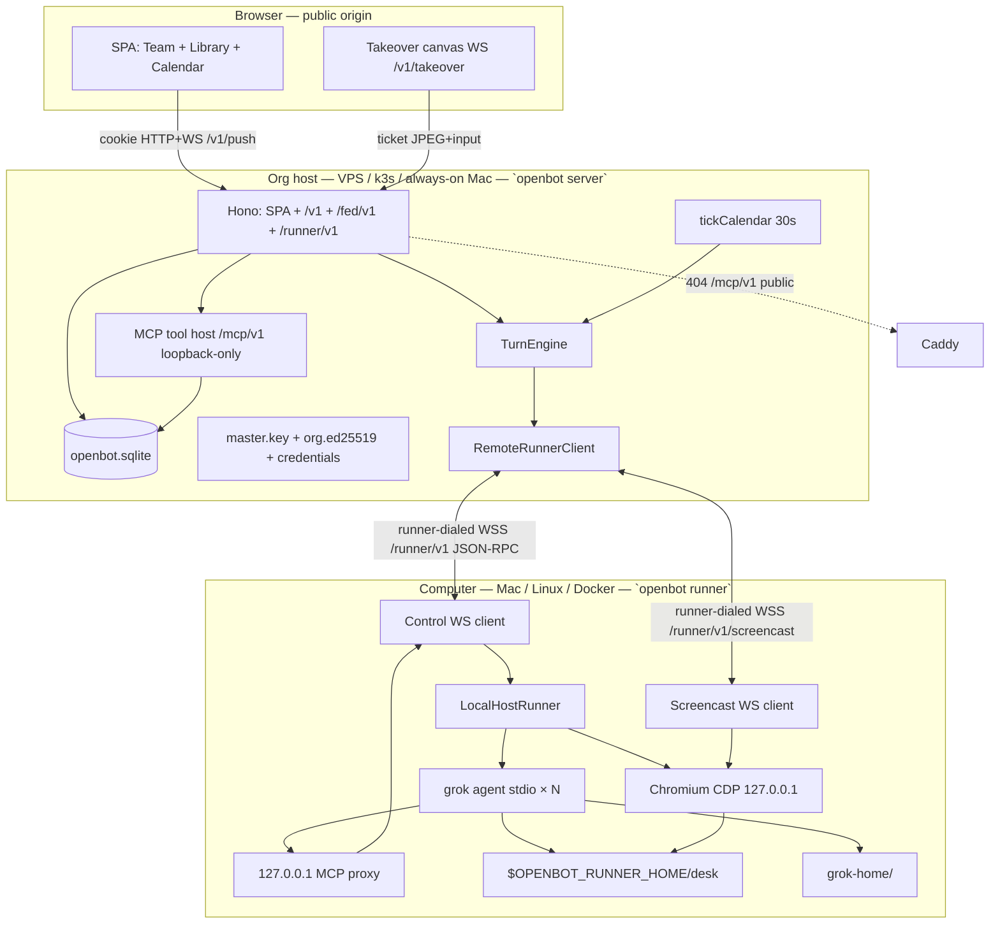
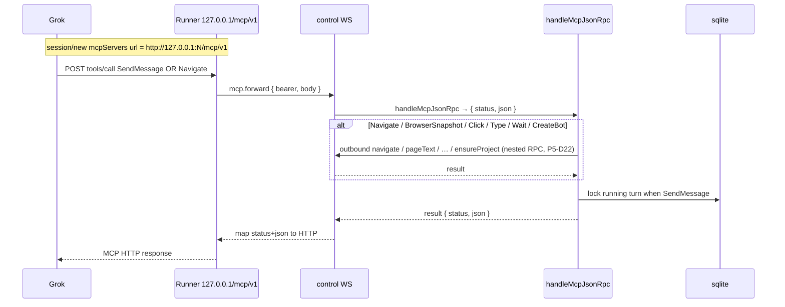
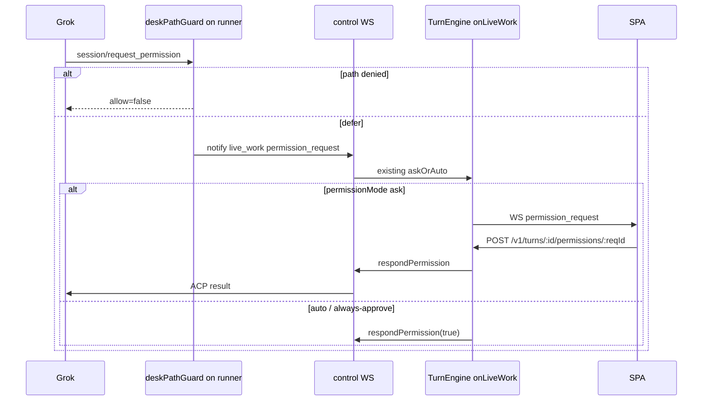

# OpenBot Phase 5 — Remote compute (runner)

| Field | Value |
| --- | --- |
| **Title** | OpenBot Phase 5 Design: Remote compute (runner) |
| **Author** | OpenBot maintainers (draft) |
| **Date** | 2026-08-31 |
| **Status** | Draft |
| **Depends on** | Phase 1–4 **as implemented in this tree** (`0.4.1`), not the pre-code freeze |
| **Audience** | Engineers extending `apps/server` + `packages/runner` + `packages/compute-protocol` |

Phase 4 shipped a durable calendar that fires real `TurnEngine` turns. Phase 5 splits **the org** from **the computer**. The orchestrator (sqlite, SPA, calendar tick, federation, vault) stays always-on. A **runner** the operator enrolls holds the desk: Grok ACP, Chromium, `desk/`. This is not “run the whole OpenBot process in k3s with Chrome in a pod.” k3s (or a VPS) may host the org; the computer is a worker that **dials out**.

---

## Overview

OpenBot today is one Bun process that is both the org and the desk. `TurnEngine` holds `runners = new Map<string, LocalHostRunner>()` and spawns `grok agent … stdio` plus Chromium as children of `openbot server`. Closing a browser tab does not stop teammates; stopping that process — or sleeping the laptop it runs on — stops the org **and** the computer.

Operators want the org on a VPS (calendar fire, federation inbox, SPA) while Ada’s bash/edit/grep and the shared Chromium live on a Mac mini, a Linux box, or a Docker host on a LAN that must not accept inbound ports. Phase 1 sketched `OPENBOT_RUNNER=sibling` and `/runner/v1` JSON-RPC as a hatch for that split. **That hatch is not in this tree.** The five-method `ComputeContract` is also not how Grok works.

Phase 5 ships one enrolled computer per org. The runner initiates a control WebSocket to the public origin (behind Caddy). Grok stays on the worker so native tools see the desk. MCP stays on the orchestrator and is **proxied over the control channel** to a loopback Streamable HTTP server on the runner — Caddy keeps 404ing public `/mcp/v1`. Takeover JPEG still terminates on `/v1/takeover`; the orchestrator bridges a dedicated media WebSocket to the runner. In-process `LocalHostRunner` remains the default when no runner is enrolled.

Sleeping the laptop means the **computer** is gone. The org stays up. Calendar ticks, federation mail lands, the SPA loads. Turns that need a harness wait or fail honestly. That is the same honesty as a stopped VM, applied to the desk rather than the process.

---

## Where we actually are

Cite this tree (`package.json` version **0.4.1**, Grok CLI pin **1.0.5**), not Phase 1/2 sketches where they disagree.

### Runtime (0.4.1, Phase 4 as shipped)

| Fact | Where |
| --- | --- |
| One Bun process = one org = one sqlite | `apps/server/src/cli.ts`, `OpenbotDb.open(join(home, "openbot.sqlite"))` in `apps/server/src/app.ts` |
| `$OPENBOT_HOME`: sqlite, `master.key`, `org.ed25519`, `allowlist`, `desk/`, `grok-home/` | README “Data on disk”; `docs/host-service.md` |
| Bind default `127.0.0.1`; `--host 0.0.0.0` warned; **no TLS** | `ALLOWED_HOSTS`, `bindNote()` in `cli.ts`; `contrib/caddy/Caddyfile.example` |
| Caddy **must** `handle /mcp/v1* { respond 404 }`; `/fed/v1` is public | `contrib/caddy/Caddyfile.example`; `docs/host-service.md` |
| LaunchAgent / systemd `--user` only, never root | `openbot install --user`; `contrib/launchd/ai.openbot.plist`; `contrib/systemd/openbot.service` |
| Calendar tick every **30s** then `kick()` | `createApp`: `setInterval(() => { tickCalendar(); kick(); }, 30_000)` in `app.ts` |
| Idle ACP TTL **10 min** desk / **30 min** Gateway | `packages/runner/src/index.ts` `DEFAULT_ACP_IDLE_MS`, `DEFAULT_GATEWAY_ACP_IDLE_MS` |

### The engine owns an in-process runner

| Fact | Where |
| --- | --- |
| `TurnEngine.runners = new Map<string, LocalHostRunner>()` | `apps/server/src/engine.ts` |
| `runnerFor(accountId)` constructs `new LocalHostRunner(this.opts.home, accountId)` | same; `home` is **the org** `$OPENBOT_HOME` |
| `runTurn` calls `runner.ensure`, `ensureProject` / `ensureGatewayWorkspace`, `matchesHarness`, `ensureHarness`, `prompt` | `engine.ts` `runTurn` |
| MCP URL is always `http://127.0.0.1:${mcpPort()}/mcp/v1` | `engine.ts` — loopback of **this** process |
| Vault `XAI_API_KEY` decrypted in the engine, passed as `ensureHarness({ env })` | `engine.ts`; wiped from `lastEnv` after spawn in `LocalHostRunner.ensureHarness` |
| `grokCliSignedIn()` reads **the server process** `$HOME/.grok/auth.json` | `packages/acp-grok/src/cli-auth.ts`; `engine.ts` refuses the turn if no vault, no fake ACP, and no CLI login |
| Permission `ask` is handled in `runnerFor`’s `onLiveWork` closure, then `respondPermission` | `engine.ts`; HTTP `POST /v1/turns/:id/permissions/:reqId` in `app.ts` |
| `reapIdleHarnesses` / `invalidateAcp` / `acpFor(botId)?.cancel()` are in-process method calls | `engine.ts`, `app.ts` cancel route |
| Archive/purge call `runner.acpFor(bot.id)?.kill()` | `app.ts` ~676, ~1111. `invalidateAcp` **skips** kill when `harness === "in_turn"` (`packages/runner`) — purge/archive need a real `kill` |
| `runTurn` catch reads `runner.acpFor(bot.id)?.lastStderr` | `engine.ts` ~452 |
| `runner.permissionMode = bot.permission_mode` each turn; `onLiveWork` reads `client?.permissionMode ?? r.permissionMode` | `engine.ts` ~261, ~58 |
| `runner.harnessSessionId = harnessId` before `ensureHarness`; `acpSessionId` written back to sqlite after | `engine.ts` ~397, ~418 |
| `botPresence` “Dormant” walks `runner.acpFor(botId)` in-process ACP maps | `app.ts` ~1985 |
| `purgeExpiredArchives` deletes `desk/projects/<id>` on the **org** home | `engine.ts` → `deleteBotProject` |

There is **no** runner WebSocket, **no** enroll token, **no** second process. `OPENBOT_RUNNER` and `/runner/v1` **do not appear** in `apps/server` or `packages/runner`. They exist only in `docs/design/phase-1-always-on-teammate-loop.md` (D25) and a Phase 2 non-goal line.

### `LocalHostRunner` is much larger than `ComputeContract`

`packages/compute-protocol/src/index.ts` still exports the five-method contract (`workspaceRoot`, `exec`, `display`, `lifecycle`, `takeoverUrl`) plus `EnsureHarnessRequest`, `PromptResult`, `LiveWorkEvent`, `PermissionHandler`. Typed `display()` is `{ cdpUrl, browserAlive, pageUrl?, pageOrigin? }` — it does **not** include `uid` / `chromeNotRoot`, which `LocalHostRunner.display()` already returns. `lifecycle` returns `diskFreeBytes: 1_000_000_000` hardcoded (`packages/runner` ~326); PR-48 must not pretend to parse `statfs`. `exec` is orchestrator debug (cwd must be under desk, 30s default / 120s cap). **Grok’s bash does not go through `exec`.** Native tools are ACP stdio on the child.

`packages/runner/src/index.ts` `LocalHostRunner` implements `ComputeContract` **and** `ComputeDriver` **and** the API the engine/app actually call:

| Method / field | Callers |
| --- | --- |
| `ensureHarness`, `prompt`, `matchesHarness`, `acpFor`, `acpSessionId`, `invalidateAcp`, `reapIdle` | `TurnEngine.runTurn` / `maintenance` |
| `ensure`, `ensureProject`, `ensureGatewayWorkspace`, `wipeDesk` | engine, `POST /v1/bots`, `onCreateBot`, wipe routes |
| `startScreencast`, `stopTakeover`, `dispatchInput`, `setScreencastViewport`, `takeoverUrl`, `ensureBrowser`, `display` | `/v1/takeover` WS, `POST /v1/compute/takeover`, learn-this `pageUrl` |
| `navigate`, `pageText`, `click`, `typeText`, `waitFor` | MCP hooks in `app.ts` (`browserNavigate` … `browserWait`) |
| `respondPermission` | `POST /v1/turns/:id/permissions/:reqId` |
| `onLiveWork`, `permissionHandler` / `deskPathGuard` | ACP `session/update` and `session/request_permission` |
| `harness`, `browser` | `healthPayload` → `GET /v1/compute` |

`ComputeContract` is **not** a sufficient RPC. Phase 5 splits **TypeScript `RunnerSession`** (engine/app, callbacks) from **JSON-RPC methods** (serializable args/results). The five methods stay a coarse health/lifecycle view.

### MCP, browser tools, CDP

| Fact | Where |
| --- | --- |
| Streamable HTTP MCP `GET+POST /mcp/v1` on the **orchestrator**; cookies rejected | `apps/server/src/app.ts` `app.all("/mcp/v1")` |
| Token bound `{accountId, botId, threadId, harnessSessionId}`, minted **only on cold start** | `engine.ts` `if (!warm) persistMcpToken(...)`; `claims.threadId` is that first thread |
| Desk tools include `Navigate`, `BrowserSnapshot`, `Click`, `Type`, `Wait` **on the orchestrator MCP server** | `packages/mcp-send-message/src/index.ts` `mcpToolsForRole`; **not** a runner-local `openbot-browser` stdio MCP (Phase 1 D20 did not ship) |
| Those tools call `LocalHostRunner` methods via `McpHooks` | `app.ts` `browserNavigate` → `runner.navigate(url, { owner: botId })` etc. |
| `OPENBOT_CDP_URL` is set in harness env to the colocated CDP (`http://127.0.0.1:<port>`) unless `omitCdp` (Gateway) | `LocalHostRunner.ensureHarness` |
| Overlay: “Prefer these tools over raw CDP” | `deskIdentityRules` in `packages/acp-grok/src/index.ts` |
| Stdio `openbot-mcp-bridge` if `mcpCapabilities.http !== true` | `packages/acp-grok/src/mcp-bridge.ts`; still targets an HTTP URL |
| `serverInfo.version` is `"0.4.1"` | `handleMcpJsonRpc` |

Browser automation is therefore **two paths**: MCP tools round-trip through the orchestrator, and Grok may also talk CDP on loopback. Both assume Grok and Chrome are on the same host as the MCP URL. That is the bug a remote runner must fix for MCP (proxy) and must **keep** for CDP (stay colocated on the worker).

### Takeover

| Fact | Where |
| --- | --- |
| `POST /v1/compute/takeover` mints a hashed ticket, 10 min, one per account | `app.ts` |
| Browser client opens `WS /v1/takeover`, first message `{ type: "auth", ticket }` | `spa.ts`; `app.ts` upgrade handler |
| Orchestrator calls `ensureBrowser`, `display`, `startScreencast`; binary JPEG to the client; JSON input → `dispatchInput` / `navigate` / `setScreencastViewport` | `app.ts` |
| CDP `remote-debugging-address=127.0.0.1`; `--use-mock-keychain`; `--password-store=basic` | `launchChromium` in `packages/runner/src/index.ts` |
| `display().cdpUrl` is **never** sent to the SPA (only `pageUrl` / `pageOrigin` / viewport) | takeover `meta` messages |
| Quality 70 JPEG, `BROWSER_VIEWPORT_MAX` 2560×1440, `everyNthFrame: 1` | `startScreencast` — heavier than Phase 1’s “~10 fps q60 max 1280” sketch |

There is **no** `/runner/v1/screencast`. Media and RPC share the server process, not a socket.

### Isolation (stays on the computer, wherever it is)

| Fact | Where |
| --- | --- |
| Grok `HOME` / `GROK_HOME` = `$OPENBOT_HOME/grok-home`; copied `auth.json`, not a symlink | `packages/acp-grok/src/grok-home.ts` `prepareIsolatedGrokHome` |
| Child env allowlist; no `SSH_AUTH_SOCK`, no `OPENBOT_MCP_TOKEN` in env (token is `session/new` headers) | `packages/runner/src/harness-env.ts` |
| ACP path guard denies vault basenames and paths outside desk/grok-home | `packages/runner/src/permissions.ts` `deskPathGuard` |
| Optional `OPENBOT_SANDBOX` (`sandbox-exec` / `bwrap`); tests default `none`; does **not** wrap Chromium | `packages/runner/src/sandbox.ts` |
| Gateway `permissionHandler` is `denyGatewayExec` (always deny); not a jail | same; `ensureHarness` |
| Per-bot cwd `desk/projects/<botId>/` is a home folder; `../` works | `packages/runner/src/workspace.ts` |
| Gateway cwd `desk/.openbot/gateway/`; `omitCdp: true`; never `ensureBrowser` from a Gateway turn | `engine.ts` `runTurn` |

### Identity, overlay, digest, calendar

Unchanged contracts Phase 5 must not break:

- Overlay is `_meta.rules` on `session/new` only (`deskIdentityRules` / `gatewayIdentityRules`). Per-turn instructions are a `runTurn` prefix (group, calendar).
- Cold start digest: `buildThreadDigest`, 40 msgs / 12k chars (`packages/live-work`).
- Calendar tick is a sibling of `maintenance()`; fire = enqueue a desk-bot turn with `origin='calendar'` user row (`calendar_instances.status='queued'`). Fire **needs a harness**.
- Live-work events are clipped at **16 KiB** (`packages/live-work` `clipJson`). Phase 1’s 64 KiB/event did not ship.
- Federation is org HTTP, hop=1, `/fed/v1`. Remote compute must not change that protocol.
- `promote()` is DB-authoritative. MCP inflight drain 2s after promote.

### `GET /v1/compute` today

```ts
// apps/server/src/app.ts healthPayload
{
  driver: "localhost",
  state: runner?.harness === "crashed" ? "unhealthy" : "running",
  harness: runner?.harness ?? "down",
  browser: runner?.browser ? "up" : "down",
  workspacePath: join(ctx.home, "desk"),
  uid: process.getuid?.() ?? -1,
  bots: activityForAccount(...),
}
```

No runner connection, no heartbeat, no hostname. There is **no** `/v1/push` event named `compute.health` — the SPA host pill is `refreshCompute()` polling `GET /v1/compute` (`spa.ts` ~1905). `compute_instances.driver` is always `'localhost'` (`ensureComputeInstance` in `apps/server/src/gateway.ts`). After enroll, `uid` / `workspacePath` / `browser` must come from the runner heartbeat or they lie (orch uid, leftover empty org `desk/`).

### What does not exist

No `/runner/v1`, no `OPENBOT_RUNNER`, no `hello` / `hello_ack`, no enroll token, no `runners` sqlite table, no `openbot runner join`, no MCP reverse-proxy, no dedicated screencast socket to a sibling, no Dockerfile for a worker, no `openbot-runner` unit. Phase 1 D25’s sibling hatch was never implemented. Phase 3 explicitly deferred “orchestrator on A, grok on B.” Phase 4’s learn-this `display().pageUrl` assumes the in-process runner.

`GET /v1/metrics` still has **not** landed (Phase 3 specified it; Phase 4 told us not to pretend). Do not block Phase 5 on it.

---

## Background & Motivation

The teammate loop is “Ada keeps working after you close the tab.” That is only true while **the process that owns Grok** stays up. Operators already run `openbot server` as a host service (`docs/host-service.md`). Two deployments fight:

1. **Org wants a durable host** — VPS / k3s / a Mac mini that never sleeps — so calendar 9am, federation inbox, and the SPA stay reachable.
2. **Desk wants a real computer** — Chromium with a persistent profile, `grok login` or a vaulted key, bash that sees files, sometimes a GPU, never an inbound port on a home LAN.

If we keep them colocated, a sleeping laptop takes down federation and the clock. If we stuff Chrome into the org’s k3s pod, we get headless Chrome in a datacenter, inbound 9222 games, and a PVC that is not the operator’s desk. If we SSH-reverse-tunnel the **whole** server to a home machine, the org dies when the laptop sleeps and `/mcp/v1` becomes a public accident.

The missing product is a **runner**: a thin process we own that dials the org and **is** the computer. Enrollment, not a catalog. Not Fly Machines. Not E2B/Daytona/Box. Not cptr.

Pain if we skip this and tell operators to “just run the server on the Mac”:

- Calendar honesty (“the 9am did not happen”) is blamed on the org when the operator only wanted the **desk** to sleep.
- Caddy 404s `/mcp/v1` only works while Grok can hit loopback on the org host.
- Phase 1’s five-method contract would ship a fake remote (`exec` as bash) and break native tools.

---

## Goals & Non-Goals

### Goals

1. **Process split.** Orchestrator remains `openbot server` (sqlite, SPA, calendar tick, `/fed/v1`, vault, MCP **tool host**). Runner is `openbot runner join` (Grok ACP, Chromium, `desk/`, `grok-home/`).
2. **One computer per org in v1.** Ada and Bob still share one desk and one Chromium. Per-bot private computers are out.
3. **Runner-initiated connection.** No inbound ports to the worker. Worker dials `wss://$OPENBOT_PUBLIC_ORIGIN/runner/v1` (or `ws://127.0.0.1` for the sibling slice).
4. **Same protocol, three packages.** Docker, Linux user unit, and macOS LaunchAgent are packaging of one runner, not three `SandboxProvider` backends.
5. **Grok stays on the worker.** Native bash/edit/grep see the desk. Do not move the coding harness onto the orchestrator.
6. **MCP proxied over the control channel.** Public origin continues to 404 `/mcp/v1`. Grok on the worker talks to `http://127.0.0.1:<runnerPort>/mcp/v1`.
7. **Desk disk on the runner.** No two-way file sync to an org PVC in v1.
8. **Sleeping laptop = computer gone; org stays up.** Same honesty as a stopped VM, applied to turns that need a harness and to calendar fire that cannot run.
9. **In-process `LocalHostRunner` remains the default** when no `runners` row exists or `status='revoked'`. `POST /v1/runner/enroll` in the **server PID** inserts `pending` and **kills** in-process ACP+Chrome (P5-D23). Never two computers.
10. **Sibling-on-localhost is the first vertical slice.** A turn + `SendMessage` + takeover must work with Grok **not** in the server PID before any Docker/Mac/Linux packaging PR.
11. Isolation already shipping (`grok-home`, copied `auth.json`, env allowlist, desk path guard, optional `OPENBOT_SANDBOX`, Chromium mock keychain) stays on the **runner host**.
12. Federation protocol unchanged (hop=1, allowlist + JWS). Calendar tick stays in the server process.

### Non-Goals (Phase 5)

- **VM provisioning** (no Fly Machines API, no catalog of instance types, no autostart). Enrollment of a computer the operator already has.
- Per-bot private computers, per-bot Chromium, gVisor, 6PN, nftables.
- Two-way file sync, org-side desk PVC, FUSE, or “the files appear on the VPS.”
- Public HTTPS MCP, or removing the Caddy 404.
- Moving Grok/ACP onto the orchestrator (Rakazo Pi-in-API).
- `cptr` / Open WebUI Computer, E2B, Daytona, Box, SSH reverse-tunnel of `openbot server`.
- Multiple enrolled runners, runner pools, autoscaling.
- Putting Gateway ACP on the orchestrator in v1 (see P5-D6).
- Postgres, Redis, a second agent runtime, changing `promote()` truth, raising the desk cap above 6.
- Desktop/mobile clients, OpenCode/Claude adapters.
- Making `ComputeContract`’s five methods the RPC (they are not).

---

## Key Decisions

| # | Decision | Choice | Rationale |
| --- | --- | --- | --- |
| P5-D1 | What a computer is | **One enrolled runner per org.** Shared desk, one Chromium, up to 6 desk bots + Gateway ACP on that runner. | Operator: Ada and Bob still share one desk; it is just not the server host. `compute_instances.account_id` is already UNIQUE. |
| P5-D2 | Who dials | **Runner initiates** control WS to the org origin. No inbound to the worker. | Home LAN / this Mac cannot port-forward. Same reason federation is org-HTTP and MCP is not public. |
| P5-D3 | RPC surface | **New `RunnerSession` in `@openbot/compute-protocol`**, implemented by `LocalHostRunner` (in-process) and `RemoteRunnerClient` (wire). Keep five-method `ComputeContract` as a health/lifecycle subset. | Engine/app already call ~25 methods. Pretending `exec` is bash would re-litigate Phase 1 D6. |
| P5-D4 | MCP | **Loopback Streamable HTTP on the runner**, POSTs forwarded as pipelined JSON-RPC `mcp.forward` `{ bearer, body }` → `{ status, json }`. Public `/mcp/v1` stays 404. Nested outbound RPCs legal (P5-D22). One proxy per **process**. | Tool host (auth, running-turn lock, `SendToOrg` signing) stays on the orch. Grok still sees `http://127.0.0.1`. Do not put MCP on the public origin. |
| P5-D5 | Disk | **sqlite / vault / org keys on the orch.** `desk/` + `grok-home/` + Chromium profile on the runner. No sync. | Native tools must see local files. Sync is a second product and a split-brain. Wipe desk is an RPC. |
| P5-D6 | Gateway ACP | **Same runner as desk bots** in v1. | `TurnEngine` is one runner per account. Gateway is already `LocalHostRunner.ensureHarness({ omitCdp: true })`. Putting Grok on the orch is the shape we rejected (P5-D3 / harness-on-orch). Inbox **storage** already survives ACP-down (Phase 3). Diplomat-while-laptop-sleeps is a later second compute plane. |
| P5-D7 | Default | **In-process iff no `runners` row or `status='revoked'`.** No auto-spawn sibling. Enroll → `pending` is already “a computer is attached.” | Today’s tests and `openbot demo` stay. `OPENBOT_RUNNER=sibling` is **not** revived. P5-D8/D23/D24. |
| P5-D8 | Auth to join | **Single-use enroll token (15 min) → long-lived machine token.** Machine token hashed in sqlite; plaintext in runner heap **and** `$OPENBOT_RUNNER_HOME/machine.token` mode 0600 (not under `desk/`). | Heap-only (Phase 1 D25) cannot survive a worker reboot. This is not `XAI_API_KEY`. Re-enroll **after revoke** (P5-D24). |
| P5-D9 | Model API key | **Vault stays on the orch.** `hello_ack` / `ensureHarness` inject `XAI_API_KEY` in memory. Runner **never** writes it to disk. `grok login` on the **runner user** is the other path (`prepareIsolatedGrokHome` copies `~/.grok/auth.json` into runner `grok-home/`). Inject rule is P5-D25 (loopback peer / forwarded https — OpenBot does **not** terminate TLS). | Matches Phase 1 D12, executed on the worker. Orch `grokCliSignedIn()` is the wrong machine once a runner is connected (P5-D16). |
| P5-D10 | Takeover media | **Dedicated WS `/runner/v1/screencast`**, runner-dialed. Nonce from **`takeoverUrl`** (today’s mint in `packages/runner` ~332–341), **used** by `startScreencast`, never from `hello`. Binary WS messages = JPEG; text = JSON input/meta. Orch `TakeoverBridge` keyed by nonce. CDP URL never leaves the runner. | RPC cannot HOL-block 10 fps. SPA and ticket auth stay as they are. `onFrame` is **not** a JSON-RPC argument. |
| P5-D11 | Control framing | **One WebSocket text message = one JSON-RPC 2.0 object** (no raw newline stream). `id` is `number \| string`. **Pipelined** (concurrent ids). Notifications for `live_work` / `harness_state`. Max JSON 1 MiB. Reader **never awaits a handler** (P5-D22). | `prompt` holds a request for up to 10 minutes (`AcpClient.prompt` timeout). `mcp.forward` → `Navigate` is a nested outbound RPC on the same WS. |
| P5-D12 | Disconnect | **Org stays up.** No in-process fallback while `status` is `pending`/`connected`/`disconnected`. Live remote = live `RemoteRunnerClient` socket, not sqlite `connected`. In-flight `prompt` follows P5-D21. Queued turns wait (queue depth 5). | In-process fallback would use the org’s leftover `desk/` — split-brain. Orch boot: `UPDATE runners SET status='disconnected' WHERE status='connected'` only — **leave `pending` and `revoked` alone**. |
| P5-D13 | Calendar vs runner down | **Option A:** tick **enqueues as today** (`calendar-tick.ts` sets instance `queued` + turn `queued`). `runTurn` returns **before** `status='running'` when enrolled and `!connected`; both stay `queued`; `kick()` on reconnect. Do **not** flip the instance back to `due` (that re-fires forever). Org-down catch-up (P4-D5) is unchanged and **separate**. | Clock is the org process. Computer-gone is occupancy, not `skipped_offline`. |
| P5-D14 | Packaging | **Same binary, same protocol.** Dockerfile / systemd `--user` / LaunchAgent **after** the sibling slice is green. | Operator: PR 1 is localhost sibling proving a turn + SendMessage + takeover. |
| P5-D15 | Caddy | **Proxy `/runner/v1*` and `/v1/takeover*` with `transport http { read_timeout 1h; }`.** Keep `/mcp/v1*` 404 **before** the catch-all. | Today’s example 404s only MCP and would already pass `/runner/v1`. Timeouts must be **in the file**, not a comment. |
| P5-D16 | `grokCliSignedIn` | Once a runner is connected, the engine uses **`hello.grokCliSignedIn`** (and vault on orch), **not** `grokCliSignedIn()` on the server host. | `engine.ts` currently refuses turns based on the org host’s `~/.grok`. That is a lie for a remote desk. |
| P5-D17 | `display()` on the wire | Wire `display` **omits `cdpUrl`.** Returns `browserAlive`, `pageUrl`, `pageOrigin`, `uid`, `chromeNotRoot`. Learn-this only needs `pageUrl`. | CDP must not leak to the orch log or a compromised sqlite backup. In-process `ComputeContract.display` may still include `cdpUrl` for local debug. |
| P5-D18 | Path guard / sandbox | **Stay on the worker.** `deskPathGuard`, `denyGatewayExec`, `wrapSandboxCommand`, `prepareIsolatedGrokHome` run in the runner process. | Paths are runner-local. Orch cannot evaluate `/Users/…` on a VPS. |
| P5-D19 | Enrollment UX | SPA: cookie `POST /v1/runner/enroll`. Unauthenticated enroll/revoke only if **both** (1) socket peer is loopback — `isLoopbackAddress(bunRequestIp(...))` (`apps/server/src/org.ts`, strips `::ffff:`), **ignore `X-Forwarded-For`** — **and** (2) `Host` is `127.0.0.1` / `localhost` / `::1` (CLI target `http://127.0.0.1:$PORT`). **Otherwise require cookie member.** Sqlite-only write **only on ECONNREFUSED**. Do **not** apply this dual gate to `hello_ack.env` (P5-D25 still trusts Caddy loopback for an already-tokened runner WS). | Peer-only is open once Caddy is in front (every WAN request is a loopback peer). Host-only is spoofable on `--host 0.0.0.0`. Both together: CLI works; SPA via Caddy needs cookie; WAN Host-spoof 403; WAN via Caddy without cookie 403. |
| P5-D20 | Sibling home | Sibling **may** share `$OPENBOT_HOME` with the server (desk already there) **but must not open sqlite**. Remote runner default home is `~/.openbot-runner` (or `OPENBOT_RUNNER_HOME`). Never copy `master.key` / `org.ed25519` / sqlite to the worker. | Shared home is the cheapest proof. Separate home is the real remote. WAL conflict if the runner opened the DB. |
| P5-D21 | In-flight `prompt` across reconnect | **Durable prompt keyed by `botId`.** Orch `prompt()` Promise is parked on `RemoteRunnerClient` and **survives** control-WS loss inside `RUNNER_GRACE_MS`. After `hello_ack`, orch sends `prompt.resume { botId }` (new JSON-RPC id, **no `text`**). Runner: (1) in-flight ACP wait → attach the new id, **must not** start a second `session/prompt`; (2) else `lastPromptResult.get(botId)` → return it; (3) else `prompt_gone`. **Never clear `lastPromptResult` on send** (no RPC ACK; a dying WS can look attached). Clear **only** on `prompt.resume` **after returning** the result, or on a new `prompt { botId }`. Resume is **idempotent**; orch only resumes `pendingPrompts`. **Grace clock:** `T_loss` = first of WS `close`/`error` **or** 15s heartbeat silence; 120s from `T_loss`, not stacked. | Clearing on “control RPC still attached” is the race the buffer exists to prevent. |
| P5-D22 | Nested RPC | **Control-WS reader never awaits a handler.** Dispatch, write the result when the handler Promise settles. `mcp.forward` → `handleMcpJsonRpc` **may emit outbound** `RunnerSession` RPCs on the same connection (`navigate`, `pageText`, `click`, `typeText`, `waitFor`, `ensureProject`). `CreateBot` → `onCreateBot` → `ensureProject` is the same pattern. Sibling test **must** run `[[nav:https://example.com]]` (or `[[sleep:3000]]` + `[[nav:]]`) during prompt, not only `[[send:]]`. | Fake ACP already navigates during `session/prompt` (`tests/fixtures/acp/fake-agent.ts`). A naive read-loop `await handle()` deadlocks the nested `navigate`. |
| P5-D23 | In-process → remote handoff | **Enroll and revoke run in the server PID.** `POST /v1/runner/enroll` (PR-48) upserts `pending` and `lifecycle({ op: "stop" })` including `in_turn`. `POST /v1/runner/revoke` (PR-48) nulls the hash, sets `revoked`, **closes the live WS**, drops `remoteClients`. CLI POSTs `http://127.0.0.1:$PORT` when the server is up; sqlite-only **only on ECONNREFUSED**. `runnerFor`: if sqlite is `revoked`, close/ignore any leftover live client **before** constructing in-process. | Sqlite-only revoke leaves `live?.connected` serving the old computer. |
| P5-D24 | Enroll vs attached | **HTTP 409 `runner_attached`** on `POST /v1/runner/enroll` while `status` is `connected` or `disconnected` **and** `machine_token_hash IS NOT NULL`. **`hello` is after the WS upgrade** — reply JSON-RPC error `-32001` `runner_attached` on the `hello` id, then close. First attach is `pending` (no machine token) → consume enroll, mint machine token. Consuming one enroll token **invalidates all other unused enroll tokens for that account**. A **second live `hello` with the same machine token** is **not** 409: last hello wins; close the previous `RemoteRunnerClient` (systemd `Restart=always` overlap). | Re-enroll-after-revoke is the steal story. Overlapping reconnects are the same computer. |
| P5-D25 | Vault env on the wire | OpenBot **does not terminate TLS** (`cli.ts` `bindNote`; Caddy terminates). Inject `hello_ack.env` / `credentials` **iff** the WS **peer is loopback** (`127.0.0.1`/`::1`) — trust the operator’s Caddy, same as cookies — **or** `X-Forwarded-Proto: https` **and** the immediate peer is loopback (do not trust proto from a non-loopback client). **Never** inject when the peer is a non-loopback cleartext client (`--host 0.0.0.0` without a proxy). `http://` public Caddy + vault inject is operator risk (already true for session cookies). Sibling `ws://127.0.0.1` injects. `ws://<non-loopback>` omits env (`envOmitted: "tls_required"`). Extend `redactSecrets` with `ob_enroll_` / `ob_run_`. | Naive `peer loopback OR TLS` always injects behind Caddy, including `http://` Caddy. There is no TLS on the Bun socket. |

---

## Proposed Design

### System context



When no runner is enrolled, `TurnEngine.runnerFor` is today’s in-process `LocalHostRunner` using `$OPENBOT_HOME/desk`. The worker subgraph does not exist.

### Process split

| Process | Binary | Owns | Must not |
| --- | --- | --- | --- |
| Orchestrator | `openbot server` / `openbot demo` | sqlite, vault, org keys, SPA, `/v1`, `/fed/v1`, `/mcp/v1` **bind on loopback of this host**, calendar tick, federation HTTP, enroll tokens, MCP authorization | Spawn Grok/Chrome once a `runners` row is `pending`/`connected`/`disconnected`; accept MCP off-loopback |
| Runner | `openbot runner join` | `LocalHostRunner` (same class), Grok children, Chromium, `desk/`, `grok-home/`, loopback MCP proxy, machine token | Open `openbot.sqlite`; read `master.key`; bind a public HTTP API; persist `XAI_API_KEY` |

Same Bun binary (`apps/server/src/cli.ts` grows a `runner` command). The runner process imports `@openbot/runner` + a small WS client; it does not call `createApp()`.

`TurnEngine` stores `Map<string, RunnerSession>`. Predicates (P5-D7 / P5-D12 / P5-D23):

```
class RunnerUnavailable extends Error {
  code = "computer_offline";
  httpStatus = 503;
}

function enrolledComputer(accountId): RunnersRow | null
  // sqlite; treat status='revoked' as no computer

function runnerFor(accountId): RunnerSession {
  const row = enrolledComputer(accountId); // null if no row OR status='revoked'
  const live = remoteClients.get(accountId);

  if (row == null && live) {
    live.close(); remoteClients.delete(accountId); // sqlite revoked; drop leftover WS
  }
  if (live?.connected && row != null) return live;
  if (row) throw new RunnerUnavailable();    // pending / connected-but-dead / disconnected
  return localHostRunnerFor(accountId);
}
```

- **In-process** iff `no row OR status='revoked'`.
- **Remote** iff a **live** `RemoteRunnerClient` (WebSocket up). Do **not** treat sqlite `status='connected'` as a live socket.
- **`createApp` boot:** `UPDATE runners SET status='disconnected', last_disconnect_at=? WHERE status = 'connected'` only. **Leave `pending` and `revoked` alone.** Test: enroll → recreate `createApp` on the same sqlite → join with the enroll token still consumes and mints a machine token.
- **Handoff (P5-D23):** `POST /v1/runner/enroll` in the **server process** upserts `pending` and `lifecycle({ op: "stop" })` on the in-memory `LocalHostRunner` (kills every ACP **including `in_turn`**). In-flight `runTurn` sees `prompt` throw → `promote({ kind: "crash" })`. Then delete the map entry. First successful `hello` constructs `RemoteRunnerClient`.
- **Revoke (P5-D23):** `POST /v1/runner/revoke` in the **same PID**: null `machine_token_hash`, `status='revoked'`, close live WS, `remoteClients.delete`. After that, `runnerFor` may construct in-process.
- **Last hello wins:** a valid **machine-token** `hello` while a live client exists: close the previous WS, replace the map slot. Do **not** JSON-RPC `-32001` (that is enroll-steal). Test: two joins with the same token; first socket closes; second is live.
- Heartbeat / WS close update sqlite `status` + timestamps. They do not spawn in-process.

Never both.

**`RunnerUnavailable` at call sites** (today `runnerFor` always returns a `LocalHostRunner`; after enroll it must not 500 the org):

| Caller | On `RunnerUnavailable` |
| --- | --- |
| `runTurn` (desk / Gateway with federation on) | Catch; **leave `queued`**; do not mark `running` |
| Gateway `runTurn` when `!federationEffective()` | **Do not call `runnerFor`.** Keep today’s system notice (`engine.ts` ~265–292) — diplomat-off must not wait on a Mac |
| `POST /v1/bots`, archive/purge `kill`/`deleteProject`, learn-this `display()`, `POST /v1/compute/takeover`, wipe, `/v1/takeover` | HTTP **503** `{ error: "computer_offline" }` |
| MCP `browserNavigate` … `browserWait` | Existing `{ ok: false, error: "browser_unavailable" }` (not 500) |
| MCP `CreateBot` `onCreateBot` / `ensureProject` | MCP tool error `computer_offline` |
| `cancel` / `respondPermission` | 503 `computer_offline` (permission: `{ ok: false, answered: false }` is also fine) |
| `GET /v1/compute` / `healthPayload` | **Must not** call throwing `runnerFor`. Read the `runners` row + last heartbeat / in-process map if no row |

### Enrollment UX

CLI does **not** share the engine heap with `openbot server`.

```text
# server up: always POST the loopback URL (peer will be 127.0.0.1)
openbot runner enroll [--origin URL] [--port 8787]
# → POST http://127.0.0.1:$PORT/v1/runner/enroll
# → { token, expiresAt, origin, join }

# ECONNREFUSED only: sqlite pending. Any HTTP 4xx/5xx is fatal (do not write pending).
openbot runner revoke [--port 8787]
# → POST http://127.0.0.1:$PORT/v1/runner/revoke  (closes live WS in the server PID)

# on the worker (no sqlite)
openbot runner join https://desk.example.com --token ob_enroll_…
openbot runner join http://127.0.0.1:8787 --token ob_enroll_… --home "$OPENBOT_HOME"
```

Unauthenticated enroll/revoke only if **both**:

1. Socket **peer** is loopback: `isLoopbackAddress(bunRequestIp(env, req))` (`org.ts` — strips `::ffff:`). **Ignore `X-Forwarded-For`.**
2. **`Host`** is `127.0.0.1` / `localhost` / `::1` (optional port).

Otherwise require cookie org-member. Not `sk-ob_`. Then:

| Path | Peer | Host | Cookie | Result |
| --- | --- | --- | --- | --- |
| CLI `POST http://127.0.0.1:$PORT` | loopback | `127.0.0.1` | no | 200 |
| SPA via Caddy | loopback (Caddy) | `desk.example.com` | yes | 200 |
| SPA via Caddy | loopback | `desk.example.com` | **no** | **403** |
| WAN Host-spoof on `--host 0.0.0.0` | not loopback | `127.0.0.1` | no | **403** |

Tests: (a) non-loopback + `Host: 127.0.0.1` → 403; (b) loopback peer + `Host: desk.example.com` without cookie → 403; (c) loopback peer + `Host: 127.0.0.1` without cookie → 200.

**P5-D25 is not this gate.** `hello_ack.env` still injects on loopback **peer** for an already-tokened runner WS (Caddy `wss://` is the product path).

SPA Settings (cookie session, not `sk-ob_`):

- **Computer:** Connected / Disconnected (`pending` and heartbeat-miss both show **Disconnected** — no third “Sleeping” pill; 15s silence already sets sqlite `disconnected`).
- Hostname, platform, runner version, last heartbeat, workspace path as reported.
- **Enroll** button: HTTP 409 `runner_attached` if a machine token is live (P5-D24); otherwise mints a token and shows the join command (token shown once).
- **Revoke** invalidates the machine token, disconnects the WS, sets `status='revoked'`, does **not** wipe the remote disk.

One computer (P5-D24): **REST enroll** while attached → HTTP 409. **`hello` with enroll** while attached → JSON-RPC `-32001` then close. Consuming one enroll token invalidates the others. Machine-token reconnect overlap → last hello wins (P5-D24).

Origin in the printed join command: `--origin` > `org_meta.public_origin` > `http://127.0.0.1:$PORT` (PORT / `--port` / 8787).

Token lifetimes:

| Token | TTL | Use | Storage |
| --- | --- | --- | --- |
| Enroll `ob_enroll_` | 15 min, **single use** | First `hello` only | Hash in `runner_enroll_tokens` |
| Machine `ob_run_` | Until revoke | Reconnect `hello`, screencast auth | Hash in `runners.machine_token_hash`; plaintext heap + `machine.token` 0600 on the worker |
| MCP `ob_sess_` | Harness session (unchanged) | Grok → loopback MCP | Hash in `mcp_tokens` on **orch** |
| Takeover ticket | 10 min (unchanged) | SPA `/v1/takeover` | Hash in `takeover_tickets` |

Reconnect: exponential backoff 1s, 2s, 5s, 10s, 30s cap. `hello` with machine token. JSON-RPC `-32002` `unauthorized` → log “re-enroll required” and stop retrying until the operator passes a new enroll token.

### Control channel protocol

Path: **`GET /runner/v1`** WebSocket. No cookies. No browser CORS. Caddy must proxy it.

Framing: **one WebSocket text message = one JSON-RPC 2.0 object.** Do not implement a raw newline codec on top of WS (Bun/Hono is already message-oriented; see `/v1/takeover`). Pipeline by `id` (`number | string`). Notifications are objects with `method` and no `id`. Max 1 MiB per message.

```ts
// packages/compute-protocol — illustrative
type RpcId = number | string;
type RpcReq = { jsonrpc: "2.0"; id: RpcId; method: string; params?: unknown };
type RpcRes = { jsonrpc: "2.0"; id: RpcId; result?: unknown; error?: { code: number; message: string; data?: unknown } };
type RpcNote = { jsonrpc: "2.0"; method: string; params?: unknown };
```

**Reader rule (P5-D22):** the control-WS read loop never `await`s an RPC handler. On inbound request, dispatch the handler and write the response when that Promise settles. On inbound response, resolve the matching pending `id`. On inbound notify, dispatch without awaiting. This is what makes `mcp.forward` → `Navigate` (nested outbound RPC on the same socket) legal.

Handshake (first message, no pipelining until `hello_ack`):

```mermaid
sequenceDiagram
  participant R as Runner
  participant Orch as /runner/v1
  participant DB as sqlite
  participant Vault as vault

  R->>Orch: hello { enrollToken? , machineToken? , protocol: 1, hostname, platform, version, grokCliSignedIn, warmBotIds[], inFlightPromptBotIds[], workspacePath, needsCredentials }
  Note over Orch: HTTP upgrade already succeeded. Errors are JSON-RPC on the hello id, then close.
  alt enroll token AND (connected|disconnected) with machine_token_hash
    Orch-->>R: error { code: -32001, message: "runner_attached" }; close
  else enroll token AND pending (no machine token)
    Orch->>DB: consume this hash; invalidate other unused enroll tokens; mint machineToken; status=connected
  else machine token match
    Orch->>Orch: close any previous live RemoteRunnerClient for this account (last hello wins)
    Orch->>DB: status=connected
  else protocol mismatch
    Orch-->>R: error { code: -32003, message: "protocol" }; close
  else bad / unknown token
    Orch-->>R: error { code: -32002, message: "unauthorized" }; close
  end
  alt needsCredentials AND (peer loopback OR (X-Forwarded-Proto https AND peer loopback))
    Orch->>Vault: decrypt xai_api_key
    Orch-->>R: hello_ack { machineToken, orgId, orgSlug, env: { XAI_API_KEY }, mcpProxy: true }
  else needsCredentials AND non-loopback peer
    Orch-->>R: hello_ack { machineToken, orgId, orgSlug, mcpProxy: true, envOmitted: "tls_required" }
  else
    Orch-->>R: hello_ack { machineToken, orgId, orgSlug, mcpProxy: true }
  end
  Note over R: keep machineToken in heap; write machine.token 0600; drop XAI_API_KEY after next spawn
  Note over Orch: prompt.resume for each parked botId (P5-D21)
  loop every 5s
    R->>Orch: notify heartbeat { harness, browser, bots: [{ id, acpAlive }], diskFreeBytes }
  end
```

`needsCredentials: true` on every **process** start (not every reconnect with warm ACP). Orch may send `env` on `hello_ack` (P5-D25) and again on `ensureHarness` (same loopback / forwarded-proto rule). Runner zeros the key from its RPC buffer after passing it into `spawn` env (existing `lastEnv` wipe).

Protocol version: `protocol: 1`. Frozen JSON-RPC application errors (`packages/compute-protocol`):

| Code | Message | When |
| --- | --- | --- |
| `-32001` | `runner_attached` | `hello` with **enroll** token while a machine token is live |
| `-32002` | `unauthorized` | bad/unknown token, or enroll token expired/used |
| `-32003` | `protocol` | `protocol !== 1` |
| `-32004` | `prompt_gone` | `prompt.resume` has neither an in-flight wait nor `lastPromptResult` |

HTTP **409** `runner_attached` is **only** `POST /v1/runner/enroll`. HTTP **401** is not used on `/runner/v1` (the upgrade already succeeded). Sibling test: second `join` with a **new enroll** token while attached receives `-32001` on the hello id, not a bare close. Second `join` with the **same machine token** replaces the first socket.

Heartbeat: 5s from runner. `bots[]` is `{ id, acpAlive }[]` so `botPresence` does not walk `acpFor`. `diskFreeBytes` may be `0` in v1 (`lifecycle` today hardcodes `1_000_000_000`); do not parse `statfs` in PR-48. Orch marks `disconnected` at `T_loss` (P5-D21). **New** `/v1/push` event `compute.health` on hello / heartbeat (throttled, e.g. 2s) / disconnect — this event does **not** exist in 0.4.1; the SPA today polls. After enroll, `healthPayload` is driven from the `runners` row + last heartbeat, **not** `process.getuid()` or `join(ctx.home, "desk")`.

### `RunnerSession` vs JSON-RPC (split)

Widen `@openbot/compute-protocol`. Do not stuff this into the five-method `ComputeContract`. **Two layers:**

1. **TypeScript `RunnerSession`** — what `TurnEngine` / `app.ts` hold. Callbacks (`onLiveWork`), `connected`, orch-owned `permissionMode`. Closures (`startScreencast(onFrame)`) exist **only** here.
2. **JSON-RPC methods** — serializable args/results on `/runner/v1`. No callbacks, no `AcpClient`, no `cdpUrl`.

Orch-owned (do **not** write onto the runner object as today’s `runner.permissionMode = …` / `runner.harnessSessionId = …`):

| Today | Remote |
| --- | --- |
| `runner.permissionMode = bot.permission_mode` | Read `bots.permission_mode` in `onLiveWork` ask/auto. Stop writing the runner field. |
| `runner.harnessSessionId = harnessId` | Stays sqlite `turns.harness_session_id`. Not a runner field. |
| `runner.acpSessionId` after `ensureHarness` | **`ensureHarness` RPC result `{ acpSessionId }`.** |
| `runner.acpFor(bot.id)?.lastStderr` | RPC errors carry `{ message, stderr }`. |
| `runner.acpFor(bot.id)?.kill()` archive/purge | RPC **`kill(botId)`** — always kills, even if `in_turn`. Distinct from `invalidateAcp` (which skips in-turn) and `cancel` (ACP `session/cancel`). |
| `runner.acpFor(botId)` in `botPresence` | Heartbeat `bots: [{ id, acpAlive }]`. |
| `runner.browser?.viewport` | `RunnerDisplay.viewport` + takeover first meta JSON. |
| `matchesHarness` sync, not awaited | Engine **always `await`s**. Remote may cache `harness_state`. |
| `ensureProject` / `ensureGatewayWorkspace` return `string` | `Promise<string>` on both implementations; engine always `await`s. |

```ts
// packages/compute-protocol/src/index.ts  (add; keep ComputeContract)

export type RunnerHello = {
  protocol: 1;
  hostname: string;
  platform: "darwin" | "linux" | "win32";
  version: string;
  grokCliSignedIn: boolean;
  warmBotIds: string[];
  inFlightPromptBotIds: string[]; // ACP session/prompt currently waiting
  // lastPromptResult is runner-local, not on the wire except via prompt.resume
  workspacePath: string;
  needsCredentials: boolean;
  enrollToken?: string;
  machineToken?: string;
};

export type RunnerHelloAck = {
  machineToken: string;
  orgId: string;
  orgSlug: string;
  env?: Record<string, string>; // XAI_API_KEY only; omitted unless P5-D25
  envOmitted?: "tls_required";
  mcpProxy: true;
};

/** Wire display: no cdpUrl (P5-D17). Matches LocalHostRunner.display extras. */
export type RunnerDisplay = {
  browserAlive: boolean;
  pageUrl?: string;
  pageOrigin?: string;
  uid: number;
  chromeNotRoot: boolean;
  viewport?: { width: number; height: number };
};

export type RpcErrorData = { stderr?: string };

/** Orch-side session. LocalHostRunner and RemoteRunnerClient implement this. */
export interface RunnerSession {
  workspaceRoot(): Promise<{ path: string }>;
  exec(req: {
    cmd: string[];
    cwd?: string;
    env?: Record<string, string>;
    timeoutMs?: number;
  }): Promise<{ exitCode: number; stdout: string; stderr: string }>;
  display(): Promise<RunnerDisplay>;
  lifecycle(
    req: { op: "start" } | { op: "stop" } | { op: "health" },
  ): Promise<{
    runner: "ok" | "degraded" | "disconnected";
    harness: "down" | "starting" | "idle" | "in_turn" | "crashed";
    browser: "down" | "up";
    diskFreeBytes: number; // 0 allowed; today's localhost hardcodes 1e9
    acpSessionId?: string;
  }>;
  takeoverUrl(): Promise<{ ready: true; screencastNonce: string }>;

  ensure(accountId: string): Promise<{ id: string; workspacePath: string }>;
  ensureHarness(req: EnsureHarnessRequest): Promise<{ acpSessionId: string }>;
  prompt(text: string, botId: string): Promise<PromptResult>;
  matchesHarness(
    botId: string,
    model?: string,
    reasoningEffort?: string,
    permissionMode?: EnsureHarnessRequest["permissionMode"],
  ): Promise<boolean>;
  invalidateAcp(botId: string): Promise<void>;
  kill(botId: string): Promise<void>;
  reapIdle(now?: number, opts?: { federationOff?: boolean }): Promise<string[]>;
  cancel(botId: string): Promise<void>;
  respondPermission(reqId: string, allow: boolean): Promise<boolean>;

  ensureProject(botId: string, name: string): Promise<string>;
  ensureGatewayWorkspace(): Promise<string>;
  deleteProject(botId: string): Promise<void>;
  wipeDesk(): Promise<void>;

  ensureBrowser(): Promise<void>;
  /** TS only: LocalHostRunner uses onFrame. RemoteRunnerClient subscribes the TakeoverBridge; onFrame may be ignored. */
  startScreencast(
    onFrame: (jpeg: Uint8Array, meta: { pageUrl?: string; pageOrigin?: string; viewport?: { width: number; height: number } }) => void,
  ): Promise<void>;
  stopTakeover(): Promise<void>;
  dispatchInput(event: Record<string, unknown>): Promise<void>;
  setScreencastViewport(width: number, height: number): Promise<void>;
  navigate(
    url: string,
    opts?: { duringTakeover?: boolean; owner?: string },
  ): Promise<{ ok: boolean; title?: string; error?: string }>;
  pageText(owner?: string): Promise<{
    ok: boolean;
    url?: string;
    title?: string;
    text?: string;
    error?: string;
  }>;
  click(
    input: { text?: string; selector?: string; nth?: number },
    owner?: string,
  ): Promise<{ ok: boolean; text?: string; tag?: string; count?: number; error?: string }>;
  typeText(
    input: { text: string; clear?: boolean; submit?: boolean },
    owner?: string,
  ): Promise<{ ok: boolean; error?: string }>;
  waitFor(ms?: number): Promise<{ ok: boolean; ms: number }>;

  onLiveWork?: (ev: LiveWorkEvent, botId?: string) => void;
  readonly harness: "down" | "starting" | "idle" | "in_turn" | "crashed";
  readonly connected: boolean;
  readonly workspacePath: string;
}

export const RUNNER_PROTOCOL = 1;
export const RUNNER_HEARTBEAT_MS = 5_000;
export const RUNNER_DISCONNECT_MS = 15_000;
export const RUNNER_GRACE_MS = 120_000;
export const RUNNER_JSON_MAX_BYTES = 1_048_576;
export const ENROLL_TTL_MS = 15 * 60 * 1000;
```

JSON-RPC methods (serializable). Names match the TS methods except as noted:

| Method | Direction | Kind | Notes |
| --- | --- | --- | --- |
| `hello` | runner → orch | request (first) | errors `-32001`/`-32002`/`-32003` then close |
| `prompt.resume` | orch → runner | request | `{ botId }` (no text) → in-flight wait **or** `lastPromptResult` **or** `-32004` `prompt_gone`. **Must not** start a second `session/prompt` (P5-D21) |
| `mcp.forward` | runner → orch | request | params `{ bearer, body }`; result `{ status: number, json: unknown }` |
| `startScreencast` | orch → runner | request | params `{ nonce }`; returns **after** the runner has dialed `/runner/v1/screencast`. No `onFrame` |
| `ensureHarness` | orch → runner | request | result `{ acpSessionId }` |
| `kill` | orch → runner | request | archive/purge |
| `heartbeat` | runner → orch | notify | `{ harness, browser, bots: [{ id, acpAlive }], diskFreeBytes }` |
| `live_work` | runner → orch | notify | payload clipped to **16 KiB** (`appendLiveWork` / `clipJson`) |
| `harness_state` | runner → orch | notify | cache for `matchesHarness` |
| `credentials` | orch → runner | notify | heap only; same P5-D25 inject rule as `hello_ack.env` |

`exec` stays orchestrator-debug, cwd-guarded **on the runner**, not exposed as HTTP. Do not use it for Grok bash. PR-48 may stub `exec` / `lifecycle` polish (hardcoded `diskFreeBytes` is OK).

`RemoteRunnerClient.prompt` parks the Promise by `botId` (P5-D21). `LocalHostRunner` already implements the methods; add `connected = true`, `kill`, and async wrappers. Engine always `await`s.

### MCP-over-control-channel



**Result shape.** `handleMcpJsonRpc` returns `{ status, json }` (`packages/mcp-send-message` ~1794). It uses **202** + `{}` for `notifications/initialized` / `notifications/cancelled`, **401/409** via thrown `McpError`. `mcp.forward` params are `{ bearer, body }`. Result is **`{ status: number, json: unknown }`** — never the inner body alone. The proxy maps that to the HTTP status line + JSON. Swallowing `status` breaks Grok (409 `federation_off`, 401 invalid bearer, 202 initialized). Tests must cover 409 / invalid bearer through the proxy, not only 200 `SendMessage`.

**Proxy lifetime.** Bind `127.0.0.1:0` **once per runner process** on first `hello_ack` (`mcpProxy: true`). Persist `proxyPort` across reconnects. Do **not** rebind on every WS. The port in `session/new` is sticky for the ACP child; rebinding breaks a warm harness.

**Rewrite.** Whenever `mcpProxy: true`, the worker **ignores** orch `EnsureHarnessRequest.mcpUrl` (today always orch loopback, `engine.ts` ~396). Cold `ensureHarness` always uses `http://127.0.0.1:${proxyPort}/mcp/v1`.

**GET / methods / cookies.** Local dummy SSE matching orch (`: connected` / `: ping` every 15s, `app.ts` ~1719–1749). Do **not** forward GET. Reject non-GET/POST (405) and cookies-without-bearer (401) the same way as `app.ts`. **No** bind on `0.0.0.0`. Cap POST body 1 MiB.

If `mcpCapabilities.http !== true`, stdio `openbot-mcp-bridge` on the **runner** targets that same loopback URL (token stays in argv of the bridge, which is already the fallback). Prefer HTTP.

Public Caddy (`contrib/caddy/Caddyfile.example` — PR-51 must put **explicit** timeouts in the file, not a comment):

```caddy
desk.example.com {
	handle /mcp/v1* {
		respond 404
	}
	handle /runner/v1* {
		reverse_proxy 127.0.0.1:8787 {
			flush_interval -1
			transport http {
				read_timeout 1h
			}
		}
	}
	handle /v1/takeover* {
		reverse_proxy 127.0.0.1:8787 {
			flush_interval -1
			transport http {
				read_timeout 1h
			}
		}
	}
	handle {
		reverse_proxy 127.0.0.1:8787
	}
}
```

This site is **HTTPS** (`desk.example.com` on 443). Caddy sets `X-Forwarded-Proto` on the reverse_proxy by default; OpenBot only honors it when the immediate peer is loopback (P5-D25). `/mcp/v1*` 404 stays **before** the catch-all. A 45s quiet takeover must not drop (checklist in PR-51). Caddy 2 already hijacks WebSockets on `reverse_proxy`; the 1h `read_timeout` is the explicit idle, not folklore about a 30s default.

`mcp.forward` must pipeline **and** nest (P5-D22). A single-flight RPC mutex is a **Critical** bug (HOL + deadlock on `Navigate` during prompt).

MCP token on the wire: only inside the already-authenticated control WS, same as `ensureHarness.mcpToken` today. Not in hello. Not in query strings. `RedactingLogger` must also redact `ob_enroll_` / `ob_run_` (P5-D25).

### Where state lives

| Asset | In-process (default) | Runner enrolled |
| --- | --- | --- |
| `openbot.sqlite` | `$OPENBOT_HOME` | **orch** `$OPENBOT_HOME` |
| `master.key`, `org.ed25519`, `allowlist`, `org.json` | orch | **orch only** — never copy |
| `credentials` (vaulted `xai_api_key`) | orch sqlite | **orch**; inject via hello_ack / ensureHarness |
| Calendar series/instances | orch sqlite | orch; tick on orch |
| Federation inbox / peers | orch | orch; `/fed/v1` unchanged |
| SPA / sessions / `sk-ob_` keys | orch | orch |
| `desk/` including Chromium profile + `projects/<botId>` + `.openbot/gateway` | `$OPENBOT_HOME/desk` | **`$OPENBOT_RUNNER_HOME/desk`** |
| `grok-home/` (config.toml, copied auth.json) | `$OPENBOT_HOME/grok-home` | **runner** |
| `machine.token` | n/a | `$OPENBOT_RUNNER_HOME/machine.token` 0600 |
| Grok ACP PIDs, Chromium PID | server process | **runner process** |
| MCP tool authorization / `SendToOrg` JWS | orch | orch (forwarded) |

`createApp` today `mkdirSync(join(cfg.home, "desk"))`. Leave it (harmless leftover). `GET /v1/readyz` stays “sqlite open + orch home writable” — **org** liveness. Runner connection is `GET /v1/compute`, not readyz. A disconnected computer must not fail k8s liveness of the org pod.

`wipeDesk` is an RPC. It does not delete sqlite or vault. Switching from in-process to a remote computer does **not** copy files; the new desk is empty. Copy:

> Files on the previous computer stay on that computer. This org does not sync a disk.

### Gateway (P5-D6)

Gateway remains a Grok ACP child on the **same** `RunnerSession`:

- `ensureGatewayWorkspace()` runs on the runner (creates `desk/.openbot/gateway`).
- `omitCdp: true`; `denyGatewayExec` on the worker.
- `SendToOrg` / `Inbox` stay orch MCP tools (signing uses `$OPENBOT_HOME/org.ed25519` which the runner must never see).
- Federation **off** still means do not `ensureHarness` for Gateway (`engine.ts` already short-circuits). `stopGatewayAcps` becomes `invalidateAcp` RPC.
- When the runner is disconnected, inbound `/fed/v1/messages` still inserts inbox (Phase 3: inbox must not depend on a live child). Drain waits until the computer is back — same as a desk turn.

Not orch-local in v1: that would spawn Grok on the VPS (second `grok-home`, second login, harness-on-orch). Diplomat-while-asleep is explicitly deferred.

### Permission round-trip (ask mode)

Path guard stays on the worker (P5-D18). Ask modal stays on the SPA.



`RemoteRunnerClient` installs `onLiveWork` like `runnerFor` does today. Ask/auto reads **`bots.permission_mode`** (orch-owned, P5-D3 split). Do **not** write `runner.permissionMode`. Do not treat this as isolation.

24h permission wait: ACP is blocked on the runner. Disconnect during ask → `respondPermission(false)` locally if possible, else ACP dies with the process and `runTurn` errors into promote crash after grace (`prompt_gone` / P5-D21).

### Live-work streaming

`AcpClient` `onEvent` → runner notify `live_work` `{ botId, kind, payload }` → orch `appendLiveWork` + `/v1/push`. Cap is **16 KiB/event** (`packages/live-work` `clipJson(..., 16 * 1024)` — Phase 1’s 64 KiB sketch did not ship). Notifications, not request/response — never wait for orch ACK before the next ACP `session/update`.

`GET /v1/turns/:id/live-work` catch-up is already sqlite; unchanged.

### Takeover media path (Chrome on B)

Keep **today’s order** (`app.ts` ~1674–1920): POST mints the ticket and the nonce; SPA WS auth is what starts screencast. Starting CDP at POST (before the SPA WS exists) drops early JPEGs.

```ts
// orch-side, not on the wire
type TakeoverBridge = {
  accountId: string;
  nonce: string;
  spaWs?: ServerWebSocket;   // after /v1/takeover auth
  mediaWs?: ServerWebSocket; // after /runner/v1/screencast auth
};
```

Keyed by `nonce` (and by `accountId` — one live takeover per account, as today’s ticket delete).

```mermaid
sequenceDiagram
  actor User
  participant SPA
  participant Orch
  participant Bridge as TakeoverBridge
  participant Ctrl as /runner/v1
  participant Media as /runner/v1/screencast
  participant Chrome

  User->>SPA: Takeover
  SPA->>Orch: POST /v1/compute/takeover
  Orch->>Ctrl: takeoverUrl
  Ctrl-->>Orch: { screencastNonce }
  Orch->>Bridge: { accountId, nonce }
  Orch-->>SPA: { ticket }
  SPA->>Orch: WS /v1/takeover { type:"auth", ticket }
  Orch->>Bridge: spaWs =
  Orch->>Ctrl: startScreencast { nonce }
  Ctrl->>Media: dial; first text { type:"auth", nonce, machineToken }
  Media->>Bridge: mediaWs =
  Ctrl->>Chrome: Page.startScreencast
  Ctrl-->>Orch: startScreencast returns (dialed)
  Note over Media,SPA: binary = JPEG; text = JSON meta/input
  loop frames
    Chrome-->>Ctrl: jpeg
    Ctrl->>Media: binary
    Media->>Bridge: binary
    Bridge->>SPA: ws.raw.send(jpeg) + text meta (viewport in first meta)
  end
  loop input
    SPA->>Orch: mouse/key/navigate/viewport (text JSON)
    Orch->>Media: text JSON
    Media->>Ctrl: JSON
    Ctrl->>Chrome: Input.dispatch*
  end
  User->>SPA: Done / WS close
  Orch->>Ctrl: stopTakeover
  Orch->>Bridge: delete
```

SPA code (`spa.ts` `/v1/takeover`) does not change. Ticket auth stays on the orch. Runner never sees the human session cookie.

Wire `startScreencast` params `{ nonce }` — **no `onFrame`**. `RemoteRunnerClient.startScreencast(onFrame)` subscribes to the bridge (or the `/v1/takeover` handler uses the bridge directly and ignores `onFrame`). In-process `LocalHostRunner.startScreencast(onFrame)` stays a closure as today.

Media WS: **binary messages = JPEG**, **text messages = JSON** (`meta` with `pageUrl` / `pageOrigin` / `viewport`, or input / navigate / viewport). Hono `upgradeWebSocket` must still deliver binary to the SPA via `ws.raw.send(jpeg)` (today’s path). Control WS is JSON-only.

Nonce is per takeover, from **`takeoverUrl`** (already minted in `packages/runner` ~332–341), **used** by `startScreencast`, never from `hello`.

CDP URL stays `http://127.0.0.1:<port>` on the worker. `RemoteRunnerClient.display()` strips it (P5-D17). First meta JSON includes `viewport`.

### Disconnect, drain, calendar honesty

| Event | Org | Computer | Turns | Calendar |
| --- | --- | --- | --- | --- |
| SPA tab closed | up | up | continue | fires |
| Runner WS drop, process still up (sleep/Wi‑Fi) | up | **gone** until reconnect | P5-D21: park `prompt` until `prompt.resume` or grace; queued wait | **Option A:** tick enqueues as today; `runTurn` returns before `running`; turn **and** instance stay `queued` |
| Runner process exit (Docker stop, kill) | up | gone | hello `inFlightPromptBotIds: []` / `warmBotIds: []` → `prompt_gone` → promote crash like `reapOrphans` | same skip-start (leave `queued`) |
| `openbot server` stopped | **down** | runner retries join | n/a | P4-D5 catch-up (`skipped_offline` ≥ 24h) |
| In-process, no row or `revoked` | colocated | colocated | today | today |

`runTurn` when a `runners` row is `pending`/`connected`/`disconnected` and `!live.connected`:

- Do **not** mark the turn `running` then crash-loop.
- Do **not** flip a calendar instance from `queued` back to `due` (`enqueueInstance` already set `queued` in `calendar-tick.ts` ~265).
- Leave the turn `queued`. `kick()` on heartbeat reconnect.
- Push **new** `compute.health` so the SPA can say “Computer offline — Ada is waiting.”

Queue depth 5 still applies; extras that **never got a turn row** stay `due` (tick occupancy); chat 429. Do not stampede 32 series when the Mac wakes — existing 8/tick + queue 5 hold.

### In-flight prompt resume (P5-D21)

```
RemoteRunnerClient.prompt(text, botId):
  pendingPrompts.set(botId, { resolve, reject, startedAt })
  send RPC prompt { text, botId }   // first socket
  return that Promise

on control WS loss:
  do not reject pendingPrompts
  start grace at T_loss if not already running

on hello_ack:
  for botId of pendingPrompts:
    send prompt.resume { botId }     // new id; no text
  if runner returns prompt_gone or grace fires:
    reject → runTurn catch → promote crash
  if runner returns PromptResult:
    resolve original Promise (same turn)

# runner
on session/prompt result:
  lastPromptResult.set(botId, result)
  if a control RPC prompt is still attached: resolve it
  # NEVER clear lastPromptResult here — no ACK; dying WS can look attached

on prompt.resume { botId }:          # idempotent
  if in-flight ACP wait: attach this id; MUST NOT session/prompt again
  else if lastPromptResult.has(botId):
    result = lastPromptResult.get(botId)
    lastPromptResult.delete(botId)   # clear only after returning
    return result
  else: error -32004 prompt_gone

on new prompt { botId }:
  lastPromptResult.delete(botId)
  start session/prompt
```

Do not re-send `text` on resume. Orch only resumes `pendingPrompts` (so a second resume after orch resolved is not issued). PR-49 tests: (a) finish fake `[[send:]]` after `T_loss` but before grace → resume delivers `PromptResult`; (b) result framed then socket drop before orch read → resume still returns `PromptResult`; no second `session/prompt`.

System copy (SPA + README + `docs/host-service.md`):

> Closing this browser tab does not stop your teammate. Stopping `openbot server` stops the org (clock, mail, UI). If you enrolled a computer, **sleeping or stopping that computer** stops Ada’s hands. The org stays up. Queued work runs when the computer is back. Calendar catch-up still only applies if the **org process** was down.

Do not reuse `skipped_offline` for runner-down (that notice means the clock was dead).

### Sibling-on-localhost (PR-48 vertical slice)

Must prove, with fake ACP (`OPENBOT_ACP_COMMAND`), **Grok not in the server PID**. Test matrix:

1. In-process ACP pid exists (including mid-`[[sleep:]]` / `in_turn`) → CLI `openbot runner enroll` against the **live** `startTestServer` (loopback `POST /v1/runner/enroll`) → **that pid is gone** (P5-D23); `GET /v1/compute.connection === "pending"` (healthPayload reads sqlite, does not throw). Also: enroll → recreate `createApp` on the same sqlite → join still consumes the enroll token (`pending` survived boot).
2. Spawn `openbot runner join http://127.0.0.1:<port> --token … --home <same-or-other>`.
3. `engine.runners.get(accountId)` is a `RemoteRunnerClient`; runner process has the ACP pid.
4. Human POST → turn → `[[send:hello]]` → DM has `origin=send_message`. Server pid ≠ ACP pid.
5. **SendMessage during prompt:** `[[sleep:3000]]` then `[[send:]]` (pipelining).
6. **Navigate during prompt:** `[[nav:https://example.com]]` (or sleep + nav) — nested `mcp.forward` → `navigate` (P5-D22).
7. Takeover: `POST /v1/compute/takeover` then SPA `/v1/takeover` receives **binary** (fake screencast OK if Chrome missing; media WS must be runner-dialed). Control WS is JSON-only.
8. WAL: runner must not `OpenbotDb.open`; fail if `openbot.sqlite-wal` has two writers.
9. Kill the join process → `GET /v1/compute` disconnected (not `driver: "localhost"` / `running`); `/v1/readyz` 200; **no org-desk ACP pid** (no in-process fallback).
10. Second `join` with a **new enroll** token while attached → JSON-RPC `-32001` on hello, not HTTP 409. Second `join` with the **same machine token** → first socket closes, second is live.
11. Enroll/revoke dual gate: (a) non-loopback peer + `Host: 127.0.0.1` → **403**; (b) loopback peer + `Host: desk.example.com` without cookie → **403**; (c) loopback peer + `Host: 127.0.0.1` without cookie → **200**. `openbot runner revoke` against a live server closes the WS (`remoteClients` empty; in-process allowed).

Share `--home` in this slice so `desk/` already exists. `OPENBOT_RUNNER=sibling` is **not** implemented and **not** required. Enrollment is the only switch.

### Packaging (after the protocol is green)

Same protocol; three unit files. Do not start these PRs before PR-48 is green.

**Dockerfile** (runner only — not the org):

- Non-root user; Chromium + `grok` on PATH; `openbot` binary.
- `ENTRYPOINT ["openbot", "runner", "join"]`.
- Env: `OPENBOT_JOIN_ORIGIN`, `OPENBOT_ENROLL_TOKEN` (first boot) or mounted `/data/machine.token`.
- Volume `/data` = `OPENBOT_RUNNER_HOME` (`desk/`, `grok-home/`, `machine.token`).
- **No** sqlite, **no** `master.key`.
- Chrome: existing `--use-mock-keychain`. **PR-52 must teach `launchChromium` to append `--no-sandbox` when `OPENBOT_CHROME_NO_SANDBOX=1`** (that env is **not** read today — documenting it without the code is a no-op). Opt-in only. `/dev/shm` size. Never root. `OPENBOT_CHROME` executable override already exists.

**Linux:** `contrib/systemd/openbot-runner.service` (`--user`, `Restart=always`, `After=network-online.target`). `openbot install-runner --user --origin … --token-file …`.

**macOS:** `contrib/launchd/ai.openbot.runner.plist` LaunchAgent (not Daemon). Same honesty as today: a LaunchAgent will not outlive logout/sleep.

Docker / Linux / Mac are **not** `SandboxProvider` backends. `OPENBOT_SANDBOX` still wraps Grok on whatever host the runner is.

### Auth: grok login vs vaulted key

| Path | Where | Disk |
| --- | --- | --- |
| Settings `PUT /v1/credentials/xai` | orch vault | orch sqlite ciphertext only |
| Inject | `hello_ack.env` / `ensureHarness.env` | runner heap → grok child env → wiped from runner maps |
| `grok login` | **runner user** `~/.grok/auth.json` | copied into runner `grok-home/auth.json` on each `ensureHarness` (existing `prepareIsolatedGrokHome`) |

`XAI_API_KEY` never on runner disk, never in `machine.token`, never in logs. `RedactingLogger` already redacts `XAI_API_KEY` / `xai-…`; extend it for `ob_enroll_` / `ob_run_` (P5-D25). `hello_ack.env` is omitted when the WS **peer is not loopback**. PR-49: `ws://127.0.0.1` injects; `ws://<non-loopback>` omits (`envOmitted: "tls_required"`). OpenBot does not observe TLS on the Bun socket.

Engine change (`runTurn` missing-cred branch):

```
const runnerSignedIn = remote ? hello.grokCliSignedIn : grokCliSignedIn();
if (!cred && !fakeHarness && !runnerSignedIn) { /* existing system notice */ }
```

Notice copy: “No Grok login on the **computer**. Run `grok login` on the runner host or paste an API key in Settings.”

Key rotation: in-flight grok finishes; orch `notify credentials` or next `ensureHarness` / respawn gets the new key (today: next spawn). Same.

---

## API / Interface Changes

### CLI (`apps/server/src/cli.ts`)

Two homes. **Org home** (sqlite) uses the existing `resolveOpenbotHome` path (`--home` / `OPENBOT_HOME` / current profile). **Runner home** (desk, grok-home, `machine.token`) uses, in order: `OPENBOT_RUNNER_HOME`, `--runner-home`, `--home` (**join/leave only** — sibling alias), else `~/.openbot-runner`.

| Command | Home | Behavior |
| --- | --- | --- |
| `openbot runner enroll [--origin] [--home] [--port]` | **org** | Always `POST http://127.0.0.1:$PORT/v1/runner/enroll`. Handler kills in-process in the **server PID**. **ECONNREFUSED only** → sqlite `pending`. Any HTTP error is **fatal** (do not write pending). Origin in `join` = `--origin` > `org_meta.public_origin` > `http://127.0.0.1:$PORT` |
| `openbot runner join <origin> --token [--home\|--runner-home]` | **runner** | Dial WS; block in the foreground; this **is** the worker process. Does not open sqlite |
| `openbot runner leave` | **runner** | Delete local `machine.token`; close WS. Does not revoke the hash |
| `openbot runner revoke [--home] [--port]` | **org** | Always `POST http://127.0.0.1:$PORT/v1/runner/revoke` (cookie or loopback **peer**). Handler nulls hash, `revoked`, **closes live WS**, drops `remoteClients`. **ECONNREFUSED only** → sqlite `revoked` (next `createApp` has no live map) |
| `openbot runner status` | org if sqlite present, else runner | Org: print `runners` row (no hashes). Runner: `machine.token` present + last hello cache. Sibling shared home: print both |

`printHelp()` gains these. `openbot install` stays the **org** unit. `openbot install-runner` lands in the packaging PR.

### HTTP / WS

| Method | Path | Auth | Change |
| --- | --- | --- | --- |
| `GET` | `/runner/v1` | enroll or machine token on `hello` | **New** control WS. Upgrade is 101; `hello` errors are JSON-RPC `-32001`/`-32002`/`-32003` then close |
| `GET` | `/runner/v1/screencast` | nonce + machine token first message | **New** media WS |
| `GET` | `/mcp/v1` public | n/a | still 404 at Caddy; orch bind still 127.0.0.1 |
| `GET` | `/v1/compute` | session | Reads sqlite / heartbeat — **does not** `runnerFor`. + `connection`, `hostname`, `platform`, `lastHeartbeatAt`, `runnerVersion`, `driver` |
| `POST` | `/v1/runner/enroll` | cookie member **or** (loopback **peer** **and** loopback **Host**) | `{ token, expiresAt, origin, join }` shown once. **HTTP 409 `runner_attached`** if a machine token is live. **403** if unauthenticated and either peer or Host is not loopback. **Kills in-process** in this PID. **PR-48** |
| `POST` | `/v1/runner/revoke` | cookie member **or** (loopback **peer** **and** loopback **Host**) | Null hash, `status='revoked'`, **close live WS**, drop `remoteClients`. **PR-48** (not PR-50) |
| `GET` | `/v1/runner` | cookie member | public snapshot (no hashes) |
| `GET` | `/v1/readyz` | none | **unchanged** (org liveness, not computer) |
| `GET`/`POST` | `/fed/v1/*` | JWS | **unchanged** |
| `WS` | `/v1/takeover` | ticket | **unchanged** client protocol; orch bridges |

`healthPayload` **must not** call throwing `runnerFor`. When **no** row or `revoked`: today’s localhost shape (in-process map if present). When enrolled: `runners` row + last heartbeat (`connection`, `hostname`, `platform`, `lastHeartbeatAt`, `runnerVersion`, `workspacePath` as reported, `uid` from heartbeat, `browser` / `harness` from heartbeat). Do **not** use orch `process.getuid()` or `join(ctx.home, "desk")` as the computer. `driver: "runner"` after first successful `hello`. `pending` → `connection: "pending"`.

**New** `/v1/push` `compute.health` on hello / throttled heartbeat / disconnect (does not exist in 0.4.1; SPA may keep polling).

### Engine / app call sites that must `await` RPC

- `runTurn`: `ensure`, `ensureProject` / `ensureGatewayWorkspace`, `ensureHarness` (use returned `acpSessionId`), `prompt(text, botId)`, `matchesHarness`. Catch uses RPC error `data.stderr`, not `acpFor().lastStderr`. Missing-cred uses `hello.grokCliSignedIn` when remote (P5-D16). **`RunnerUnavailable` → leave `queued`.** Gateway + `!federationEffective()`: **skip `runnerFor`**, keep today’s system notice (`engine.ts` ~265–292).
- `POST /v1/bots`, archive/purge `kill`/`deleteProject`, learn-this `display()`, takeover, wipe: **503 `computer_offline`** on `RunnerUnavailable`
- MCP browser hooks: `{ ok: false, error: "browser_unavailable" }` when the computer is offline (existing error); nested RPCs when live
- MCP `CreateBot` / `ensureProject`: tool error `computer_offline`
- Cancel / `respondPermission`: 503 or `{ ok: false, answered: false }`
- `GET /v1/compute`: sqlite + heartbeat, never throws `RunnerUnavailable`
- `botPresence`: heartbeat `acpAlive` when enrolled, else in-process `acpFor` only if no `runners` row
- Do not reach into `AcpClient` from the orch. Do not write `runner.permissionMode` / `runner.harnessSessionId`

### MCP `serverInfo`

Bump to `"0.5.0"` when touching `handleMcpJsonRpc` if a protocol comment is needed; **not** required for the sibling slice. Prefer bump in the MCP-proxy PR if that file changes.

### SPA

Settings → **Computer** (next to Federation / timezone). Host pill: **Connected** or **Disconnected** (`pending` and heartbeat-miss both Disconnected — no Sleeping pill). Learn-this `display().pageUrl` via RPC; 503 `computer_offline` if enrolled and disconnected. Markup tests: `open-computer`, `runner.disconnected`, join command.

---

## Data Model Changes

Additive `SCHEMA` + `ensureColumn` / new tables, same discipline as calendar (`packages/db/src/index.ts`).

```sql
CREATE TABLE IF NOT EXISTS runners (
  id text PRIMARY KEY,
  account_id text NOT NULL UNIQUE REFERENCES accounts(id), -- one computer per org
  hostname text,
  platform text,
  runner_version text,
  workspace_path text,
  machine_token_hash text UNIQUE,
  status text NOT NULL,          -- pending | connected | disconnected | revoked
  grok_cli_signed_in integer NOT NULL DEFAULT 0,
  last_hello_at integer,
  last_heartbeat_at integer,
  last_disconnect_at integer,
  created_at integer NOT NULL,
  updated_at integer NOT NULL
);

CREATE TABLE IF NOT EXISTS runner_enroll_tokens (
  id text PRIMARY KEY,
  account_id text NOT NULL REFERENCES accounts(id),
  token_hash text NOT NULL UNIQUE,
  expires_at integer NOT NULL,
  used_at integer,
  created_at integer NOT NULL
);
CREATE INDEX IF NOT EXISTS runner_enroll_account ON runner_enroll_tokens(account_id, expires_at);
```

`compute_instances.driver` remains `'localhost'` until the first successful `hello`; then `'runner'`. `workspace_path` updates to the **reported** runner path (informational; orch must not `fs` it).

`ensureComputeInstance` still inserts `driver='localhost'` on first login — correct until enroll.

Purge/archive of bots: still sqlite + RPC `deleteProject`. Revoke runner: do not DELETE the `runners` row (keep last hostname for the UI); set `status='revoked'`, null the token hash.

Cap: one row per `account_id` (UNIQUE). Enroll while `connected`/`disconnected` with a machine token → **409** (P5-D24). Enroll while `pending` (no machine token yet) may mint another unused token. Consuming one enroll token in `hello` marks **all** unused tokens for that account `used_at=now` in the same `immediate()` — no parallel 15-minute join race. `hello` with enroll never steals a live machine token.

Boot: `createApp` sets `status='disconnected'` **only where `status='connected'`**. Leave `pending` and `revoked` alone. Live connection is the WS, not this column. Test: enroll → new `createApp` → enroll token still works.

---

## Alternatives Considered

### A. Stuff Chrome (and Grok) in k3s next to the org

**Reject.** Operator: this is not “the whole OpenBot process in k3s with Chrome in a pod.” Chrome-in-a-pod is a bad 2FA computer (no operator keychain, PVC cookies, inbound or NodePort CDP games, RAM). k3s may host the **org**. The computer dials out.

### B. Rakazo `SandboxProvider` / E2B / Daytona / Box

**Reject.** Those APIs provision an ephemeral coding sandbox and keep the harness in the control plane (Pi-in-API). Native bash would not see a durable operator desk. We already have isolation on the worker (`grok-home`, path guard, optional bwrap/seatbelt). Phase 5 is enrollment of a machine, not a sandbox catalog.

### C. SSH reverse-tunnel of `openbot server` (or Tailscale the whole process home)

**Reject.** Laptop sleep still kills the org (sqlite, calendar, federation). MCP and CDP become reachable on whatever the tunnel exposes. We want the **org** always-on and the **computer** optional.

### D. `cptr` / Open WebUI Computer

**Reject.** Phase 1 D13. Different product surface (computer-first, BYO harness UI). We own a thin runner speaking `RunnerSession`, not an upstream computer-use stack.

### E. Public HTTPS MCP for remote Grok

**Reject.** Phase 3 P3-D20: Caddy must 404 `/mcp/v1`. Tokens in spawn env/headers are not enough on a public origin. Proxy over the already-authenticated control channel. Grok still thinks it is on loopback.

### F. Widen only the five-method `ComputeContract` and implement remote `exec`

**Reject.** Grok bash is ACP-native. `exec` is debug. The engine calls `ensureHarness` / `prompt` / browser methods / permissions. A five-method remote would force a second “computer use” MCP and break colocation.

### G. Orch-local Gateway ACP, remote desk bots

**Reject for v1** (P5-D6). Attractive for diplomat-while-asleep, but it puts Grok on the org host (the shape we are unwinding), splits `TurnEngine.runners`, and needs a second `grok-home`/login. Inbox already stores without ACP. Revisit if operators demand mail drain during laptop sleep.

### H. Two-way file sync (org PVC ↔ runner desk)

**Reject for v1.** Split-brain with sqlite-as-truth vs files-as-truth. Native tools need one disk. Operator copies what they need, or the desk **is** the runner.

### I. Revive `OPENBOT_RUNNER=sibling` env as the product switch

**Reject.** Enrollment is the switch and covers loopback. An env flag that auto-spawns a sibling would surprise `openbot demo` and fight in-process tests. Phase 1 D25’s hatch is acknowledged as **unimplemented** and superseded.

---

## Security & Privacy Considerations

### Trust boundaries

- **Org process** is the identity and mail hub. Compromise of the VPS is compromise of sqlite, vault, org Ed25519, MCP authorization.
- **Runner process** is laptop-equivalent on the worker uid. Compromise of the runner is compromise of `desk/`, Chromium cookies, grok-home `auth.json`, and in-memory `XAI_API_KEY` during a spawn. It is **not** compromise of `master.key` if we never copy it.
- **Control WS** is equivalent to being the computer. Machine token = that right.
- **Browser SPA** still never receives CDP URLs or MCP tokens.

| Threat | Severity | Mitigation |
| --- | --- | --- |
| Stolen enroll token | High | 15 min, single use, hash at rest; SPA shows once; rate 5/hour/account; consume-one invalidates others (P5-D24) |
| Stolen machine token | High | 0600 file outside `desk/`; path guard denies vault-like names; revoke; hash at rest; WS has no cookies |
| MCP token on the public origin | **Critical** if missed | Caddy 404; Grok uses runner loopback; `mcp.forward` only on authed control WS |
| CDP leaked to SPA / logs / sqlite | High | P5-D17 omit `cdpUrl` on the wire; bind 127.0.0.1 on the worker; takeover ticket unchanged |
| RPC HOL / nested deadlock | **Critical** if missed | Dedicated media WS; pipelined JSON-RPC; reader never awaits a handler (P5-D22) |
| Double `session/prompt` after Wi‑Fi blip | **Critical** if missed | `prompt.resume` must not start a second prompt (P5-D21) |
| `hello_ack.env` on cleartext WAN | High | P5-D25: inject iff peer is loopback (trust Caddy) or `X-Forwarded-Proto: https` from a loopback proxy. Never for non-loopback cleartext. OpenBot does not observe TLS |
| `hello` / heartbeat logs persist `ob_run_` | High | `redactSecrets` + `containsSecretLeak` for `ob_enroll_` / `ob_run_`; audit payload has no tokens |
| Silent steal-on-hello | High | P5-D24: HTTP 409 on REST enroll; JSON-RPC `-32001` on `hello` with a **new** enroll token |
| Runner writes `XAI_API_KEY` to disk | High | hello_ack heap only; wipe `lastEnv`; tests grep runner home for `xai-` |
| Runner opens sqlite / copies `master.key` | High | Runner never calls `OpenbotDb.open`; sibling test asserts single WAL writer |
| Fallback to in-process on disconnect (split-brain desk) | High | P5-D12 / D23: pending\|connected\|disconnected ⇒ never LocalHostRunner |
| Two computers during enroll→hello window | High | P5-D23: `POST /v1/runner/enroll` in the server PID `lifecycle(stop)` including `in_turn` |
| CLI enroll does not kill Grok | High | CLI POSTs `http://127.0.0.1:$PORT`; sqlite-only **only on ECONNREFUSED**; HTTP errors are fatal |
| Unauthenticated enroll via Caddy (loopback peer, public Host) | **Critical** if missed | Dual gate: peer loopback **and** Host loopback; else cookie. Tests (a)(b)(c) in the sibling matrix |
| Sqlite-only revoke leaves live WS | High | `POST /v1/runner/revoke` in the server PID closes WS; `runnerFor` drops leftover live client when sqlite is `revoked` |
| Path guard evaluated on the VPS (wrong roots) | High | P5-D18: guard/sandbox on the worker |
| Chrome in Docker as root / `--no-sandbox` default | High | non-root; mock keychain already; `--no-sandbox` **opt-in** via `launchChromium` (PR-52) |
| Public `/runner/v1` scan | Medium | no cookies; first message must be `hello`; rate-limit 60/min/IP; unauth close |
| Prompt injection exfiltrates machine token | Medium | token not in desk/; not in grok env; not in `_meta.rules` |
| `sk-ob_` enrolls a runner | Medium | cookie/session only, like peers (P3-D26) |
| Screencast frames in logs | Medium | binary path; existing “no frame logs” |
| Federation protocol change / hop>1 | n/a | out of scope; do not touch `/fed/v1` |

Audit types: `runner.enroll`, `runner.hello`, `runner.disconnect`, `runner.revoke`. Payload: hostname, platform, runner id — **not** tokens, **not** env.

---

## Observability

`GET /v1/metrics` still does not exist. Do not block on it.

| Signal | Where |
| --- | --- |
| `runner.hello` `{hostname, platform, warmBotIds, ms}` | orch logs |
| `runner.disconnect` `{reason, lastHeartbeatAgeMs}` | orch logs |
| `runner.mcp_forward` `{ms, method}` (sample) | orch; p95 target below |
| `GET /v1/compute` | When enrolled: `connection`, `lastHeartbeatAt`, `hostname`, `harness`, `browser`, `driver: "runner"`, `workspacePath`/`uid` from heartbeat — **not** orch `getuid` / org `desk/`. When in-process: today’s payload |
| `/v1/push` `compute.health` | **New** event on hello / throttled heartbeat / disconnect. 0.4.1 SPA polls `GET /v1/compute`; keep polling as fallback |
| Runner stderr | `openbot runner join` stays in the foreground; systemd/journald for the unit |

Latency targets (add to Phase 1’s warm-harness table):

| Path | Sibling (loopback) | Remote (home → VPS) |
| --- | --- | --- |
| `hello` → `hello_ack` | p95 < 100 ms | p95 < 500 ms |
| `mcp.forward` SendMessage extra vs in-process | p95 < 50 ms | p95 < 150 ms |
| Takeover first frame (Chrome already up) | p95 < 1.5 s | p95 < 2.5 s |
| Takeover steady JPEG | ~10 fps; 300–800 KB/s through orch | same, plus last-mile |
| `prompt` first `live_work` | p95 < 2 s warm (unchanged budget + one RTT) | + RTT |

Load: one control WS + optional one media WS per org. Heartbeat ~100 B / 5s. Six Grok processes + Chrome stay on the **worker** RAM budget (README: 8 GB for 3+ bots, 16 GB comfortable for 6 + Chrome). Orch without Grok/Chrome is small (~few hundred MB).

Alerting (operator, not a product pager): unit `Restart=always` on both sides; SPA “computer offline” is the user-visible alert.

---

## Rollout Plan

1. **Dev / PR-48:** `startTestServer` + `openbot runner join` on loopback + fake ACP. Prove turn + SendMessage + media WS. No live xAI. No Docker.
2. **Flags:** none required. Default remains in-process. Optional later panic: `OPENBOT_RUNNER=0` refuse `hello` (do not add unless a PR needs it).
3. **Staging:** org on a VPS behind Caddy (MCP 404, `/runner/v1` proxied, HTTPS); runner on a laptop; enroll; takeover; close the lid; confirm SPA still loads and the **queued calendar turn stays `queued`** until the laptop opens; confirm `/fed/v1/info` still works. Caddy must be HTTPS; `http://` public Caddy + vault inject is operator risk.
4. **Docs:** README capability row; honesty paragraph; `docs/host-service.md` Computer section; Caddyfile snippet.
5. **Rollback:** `openbot runner revoke` (org) + stop the worker. Schema stays. In-process returns only after `status='revoked'` (the row is **kept**). Stopping the worker without revoke leaves the org in “computer offline” — that is correct, not a rollback bug.
6. **Packaging PRs** only after PR-48 is green.

Existing 0.4.1 DBs: migrate adds empty `runners` / `runner_enroll_tokens`. No behavior change until enroll.

---

## Risks

| Risk | Severity | Mitigation |
| --- | --- | --- |
| Implementer uses a single-flight RPC queue / awaits handler on the reader | **Critical** | P5-D11/D22; tests: SendMessage during `[[sleep:3000]]`; `[[nav:]]` during prompt |
| Re-issue `prompt` after reconnect (double Grok turn) | **Critical** | P5-D21; `prompt.resume` must not call `session/prompt` |
| Implementer multiplexes JPEG on `/runner/v1` | **Critical** | P5-D10; sibling test asserts control WS is JSON-only **and** SPA `/v1/takeover` still receives binary |
| Public MCP accidentally proxied | **Critical** | Caddy 404 first; no CORS on MCP; bind 127.0.0.1 on both hosts |
| `mcp.forward` swallows HTTP status | High | result `{ status, json }`; test 409 `federation_off` / 401 through the proxy |
| `runTurn` still calls `grokCliSignedIn()` on the org host | High | P5-D16; test with vault-less orch + runner `grokCliSignedIn: true` (fake) |
| In-process fallback on disconnect uses empty org `desk/` | High | P5-D12/D23; kill-join test: no org-desk ACP pid |
| sqlite WAL locked by sibling sharing `--home` | High | runner never opens DB; test |
| Laptop sleep: operator expects calendar catch-up replay | High | Copy: catch-up is org-down only; runner-down leaves turn+instance `queued` |
| Chrome in Docker (no userns, tiny `/dev/shm`, 2FA) | High | PR-52: `launchChromium` honors `OPENBOT_CHROME_NO_SANDBOX`; prefer a real user session for takeover |
| Takeover bandwidth through a small VPS | Medium | JPEG already lossy; document; do not add WebRTC in v1 |
| `ensureProject` sync → forgotten `await` | Medium | Both implementations return `Promise<string>`; engine always await |
| Gateway diplomat silent while Mac sleeps | Medium | Accepted (P5-D6); inbox persists; Settings held/pending already exist |
| Machine token on runner disk stolen via desk bash | Medium | file **outside** `desk/`; path guard denies `$OPENBOT_RUNNER_HOME` except desk/grok-home — **must** set runner home so `machine.token` is not under `desk/` |
| Caddy idle kills WS | Medium | Example file has `read_timeout 1h` on `/runner/v1*` and `/v1/takeover`; 45s quiet takeover checklist |
| Phase 1 D25 readers implement `OPENBOT_RUNNER=sibling` | Low | This doc supersedes; grep stays empty on purpose except tests |

---

## Honesty (Phase 5)

- **The org is the process.** Closing a tab does not stop it. Stopping `openbot server` / the unit / the VM does. Calendar catch-up and federation held-mail are about **that** process.
- **The computer is the runner.** Sleeping the laptop, stopping Docker, or killing `openbot runner` stops Grok and Chromium. The org stays up. Ada cannot type. Queued turns wait. We will not silently run them on the VPS disk.
- **One shared desk, still.** Ada and Bob are not isolated from each other. The boundary we added is org-host vs computer-host, not Ada vs Bob.
- **No file sync.** The desk is whatever disk the runner has. Wiping the desk wipes that disk via RPC, not the org sqlite.
- **MCP is not on the internet.** If Caddy stops 404ing `/mcp/v1`, that is an operator incident.
- **We do not provision VMs.** You enroll a machine you already have.

---

## Open Questions

None that block implementation. Unauthenticated enroll/revoke require **both** loopback peer (`isLoopbackAddress(bunRequestIp)`) **and** loopback Host; otherwise cookie. P5-D25 vault inject is a separate, runner-tokened path.

Deferred on purpose (not questions): orch-local Gateway, multi-runner, file sync, WebRTC takeover, `GET /v1/metrics`, real `statfs` `diskFreeBytes`.

---

## References

- This repo: `README.md`, `docs/host-service.md`, `docs/design/phase-1-always-on-teammate-loop.md` (D4 colocation, D6 tool ownership, D11 takeover, D12 vault inject, D19 MCP loopback, D25 sibling hatch **unimplemented**, Later Phases “Remote runner”), `docs/design/phase-2-team-on-one-desk.md` (P2-D8 warm ACP map, non-goal remote runner), `docs/design/phase-3-orgs-vms-gateway.md` (P3-D14 Gateway cwd, P3-D20 MCP 404, hop=1), `docs/design/phase-4-calendar-automations.md` (tick sibling of maintenance, fire needs a harness, P4-D5 catch-up = org down)
- Code: `apps/server/src/engine.ts` (`runners`, `runTurn`, `mcpUrl`), `apps/server/src/app.ts` (`/mcp/v1`, `/v1/takeover`, `healthPayload`, MCP browser hooks), `apps/server/src/cli.ts` (`openbot server` / `install`), `packages/runner/src/index.ts` (`LocalHostRunner`), `packages/compute-protocol/src/index.ts`, `packages/mcp-send-message/src/index.ts` (`mcpToolsForRole`, `McpHooks`), `packages/acp-grok/src/index.ts` (`newSession` MCP HTTP, overlay), `packages/acp-grok/src/grok-home.ts`, `packages/acp-grok/src/cli-auth.ts`, `packages/runner/src/harness-env.ts`, `permissions.ts`, `sandbox.ts`, `workspace.ts`, `contrib/caddy/Caddyfile.example`
- Tests that lock current contracts: `tests/loop.test.ts`, `tests/engine-parallel.test.ts`, `tests/browser-mcp.test.ts`, `tests/browser-cdp.test.ts`, `tests/permissions.test.ts`, `tests/harness-env.test.ts`, `tests/sandbox-policy.test.ts`, `tests/grok-home.test.ts`, `tests/idle-acp.test.ts`, `tests/reap-orphans.test.ts`, `tests/calendar-fire.test.ts`, `tests/send-to-org.test.ts`, `tests/fixtures/acp/fake-agent.ts`

---

## PR Plan

Each PR independently reviewable. Tests: fake ACP (`OPENBOT_ACP_COMMAND`, `tests/fixtures/acp/fake-agent.ts`). No live xAI. **PR-48 must prove the protocol on localhost before any packaging PR.** Numbering continues after Phase 4’s PR-47. Defer `exec` / `lifecycle` / `statfs` polish.

### PR-48 — Localhost sibling: protocol + handoff + MCP proxy + takeover

- **Title:** `feat(runner): /runner/v1 JSON-RPC sibling, MCP proxy, screencast bridge`
- **Files:** `packages/compute-protocol` (TS `RunnerSession` **and** JSON-RPC types, hello, `-32001`/`-32002`/`-32003`, `{ status, json }` `mcp.forward`); `packages/runner` (`rpc.ts`, `mcp-proxy.ts`, `join.ts`); `packages/vault` (`ob_enroll_` / `ob_run_` redaction); `packages/db` (`runners`, `runner_enroll_tokens`); `apps/server/src/engine.ts` (`runnerFor` drops leftover live client when sqlite `revoked`; `RunnerUnavailable`; Gateway skip when federation off; leave queued; boot `UPDATE … WHERE status='connected'`); `apps/server/src/app.ts` (`POST /v1/runner/enroll` **and** `POST /v1/runner/revoke` — cookie **or** (loopback peer **and** loopback Host via `isLoopbackAddress(bunRequestIp)`); enroll kills in-process; revoke closes WS; `/runner/v1`, screencast, `TakeoverBridge`, `mcp.forward`, 503 `computer_offline`, `GET /v1/compute` reads sqlite); `apps/server/src/cli.ts` (enroll/revoke POST `http://127.0.0.1:$PORT`; sqlite-only **only** on ECONNREFUSED); `tests/runner-sibling.test.ts` (matrix above, including dual-gate 403s (a)(b)(c), revoke closes WS, enroll→recreate `createApp`→join, last-hello-wins); `tests/schema.test.ts`
- **Depends on:** this tree (0.4.1)
- **Description:** Vertical slice. Dual-gate `POST /v1/runner/enroll` (loopback peer **and** Host, or cookie) → in-process ACP pid gone. Tests (a)(b)(c) in matrix #11. Revoke closes live WS. Join → turn + `[[send:]]` + `[[nav:]]` during prompt. WAL single writer. Kill join → disconnected + **no** org-desk ACP pid. Enroll token survives `createApp` restart. No vault `hello_ack.env` yet. No Docker. No SPA Computer panel.

### PR-49 — Vault inject, loopback env, prompt.resume, grokCliSignedIn

- **Title:** `feat(runner): hello_ack vault env, prompt.resume, runner-signed-in`
- **Files:** `engine.ts` (P5-D16; P5-D21 park/`prompt.resume`/`lastPromptResult`/grace; `purgeExpiredArchives` RPC `deleteProject`); `app.ts` inject env iff peer loopback (or `X-Forwarded-Proto: https` from loopback proxy); `join.ts` env wipe; `tests/runner-auth.test.ts` (`ws://127.0.0.1` injects; `ws://<non-loopback>` omits); `tests/runner-disconnect.test.ts` (Wi‑Fi blip: resume does not double-prompt; **completed-during-gap** `[[send:]]` still delivers `PromptResult`; **framed then socket drop before orch read** → resume still returns `PromptResult`; process kill: `prompt_gone`; calendar instance stays `queued` not `due`); `tests/calendar-fire.test.ts` extra case
- **Depends on:** PR-48
- **Description:** `XAI_API_KEY` never on runner disk. OpenBot does not observe TLS. Grace clock as P5-D21. Option A calendar skip-start lives here (engine occupancy), not only SPA.

### PR-50 — SPA Computer panel + honesty copy + healthPayload

- **Title:** `feat(web): Computer settings, host pill, compute.health push`
- **Files:** `apps/server/src/spa.ts`, `tests/spa-markup.test.ts`; `healthPayload` from `runners` + heartbeat; `/v1/push` `compute.health`; README + `docs/host-service.md` honesty paragraph
- **Depends on:** PR-49
- **Description:** Markup: `open-computer`, Connected/Disconnected only (no Sleeping). Calendar: org-down catch-up **unchanged**; runner-down does not `skipped_offline`. Host pill. Learn-this 503 when offline. Do not show orch uid / org `desk/` as the computer. Enroll **and revoke** HTTP routes already landed in PR-48.

### PR-51 — Caddy `/runner/v1`, explicit idle timeouts, docs

- **Title:** `docs(runner): Caddy proxy /runner/v1, MCP 404 stays, read_timeout 1h`
- **Files:** `contrib/caddy/Caddyfile.example`, `docs/host-service.md`, README HTTP table
- **Depends on:** PR-48 (paths exist)
- **Description:** Site must be **HTTPS** (P5-D25 trusts loopback peer + Caddy). `handle /mcp/v1*` 404 **first**. `handle /runner/v1*` and `/v1/takeover*` with `transport http { read_timeout 1h; }` and `flush_interval -1`. Checklist: 45s quiet takeover must not drop. Note `http://` public Caddy + vault inject is operator risk. Federation unchanged.

### PR-52 — Packaging: Dockerfile, linux user unit, mac LaunchAgent

- **Title:** `feat(runner): Docker/linux/mac packaging of the same join protocol`
- **Files:** `contrib/docker/runner/Dockerfile`; `contrib/systemd/openbot-runner.service`; `contrib/launchd/ai.openbot.runner.plist`; `cli.ts` `install-runner`; **`packages/runner/src/index.ts` `launchChromium`** — append `--no-sandbox` iff `OPENBOT_CHROME_NO_SANDBOX=1` (opt-in); `docs/host-service.md` Computer install
- **Depends on:** PR-48 (protocol), ideally PR-51 (Caddy)
- **Description:** Same `openbot runner join`. Non-root Chrome. Volume is runner home only. **No** sqlite in the image. Do not start this PR before sibling tests are green.

**Do not** schedule a Fly provisioner PR, a k3s-Chrome PR, a SandboxProvider PR, a public-MCP PR, or a file-sync PR on this ladder.
