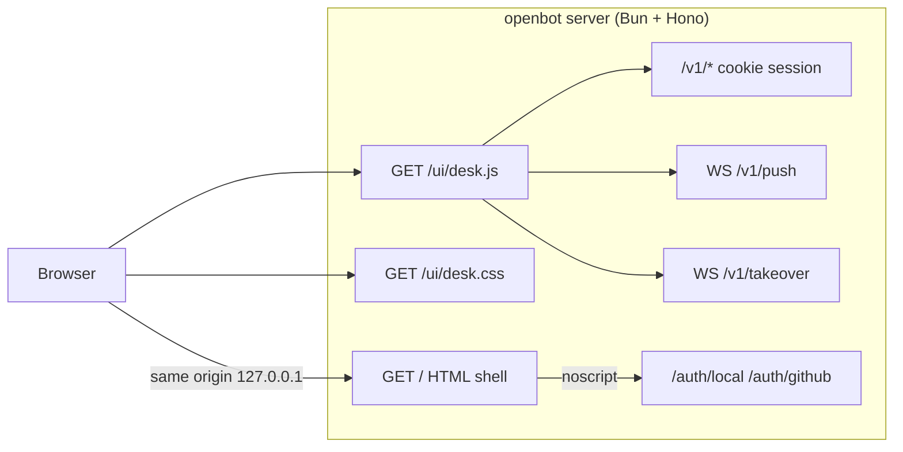
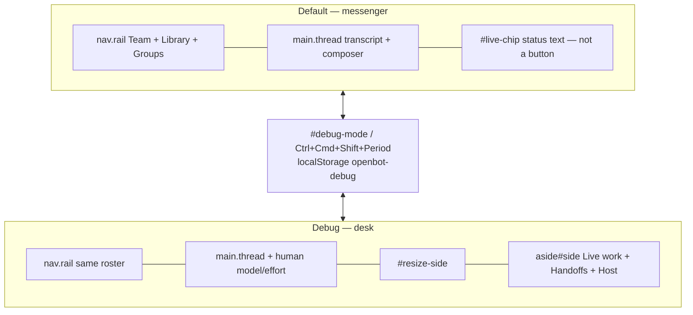
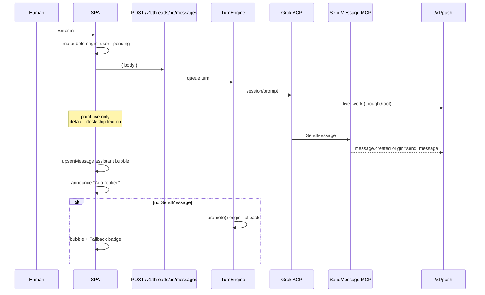
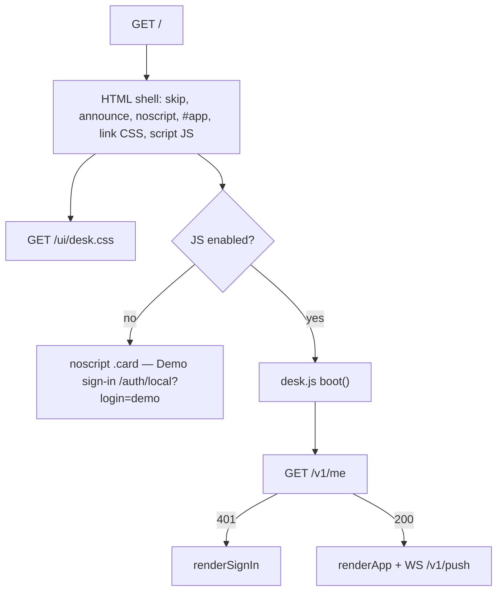

# OpenBot web UI/UX overhaul — accessible, progressive, beautiful chat

| Field | Value |
| --- | --- |
| **Title** | OpenBot web UI/UX overhaul: accessible, progressive, beautiful chat |
| **Author** | OpenBot maintainers (draft) |
| **Date** | 2026-08-31 |
| **Revised** | 2026-08-31 (review rounds + operator Open Questions) |
| **Status** | Draft |
| **Repo** | `/Users/jasonwilson/.grok/worktrees/git-openbot/2026-08-31-4d5d3bac` |
| **Audience** | Senior engineers changing `apps/server/src/spa.ts`, `apps/server/src/app.ts`, `apps/server/src/spa/desk.css`, `apps/server/src/spa/desk.js`, `tests/spa-markup.test.ts`, `tests/browser-cdp.test.ts`, `scripts/build-binary.ts` |
| **Depends on** | Product as shipped: named AI teammates on this machine; same-origin SPA from the Hono process that serves `/v1`; closing the tab does not stop teammates |

**Operator decisions (final — do not reopen):**

1. **Evolve `spa.ts`. Do not add React, Vite, or Electron.** Hono still serves the UI. CSS/JS may leave the giant `SPA_HTML` string; static files are still served by the server package. Progressive enhancement. No second toolchain.
2. **Feel: calm desktop messenger, plus a Debug mode.** Default chrome is iMessage/Slack density: clear bubbles, quiet chrome, teammate list, composer always ready. Distinct OpenBot identity — not a Grok Bot clone. Debug mode (operator) reveals the dense desk: live-work stream, tool payloads, takeover, activity internals. Default mode must not dump thinking/tools into the chat transcript. **SendMessage is the mouth; live-work stays secondary.**
3. **v1 surfaces: the core chat loop.** Sign-in, roster, human DM, composer, live-work (collapsed/quiet in default, full in debug), activity, empty/error states. Calendar, takeover, settings, groups, archive, Gateway **must not regress** a11y or usability, but may keep current layout until follow-up PRs — they still inherit tokens, focus, and type scale.
4. **A11y: WCAG 2.2 AA + keyboard + screen reader.** 44px targets, visible focus, live regions for new messages/turns, no keyboard trap in takeover. Chat is not required to work with JS disabled except the existing noscript demo sign-in. Not AAA-only. Not a full no-JS chat protocol.

Also: **dark default** plus a **light theme** from `prefers-color-scheme`, with a **Settings override** (`localStorage['openbot-theme']`). Persist Debug mode in `localStorage`.

**Locked after review (also final):**

- `#live-chip` is **status text only**, never a Debug toggle. Entry to Debug is `#debug-mode` and a UA-safe shortcut.
- Hide `#live-chip` when idle (`deskChipText()` empty / harness not `in_turn` / `starting`).
- Takeover in default chrome is `button.ghost#takeover` named **Desk browser**, not an overflow menu.
- Debug shortcut is **`Ctrl/Cmd+Shift+Period`**. Do not bind `Ctrl/Cmd+Shift+D` (browser “Bookmark all tabs”), `⌘⌥D` (macOS Dock), or `Ctrl+Alt+D` (Windows AltGr). Header `#debug-mode` is canonical.
- **`toggleDebug` must not call `renderApp()`.** Grid / composer-tools / side visibility are CSS via `html[data-debug]`. If a future change rebuilds, `saveDraft()` before wipe and `loadDraft()` after are mandatory.
- **CSP `script-src 'self'`:** follow-up **after** the 6 PRs. Do not hash boot/`onerror` in visual PRs.
- **Theme override is in this overhaul (PR 2):** Settings `#set-theme` + `localStorage['openbot-theme']` (`light` | `dark` | `system`). Default `system`.
- **Incremental `renderApp`:** follow-up after the visual cut. PR 5 fingerprint skip is the v1 slice — do not expand PR 5 into a renderer rewrite.

---

## Overview

The desk UI is one HTML document: `export const SPA_HTML` in [`apps/server/src/spa.ts`](apps/server/src/spa.ts) (3,019 lines, 146,526 bytes). Hono serves it at `GET /` (`app.get("/", (c) => c.html(SPA_HTML))` in [`apps/server/src/app.ts`](apps/server/src/app.ts) line 299). Inline CSS is dark-only (`--bg: #0e1116`). Inline JS owns every view (`state.view`: `human` | `a2a` | `group` | `activity` | `archive` | `calendar`), the composer, live-work, takeover, and Settings.

The product contract is already in the code: assistant ramble is live-work, not bubbles. The mouth is `origin='send_message'` (plus `fallback` / `pending_approval`). **Who filters what today:**

| Layer | `prompt` | `calendar` |
| --- | --- | --- |
| `VISIBLE_MESSAGES_SQL` (`app.ts` 126–127) | omitted | omitted |
| `visibleMessages()` (`spa.ts` 619–621) | omitted | **not omitted** |
| `upsertMessage()` (`spa.ts` 2114) | dropped | dropped |
| WS `message.created` (`spa.ts` 2194) | skipped | relies on `upsertMessage` |

SQL is the source of truth for GET. Tighten the client filter to match SQL in the PR that touches `paintMessages` (PR 4). Do not cite `visibleMessages` as the calendar guard until that lands.

This overhaul keeps that architecture and that contract. It splits CSS and JS out of the template string so the visual system can evolve, adds a **default messenger** vs **Debug** information architecture, ships **light + dark** tokens that meet WCAG 2.2 AA, and makes the chat loop look and feel like a calm named-teammate messenger. Calendar, takeover, Settings, groups, archive, and Gateway inherit the new tokens and focus rules but are not a v1 visual rewrite.

No React. No Vite. No Electron. Same origin, same process, same `bun test` / `bun build --compile` packaging.

---

## Background & Motivation

### Current state (cite the code)

| Piece | Where | Fact |
| --- | --- | --- |
| One document | `SPA_HTML` in `apps/server/src/spa.ts` | `<style>` + markup + `<script>` in one template literal |
| Serve | `apps/server/src/app.ts` line 299 | `app.get("/", (c) => c.html(SPA_HTML))` |
| Cache | `app.ts` 213–218 | Every response `Cache-Control: no-store` |
| Theme | `:root` in `spa.ts` 23–38 | `color-scheme: dark` only; meta `theme-color` `#0e1116` |
| Shell | `.shell` 92–99 | Four tracks: rail / thread / 6px resize / live-work (`--side-w`, default 320px from `openbot-side-w`). `.no-rail` → `52px`. `.no-side` still leaves `48px` |
| Views | `state.view` 309–311, `renderApp` 805–984 | `human`, `a2a`, `group`, `activity`, `archive`, `calendar` |
| Rebuild | `renderApp` 865 | `el.innerHTML = ''` then a full header + shell string. Focus is re-applied ad hoc (`#draft.focus()` in `selectBot` 650–651 / `selectGroup` 674–675 only) |
| Presence poll | `hostPoll` 983, `refreshCompute` 1905–1933 | Already **does not** call `renderApp`. Patches pill/dots then `paintMessages()`, which **does** replace `#msgs` innerHTML |
| Product mouth | `upsertMessage`, `paintMessages`, SQL | See table in Overview. Fallback badge. `pending_approval` Approve/Reject |
| Live-work | `#live`, `paintLive`, `buildLiveBlocks` | Thoughts, tool I/O, raw kinds. `#live` has `aria-live="off"` (correct). `liveSummary()` returns `'Writing'` for `agent_message_chunk` (2032); `paintLive` labels the block “Writing to thread” (2069) |
| Composer | `#draft`, `#send`, `onDraftKey` | Enter send, Shift+Enter newline. **Human** view shows `#pick-model` / `#pick-effort` via `inferenceFields()` (764) which always wraps `.composer-tools`. Same helper is reused for onboard `#on-model` / `#on-effort` (584) and Settings `#set-model` / `#set-effort` (2548). Group composer has **no** model row |
| Takeover | `startTakeover` 2854–3008 | `.overlay.tk` + `#takeover-frame` canvas. Esc on canvas and `openOverlay` closes. Canvas `keydown` `preventDefault`s every key except the Esc branch (2998–3004) and forwards the rest. `openOverlay` already focuses `focusables()[0]` = `#tk-url` |
| Overlays | `openOverlay` 2215–2240 | `role="dialog"` `aria-modal="true"`, Esc, Tab cycle, restore `document.activeElement` |
| A11y already shipped | markup + CSS | Skip `href="#draft"` (draft does not exist until JS paints — true today), `#announce` `role="status"` `aria-live="polite"`, noscript `/auth/local?login=demo`, 44px `min-height` on `button`, `:focus-visible`, `prefers-reduced-motion`, `prefers-contrast: more`. `.seg button` is 32px; `.composer-tools select` 36px; `.pill` 28px (non-interactive); `#collapse-rail` / `#collapse-side` 32px |
| Tests | `tests/spa-markup.test.ts` | Fetches `/` and ~90 `expect(...)` string-matches on the **document**. Brace-extracts inline `parseHttpUrl` from `SPA_HTML` |
| Tests | `tests/browser-cdp.test.ts` 137–147 | `import` `SPA_HTML` and expects client tokens (`catchUpLive`, `mousedown`, `permission_request`, `el.querySelector(sel)`, `SendToAgent`, `/v1/messages/`, …) |
| Tests | `tests/server-launch.test.ts` | `/` contains `OpenBot` and `html.length > 200` |
| `SPA_HTML` importers | repo grep | `app.ts`, `spa-markup.test.ts`, `browser-cdp.test.ts` only (phase-2 design doc mentions a non-existent `spa-roster.test.ts`) |
| Binary | `scripts/build-binary.ts` | `bun build apps/server/src/cli.ts --compile` — import graph is embedded. No disk static directory at runtime. In-repo precedent: `cli.ts` already `import … with { type: "text" }` for launchd/systemd templates |
| Text-import of `.css`/`.js` in `--compile` | unverified | PR 1 must run `bun run build:binary --current` once. Do not treat embed as proven until that succeeds |

### Pain points

1. **Operator desk is the only density.** Live-work, host line, Readable/Raw, model/effort, takeover, and federation chrome sit in the default path. A human who wants to talk to Ada sees a debugger.
2. **Thinking looks adjacent to speech.** The transcript is correct (no thought bubbles), but the always-on sidebar and `agent_message_chunk` labeled “Writing to thread” sit next to `#msgs`. Easy to confuse ramble with SendMessage.
3. **Dark-only.** `--muted: #b4c0d0` on `#0e1116` is fine in the dark; there is no light theme, and `color-scheme` does not follow the OS. Many paints are hardcoded hex (`.rail` `#12161c`, `button` `#243044`, `.live-body` `#d5dde8`, takeover `#11161e`, …) and will break a light theme if only `:root` tokens change.
4. **`SPA_HTML` is unmaintainable.** Visual work means editing CSS inside a JS template literal. `tests/spa-markup.test.ts` treats the whole file as a contract blob. One typo in a backtick breaks the server. Extracting files is **not** a copy of `spa.ts` source lines — those lines are escaped for the template (see PR 1).
5. **`renderApp` blows away the DOM** on every roster/view change. Roster rows have **no `id`**. Composer value is restored from `sessionStorage` (`openbot-draft-<threadId>`), but focus, `#announce`, and live-work `<details open>` state are fragile. `paintMessages()` on the 2.5s poll drops focus on Copy/Approve/Retry.
6. **Takeover Tab forwarding** is a keyboard trap relative to overlay chrome. Esc does close — that must stay, and F6 must move focus to `#done` **with** `preventDefault` so the UA does not steal it and Chromium does not see it.

### Why now

The loop, roster, Gateway, calendar, and takeover already work. The UI is the remaining product surface. Phase 1’s design even sketched a Vite React SPA (`docs/design/phase-1-always-on-teammate-loop.md`); that is **rejected** for this overhaul. We have a working same-origin document. Make it a messenger.

---

## Goals & Non-Goals

### Goals

1. Default UI reads as a **calm desktop messenger**: roster of named teammates, 1:1 transcript of SendMessage (and human) bubbles, composer always ready.
2. **Debug mode** (persisted `localStorage['openbot-debug']`) reveals the current dense desk: live-work stream, tool payloads, Readable/Raw, host/compute internals, resize handle.
3. **WCAG 2.2 AA** on v1 surfaces: contrast 4.5:1 body / 3:1 UI that conveys state, 44×44px targets (with listed exceptions), visible focus, keyboard, screen-reader names/roles, polite live regions for new **messages/turns** (not tool JSON).
4. **Light + dark** via `prefers-color-scheme` (dark when the OS has no preference) **and** a Settings override (`#set-theme`, `openbot-theme`).
5. **Progressive enhancement:** noscript demo sign-in keeps working; chat still requires JS. CSS loads without JS so the noscript card is themed.
6. **Split CSS/JS** from `SPA_HTML` without breaking `bun test` or `bun build --compile`.
7. Calendar / takeover / Settings / groups / archive / Gateway: **no a11y or usability regression**; inherit tokens; no v1 visual rewrite.

### Non-Goals

- React, Preact, Solid, Vite, webpack, esbuild-as-app-bundler, Tailwind, shadcn, Electron, Tauri, React Native, mobile/desktop native apps.
- A no-JS chat protocol (WebSocket-less form POST, SSE-only transcript, etc.).
- WCAG 2.2 AAA as a gate. `forced-colors` / Windows High Contrast is a **follow-up**, not a v1 gate (`prefers-contrast: more` stays).
- Postgres, a second origin (`app.` + `api.`), or changing `/v1` JSON.
- Changing `promote()`, or making assistant text the thread.
- Redesigning calendar, Settings, groups, archive, Gateway, or takeover visuals (follow-up PRs).
- A full Settings visual rewrite (the Appearance `<select>` in PR 2 is in scope; the rest of Settings stays inherit-only).
- i18n / `lang` other than `en`.
- Virtualized message lists, markdown spec expansion, or a new WYSIWYG composer.

---

## Key Decisions

| # | Decision | Choice | Rationale |
| --- | --- | --- | --- |
| D1 | Framework | **Stay on the Hono-served document.** Split files, not stacks. | Operator #1. Phase 1’s Vite React sketch is historical, not a plan. |
| D2 | Default IA | **Two-pane messenger:** Team rail + thread/composer. Live-work is a quiet status chip, not a column. | Operator #2. SendMessage is the mouth. |
| D3 | Debug IA | **`html[data-debug="1"]` restores the three-column desk** (rail / thread / live-work), Readable/Raw, host line, tool payloads. Human-composer model/effort (`#pick-model` / `#pick-effort`) show only in Debug. **Settings and onboard always show their inference fields.** | Operators still need the desk. Global `.composer-tools { display:none }` would hide `#set-model` / `#on-model` — forbidden. |
| D4 | Debug persistence | On iff `localStorage['openbot-debug'] === '1'`. **Missing key = off.** Write `'1'` when turning on; write `'0'` only when the user turns it off. Do not write on first visit. | Operator: persist Debug. First visit is messenger. Avoid a spurious write. |
| D5 | Debug toggle | Header `#debug-mode` (`aria-pressed`) is **canonical**. Keyboard **`Ctrl/Cmd+Shift+Period`** (`aria-keyshortcuts="Control+Shift+Period Meta+Shift+Period"`). Matcher: control or meta, plus Shift, no Alt, `key === '.'` or `code === 'Period'`. **Not** `Ctrl/Cmd+Shift+D` (Bookmark all tabs), **not** `⌘⌥D` (Dock), **not** `Ctrl+Alt+D` (AltGr). | Discoverable without fighting UA/OS. Period avoids AltGr character insert from `#draft`. |
| D6 | Theme | Dark tokens on `:root`. Light tokens when the resolved theme is light (see D21). `<meta name="color-scheme" content="dark light">` in **PR 2** (PR 1 keeps today’s dark-only metas). | Operator: dark default + OS light + Settings override in this overhaul. |
| D7 | Identity | **Ink + paper + teal send + amber focus.** Not iMessage blue, not Grok purple/black, not Slack aubergine rail. | Distinct OpenBot. Calm, not a clone. |
| D8 | Transcript | **Never** render `agent_thought_chunk` / tool I/O as `.msg`. Fallback stays a **badge**. GET truth is `VISIBLE_MESSAGES_SQL`. Tighten `visibleMessages` + WS `message.created` to also drop `calendar` in PR 4. | Preserve the mouth. Do not “preserve” a client filter that does not exist yet. |
| D9 | Asset split | `apps/server/src/spa/desk.css` + `desk.js` imported **`with { type: "text" }`**, served at `/ui/desk.css` and `/ui/desk.js`, HTML shell at `/`. Files are the **evaluated** `<style>` / `<script>` bodies, not `spa.ts` source lines. | Authorable CSS/JS; Bun compile still embeds; same origin. |
| D10 | Tests | Concatenate HTML+CSS+JS in `spaSource()`. Fetch `/` **and** `/ui/desk.*`. Extract `parseHttpUrl` from **`SPA_JS`**. Rewrite **`tests/browser-cdp.test.ts`** to `spaSource()` / `SPA_JS`. | spa-markup **and** browser-cdp import `SPA_HTML` today. |
| D11 | Packaging | **No runtime `readFile` of CSS/JS.** Strings are module-load constants. PR 1 acceptance includes `bun run build:binary --current`. | `scripts/build-binary.ts` has no asset directory. Embed of `.css`/`.js` is unverified until that compile. |
| D12 | Progressive JS | Chat, WS, overlays require JS. Noscript = demo sign-in only. Tiny **critical CSS** stays in the HTML shell. Script `onerror` paints a “Desk JS failed to load” card (otherwise `boot().catch` never runs). | Operator #4. Script 404 is silent today after split. |
| D13 | Focus | Snapshot a **descriptor before** `el.innerHTML = ''`: `{ area, botId?, groupId?, msgId?, action?, id? }`. Restore via `#draft`, `#debug-mode`, `[data-id]`, `[data-group]`, or `#msgs [data-msg-id] [data-action]`. Do not steal rail focus. `paintMessages` skips when the list fingerprint is unchanged; otherwise restore msgs-action focus. Approve/Reject/Copy/Retry is **PR 5**, which **depends on PR 4** (`data-msg-id`) and uses `data-action` not `textContent`. Debug toggle does not snapshot — it does not rebuild. | Roster buttons have no `id`. `hostPoll` already skips `renderApp` but still wipes `#msgs`. Copy’s label becomes “Copied”. |
| D14 | Live regions | `#announce` polite for send/reply/error. Waiting row polite. `#live` stays `aria-live="off"`. **`#live-chip` is not a live region.** Permission modal is the assertive path (dialog). | Do not SR-spam tool JSON or “Writing”. |
| D15 | Takeover | **No visual rewrite.** On canvas `keydown`: **`preventDefault` + do not `sendKey`** for **Esc** and **F6**. Esc → `endTakeover()`. F6 → focus `#done`. Tab in `.tk-chrome` keeps the overlay cycle. Tab on canvas may still go to Chromium. Initial focus stays `#tk-url` (already `focusables()[0]`). | Operator: no keyboard trap. F6 without `preventDefault` goes to the URL bar. Esc without `preventDefault` reaches the remote page. |
| D16 | v1 surface cut | Visual rewrite: sign-in, onboard, roster, human DM, composer, quiet live-work, activity, empty/error. Inherit-only: calendar, groups, archive, Gateway, Settings, takeover. | Operator #3. |
| D17 | `renderApp` | Keep string-render for v1 view changes. **Debug toggle is not a `renderApp` caller** (D20). Presence ticks already avoid `renderApp`; they still call `paintMessages`. | Do not relitigate a VDOM. Do not wipe `#draft` to flip a CSS class. |
| D18 | Live chip | **Not a control.** Status text in the app header next to `h1`. Hidden when idle. Copy table (`deskChipText`) **never** uses “Writing”, “Writing to thread”, or thought text. Click does nothing (or is not a button). Debug entry = `#debug-mode` + shortcut only. | Operator #2 + WCAG 3.2.2. A chip that morphs the layout into tool JSON is a change of context. |
| D19 | Header chrome | One title: `h1` in `header.app-header` (teammate / view name). **No** duplicate thread heading. Keep Orgs / Help / Settings as header buttons (no overflow widget). Takeover is `button.ghost#takeover` named **Desk browser**. `#debug-mode` is one extra `aria-pressed` control. Learn this / Archive stay when the current view allows them. | ASCII that invents a second Ada title and an unspecified overflow is not implementable. |
| D20 | Debug without rebuild | `toggleDebug(on)` sets `state.debug`, `localStorage`, `document.documentElement.dataset.debug`, `#side.inert`, `#debug-mode[aria-pressed]`. **Does not call `renderApp()`.** First `renderApp` always emits `#side`, `#resize-side`, `#live-toggle`, and (human view) `.thread .composer-tools`; CSS + `inert` hide them. Focus and `#draft` value stay put. **Invariant:** any path that does `el.innerHTML = ''` (including a future Debug rebuild) must `saveDraft()` before and `loadDraft()` after. | `renderApp` does not call `loadDraft()` (`spa.ts` 865 vs 649/673). Toggling Debug from the composer would otherwise destroy the draft. |
| D21 | Theme override | `localStorage['openbot-theme']` is `light`, `dark`, or `system`. **Missing = `system`.** Settings `<select id="set-theme">`. `html[data-theme="light"]` / `html[data-theme="dark"]` force tokens; **omit `data-theme` when system** so `@media (prefers-color-scheme: light)` applies. `applyTheme` does **not** `renderApp()`. Lands in **PR 2** (not a 2b) so light theme is usable the same merge. | Operator: add in this overhaul. Dark OS + paper chat needs a control, not a second wait. |
| D22 | Incremental paint | PR 5 fingerprint skip on `paintMessages` is the v1 slice. A dedicated incremental-`renderApp` PR is a **follow-up after the visual cut**, not pulled into PR 5. | Operator: do not grow PR 5 into a renderer rewrite. |
| D23 | CSP | `script-src 'self'` is a **follow-up after the 6 PRs**. Visual PRs do not add hashes for the boot snippet or `onerror`. | Operator: do not couple CSP to the overhaul. |

---

## Proposed Design

### System context



The binary and `bun run openbot` already import `spa.ts` via `app.ts` ← `cli.ts`. After the split, `spa.ts` still exports `SPA_HTML` (shell), `SPA_CSS`, `SPA_JS`. Compile embeds all three. There is still **no** `dist/` static folder on disk in production.

### Information architecture



#### Default (messenger)

- **Rail (`nav.rail`, `aria-label="Team"`):** desk bots (`button.bot[data-id]`), `#newbot`, Library (`#open-activity`, `#open-archive`, `#open-calendar`), Gateway pin (`#open-gateway`), Groups (`[data-group]`, `#new-group`). Same `state.view` routing. Collapse (`#collapse-rail`, `openbot-rail`) stays and **must** still collapse to 52px (see grid matrices).
- **Thread:** `ol#msgs` bubbles + `#composer-wrap` with `#draft` / `#send` always present on `human` and `group`. A2A stays read-only (`#draft-help`).
- **Live-work:** **not a column.** `#side` and `#resize-side` are `display: none` and `#side` has `inert`. `#live-toggle` (mobile “Live work”) is **hidden** in default — it must not remain as a dead control.
- **Quiet status (`#live-chip`):** text next to `h1` in `header.app-header`. **Not a `<button>`.** Not `aria-live`. Uses `deskChipText()` (below), **not** raw `liveSummary()`. Hidden when idle. Presence dots on roster rows stay (`.st.working|queued|attention|idle`).
- **Composer tools:** hide **only** `.thread .composer-tools` (the `#pick-model` / `#pick-effort` row) in default. **Do not** hide `.composer-tools` globally — onboard and Settings reuse that class. Group view never gains model selects (today it has none; Debug must not add them).
- **Header:** `h1` (current view title — teammate, Group, Activity, Archive, Calendar). `#live-chip` when visible. Connection `.pill`, org pill, `#debug-mode`, `button.ghost#takeover` (“Desk browser”), Orgs, Help, Settings. Learn this / Archive stay on human DM as today. **No overflow menu.**
- **Activity:** still a v1 surface (`state.view === 'activity'`, `#activity-board`). Cards keep presence + last snippet; they do not grow a live-work dump.

#### Debug (desk)

- `toggleDebug(true)` is the only writer that turns Debug on (header button or shortcut).
- Restore current `.shell` four-track grid, `#side` (`aria-label="Live work"`), `#resize-side`, Readable/Raw (`#live-human` / `#live-raw`, `openbot-live-raw`), `#live-summary`, `#handoffs`, `#host`. Remove `inert` from `#side`.
- Human composer shows `#pick-model` / `#pick-effort`. Groups / a2a / activity / calendar / archive: no new model row.
- Header: `#debug-mode` pressed; Takeover still “Desk browser” (ghost is fine in both modes).
- `openbot-side` / `openbot-side-w` apply only while Debug is on. Toggling Debug off does not erase them.
- Mobile: `#live-toggle` may show and open `aside.side.open` **only** when Debug is on.

#### `deskChipText()` (default chip copy — lands in the same PR as the chip)

| Input | Default `#live-chip` | Debug `#live-summary` (unchanged `liveSummary()`) |
| --- | --- | --- |
| No live blocks and harness not `in_turn` / `starting` | **hidden** (idle) | `Quiet` |
| thought | `Working on the desk…` | `Thinking` |
| write (`agent_message_chunk`) | `Working on the desk…` | `Writing` / block title “Writing to thread” |
| tool running / completed | `Working on the desk…` | `Using {title}` / `Finished {title}` |
| `Needs permission` | `Needs permission` | `Needs permission` |
| `Turn finished` then idle | **hidden** | `Turn finished` then `Quiet` |

**Never** put “Writing”, “Writing to thread”, or thought body text on `#live-chip`. Chip is not a live region (`aria-live` unset / `off`).

#### `toggleDebug(on)` (single writer — **no `renderApp`**)

Grid, `#side` / `#resize-side` / `#live-toggle` visibility, and `.thread .composer-tools` are CSS on `html[data-debug="1"]`. Rebuilding would wipe `#draft`: `renderApp` does `el.innerHTML = ''` (`spa.ts` 865) and **never** calls `loadDraft()` (only `selectBot` / `selectGroup` do, 649 / 673).

```js
function toggleDebug(on) {
  state.debug = Boolean(on);
  try {
    if (state.debug) localStorage.setItem('openbot-debug', '1');
    else localStorage.setItem('openbot-debug', '0');
  } catch {}
  document.documentElement.dataset.debug = state.debug ? '1' : '0';
  const side = document.getElementById('side');
  if (side) {
    if (state.debug) side.removeAttribute('inert');
    else side.setAttribute('inert', '');
  }
  const btn = document.getElementById('debug-mode');
  if (btn) btn.setAttribute('aria-pressed', state.debug ? 'true' : 'false');
  // Do not renderApp(). Do not saveDraft/loadDraft here — the composer node stays.
}
```

**Invariant:** if a future change calls `renderApp()` from this path, it **must** `saveDraft()` before the wipe and `loadDraft()` after. Prefer not to. `bots.updated` already has this footgun (`renderApp()` without loadDraft); out of scope unless that handler is touched — if it is, apply the same invariant.

First `renderApp` **always** emits `#side`, `#resize-side`, `#live-toggle`, and (human view) `.thread .composer-tools` in the DOM. CSS + `inert` hide them when `data-debug` is unset. Do not omit those nodes when `!state.debug`.

- Boot: `state.debug = localStorage.getItem('openbot-debug') === '1'`.
- Inline boot snippet **before** the stylesheet. PR 2 adds the theme lines; **PR 3 extends the same `<script>`** with debug (one snippet, not two):

```html
<script>
try {
  var th = localStorage.getItem('openbot-theme');
  if (th === 'light' || th === 'dark') document.documentElement.dataset.theme = th;
  if (localStorage.getItem('openbot-debug') === '1') document.documentElement.dataset.debug = '1';
} catch (e) {}
</script>
```

A later `script-src 'self'` CSP (follow-up **after** the 6 PRs, D23) must hash or relocate that snippet. Visual PRs do not add CSP hashes.

`#debug-mode.onclick = () => toggleDebug(!state.debug)`. Window `keydown`:

```js
if ((e.ctrlKey || e.metaKey) && e.shiftKey && !e.altKey && (e.key === '.' || e.code === 'Period')) {
  e.preventDefault();
  toggleDebug(!state.debug);
}
```

Do not special-case `#draft` — the shortcut is allowed there. `#debug-mode` is the reliable path if the UA eats the key.

#### Keyboard shortcut

| Keys | Action | When |
| --- | --- | --- |
| `Enter` | Send | `#draft` focused, not Shift (existing `onDraftKey`) |
| `Shift+Enter` | Newline | `#draft` |
| `Ctrl/Cmd+Shift+Period` | Toggle Debug | Window (including `#draft`). Canonical: `#debug-mode` |
| `Esc` | Close overlay / end takeover | Existing `openOverlay` + canvas (`preventDefault`, no `sendKey`) |
| First `Tab` | Skip link | PR 1: still `href="#draft"` (today). PR 5: retarget `#app` → `#draft` when painted |
| `F6` | Takeover: `preventDefault`, do not `sendKey`, focus `#done` | Canvas focused |

Update `openHelp()` in **PR 6** (after F6 exists). PR 3 Help may mention Debug + shortcut only.

### Layout (target)

Default desktop (≥860px). **One** title (`h1` = Ada). Chip sits in the header, not a second heading.

```
┌──────────────────────────────────────────────────────────────────┐
│ Ada  Working on the desk…    Idle · acme                         │
│ [Debug] [Desk browser] Orgs Help Settings                        │
├──────────────┬───────────────────────────────────────────────────┤
│ TEAM         │                                                   │
│ ● Ada        │  ┌─────────────┐                                  │
│   Dormant    │  │ You    3:01 │                                  │
│ ○ Bob        │  └─────────────┘                                  │
│   Working    │         ┌──────────────────┐                      │
│ LIBRARY      │         │ Ada         3:02 │                      │
│ Activity     │         └──────────────────┘                      │
│ Archive      │                                                   │
│ Calendar     │  ┌────────────────────────────────────┬────────┐  │
│ Gateway      │  │ Message Ada…                       │ Send   │  │
│ GROUPS       │  └────────────────────────────────────┴────────┘  │
│ # design     │  Enter send · Shift+Enter newline                 │
└──────────────┴───────────────────────────────────────────────────┘
```

When idle, omit `Working on the desk…`. Debug adds the live-work column (current `.shell`).

Mobile (`max-width: 860px`): keep the existing stacked rail + thread. Hide `#live-toggle` unless Debug. `#live-chip` remains in the header when working.

### Grid matrices (required CSS)

Do **not** use a single `html:not([data-debug="1"]) .shell { grid-template-columns: minmax(12rem, 16rem) minmax(0, 1fr); }` — that beats `.shell.no-rail` and freezes the rail at 12–16rem.

Desktop (≥860px):

| Mode | Rail | Side | `grid-template-columns` |
| --- | --- | --- | --- |
| Default | expanded | n/a (hidden) | `minmax(12rem, 16rem) minmax(0, 1fr)` |
| Default | `.no-rail` | n/a | `52px minmax(0, 1fr)` |
| Debug | expanded | expanded | `minmax(12rem, 16rem) minmax(0, 1fr) 6px var(--side-w)` |
| Debug | `.no-rail` | expanded | `52px minmax(0, 1fr) 6px var(--side-w)` |
| Debug | expanded | `.no-side` | `minmax(12rem, 16rem) minmax(0, 1fr) 0 48px` |
| Debug | `.no-rail` | `.no-side` | `52px minmax(0, 1fr) 0 48px` |

```css
/* Default: two tracks. Each selector must beat .shell.no-rail (0,2,0). */
html:not([data-debug="1"]) .shell {
  grid-template-columns: minmax(12rem, 16rem) minmax(0, 1fr);
}
html:not([data-debug="1"]) .shell.no-rail {
  grid-template-columns: 52px minmax(0, 1fr);
}
html:not([data-debug="1"]) #side,
html:not([data-debug="1"]) #resize-side,
html:not([data-debug="1"]) #live-toggle {
  display: none;
}
/* Human composer only — Settings/onboard keep .composer-tools */
html:not([data-debug="1"]) .thread .composer-tools {
  display: none;
}

@media (max-width: 860px) {
  html:not([data-debug="1"]) .shell,
  html:not([data-debug="1"]) .shell.no-rail {
    grid-template-columns: 1fr;
    grid-template-rows: auto 1fr auto;
  }
}
```

Debug keeps today’s `.shell` / `.no-rail` / `.no-side` rules (they already encode the four Debug rows). JS sets `inert` on `#side` when `!state.debug`.

Markup test: default CSS must not match `#set-model` / `#on-model` parents; assert the hide selector contains `.thread .composer-tools` (or `#pick-model`) and **not** a bare `.composer-tools`.

### Visual system

OpenBot is **named people at a shared desk**, not a coding IDE and not iMessage. Paper/ink, one teal accent for “send / current”, amber only for focus and attention.

#### Type

Use the system UI stack already in `body { font: … ui-sans-serif, system-ui, sans-serif }`. Mono for code, kbd, live-work, org ids: `ui-monospace`.

| Token | Size | Weight | Use |
| --- | --- | --- | --- |
| `--font-xs` | 0.75rem / 1.3 | 500 | `.who`, `.hint`, timestamps, `.tool-st` |
| `--font-sm` | 0.8125rem / 1.4 | 400 | Rail `.muted`, pills, badges |
| `--font-md` | 0.9375rem / 1.5 | 400 | Body, bubbles, composer (15px — messenger density vs current 1rem) |
| `--font-lg` | 1.05rem / 1.3 | 650 | `header.app-header h1`, modal `h2` |
| `--font-label` | 0.72rem / 1.2 | 600 | Rail `h2` uppercase, letter-spacing 0.06em (keep) |

Do not ship a webfont. Binary size and offline/loopback matter.

#### Spacing, radius, targets

| Token | Value | Use |
| --- | --- | --- |
| `--space-1` … `--space-6` | 4 / 8 / 12 / 16 / 24 / 32 px | Gaps, padding |
| `--radius-sm` | 8px | Buttons, inputs (already) |
| `--radius-md` | 12px | Cards, archive rows, activity cards |
| `--radius-lg` | 16px | `.msg` bubbles (today 14px) |
| `--radius-pill` | 999px | `.pill` |
| `--header-h` | 56px | Keep |
| `--target` | 44px | Default `min-height` / `min-width` on buttons, `.bot` rows, `.cal-chip`, composer Send, `#collapse-rail`, `#collapse-side` |
| `--focus` | 2px solid `var(--focus-ring)` offset 2px | `:focus-visible` only (not `:focus`) |

`.bot` rows must be ≥44px tall even when the rail is collapsed (`no-rail` icon-only).

**44px exceptions (document, do not silently leave 32px on actions):**

| Control | Size | Why it is allowed |
| --- | --- | --- |
| `.pill` | 28px | Non-interactive status; 2.5.8 does not apply |
| `.seg button` (`#live-human` / `#live-raw`, calendar Agenda/Month) | **44px** after PR 2/3 (today 32px — raise) | Interactive; house standard |
| `.composer-tools select` | **44px** when shown (today 36px — raise) | Interactive |
| `#collapse-rail` / `#collapse-side` | **44px** (today 32px — raise, extra padding OK) | Interactive |

#### Color tokens

Dark is default (`:root`). Light overrides when the **resolved** theme is light: `@media (prefers-color-scheme: light)` on `html:not([data-theme="dark"])`, **and** `html[data-theme="light"]` (Settings override). See Theme override (D21).

Contrast rules:

- **4.5:1** — body, muted-as-text, `.err`, `.badge` (`.badge` uses `--bad` as **text**, `spa.ts` 231).
- **3:1** — `--line-ui` vs the **component’s own fill** (WCAG 1.4.11). Consumers: input/textarea/select outlines, `.msg.assistant` bubble edge, focus-adjacent chrome. **Not** default `button` chrome (see `--btn-bg` below).
- **`--line`** is **decorative** (section dividers **and** default `button { border: 1px solid var(--line) }`, matching `spa.ts` 60–62). It is **not** claimed at 3:1. Do not use `--line` as the only cue for state. `.primary` stays `border: 0`.

**Dark (`:root`)** — pairs checked against `--bg` `#12151c` / `--panel` `#1a1f28` unless noted.

| Token | Hex | Role | Contrast notes |
| --- | --- | --- | --- |
| `--bg` | `#12151c` | App canvas | Lifted from `#0e1116` so bubbles separate |
| `--panel` | `#1a1f28` | Header, composer bar | |
| `--rail` | `#161b24` | `nav.rail`, `aside.side` | Replaces `#12161c` |
| `--surface` | `#222833` | Bot bubble, cards | |
| `--text` | `#e8eef6` | Body | ≥ 12:1 on `--bg` |
| `--muted` | `#a7b3c2` | Meta, timestamps | ≥ 4.5:1 on `--bg` and `--panel` |
| `--line` | `#3c4758` | Decorative hairline | **~1.8:1** on `--panel` — decorative only |
| `--line-ui` | `#6b7787` | State-bearing borders (inputs, `.msg.assistant`) | **≥ 3:1** on `--panel`, `--surface`, `--input-bg`. **Not** a button border — `#6b7787` on `--btn-bg` `#243044` is **2.92:1** |
| `--acc` | `#3db8a8` | Send, active roster, links | Teal — not `#007AFF`, not purple |
| `--acc-ink` | `#06201c` | Text on `--acc` | ≥ 4.5:1. Also `.bot.active .muted` — **no** `#243044` |
| `--user` | `#2a3f5c` | Human bubble | Slate, not iMessage blue fill |
| `--bot` | `--surface` | Teammate bubble | Border `--line-ui` |
| `--bad` | `#e0a54a` | Fallback badge text, working | ≥ 4.5:1 on `--bg` / `--surface` |
| `--err` | `#f0979c` | `.err` text / attention | ≥ 4.5:1 on `--panel` |
| `--ok` | `#7dcca0` | Idle-live pill | Keep |
| `--focus-ring` | `#e8b84a` | Focus | ≥ 3:1 vs `--bg` |
| `--btn-bg` | `#243044` | Default `button` fill | Border stays `var(--line)` (decorative). Do not map buttons to `--line-ui` until that pair is ≥ 3:1 |
| `--input-bg` | `#0b0e13` | `input` / `textarea` / `select` | |
| `--code-bg` | `#161b24` | `code`, `.md-pre`, `kbd` | Replaces `#0b0e13` on bubbles |
| `--code-fg` | `#d5dde8` | `.live-body`, raw live | ≥ 4.5:1 on `--code-bg` |
| `--avatar-bg` | `#31415a` | `.avatar` | |
| `--overlay-scrim` | `#000a` | `.overlay` | |
| `--tk-bg` | `#05070a` | `.overlay.tk` | Takeover **stays dark** in light theme (screencast) |
| `--tk-stage` | `#11161e` | `.tk-stage`, canvas fill | Same — do not flip with OS |

**Light (`prefers-color-scheme: light` on `html:not([data-theme="dark"])`, and `html[data-theme="light"]`)** — takeover tokens **do not** flip. Duplicate this block in both selectors.

| Token | Hex | Role | Contrast notes |
| --- | --- | --- | --- |
| `--bg` | `#f3efe6` | Warm paper | |
| `--panel` | `#fffaf2` | Header / composer | |
| `--rail` | `#fffaf2` | Rail / side | |
| `--surface` | `#ffffff` | Bot bubble | |
| `--text` | `#1c232d` | Body | ≥ 10:1 on paper |
| `--muted` | `#4e5968` | Meta | ≥ 4.5:1 on paper |
| `--line` | `#c5c0b4` | Decorative | **~1.8:1** — decorative only |
| `--line-ui` | `#8a8376` | State-bearing borders (inputs, `.msg.assistant`) | **≥ 3:1** on `--panel` / `--surface` / `--input-bg`. **Not** on `--btn-bg` `#e8e2d6` (**2.91:1**) |
| `--acc` | `#0f7a6e` | Send / links / active roster | |
| `--acc-ink` | `#f4fffc` | On teal; `.bot.active .muted` | ≥ 4.5:1 on `--acc` |
| `--user` | `#d5e2f4` | Human bubble | `--text` on it ≥ 4.5:1 |
| `--bot` | `#ffffff` | Border `--line-ui` | |
| `--bad` | `#8a5200` | Warning **text** on paper | **≥ 4.5:1** on `--bg` (do not use `#9a6700` — 4.24:1) |
| `--err` | `#b42318` | Error text | ≥ 4.5:1 |
| `--ok` | `#0f7a4a` | Live | ≥ 4.5:1 |
| `--focus-ring` | `#8a5a00` | Focus on paper | ≥ 3:1 |
| `--btn-bg` | `#e8e2d6` | Default button | Border `var(--line)`, not `--line-ui` | |
| `--input-bg` | `#fffaf2` | Fields | |
| `--code-bg` | `#eee8dc` | Code / kbd | |
| `--code-fg` | `#1c232d` | Live-work text on `--code-bg` | ≥ 4.5:1 |
| `--avatar-bg` | `#c5d4e8` | Avatar | |
| `--overlay-scrim` | `#0006` | Modal scrim | |
| `--tk-bg` / `--tk-stage` | (keep dark values) | Takeover | Screencast stays dark |

`prefers-contrast: more` lifts `--line-ui`, `--muted`, `--text` in **both** themes (today it only bumps `--line` / `--muted` / `--text` on `:root`).

Map today’s hardcoded paints to tokens in PR 2 (acceptance: grep `desk.css` for `#` hex **outside** `:root`, `prefers-color-scheme: light`, and `prefers-contrast: more`):

| Today | Token |
| --- | --- |
| `#0e1116` body | `--bg` |
| `#171b22` `--panel` | `--panel` |
| `#12161c` `.rail` / `aside.side` | `--rail` |
| `#0b0e13` input, kbd, live-block, `.body code` | `--input-bg` / `--code-bg` |
| `#243044` `button` fill | `--btn-bg`; **border stays `var(--line)`** |
| `.bot.active .muted` `#243044` | `--acc-ink` |
| `#31415a` `.avatar` | `--avatar-bg` |
| `#d5dde8` `.live-body` | `--code-fg` |
| `#05070a` `.overlay.tk` | `--tk-bg` |
| `#11161e` `.tk-stage`, canvas fill | `--tk-stage` |
| `#000a` `.overlay` | `--overlay-scrim` |

`.bot.active .muted { color: var(--acc-ink); }` — `#243044` on light `--acc` `#0f7a6e` is ~2.55:1 and is forbidden.

`html, body` background uses `--bg`. Theme-color metas in **PR 2**:

```html
<meta name="color-scheme" content="dark light" />
<meta name="theme-color" content="#12151c" media="(prefers-color-scheme: dark)" />
<meta name="theme-color" content="#f3efe6" media="(prefers-color-scheme: light)" />
```

`applyTheme` also sets `document.querySelector('meta[name="theme-color"]:not([media])')` or updates the matching meta so an override is visible in the browser chrome (media metas alone ignore `data-theme`).

#### Theme override (PR 2 — D21)

**Pick:** land in **PR 2**, not a 2b, so the 6-PR plan stays and paper-on-dark-OS works the same merge as the tokens.

Resolved theme:

| `openbot-theme` | `html` attribute | Tokens |
| --- | --- | --- |
| missing or `system` | **no** `data-theme` | `:root` dark; `@media (prefers-color-scheme: light)` light |
| `dark` | `data-theme="dark"` | dark (`:root`), even if the OS is light |
| `light` | `data-theme="light"` | light, even if the OS is dark |

CSS (light block listed once in the media query **and** on `html[data-theme="light"]` — duplicate the token assignments; no preprocessor):

```css
:root {
  color-scheme: dark;
  /* dark tokens */
}
@media (prefers-color-scheme: light) {
  html:not([data-theme="dark"]) {
    color-scheme: light;
    /* light tokens */
  }
}
html[data-theme="light"] {
  color-scheme: light;
  /* same light tokens */
}
```

`html[data-theme="dark"]` needs no extra block: `:root` is already dark, and the media query is gated with `:not([data-theme="dark"])`.

Boot snippet **before** the stylesheet (PR 2). PR 3 **extends this same `<script>`** with the debug line — do not add a second inline script.

```html
<script>
try {
  var th = localStorage.getItem('openbot-theme');
  if (th === 'light' || th === 'dark') document.documentElement.dataset.theme = th;
} catch (e) {}
</script>
```

```js
function applyTheme(value) {
  const v = (value === 'light' || value === 'dark') ? value : 'system';
  try { localStorage.setItem('openbot-theme', v); } catch {}
  if (v === 'system') delete document.documentElement.dataset.theme;
  else document.documentElement.dataset.theme = v;
  const dark = v === 'dark' || (v === 'system' && !window.matchMedia('(prefers-color-scheme: light)').matches);
  const meta = document.querySelector('meta[name="theme-color"][media]') || document.querySelector('meta[name="theme-color"]');
  if (meta && !meta.media) meta.content = dark ? '#12151c' : '#f3efe6';
  // Do not renderApp().
}
```

Missing key: do **not** write `system` on first visit. Read: anything other than `light`/`dark` is system.

Settings (`openSettings`, inherit-only chrome except this control):

```html
<label for="set-theme">Appearance</label>
<select id="set-theme" aria-describedby="set-theme-help">
  <option value="system">Match system</option>
  <option value="dark">Dark</option>
  <option value="light">Light</option>
</select>
<p id="set-theme-help" class="muted">Match system follows this device. Dark is ink; Light is paper.</p>
```

On open, `#set-theme.value` = stored value or `system`. `onchange` → `applyTheme(el.value)`. Takeover stays dark in both themes (`--tk-*` do not flip).

Tests (PR 2): spa-markup contains `id="set-theme"`, `openbot-theme`, `data-theme`, `prefers-color-scheme: light`, `html:not([data-theme="dark"])`.

#### Message bubbles

Keep classes: `.msg.user | .assistant | .system`, modifiers `.fallback .pending .failed`.

- Human: `align-self: flex-end`, `--user`, 16px radius, slightly tighter on the trailing corner (optional `border-bottom-right-radius: 4px`).
- Teammate SendMessage: `align-self: flex-start`, `--bot` + `--line-ui` hairline, leading corner tighter.
- System / A2A `origin='agent'` / federation: centered, no fill, `--muted` (already `.msg.system`).
- Fallback: keep `.badge` “Fallback — teammate did not call SendMessage”. Do **not** restyle fallback as a thought. Color `--bad`.
- `pending_approval`: badge + Approve/Reject (44px). `#announce` “Pending your approval” on insert.
- Markdown: keep `renderBody` / `.md-pre`. Code uses `var(--code-bg)` / `var(--code-fg)`.
- `paintMessages` sets `data-msg-id="{m.id}"` on each `li.msg` and `data-action="copy|approve|reject|retry"` on those buttons (not `textContent` — Copy becomes “Copied”).

#### Roster rows

Keep `button.bot` + `.avatar` (32px) + `.bot-meta`. Active: `--acc` background + `--acc-ink`. Presence: keep the dot **and** `.presence` text (Working / Queued / Needs you / Dormant from `botPresence` in `app.ts` 1960–1989).

When `.no-rail`, set `aria-label="{name}, {presence}"` on each `.bot` (visible name is clipped). Expanded rail: no extra `aria-label` (visible text is the name).

Stable restore hooks: `id="bot-{id}"` on desk bots, keep `data-id` / `data-group`. Gateway stays `#open-gateway`.

Gateway `.bot.folder` stays under Library, never in `state.bots[]`.

#### Composer

- Always visible on human/group. Sticky bottom of `.thread`.
- `#draft` `min-height: 48px`, `max-height: 40dvh` (keep). `--input-bg`, `--line-ui` border, `--radius-sm`.
- `#send` primary teal, 44px, disabled until trim nonempty (existing `syncSend`).
- Default: no model row (`.thread .composer-tools` hidden). Debug **human** view: show `#pick-model` / `#pick-effort`. Never inject that row into group/a2a.
- Hint `.hint`: keyboard only in default.

### State additions

```js
const state = {
  // existing…
  debug: false, // set in boot from localStorage === '1'
  // liveRaw, railCollapsed, sideCollapsed, sideW unchanged
};
```

`renderApp` emits Debug chrome every time (do not omit `#side` / `.thread .composer-tools` when `!state.debug`). The inline boot snippet plus `toggleDebug` set `dataset.debug`, `#debug-mode[aria-pressed]`, and `#side[inert]`. **`toggleDebug` does not call `renderApp`.**

### Chat data flow (unchanged mouth)



**Forbidden:** mapping `agent_thought_chunk` or `agent_message_chunk` onto `#msgs`. `buildLiveBlocks` already treats `agent_message_chunk` as type `write` in the **sidebar**. Default chip uses `deskChipText()` → “Working on the desk…” or hidden — never “Writing”.

### Core surfaces (v1 visual)

#### Sign-in

`renderSignIn()` + noscript card. Same copy (“Closing this tab does not stop them…”). `.card` uses `--panel` / type scale / 44px `.primary` links: `/auth/local?login=demo` (when `GET /v1/auth-options` `{ local: true }`) and `/auth/github`. Light theme applies to the card because CSS loads without JS.

#### Onboard

`renderOnboard()` — still `#name` `#desc` `#on-model` `#on-effort` `#go` `#err role="alert"`. Inference fields **remain visible** regardless of Debug (first-run operator). Focus `#name` (already).

#### Roster + human DM + composer

As IA above. Empty `#msgs`: keep the three strings (a2a / group / human hello). Error: keep `boot().catch` reload card; style with `--err`. Failed send: `.msg.failed` + Retry (already).

#### Live-work

| Mode | UI | SR |
| --- | --- | --- |
| Default | `#live-chip` = `deskChipText()`; hidden when idle; no tool I/O; **not a button** | Not a live region. `#announce` only for SendMessage / send failure / permission |
| Debug | Current `paintLive` `<details class="live-block">`, Readable/Raw | `#live aria-live="off"` **stays** |

#### Activity

`openActivity` / `paintActivity` / `.act-card`. Inherit tokens, 44px cards, `aria-current` on `#open-activity`. Click still `selectBot(b.id)`.

#### Empty / error

- Empty archive / activity / calendar / msgs: `.empty` muted, not a blank column.
- WS down: existing `.pill.down` “Reconnecting”.
- Harness crashed: waiting row + Settings hint (already).
- Corrupt live-work: existing boot catch copy.
- **Desk JS 404:** shell `script onerror` paints a `.card` “Desk JS failed to load” + Reload. `boot().catch` cannot run if the file never parsed.

### Inherit-only surfaces (tokens, focus, type — not a rewrite)

- **Calendar:** `#calendar-board`, `#cal-agenda` / `#cal-month`, `#learn-this`. Contrast on `.cal-cell` / `.cal-chip` (today `min-height: 44px` on chips — keep). Raise `.seg button` to 44px with tokens.
- **Groups:** `#new-group`, `selectGroup`, `@mention` hint. Composer pattern matches human DM **without** model/effort.
- **Archive:** `#open-archive`, `Type DELETE to confirm wipe` stays a Settings string; purge confirm `askConfirm`.
- **Gateway:** `#open-gateway`, federation copy in Settings (`#fed-on` / `#fed-off`).
- **Settings / Orgs / Help / permission / Learn this:** `openOverlay` path. Modals get tokenized `.modal`; 44px actions; `aria-labelledby` already set. Settings `#set-model` / `#set-effort` **always visible**. **PR 2 adds `#set-theme` (Appearance)**; no other Settings IA rewrite.
- **Takeover:** see below.

### Takeover (a11y only)

Keep `startTakeover`, `#tk-url`, `#tk-nav`, `#tk-stage`, `#takeover-frame`, `type:'navigate'`, `type:'viewport'`, `sendPointer('wheel'…)`, `sendKey('rawKeyDown'|'char')`, `lastFit`, `ResizeObserver`, `requestAnimationFrame`, `touch-action: none`, **no** `object-fit: contain`, **no** `e.key === 'Backspace'` (tests lock these).

Canvas `keydown` (replace the “preventDefault everything except Esc” behavior):

```js
canvas.addEventListener('keydown', (e) => {
  if (e.key === 'Escape') { e.preventDefault(); endTakeover(); return; }
  if (e.key === 'F6') { e.preventDefault(); document.getElementById('done').focus(); return; }
  e.preventDefault();
  sendKey('rawKeyDown', e);
  if (e.key.length === 1) sendKey('char', e, e.key);
  else if (e.key === 'Enter') sendKey('char', e, '\r');
});
```

`keyup`: still skip Esc; also skip F6 (do not `sendKey('keyUp')` for it).

- `#done` `aria-keyshortcuts="Escape F6"`.
- Close remains ≥44px.
- Canvas keeps `role="img"` `aria-label="Shared desk browser"` `tabIndex=0`.
- **Initial focus stays `#tk-url`** — already true (`openOverlay` → `focusables()[0]`). Do not treat “set initial focus to `#tk-url`” as new work.

This is enough for 2.1.2 without a visual rewrite.

---

## Accessibility spec

Standard: **WCAG 2.2 Level AA**. Keyboard and one SR (VoiceOver on macOS is the operator’s machine; NVDA as secondary). `forced-colors` is **out of v1** (follow-up).

### Names, roles, structure

| Control | Role / name | Notes |
| --- | --- | --- |
| Skip | `.skip` | PR 1: `href="#draft"` (today). PR 5: `href="#app"` in shell; JS retargets to `#draft` when painted. If composer hidden, target `main.thread` |
| Live announce | `#announce` `role="status"` `aria-live="polite"` `aria-atomic="true"` | Keep `.sr-only` |
| App header | `header.app-header` / `h1` | **Only** title. Chip is adjacent text, not a heading |
| Roster | `nav.rail aria-label="Team"` | `aria-current="page"` on the active `button.bot` (already). `aria-label` when `.no-rail` |
| Debug | `#debug-mode` `aria-pressed` `aria-keyshortcuts="Control+Shift+Period Meta+Shift+Period"` | Name: “Debug mode”. Canonical vs the shortcut |
| Takeover | `#takeover` | Name: “Desk browser”. `class="ghost"` |
| Appearance | `#set-theme` | Label “Appearance”. Values Match system / Dark / Light |
| Thread | `main.thread` `aria-label` as today | |
| Messages | `ol#msgs` | Each `li.msg` keeps `aria-label` `senderLabel + time` and `data-msg-id` |
| Composer | `label.sr-only` for `#draft` | “Message {name}” / “Message group” (already) |
| Send | `#send` | Name “Send”. Disabled when empty |
| Live-work side | `aside#side aria-label="Live work"` | `inert` + `display:none` when not Debug |
| Live chip | `#live-chip` | Name “Desk status: {deskChipText}”. **Not a button.** `aria-live` off/unset |
| Resize | `role="separator"` `aria-orientation="vertical"` | Hidden when not Debug |
| Dialogs | `.overlay` `role="dialog"` `aria-modal="true"` `aria-labelledby` | Already |
| Takeover canvas | `role="img"` | Already |
| Status pill | decorative `.dot aria-hidden="true"` | Name is the text “Idle” / “Working” |

### Live regions

| Event | Region | Politeness |
| --- | --- | --- |
| Sending / sent / send failed | `#announce` | polite (already `announce(...)`) |
| New non-user bubble | `#announce` `"{name} replied"` | polite (already in `upsertMessage`) |
| Waiting / working / crashed row | `li.msg.system aria-live="polite"` | polite (already). **Do not** also announce every `live_work` tick |
| Permission | `showPerm` dialog | Dialog is enough. Optional `#announce` “Permission requested” |
| Debug live-work stream | `#live` | **off** |
| Default chip | `#live-chip` | **off** / not a live region |
| Errors in forms | `#err` `role="alert"` | already onboard |

Never put tool input/output in a live region.

### Focus management

Snapshot **before** `el.innerHTML = ''`:

```js
function snapshotFocus() {
  const a = document.activeElement;
  if (!a || !el.contains(a)) return null;
  if (a.id === 'draft') return { area: 'draft' };
  if (a.id === 'debug-mode' || a.id === 'takeover' || a.id === 'send') return { area: 'id', id: a.id };
  const bot = a.closest('button.bot[data-id]');
  if (bot) return { area: 'rail', botId: bot.getAttribute('data-id') };
  const g = a.closest('button.bot[data-group]');
  if (g) return { area: 'rail-group', groupId: g.getAttribute('data-group') };
  const lib = a.closest('#open-activity, #open-archive, #open-calendar, #open-gateway, #newbot, #new-group');
  if (lib) return { area: 'id', id: lib.id };
  const msgBtn = a.closest('#msgs button');
  if (msgBtn) {
    const li = msgBtn.closest('li.msg');
    return { area: 'msgs-action', msgId: li && li.getAttribute('data-msg-id'), action: msgBtn.getAttribute('data-action') };
  }
  return a.id ? { area: 'id', id: a.id } : null;
}
```

Restore after paint: `draft` → `#draft`; `rail` → `button.bot[data-id="…"]` or `#bot-{id}`; `msgs-action` → `#msgs li[data-msg-id="…"] button[data-action="…"]`; `id` → `getElementById`.

Rules:

1. **View change** (`selectBot`, `selectGroup`, `openActivity`, `openArchiveFolder`, `openCalendar`): if snapshot `area` is `rail` / `rail-group` / library id, **do not** steal focus to `#draft`. If snapshot was `draft` or empty (mouse click on a rail button that blurs before paint), focus `#draft` when the composer exists; else `h1`.
2. **Debug toggle:** do **not** move focus. `toggleDebug` does not rebuild, so `#draft` / `#debug-mode` stay focused.
3. **`paintMessages`:** compute a fingerprint (`messages.map(m => m.id + ':' + m.origin + ':' + (m._pending||'') + ':' + (m._failed||'')).join('|')` + `waitingKind()`). If unchanged, **do not** replace innerHTML (preserves Copy/Approve focus during `hostPoll`). If changed, replace then restore `msgs-action` if possible.
4. **Overlays:** existing `openOverlay`. Keep.
5. **Takeover:** Esc / F6 / `#done` as D15. Initial focus remains `#tk-url`.
6. **No `autofocus` attribute** except onboard `#name`.

Approve/Reject/Copy/Retry focus loss on the 2.5s poll is **in scope for PR 5** (fingerprint + `data-msg-id` + `data-action`). `data-msg-id` may land in PR 4; PR 5 **depends on PR 4** and adds `data-action` if missing.

### Keyboard (composer and global)

- Enter send / Shift+Enter newline — keep.
- `Ctrl/Cmd+Shift+Period` Debug; `#debug-mode` is canonical.
- Do not bind `/`, `⌘K`, `Ctrl/Cmd+Shift+D`, `⌘⌥D`, or `Ctrl+Alt+D`.
- Skip link first in tab order (already).

### Reduced motion / contrast / targets

- Keep `prefers-reduced-motion: reduce { animation/transition: none }`.
- Keep `prefers-contrast: more` (extend to `--line-ui` and both themes).
- 44px house standard; exceptions listed above. WCAG 2.2 **2.5.8** minimum is 24px.
- `:focus-visible` 2px `--focus-ring`. Never `outline: none` without a replacement.

### Contrast checklist (gate for PR 2)

- Body `--text` on `--bg`, `--panel`, `--user`, `--bot`
- `--muted` on `--bg` and `--panel` (treat as text)
- `--acc-ink` on `--acc` (including `.bot.active .muted`)
- `.err` / `--err` and `.badge` / `--bad` on `--panel` / `--surface` (**4.5:1**, including light `--bad`)
- `--line-ui` on `--panel`, `--surface`, `--input-bg` (**3:1**). Do **not** claim `--line` at 3:1. Do **not** claim `--line-ui` on `--btn-bg` (2.92:1 dark / 2.91:1 light). Default `button` border is `--line`.
- `--code-fg` on `--code-bg`
- Focus ring vs adjacent background
- Light **and** dark, plus `prefers-contrast: more`
- Grep `desk.css` for leftover `#` hex outside token blocks

### Screen-reader pass (acceptance for PR 5 + PR 6)

Not a new toolchain. Operator VoiceOver (macOS) on loopback demo, six rows:

| # | Path | Expect |
| --- | --- | --- |
| 1 | Sign-in | Heading “OpenBot”, Demo sign-in / GitHub links named |
| 2 | Roster | Team nav; bot name + presence; `aria-current` moves on select |
| 3 | Send | `#announce` “Sending” then “Message sent”; teammate reply announced; bubble is SendMessage text, not thought |
| 4 | Chip | When working, chip text “Working on the desk…” is readable next to `h1`; **not** announced as a live region; **not** a button |
| 5 | Debug | `#debug-mode` pressed state; shortcut documented; side becomes available; Settings still has Model/Reasoning |
| 6 | Takeover | Esc closes; F6 from canvas lands on Close; Tab in chrome cycles |

---

## Progressive enhancement



| Capability | No JS | JS |
| --- | --- | --- |
| Read themed sign-in/noscript card | Yes (CSS + noscript) | Yes |
| Demo loopback login | Yes (`<a href="/auth/local?login=demo">`) | Yes |
| GitHub OAuth | Noscript stays local-demo only (today). Do not add GitHub to noscript in v1 | `renderSignIn` |
| Roster, chat, composer, WS, live-work, takeover | No | Yes |
| Skip link | PR 1: `href="#draft"` — **same as today** (target missing until JS). PR 5 retargets | Yes |

**Critical CSS in the HTML shell** (inline `<style>`, ~15 rules): `body` background/color, `.skip`, `.card`, `.primary`, `.sr-only`, `.err`. So a CSS 404 still leaves a readable noscript / JS-error card.

Chat **requires** JS. Do not invent a `<form action="/v1/threads/...">` protocol.

Script tag (PR 1):

```html
<script src="/ui/desk.js" defer
  onerror="document.getElementById('app').innerHTML='<main class=card><h1>OpenBot</h1><p class=err>Desk JS failed to load.</p><p><a class=primary href=/>Reload</a></p></main>'"></script>
```

---

## How to split `SPA_HTML` without breaking tests or the binary

### Target layout

```
apps/server/src/spa.ts              # parseHttpUrl, assemble exports, HTML shell
apps/server/src/spa/desk.css        # evaluated <style> body (PR 1: today’s CSS)
apps/server/src/spa/desk.js         # evaluated <script> body (PR 1: today’s JS)
apps/server/src/app.ts              # GET / and GET /ui/desk.css|js
tests/spa-markup.test.ts            # spaSource() + fetch three URLs; parseHttpUrl from SPA_JS
tests/browser-cdp.test.ts           # SPA_JS / spaSource() for client token expects
scripts/build-binary.ts             # unchanged entry; PR 1 runs --current once
```

### Extraction rule (PR 1 — not a copy-paste of `spa.ts` lines)

`SPA_HTML` is a JavaScript template literal. Source lines 22–3016 contain escapes that only become real CSS/JS **after evaluation**: nested `` \` ``, `\${...}`, `'\\n'`, and `renderBody` regexes (`/\`\`\``, `\\n`, `\\*\\*`). Copying `spa.ts` characters into `desk.js` yields invalid or wrong client JS (blank desk).

**Mechanical transform:**

1. From the repo, import the **evaluated** `SPA_HTML` string (`import { SPA_HTML } from "./spa.ts"` in a one-off extract script, or `bun -e` that writes files).
2. `desk.css` = the substring between `<style>\n` and `\n  </style>` (the CSS the browser receives today).
3. `desk.js` = the substring between `<script>\n` and `\n  </script>` (the JS the browser receives today).
4. Write those bytes as `apps/server/src/spa/desk.css` and `desk.js`.
5. Replace `SPA_HTML` with the shell that links those files; `import deskCss from "./spa/desk.css" with { type: "text" }` (same for JS).

Do **not** describe this as “move lines 308–3016.” Describe it as “write files whose contents equal the evaluated `<script>` / `<style>` bodies.”

### Embed, do not read from disk

```ts
// apps/server/src/spa.ts
export function parseHttpUrl(raw: unknown): URL | null { /* keep TS original */ }

import deskCss from "./spa/desk.css" with { type: "text" };
import deskJs from "./spa/desk.js" with { type: "text" };

export const SPA_CSS = deskCss as string;
export const SPA_JS = deskJs as string;

export const SPA_HTML = `<!DOCTYPE html>
<html lang="en">
<head>
  <meta charset="utf-8" />
  <meta name="viewport" content="width=device-width, initial-scale=1" />
  <meta name="color-scheme" content="dark" />
  <meta name="theme-color" content="#0e1116" />
  <title>OpenBot</title>
  <style>/* critical skip + noscript + JS-error card — PR 1 keeps dark */</style>
  <link rel="stylesheet" href="/ui/desk.css" />
</head>
<body>
  <a class="skip" href="#draft">Skip to message input</a>
  <div id="announce" class="sr-only" role="status" aria-live="polite" aria-atomic="true"></div>
  <noscript>…Demo sign-in…</noscript>
  <div id="app"></div>
  <script src="/ui/desk.js" defer onerror="…"></script>
</body>
</html>`;

export function spaSource(): string {
  return `${SPA_HTML}\n${SPA_CSS}\n${SPA_JS}`;
}
```

PR 1 shell **keeps** `href="#draft"`, dark `color-scheme`, and `#0e1116` theme-color. Skip retarget and light metas are later PRs. `onerror` is allowed (robustness, not IA).

Bun’s `with { type: "text" }` inlines the file into the module graph. Precedent: `apps/server/src/cli.ts` launchd/systemd templates. **Do not** `Bun.file("apps/server/src/spa/desk.css")` at request time — that path does not exist next to `dist/openbot-darwin-arm64`.

If `type: "text"` ever misbehaves for `.css`/`.js`, fallback is `desk.css.ts` exporting a string. Still in the graph. Never a loose file next to the binary.

**Embed of `.css`/`.js` via `--compile` is unverified** until PR 1 runs `bun run build:binary --current` successfully.

### Hono routes

```ts
app.get("/", (c) => c.html(SPA_HTML));
app.get("/ui/desk.css", (c) => {
  c.header("Content-Type", "text/css; charset=utf-8");
  return c.body(SPA_CSS);
});
app.get("/ui/desk.js", (c) => {
  c.header("Content-Type", "text/javascript; charset=utf-8");
  return c.body(SPA_JS);
});
```

`c.body` + `Content-Type` matches `openai.ts`. Global `Cache-Control: no-store` stays. Do not add hashing in v1.

CSP `script-src 'self'` is a **follow-up after the 6 PRs** (D23). After the split it becomes possible for `/ui/desk.js` **except** the boot snippet and `onerror`. Visual PRs do not add hashes.

### `parseHttpUrl` dual implementation

There are **two** copies today: TS export (tests + server) and the inline function inside `SPA_HTML` (org bookmarks). `tests/spa-markup.test.ts` `spaParseHttpUrl()` brace-matches the **inline** copy.

After split:

- Keep the TS export in `spa.ts`.
- Keep a client copy in `desk.js` (cannot import TS at runtime in the browser).
- Point `spaParseHttpUrl()` at **`SPA_JS`**, not `SPA_HTML`.

### Test migration

**`tests/spa-markup.test.ts`:** today `fetch(origin + "/")` and expects strings that live in CSS and JS. After split, `/` will not contain `prefers-reduced-motion`, `Enter</kbd> send`, `tk-url`, …

```ts
import { SPA_HTML, SPA_CSS, SPA_JS, spaSource, parseHttpUrl } from "../apps/server/src/spa.ts";

async function fetchedSource(origin: string): Promise<string> {
  const [html, css, js] = await Promise.all([
    fetch(origin + "/").then((r) => r.text()),
    fetch(origin + "/ui/desk.css").then((r) => r.text()),
    fetch(origin + "/ui/desk.js").then((r) => r.text()),
  ]);
  expect(html).toContain('lang="en"');
  expect(html).toContain('href="#draft"'); // PR 1 — do not change skip yet
  expect(css.length).toBeGreaterThan(0);
  expect(js.length).toBeGreaterThan(0);
  return html + css + js;
}
```

Assert (same list as today’s ~90 expects, searched in `fetchedSource` **or** `spaSource()`):

- Shell: `lang="en"`, skip `#draft`, noscript, `/auth/local?login=demo`, `role="status"`, `aria-live`, `viewport`, `href="/ui/desk.css"`, `src="/ui/desk.js"`.
- CSS: `prefers-reduced-motion`, `prefers-contrast`, `min-height: 44px`, `:focus-visible`, `.overlay.tk`, `touch-action: none`, `width: 100%; height: 100%`, not `object-fit: contain`.
- JS: `Enter</kbd> send`, `tk-url`, `tk-stage`, `type:'navigate'`, `type:'viewport'`, `sendPointer('wheel'`, `sendKey('rawKeyDown'`, `sendKey('char'`, `lastFit`, `ResizeObserver`, `requestAnimationFrame`, `Type DELETE to confirm wipe`, `open-archive`, `open-calendar`, `inCalendar`, `live-human`, `collapse-rail`, `collapse-side`, `resize-side`, `open-activity`, `live-block`, `pick-model`, `open-gateway`, `fed-on`, `new-group`, `origin === 'prompt'`, `origin === 'calendar'`, `dropFinishedTurn`, `openbot-orgs`, `javascript:`, `/v1/org/peers`, `%%FENCE`, `function parseHttpUrl`.
- Still **not** `e.key === 'Backspace'`, `thread_bridges`, `Schedule vs Routine`.

PR 1 syntax acceptance (in spa-markup or a sibling test):

```ts
expect(() => new Function(SPA_JS)).not.toThrow();
expect(SPA_JS).toContain("%%FENCE");
expect(SPA_JS).toContain("function parseHttpUrl");
expect(SPA_CSS).toContain(":root");
```

`new Function(SPA_JS)` parses the evaluated script as a function body (no `import`/`export` in `desk.js`). A SyntaxError means the extract copied template escapes.

**`tests/browser-cdp.test.ts` 137–147:** change to `spaSource()` or `SPA_JS`. Tokens (`catchUpLive`, `mousedown`, `permission_request`, `el.querySelector(sel)`, `SendToAgent`, `/v1/messages/`, `New bot`, `/v1/turns/`, `live-work`, `keydown`) live in the client script, not the shell. **PR 1 is red without this.**

Repo grep `SPA_HTML` before merge: only `app.ts` (serve `/`), `spa.ts` (export), tests that switched to `spaSource()`.

**`tests/server-launch.test.ts`:** `/` contains `OpenBot` and `html.length > 200` — still true of the shell.

### Binary size and compile smoke

| Item | Estimate |
| --- | --- |
| Current `spa.ts` | 146,526 bytes source, already inside the compiled binary |
| After split | Same bytes + ~2 KB HTML shell + two route handlers |
| Extra HTTP on first load | 2 same-origin GETs, loopback, `no-store`. Negligible vs ACP/WS |
| Risk | **Low** if text imports are used **and** `--current` compile is proven. **High** if someone `readFileSync`s relative to `import.meta.dir` |

PR 1 acceptance:

1. `bun test` (spa-markup + browser-cdp + the rest).
2. `expect(() => new Function(SPA_JS)).not.toThrow()`.
3. **`bun run build:binary --current` succeeds.** Treat `.css`/`.js` embed as unverified until this runs once. If it fails, fall back to `desk.css.ts` / `desk.js.ts` string modules (still in the graph).
4. Optional follow: GET `/ui/desk.js` from a spawned compiled binary. Not required every CI if (3) is expensive; required once on the split PR.

### Same-origin / cookies

No CORS. `/ui/*` is unauthenticated (CSS/JS have no secrets). Session cookie still `SameSite=Lax` on `/v1`. MCP remains loopback-intended. Caddy `contrib/caddy/Caddyfile.example` `handle { reverse_proxy 127.0.0.1:8787 }` already forwards `/ui/*`; no new origin.

---

## API / Interface Changes

**No `/v1` JSON changes.** This is a client-chrome overhaul.

| Surface | Before | After |
| --- | --- | --- |
| `GET /` | Full HTML+CSS+JS string | HTML shell + critical CSS + `<link>` / `<script defer onerror>` |
| `GET /ui/desk.css` | n/a | `text/css` (embedded) |
| `GET /ui/desk.js` | n/a | `text/javascript` (embedded) |
| `export const SPA_HTML` | Entire document | Shell (tests use `spaSource()`) |
| `export const SPA_CSS` / `SPA_JS` | n/a | New |
| `export function spaSource()` | n/a | Concatenation for tests |
| `localStorage['openbot-debug']` | n/a | `'1'` on; `'0'` after explicit off; missing = off |
| `localStorage['openbot-theme']` | n/a | `light` / `dark` / `system`; missing = system |
| `#set-theme` | n/a | Settings Appearance `<select>` |
| `applyTheme(value)` | n/a | Sets storage + `html[data-theme]`; **no `renderApp`** |
| `state.debug` | n/a | boolean |
| `toggleDebug(on)` | n/a | Single writer; **no `renderApp`** |
| `#debug-mode` | n/a | header toggle |
| `#live-chip` | n/a | default-mode **status text**, not a control |
| Client `parseHttpUrl` | Inside `SPA_HTML` | Inside `SPA_JS` |
| `visibleMessages` | drops `prompt` only | PR 4: drop `prompt` **and** `calendar` |
| WS `message.created` | skips `prompt` only | PR 4: skip `prompt` **and** `calendar` |

`GET /v1/auth-options`, `/v1/me`, `/v1/bots`, `/v1/threads`, `/v1/push`, `/v1/turns/:id/live-work`, `/v1/activity`, `/v1/compute/takeover` unchanged.

---

## Data Model Changes

**None.** No sqlite migrations. No new message origins.

Client-only keys:

| Key | Store | Value |
| --- | --- | --- |
| `openbot-debug` | localStorage | `'1'` on; `'0'` after user turns off; **missing = off** (do not write on first visit) |
| `openbot-theme` | localStorage | `light` / `dark` / `system`; **missing = system** (do not write on first visit) |
| `openbot-live-raw` | localStorage | existing |
| `openbot-rail` / `openbot-side` / `openbot-side-w` | localStorage | existing; side keys apply in Debug only |
| `openbot-last-bot` | localStorage | existing |
| `openbot-orgs` | localStorage | existing bookmarks |
| `openbot-draft-<threadId>` | sessionStorage | existing |

Migration: missing `openbot-debug` ⇒ default messenger. Missing `openbot-theme` ⇒ system (dark OS → dark UI; light OS → paper). No user prompt.

---

## Alternatives Considered

### A. React + Vite SPA (rejected)

Phase 1’s own design table listed “React SPA (Vite) bundled into the server” and a `web/` package (`docs/design/phase-1-always-on-teammate-loop.md` ~186–208). **Reject.** Operator decision #1: no second toolchain, evolve `spa.ts`. Costs: new package, hydration vs Hono cookies, binary embedding of `dist/`, rewrite of every overlay, and a 3,000-line behavior fork. Benefits (components, virtual DOM) do not pay for a same-origin loopback desk. `renderApp` innerHTML is ugly; it is not a reason to adopt React in this PR series.

### B. Keep one giant `SPA_HTML` string (rejected as the long-term authoring model)

**Reject as the authoring model.** Token work and light theme inside a template literal is how `--bg: #0e1116` calcified. Tests can keep a concatenated `spaSource()`. Operator explicitly allowed a split with static files served by the server package.

### C. shadcn / Tailwind / Radix (rejected)

**Reject.** New toolchain, new CSS model, accessibility would be re-derived from a kit that assumes React. We already have skip, live region, 44px, overlays, and takeover. Tokens + a few class names are enough. shadcn would also push us toward Alternative A.

### D. Electron / native shell (rejected)

README non-goal. Closing a tab must not stop teammates; a native wrapper does not change that and adds a second client. Out of scope.

### E. Always-on three-column with a “simple” CSS hide (insufficient)

Today `.shell.no-side` still reserves 48px and leaves live-work in the a11y tree unless we `inert` it. A collapse button is not Debug mode: first-time users still see Raw/Readable and “Writing to thread”. **Need an explicit mode bit**, not only `sideCollapsed`. CSS-only `:has(#debug-mode:checked)` without `localStorage` cannot persist across reloads and is not a substitute for D4.

### F. Author split files, concatenate into one `SPA_HTML`, keep only `GET /` (rejected)

Serve `SPA_HTML = shellWithInline(SPA_CSS, SPA_JS)` and skip `/ui/*`. **Reject as the shipping shape.**

| | Concatenate-only | `/ui/desk.css` + `/ui/desk.js` (chosen) |
| --- | --- | --- |
| `tests/spa-markup.test.ts` | Can keep fetching `/` | Must `spaSource()` / three URLs |
| `tests/browser-cdp.test.ts` | `SPA_HTML` still contains JS tokens | Must switch to `SPA_JS` |
| Extra MIME routes | None | Two |
| Noscript theming | Inline `<style>` (works) | `<link>` (works; critical CSS still inline) |
| Later `script-src 'self'` | Still needs `'unsafe-inline'` or hashes for a huge script | Possible for the main file (`'self'`); boot/`onerror` still special |
| Binary | Embeds either way | Embeds either way |

Honesty: F would have avoided the three-URL test blast and `browser-cdp` breakage. We still choose `/ui/*` because (1) operator allowed static files served by the server package, (2) noscript/CSS can load without inlining ~8–10 KB, (3) CSP without inlining the whole desk is a real later win. If `--compile` cannot embed `.css`/`.js` text imports, **do not** jump to F — use `desk.css.ts` string modules and keep the `/ui/*` routes.

---

## Security & Privacy Considerations

| Threat | Severity | Mitigation |
| --- | --- | --- |
| XSS via message markdown | High (existing) | Keep `escapeHtml` then allowlisted tags in `renderBody`. No `innerHTML` of raw WS payloads. Split does not change this. |
| `javascript:` org bookmarks | High (existing) | Dual `parseHttpUrl` (TS + JS) must stay in lockstep; tests compare both. |
| `/ui/desk.js` as an extra script URL | Low | Same origin, no secrets, `no-store`. Do not serve user-controlled paths under `/ui/`. |
| Inline script → external script | Net **positive** | Enables a later CSP without `unsafe-inline` for the main file. Boot snippet + `onerror` remain inline until CSP work. |
| Takeover key forwarding | Medium | `preventDefault` + no `sendKey` for Esc and F6. |
| Debug mode leaking tool I/O to a shared screen | Low | Debug is local `localStorage`, not a server flag. Default hides payloads. Chip is not a toggle onto that screen. |
| Auth | Unchanged | GitHub allowlist or loopback `/auth/local` (`app.ts` 362–377, host must be `127.0.0.1`/`localhost`). Bind default 127.0.0.1. |
| Session on static assets | N/A | CSS/JS unauthenticated by design. |

No new PII. Transcripts stay in sqlite. Theme/Debug flags never leave the browser.

---

## Observability

This is a local UI. No new backend metrics required.

| Signal | How |
| --- | --- |
| JS boot failure | Existing `boot().catch` card **if** `desk.js` ran |
| JS 404 / parse failure | Shell `script onerror` card — **required**, because `boot().catch` never runs |
| WS `state.ws` | Existing `.pill.down` “Reconnecting” |
| CSS 404 | Critical CSS still themes noscript / error card; optional `console.warn` if CSSOM missing `--acc` |
| Tests | `spa-markup` + `browser-cdp` client-token block. Any markup/CSS/JS move **must** update them or CI fails |
| Binary | PR 1 `bun run build:binary --current`. Release job already compiles four targets |

Do not log message bodies. Do not log takeover frames.

---

## Rollout Plan

1. **PR 1 lands split**, behavior-identical (dark-only, skip `#draft`, three-column desk still default). Feature-flag not required.
2. **PR 2 tokens + light theme + Settings Appearance.** Operators with light OS see paper immediately; dark-OS operators pick Light in Settings. Takeover stays dark.
3. **PR 3 (IA + quiet copy together)** is the behavior change: live-work column disappears until Debug; chip copy is “Working on the desk…” or hidden; never “Writing”. Mitigation: `#debug-mode` + `Ctrl/Cmd+Shift+Period`. **PR 3 includes a README one-liner** so `main` does not keep advertising a default sidebar. **Chip does not enable Debug. `toggleDebug` does not `renderApp`.**
4. **Rollback:** revert the PR. `localStorage['openbot-debug']` leftover is harmless. No DB down-migration.
5. **No staged cohort.** Single-binary product. `bun test` is the gate.

---

## Risks

| Risk | Severity | Mitigation |
| --- | --- | --- |
| `tests/spa-markup.test.ts` false reds after split | **High** | PR 1 rewrites the test to `spaSource()` / fetch three URLs. **Zero visual/IA change.** |
| `tests/browser-cdp.test.ts` false reds after split | **High** | PR 1 files include this test; switch expects to `SPA_JS` / `spaSource()`. Grep `SPA_HTML`. |
| Copied template escapes into `desk.js` | **High** | Extract from **evaluated** `SPA_HTML`. `new Function(SPA_JS)` in CI. |
| Binary missing CSS/JS | **High** | Text imports only; `bun run build:binary --current` on PR 1. Fallback `desk.css.ts` strings, not `readFile`. |
| SendMessage vs live-work confusion | **High** | Chip is not a Debug toggle; idle chip hidden; copy table forbids “Writing”; thinking never in `#msgs`. IA + copy ship in **one** PR. |
| Global `.composer-tools { display:none }` hides Settings/onboard | **High** | Selector is `.thread .composer-tools` only. Markup test. |
| Default grid beats `.no-rail` | **High** | Explicit two-track `.no-rail` rule. Hide `#live-toggle` in default. |
| Takeover keyboard trap / F6 eaten by UA | **Medium** | `preventDefault` + no `sendKey` for Esc **and** F6. Header Close remains. |
| `Ctrl/Cmd+Shift+D` / `⌘⌥D` / `Ctrl+Alt+D` is a Help-doc lie | **Medium** (if used) | **Do not ship them.** Use `Ctrl/Cmd+Shift+Period`; `#debug-mode` is canonical. |
| `toggleDebug` → `renderApp` wipes `#draft` | **High** | **Do not call `renderApp`.** CSS + `dataset` + `inert` + `aria-pressed`. Invariant: any wipe path `saveDraft`/`loadDraft`. |
| `renderApp` / `paintMessages` focus loss | **Medium** | Descriptor snapshot **before** wipe; roster `[data-id]`; fingerprint skip; PR 5 owns Approve/Retry and **depends on PR 4**. |
| Light theme contrast misses | **Medium** | Recalculated `--line-ui` / light `--bad`; buttons keep decorative `--line`; grep leftover hex; checklist. |
| Debug boot flash | **Low** | Inline dataset snippet before CSS in PR 3. |
| Skip `#draft` missing before JS | **Low** | Keep today’s behavior in PR 1; retarget in PR 5. |
| Header crowding | **Low** | One extra Debug control; Takeover is ghost “Desk browser”; no overflow. |
| Operators think model selects vanished | **Low** | Settings + onboard always show them; CSS scoped to `.thread`. |

---

## Open Questions

All closed. Do not reopen Debug / chip / shortcut.

1. **Idle chip — resolved.** Hide `#live-chip` when idle (`deskChipText()` empty and harness not `in_turn` / `starting`).
2. **Takeover control — resolved.** `button.ghost#takeover` named **Desk browser**. No overflow menu.
3. **CSP `script-src 'self'` — resolved.** Follow-up **after** the 6 PRs (D23). Do not couple hashes to visual PRs.
4. **Theme override — resolved.** **In this overhaul, PR 2.** Settings `#set-theme` + `localStorage['openbot-theme']` (`light` / `dark` / `system`, default system). `html[data-theme]` forces light/dark; omit attribute for system so `prefers-color-scheme` applies (D21).
5. **Incremental `renderApp` — resolved.** Follow-up **after the visual cut**. PR 5 fingerprint skip is the v1 slice (D22). Do not pull a renderer rewrite into PR 5.

---

## References

- [`apps/server/src/spa.ts`](apps/server/src/spa.ts) — `SPA_HTML`, `state.view`, `renderApp`, `paintMessages`, `paintLive`, `liveSummary`, `inferenceFields`, `openOverlay`, `startTakeover`
- [`apps/server/src/app.ts`](apps/server/src/app.ts) — `GET /`, `VISIBLE_MESSAGES_SQL`, `botPresence`, `/auth/local`
- [`apps/server/src/cli.ts`](apps/server/src/cli.ts) — `with { type: "text" }` precedent
- [`tests/spa-markup.test.ts`](tests/spa-markup.test.ts) — ~90 document `expect`s
- [`tests/browser-cdp.test.ts`](tests/browser-cdp.test.ts) — `SPA_HTML` client-token block 137–147
- [`tests/server-launch.test.ts`](tests/server-launch.test.ts) — `/` contains `OpenBot`
- [`scripts/build-binary.ts`](scripts/build-binary.ts) — `bun build --compile` from `cli.ts`
- [`contrib/caddy/Caddyfile.example`](contrib/caddy/Caddyfile.example) — reverse_proxy already covers `/ui/*`
- [`packages/live-work/src/index.ts`](packages/live-work/src/index.ts) — `promote()` fallback vs `send_message`
- [`docs/design/phase-1-always-on-teammate-loop.md`](docs/design/phase-1-always-on-teammate-loop.md) — D7 mouth, D31 same-origin; historical Vite React (superseded)
- [`docs/design/phase-2-team-on-one-desk.md`](docs/design/phase-2-team-on-one-desk.md) — roster, A2A inspector
- [`docs/design/phase-3-orgs-vms-gateway.md`](docs/design/phase-3-orgs-vms-gateway.md) — org bookmarks `parseHttpUrl`, Gateway sidecar
- [`docs/design/phase-4-calendar-automations.md`](docs/design/phase-4-calendar-automations.md) — Calendar inherit-only
- README honesty + Chat section (~219): “Live work (thinking, tools) is the right sidebar” — **PR 3** one-liner so `main` is not lying; PR 6 expands the Chat section + F6 Help
- WCAG 2.2: 1.4.3 Contrast, 1.4.11 Non-text, 2.1.1/2.1.2 Keyboard / No trap, 2.4.3 Focus order, 2.4.7/2.4.13 Focus visible, 2.5.8 Target size, 3.2.2 On input, 4.1.2 Name/role/value, 4.1.3 Status messages

---

## PR Plan

Incremental, independently reviewable, each mergeable to `main` with `bun test` green. Do not mix the split with the visual rewrite. **Do not land a default chip that says “Writing”.** Skip `href` change lives entirely in PR 5.

### PR 1 — Split `SPA_HTML` into shell + `/ui/desk.css` + `/ui/desk.js`

- **Title:** `spa: split CSS/JS out of SPA_HTML; serve /ui/desk.* from the server package`
- **Files:** `apps/server/src/spa.ts`, `apps/server/src/spa/desk.css`, `apps/server/src/spa/desk.js`, `apps/server/src/app.ts`, `tests/spa-markup.test.ts`, **`tests/browser-cdp.test.ts`**
- **Depends on:** none
- **Description:** Extract **evaluated** `<style>` / `<script>` bodies into text-imported files (not `spa.ts` source lines). `GET /` returns a shell with skip **`href="#draft"`**, noscript, `#announce`, `#app`, critical CSS, dark metas (unchanged), `<link rel="stylesheet" href="/ui/desk.css">`, `<script src="/ui/desk.js" defer onerror="…">`. Routes return the embedded strings. Export `SPA_CSS`, `SPA_JS`, `spaSource()`. Rewrite spa-markup to search `spaSource()` / fetched HTML+CSS+JS; extract `parseHttpUrl` from `SPA_JS`; `new Function(SPA_JS)` must not throw; assert `%%FENCE`. Point browser-cdp client-token expects at `SPA_JS` / `spaSource()`. Grep `SPA_HTML`. **No visual or IA change** (still three-column dark desk). Acceptance: `bun test` + `bun run build:binary --current`. If `.css`/`.js` text imports fail compile, use `desk.css.ts` string modules and keep `/ui/*`.

### PR 2 — Design tokens, type scale, light/dark, Appearance override

- **Title:** `spa: ink/paper tokens, light theme, Settings Appearance override`
- **Files:** `apps/server/src/spa/desk.css`, `spa.ts` (color-scheme metas + **theme boot snippet** before the stylesheet), `desk.js` (`applyTheme`, `openSettings` `#set-theme`), `tests/spa-markup.test.ts`
- **Depends on:** PR 1
- **Description:** Replace hardcoded paints with tokens (inventory in Color tokens). Dark on `:root`; light in `@media (prefers-color-scheme: light) { html:not([data-theme="dark"]) }` **and** `html[data-theme="light"]`. Takeover stays dark. `--line` decorative (dividers **and** default `button` border). `--line-ui` ≥ 3:1 on `--panel` / `--surface` / `--input-bg` only — **not** on `--btn-bg`. Light `--bad` `#8a5200` ≥ 4.5:1. Raise `.seg button`, `.composer-tools select`, collapse chevrons to 44px. **Appearance:** `<label for="set-theme">` + `<select id="set-theme">` (Match system / Dark / Light) in Settings; `applyTheme` writes `openbot-theme`, sets or deletes `html[data-theme]`, does **not** `renderApp`. Missing key = system. Boot snippet sets `data-theme` from storage before CSS (no flash). Keep `prefers-contrast: more` / `prefers-reduced-motion`. Apply tokens to **all** views. No Debug mode yet. Acceptance: grep leftover `#` hex; contrast checklist; markup contains `set-theme`, `openbot-theme`, `data-theme`, `html:not([data-theme="dark"])`.

### PR 3 — Default messenger IA + quiet live-work (single merge)

- **Title:** `spa: default two-pane messenger; Debug restores live-work; chip is not a mouth`
- **Files:** `apps/server/src/spa/desk.js`, `desk.css`, `spa.ts` (**extend** the PR 2 boot snippet with `openbot-debug`; do not add a second inline script), Help strings inside `openHelp` (Debug + shortcut only; F6 can wait), `README.md` (one-liner), `tests/spa-markup.test.ts`
- **Depends on:** PR 2
- **Description:** This is former “PR 3 + PR 5” in one merge so `main` never shows a “Writing” chip. `state.debug` + `toggleDebug(on)` + `localStorage` (`'1'` / `'0'` / missing). **`toggleDebug` does not call `renderApp()`** — only `dataset.debug`, `#side` `inert`, `#debug-mode` `aria-pressed`. First paint always emits side + human `.thread .composer-tools`; CSS hides them. Inline boot snippet sets `data-debug` before CSS. Grid matrices for default × `{rail, no-rail}` and debug × rail × side. Hide `#side`, `#resize-side`, `#live-toggle` in default. Hide **`.thread .composer-tools` only**. Header: `#debug-mode` `aria-pressed` + **`Ctrl/Cmd+Shift+Period`** (canonical: the button); Takeover `button.ghost` “Desk browser”; keep Orgs/Help/Settings as buttons. `#live-chip` status text (not a button, not a live region) using `deskChipText()`; hide when idle; **never** “Writing”. Debug CSS restores live-block / Readable / Raw / Host / human model selects. **README one-liner** (What you get / Chat): default UI is the messenger; Debug shows live work — so `main` is not lying until PR 6. Markup tests: `openbot-debug`, `debug-mode`, `Shift+Period` / `code === 'Period'`, `.thread .composer-tools`, `deskChipText` / `Working on the desk`, `id="live-chip"`, **not** chip-as-button onclick to `toggleDebug`, **not** `renderApp` inside `toggleDebug`. Assert Settings/onboard still contain `set-model` / `on-model`.

### PR 4 — Chat loop visuals (roster, bubbles, composer, empty/error, sign-in)

- **Title:** `spa: messenger density for roster, bubbles, composer, empty states`
- **Files:** `apps/server/src/spa/desk.css`, `desk.js` (`paintMessages`, `renderSignIn`, `renderOnboard`, `visibleMessages`, WS `message.created`)
- **Depends on:** **PR 3** (header chrome, chip, Debug control are in the ASCII layout)
- **Description:** 16px bubbles, teal Send, 44px roster rows, `data-msg-id` on `li.msg`, collapsed-rail `aria-label`. Sign-in/onboard/error cards on tokens. Tighten `visibleMessages` and WS `message.created` to drop `origin === 'calendar'` as well as `prompt`. Do not restyle calendar month grid beyond tokens (PR 2). Keep fallback / pending_approval badges. Do not add `#pick-model` to groups. `data-action` on Copy/Approve/Reject/Retry may land here or in PR 5; PR 5 depends on this PR’s `data-msg-id`.

### PR 5 — Focus restore, skip retarget, takeover F6

- **Title:** `spa: WCAG 2.2 AA focus snapshot, skip retarget, takeover F6`
- **Files:** `apps/server/src/spa/desk.js` (`renderApp`, `snapshotFocus`, `paintMessages` fingerprint, `startTakeover`), `spa.ts` shell skip `href`, `tests/spa-markup.test.ts`
- **Depends on:** **PR 4** (`data-msg-id` on `li.msg`; also needs `#debug-mode` from PR 3)
- **Description:** Skip → `#app` in shell; JS retargets to `#draft` or `main.thread`. Snapshot focus **before** `innerHTML = ''`; restore via `data-id` / `data-msg-id` / **`data-action`** / ids; do not steal rail focus. **Do not use `textContent`** for action identity (Copy → “Copied”). If PR 4 omitted `data-action="copy|approve|reject|retry"`, add it here. `paintMessages` no-op when fingerprint unchanged; restore msgs-action otherwise (**Approve/Reject/Copy/Retry in scope**). **Do not** turn this PR into an incremental `renderApp` rewrite (D22) — fingerprint skip is the v1 slice. Takeover: `preventDefault` + no `sendKey` for Esc and F6; F6 focuses `#done`; `aria-keyshortcuts` on Close. **Keep** initial focus `#tk-url` (already). Assert F6 / `aria-keyshortcuts` / skip `#app` / `data-action` in markup tests. Keep all existing takeover protocol strings (`type:'navigate'`, no `object-fit: contain`, no `e.key === 'Backspace'`). VoiceOver six-row pass (a11y spec) is acceptance alongside PR 6. Debug toggle is **not** a focus-restore case (no rebuild).

### PR 6 — Copy, Help, README

- **Title:** `docs: Debug mode, SendMessage vs live-work, keyboard`
- **Files:** `apps/server/src/spa/desk.js` (`openHelp`), `README.md` (What you get / Chat ~219 “right sidebar”)
- **Depends on:** **PR 5** (Help must list F6). README **sidebar one-liner already landed in PR 3**.
- **Description:** Help lists Enter, Shift+Enter, Esc, skip, `Ctrl/Cmd+Shift+Period` Debug (`#debug-mode` canonical), takeover Esc/F6. Expand the Chat section (model/effort in Settings and Debug composer; live work is Debug; Appearance is Settings). Honesty line unchanged: closing the tab does not stop teammates. Complete the six-row SR pass if not done in PR 5.

**Follow-ups (not this overhaul):** calendar visual pass, rest of Settings IA, group @mention UX, **CSP `script-src 'self'`** (hash boot snippet + `onerror`, after these 6 PRs), `forced-colors`, **incremental `renderApp` beyond PR 5 fingerprint skip**. Theme override is **in PR 2**, not a follow-up.
